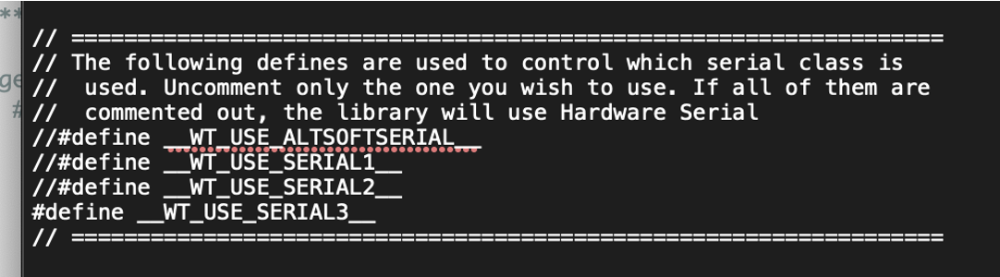
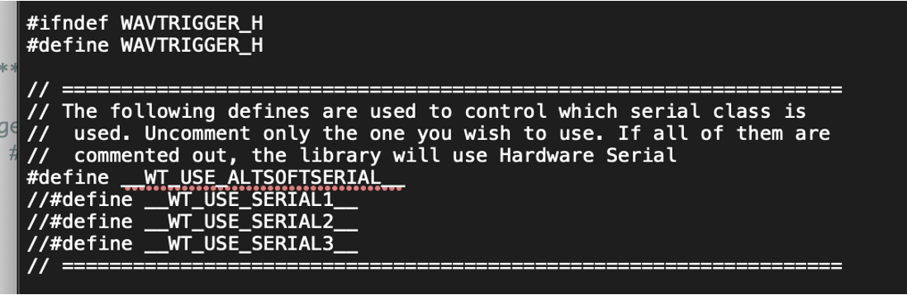

# Arduino IDE Setup

The custom software needed for operation must be compiled and uploaded to the Arduino devices. This guide provides the list of required libraries for compilation and outlines the changes needed to support each board.

## Prerequisites

The following libraries are required to be installed with the [Arduino IDE 2.x](https://www.arduino.cc/en/software). All but the WavTrigger and MillisDelay library can be found within the Arduino Library Manager with the app. Go to `Sketch -> Include Library -> Manage Libraries...` to access the Library Manager. Search for the libraries by name and install the latest version available.

- **FastLED** by Daniel Garcia
- **ezButton** by ArduinoGetStarted.com
- **Ramp** by Sylvain Garnavault
- **AltSoftSerial** by Paul Stoffregen
- **simple ht16k33 library** by lpaseen
- **millisDelay** `See Below`
- **WavTrigger** `See Below`

### MillisDelay

The MillisDelay library must be downloaded from the project GitHub page. Download the code as a zip use the `Sketch -> Add .ZIP Library` option to import the downloaded file.
[https://github.com/ansonhe97/millisDelay](https://github.com/ansonhe97/millisDelay)

No further configuration is needed for this library.

### WavTrigger

The WavTrigger library must be downloaded from the project GitHub page. Download the code as a zip use the `Sketch -> Add .ZIP Library` option to import the downloaded file.
[https://github.com/robertsonics/WAV-Trigger-Arduino-Serial-Library](https://github.com/robertsonics/WAV-Trigger-Arduino-Serial-Library)

## +++ IMPORTANT +++
Documented on both the Proton Pack and Neutron Wand code at the top of each file, is instructions on modifying the wavTrigger.h file. **You will need to open the wavTrigger.h file and comment out the neccessary #define required for the Proton Pack or Neutrona Wand**

**(see For compiling code on the Arduino Mega or Nano below for more information)**. 

The **wavTrigger.h** file can be located in your `Arduino/Libraries/<wav trigger folder>` (MacOS) or `C:\Arduino\Libraries` (Windows). See the special notes below for compiling the sketches for each of the Arduino boards.

## For compiling code on the Arduino Mega:

You need to enable `__WT_USE_SERIAL_3__` by uncommenting this line inside the **wavTrigger.h** file. Be sure to comment out any other serial class option previously in use. Note that you will need to confirm this value if you switch between compiling for the Arduino Nano.

## For compiling code on the Arduino Nano:

You need to enable `__WT_USE_ALTSOFTSERIAL__` by uncommenting this line inside the **wavTrigger.h** file. Be sure to comment out any other serial class option previously in use. Note that you will need to confirm this value if you switch between compiling for the Arduino Mega.

**NOTE: Before uploading to the Arduino Nano, be sure to either disconnect the wand from the pack or otherwise disconnect the TX/RX connections as these will interfere with the USB interface when still connected to the Arduino Mega in the pack.**

