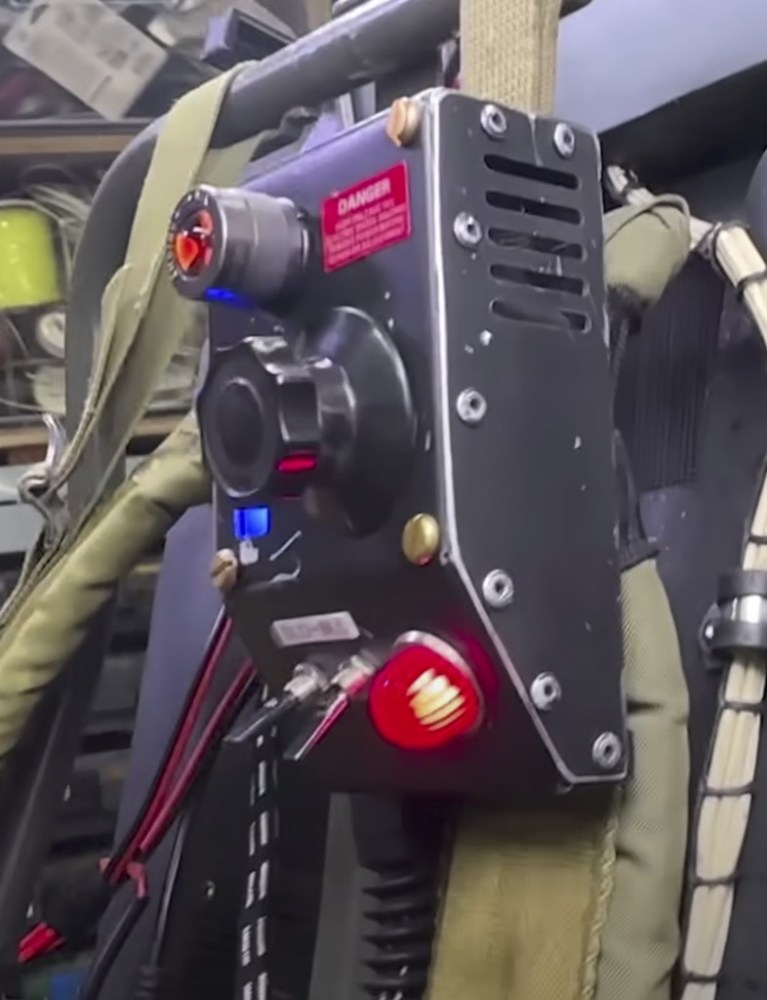
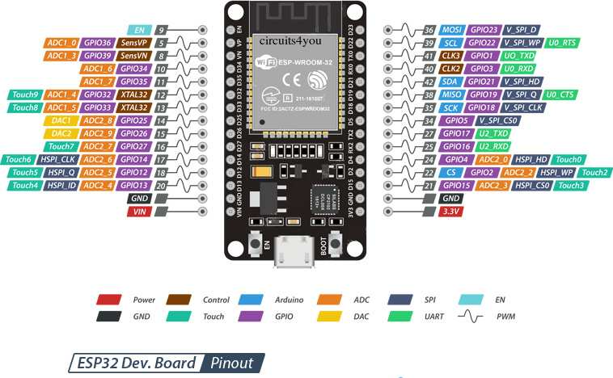
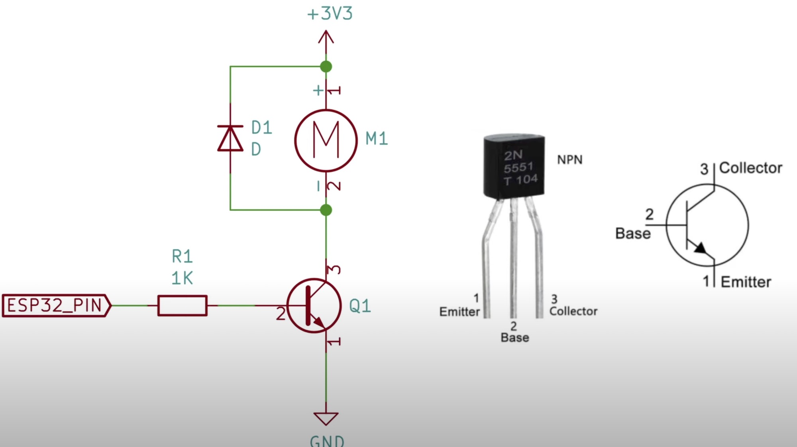

# Pack Attenuator (Optional)

"If Egon had kept on using and modifying his pack and modifying it, what might it look like?"

That was the question posed by Jason Reitman to Adam Savage with regards to the 2021 Ghostbusters Afterlife film. So in 2022 [Adam Savage's Tested YouTube channel released a video](https://www.youtube.com/watch?v=dloSR3a57IA) for a "1 Day Build" which featured propmaster Ben Eadie to create a unique item which brings more life to the front of the Proton Pack.

*Still image of Adam's creation.*

This guide demonstrates the build process for replicating the "Pack Attenuator" device created by Adam and Ben which fully integrates into the GPStar electronics kit. The ability to control and receive feedback from the devices makes this more than just an aesthetic improvement but a truly usable piece of the pack-wand combination.

### Potential Backstory

The device was rediscovered by Phoebe Spengler from notes in her grandfather’s underground workshop on the “Dirt Farm”. The device was theorized and prototyped but never put into service until now.

The attenuator device alters the magnetic field to maintain a correct “rate of feed” of positrons into the cyclotron, thus allowing the user to extend the time to ensnare a ghost by preventing an overheat event within the Proton Pack. Ahead of an overheat (aka. vent sequence) the device will provide physical and audiovisual cues as to the impending event. Interacting with the device will cancel the warning and stave off the venting sequence.

### Special Notes

Credit to [ShapeforgeProps](https://www.etsy.com/shop/ShapeforgeProps) for their excellent reproduction of this device as a 3D print and served as inspiration for taking this to a new level with the GPStar kit.

*Please note that this device is considered experimental and still under development. An electronics and housing kit is in the works which will integrate with the GPStar Proton Pack controller.*

[Attenuator Preview Demonstration](https://www.youtube.com/watch?v=k-u7S7Ctcbc) (YouTube, August 2023).

[Attenuator Backstory and Updates](https://www.youtube.com/watch?v=BLHyUAcyqoI) (YouTube, October 2023).

## Bill of Materials

This device has it's own BOM which is separate from any other build items related to the pack or wand. This utilizes the same ArduinoIDE for writing software as the other controllers and we'll be using the same type of serial protocol as used between the pack and wand.

**Core Electronics**

* [4 Pin Aviation Connector (to Proton Pack)](https://a.co/d/gPiOSzL)
* [20 AWG 4 Conductor Wire w/ PVC Jacket](https://a.co/d/iglELZR)
* [1/4 Inch Braided PET Wire Loom](https://a.co/d/cDQPSk0)
* [PG7 Rubber Strain Relief Connector](https://a.co/d/h1Hxh5T)
* [Single-Pixel 5V WS2812B RGB Addressable RGB LEDs](https://a.co/d/90SO4AQ) (You will use 3 pixels from this set)
* [Pre-soldered SPST Mini Toggle Switches](https://a.co/d/8SfEpVH)
* [Rotary Encoder Knob w/ Switch](https://a.co/d/3iBps4P)
* [3V 10mm x 2mm Vibration Motor](https://a.co/d/8p7mP9x)
* [9mm Passive Piezo Buzzer](https://a.co/d/b39ELcm)
* [28-Segment Bargraph from Frutto Technology](https://fruttotechnology.com/ols/products/preorder-28-segment-bargraph-pcb-for-spengler-neutrona-wand)

The preferred processor for this device is an ESP32 though you may also use an Arduino Nano though this may be phased out in the future. **Note that wireless capabilities are only available with the ESP32.**

* [ESP-WROOM-32 Dev Board w/ Terminal Shield](https://a.co/d/hDxXluE)

or

* [Arduino Nano Microcontroller](https://a.co/d/ev1LPea)
* [Arduino Nano Terminal Shield](https://a.co/d/7xNKJtO)

**Decorations**

This device was designed to allow for certain "real" parts as opposed to being 100% 3D printed. To finish the look of the exterior the following are either required or suggested. These parts may be sourced from any vendor you prefer (in the US most ACE Hardware locations have extensive selections of metrics screws).

* [M3x4 Button Hex Head Screws](https://a.co/d/h5No0N9) (Qty: 14) - Used for decoration on the sides of the body.
* [M4x4 Fillister Head Slotted Screws](https://a.co/d/es5eXBC) (Qty: 4) - Used for decoration on the top of the body.

The back plate will be attached using either M5 or M4 screws depending on the material used. For screws, your best value is to purchase an assorted set as this cost less than buying a single size of screw.

* [M5x8 Button Hex Head Screws](https://a.co/d/0fcUDN5) (Qty: 4) - Used to secure the base plate to metal body.

or

* [M4x8 Button Hex Head Screws](https://a.co/d/0fcUDN5) (Qty: 4) - Used to secure the base plate to plastic body.
* [M4x6 Heat-set Inserts](https://a.co/d/dMBuRqA) (Qty: 4) - Used to secure the base plate to a plastic body.

Device labels can be obtained or created by any means desired. The sizes [offered by this product on GBFans](https://www.gbfans.com/shop/pack-vinyl-labels/) should be sufficient.

* [Clear Dome Lens](https://www.digikey.com/en/products/detail/carclo-technical-plastics/10403/2641656)
* [Clip-in Lens SML_190_CTP](https://www.digikey.com/en/products/detail/visual-communications-company-vcc/SML-190-CTP/4515623)

## Dimensions

It is worth noting that the device is meant to attach to the left shoulder strap of a standard ALICE pack. The width of the strap is typically around 80mm while worn, so this device will fit near perfectly once the strap is pressed against your shoulder/chest. These are the overall dimensions if you wish to approximate the needed space or design your own enclosure. Maintaining these dimensions ensures the components above will fit within the enclosure.

	Width: 80mm
	Height: 115mm
	Depth: 38mm

## WiFi Connectivity

When using the ESP32 controller it is possible to connect to the device via WiFi. The SSID (Network Name) will be broadcast as **"ProtonPack_####"** where "####" is the last 4 hexadecimal values for the MAC address of the WiFi interface. This will differ for each ESP32 device, making each network unique to the attached pack. The default password is **"555-2368"** and can (and should) be changed via the web interface after successfully connecting to the network. The IP address for the device will be hardcoded as "192.168.1.2" with the web interface accessible at `http://192.168.1.2`.

**Security Notice**

Once you have successfully paired with the WiFi network for the Proton pack, you are HIGHLY encouraged to change the default password. This is accessible via a link at the bottom of the main device page as noted above. Follow the prompts to enter and confirm a new password then re-join your pack's WiFi network with the new credentials.

For instructions on using the web interface to control your equipment, please see the [Wireless Operations](WIRELESS_OPERATION.md) guide.

## ESP32 - Standard Pinout Reference

## ESP32 - Pin Connections

The following is a diagram of the ESP32 pins from left and right, when oriented with the USB connection facing down (south) like the pinout diagram above.

| Connection    | ESP32 (L) |     | ESP32 (R) | Connection    |
|---------------|-----------|-----|-----------|---------------|
|               | EN        |     | GPIO23    | Neopixels (2) |
|               | GPIO36    |     | GPIO22    | SCL Bargraph  |
|               | GPIO39    |     | GPIO1     |               |
| Left Toggle   | GPIO34    |     | GPIO3     |               |
| Right Toggle  | GPIO35    |     | GPIO21    | SDA Bargraph  |
| Encoder A     | GPIO32    |     | GPIO19    | PN2222        |
| Encoder B     | GPIO33    |     | GPIO18    | Piezo Buzzer  |
|               | GPIO25    |     | GPIO5     |               |
|               | GPIO26    |     | GPIO17    | to Pack RX1   |
|               | GPIO27    |     | GPIO16    | to Pack TX1   |
|               | GPIO14    |     | GPIO4     | Encoder Post  |
|               | GPIO12    |     | GPIO2     |               |
|               | GPIO13    |     | GPIO15    |               |
| Ground (Pack) | GND       |     | GND       | Common Ground |
| +5V (Pack)    | VIN       |     | 3.3V      | Vib. Motor +  |
|               |         | **USB** |         |               |

When connecting to the pack, the following wiring scheme was used with the recommended 4-pin connector:

	1 - GND (Black)
	2 - VIN (Red)
	3 - TX2 (White) to Pack RX1
	4 - RX2 (Yellow) to Pack TX1

It is advised to add a 330uF capacitor to the VIN+GND pins to help regulate power which will be shared with the controller, bargraph, and addressable LED's.

**Note:** Bargraph power (+5V) should be split from the VIN terminal which delivers power from the Proton Pack.

## Arduino Nano - Standard Pinout Reference

## Arduino Nano - Pin Connections

The following is a diagram of the Arduino Nano pins from left and right, when oriented with the USB connection facing down (south) like the pinout diagram above.

| Connection    | Nano (L) |     | Nano (R) | Connection    |
|---------------|----------|-----|----------|---------------|
| to Pack RX1   | TX1      |     | VIN      | +5V (Pack)    |
| to Pack TX1   | RX0      |     | GND      | Ground (Pack) |
|               | RST      |     | RST      |               |
| Common Ground | GND      |     | 5V       | To Bargraph   |
| Encoder A     | D2       |     | A7       |               |
| Encoder B     | D3       |     | A6       |               |
| Encoder Post  | D4       |     | A5       | SCL Bargraph  |
| Left Toggle   | D5       |     | A4       | SDA Bargraph  |
| Right Toggle  | D6       |     | A3       |               |
|               | D7       |     | A2       |               |
|               | D8       |     | A1       |               |
| Neopixels (2) | D9       |     | A0       |               |
| Piezo Buzzer  | D10      |     | REF      |               |
| PN2222        | D11      |     | 3V3      | Vib. Motor +  |
|               | D12      |     | D13      |               |
|               |        | **USB** |        |               |

When connecting to the pack, the following wiring scheme was used with the recommended 4-pin connector:

	1 - GND (Black)
	2 - VIN (Red)
	3 - TX1 (White) to Pack RX1
	4 - RX0 (Yellow) to Pack TX1

It is advised to add a 330uF capacitor to the VIN+GND pins to help regulate power which will be shared with the controller, bargraph, and addressable LED's.

### Connections by Component

Wire colors are suggestions, and meant to help differentiate the components. You may use your own scheme as desired. Microcontroller (MCU) pins are labelled using their Nano (D#) or ESP (GPIO#) designations. Common pins will retain a singular name.

**Toggles - Arduino Nano**

| LEFT TOGGLE                    |   | MCU Pin | Notes |
|--------------------------------|---|---------|-------|
| Blue | → | GND     | Shouldn’t matter which wire goes where |
| Blue | → | D5      | Shouldn’t matter which wire goes where |

| Right TOGGLE                     |   | MCU Pin | Notes |
|----------------------------------|---|---------|-------|
| Green | → | GND     | Shouldn’t matter which wire goes where |
| Green | → | D6      | Shouldn’t matter which wire goes where |

**Toggles - ESP32**

For the ESP32 controller, GPIO pins 34 and 35 are input-only and do not have internal pull-up resistors. In order to get an accurate reading from the state of the switch it is necessary to add a 3.8k Ω resistor between the 3.3V (3V3) pin and the respective GPIO pin where the toggle switch connects to the controller. This is essentially a wire from the V+ pin to the noted GPIO pin, with the stated resistor on the wire. Both wires for the pull-up resistor and toggle switch will terminate at the same point on the controller.

| LEFT TOGGLE                    |   |        | MCU Pin | Notes |
|--------------------------------|---|--------|---------|-------|
| Blue | → |   →    | GND     | Shouldn’t matter which wire goes where |
| Blue | → |   →    | GPIO34  | Shouldn’t matter which wire goes where |
| Red   | ↑ | 3.8K Ω | 3V3     | External Pull-up Resistor |

| Right TOGGLE                     |   |        | MCU Pin | Notes |
|----------------------------------|---|--------|---------|-------|
| Green | → |   →    | GND     | Shouldn’t matter which wire goes where |
| Green | → |   →    | GPIO35  | Shouldn’t matter which wire goes where |
| Red     | ↑ | 3.8K Ω | 3V3     | External Pull-up Resistor |

**Rotary Encoder w/ Switch**

The rotary encoder is similar to that used on the Proton Pack and Neutrona Wand. It requires a common ground connection and sends data via the A/B signal wires to indicate which direction it was turned.

**Note: For this connection the post is oriented to the left.**

| ROTARY ENCODER (DIAL)          |   | MCU Pin   |
|--------------------------------|---|-----------|
| Blue | → | D2/GPIO33 |
| Black                          | → | GND       |
| Blue | → | D3/GPIO32 |

One notable point in the stated part noted in the BOM is that this encoder MUST also support a momentary "push" action on the center post, so an additional ground and data pin will be used for that momentary switch.

**Note: It does not matter which pin on the rotary encoder goes to which MCU pin.**

| ROTARY ENCODER (POST)            |   | MCU Pin  |
|----------------------------------|---|----------|
| Green | → | D4/GPIO4 |
| Black                            | → | GND      |

**Addressable LEDs**

| LED'S                           |   | Component | MCU Pin |
|---------------------------------|---|-----------|---------|
| Red    | → | 100uf | 5V/VIN    |
| Green  | → | 470 Ω | D9/GPIO23 |
| Black | → | 100uf | GND       |

**Note:** It is advised to place a 100uf capacitor across the positive and negative connections to these devices, just to buffer any current fluctuations.

Addressable LEDs have a distinct data flow with solder pads labelled `DIN` and `DOUT`. It is crucial to chain these devices starting from the Arduino to an LED's `DIN` pad first, then the same device's `DOUT` pad to the next LED's `DIN` pad, and so on.

**Audio &amp; Physical Feedback**

| PIEZO BUZZER                 |   | MCU Pin    |
|------------------------------|---|------------|
| Red | → | D10/GPIO18 |
| Black                        | → | GND        |

| VIBRATION MOTOR                | Component(s) | Component(s) | MCU Pin |
|--------------------------------|--------------|--------------|---------|
| Red   | 1N4001 (s)   | →     | 3V3/3.3V |
| Blue | 1N4001       | NPN C |          |
|                                |              | NPN B | R 270 Ω → D11/GPIO19 |
|                                |              | NPN E | GND      |

**Note:** The vibration motor (60mA) requires use of a transistor as the higher current draw exceeds the maximum 40mA recommended for the microcontroller's pin. To safely deliver power we will use an 2N2222/2N5551, an NPN Bipolar Transistor (BJT). A diode is recommended as this is a motor and thus could cause a small induction current in reverse when power is removed.

## Bargraph

This is a separate but critical device and should be a relatively easy connection when using the Frutto Technology packaging which has only 2 ports: 5V/GND and SDA/SCL. Power will be connected to the "5V" on the Arduino and a common ground (GND). F0r the Arduino Nano connect the SDA and SCL to the A4 and A5 pins, respectively. For the ESP32 these are GPIO pins 21 and 22 for SDA and SCL, respectively.

**Note:** For the ESP32 controller, GPIO pins 21 (SDA) and 22 (SCL) do not have internal pull-up resistors. In order to detect attached devices it is necessary to add a 3.8k Ω resistor between the 3.3V (3V3) pin and the respective GPIO pin where the bargraph connects to the controller. This is essentially a wire from the V+ pin to the noted GPIO pin, with the stated resistor on the wire. Both wires for the pull-up resistor and data line will terminate at the same point on the controller.

| Bargraph                        |     |   |        | MCU Pin | Notes |
|---------------------------------|-----|---|--------|---------|-------|
| Red    |     | ↓ | 3.8K Ω | 3V3    | External Pull-up Resistor     |
| White | SDA | → |   →    | GPIO21 | Check wire labels on bargraph |
| White | SCL | → |   →    | GPIO22 | Check wire labels on bargraph |
| Red    |     | ↑ | 3.8K Ω | 3V3    | External Pull-up Resistor     |

## ESP32 Break-out Board

To simplify installation it is suggested to create a break-out board for connections when using the ESP32 microcontroller. This is due to the need for pull-up resistors on select pins and can be accomplished by using a solderable ½ size protoboard.

|        | **A** | **B** | **C** | **D** | **E** |   | **F** | **G** | **H** | **I** | **J** |
|--------|-------|-------|-------|-------|-------|---|-------|-------|-------|-------|-------|
| **1**  |       |       |       |       |       |   |       |       |       |       |       |
| **2**  |       |       |       |       |       |   |       |       |       |       |       |
| **3**  | 3V3 | Z+ |  | R&nbsp;3.8K&nbsp;Ω | ↔ | ↔ | ↔ | R&nbsp;3.8K&nbsp;Ω |  | GPIO21 | Bargraph&nbsp;SDA (JST-PH) |
| **4**  | | Z+ | Y+ | R&nbsp;3.8K&nbsp;Ω | ↔ | ↔ | ↔ | R&nbsp;3.8K&nbsp;Ω |  | GPIO22 | Bargraph&nbsp;SCL (JST-PH) |
| **5**  |       |       |       |       |       |   |       |       |       |       |       |
| **6**  | GPIO23 |  |  | R 470 Ω | ↔ | ↔ | ↔ |  R 470 Ω |  |  | Addressable&nbsp;LED's |
| **7**  |       |       |       |       |       |   |       |       |       |       |       |
| **8**  |  | X+ | Y+ | R&nbsp;3.8K&nbsp;Ω | ↔ | ↔ | ↔ | R&nbsp;3.8K&nbsp;Ω |  | GPIO34 | Left Toggle |
| **9**  |  | X+ | W+ | R&nbsp;3.8K&nbsp;Ω | ↔ | ↔ | ↔ | R&nbsp;3.8K&nbsp;Ω |  | GPIO35 | Right Toggle |
| **10** |       |       |       |       |       |   |       |       |       |       |       |
| **11** |       |       |       |       |       |   | W+ | | | 1N4001 (s) | Vib. Motor (+) |
| **12** |       |       |       |       |       |   |       |       |       | ↕ |       |
| **13** |       |       |       |       |       |   |       |       |       | ↕ |       |
| **14** |       |       |       |       |       |   |       |       | NPN&nbsp;C | 1N4001 | Vib. Motor (-) |
| **15** | GPIO19 |  |  | R 270 Ω | ↔ | ↔ | ↔ | R 270 Ω | NPN&nbsp;B |  |  |
| **16** | GND (-) | V- | L.&nbsp;Toggle&nbsp;(&dash;) | R.&nbsp;Toggle&nbsp;(&dash;) | W- |  | W- |  | NPN&nbsp;E |  |  |
| **17** | Buzzer&nbsp;(&dash;) | V- | Rot.&nbsp;Enc.&nbsp;(&dash;) | Enc.&nbsp;Post&nbsp;(&dash;) |  |  |  |  |  |  |  |

## Pack Connection Cable

In order to connect to the pack you will need to create a custom cable for the device. This will consist of running the 4-conductor jacketed wire through the braided wire loom, and terminating with the 4-pin connector at one end and passing through the strain relief at the other end. The bare wires can be soldered directly to the microcontroller or use a terminal shield.

Where the socket for this connection cable is mounted on the pack is up to you--this device is meant to integrate how you think it should. You will be able to use 2 existing JST-XH connections on the gpstar Pack PCB controller: 5V-OUT and TX1/RX1. Please refer to the wiring notes above for how to make this connections. Just remember that TX/RX from the Attenuator will go to RX/TX on the pack (read: the wires flip).

Please see the notes above for the correct pin names for connections based on your choice of microcontroller.

## Component Fitment

The dimensions of the project housing allows for easy access into all areas of the device. It should be no problem to fit the available components within the final device. Note that you will want to build the connection cable in full and run it through the strain relief before attached to the device housing.

For assembly, the shell contains 4 holes meant to take heat-set inserts which provide metal-threaded junctions for screws to hold on the bottom plate. Because the plat must then be attached to the ALICE pack strap these should be secure but removable in the case of re-flashing software updates to the device.

## Software Requirements

To build or edit the code for this device you must have an ArduinoIDE environment set up similar to what is needed for the pack/wand software. Download and install the Arduino IDE 2.x or higher. This will be used to compile and upload the code to your Proton Pack and Neutrona Wand.

[Arduino IDE 2.x](https://www.arduino.cc/en/software)

The following libraries are required to be installed. All but the MillisDelay library can be found within the Arduino Library Manager with the app. Go to `Sketch -> Include Library -> Manage Libraries...` to access the Library Manager. Search for the libraries by name and install the latest version available.

- **FastLED** by Daniel Garcia
- **ezButton** by ArduinoGetStarted.com
- **simple ht16k33 library** by lpaseen
- **SerialTransfer** by PowerBroker2
- **ArduinoJSON** by Benoit Blanchon
- **AsyncTCP** by dvarrel
- **ESPAsyncTCP** by dvarrel
- **ESPAsyncWebSrv** by dvarrel
- **Preferences** by Volodymyr Shymanskyy
- **AsyncElegantOTA** `See Below`
- **ESPAsyncWebServer** `See Below`
- **millisDelay** `See Below`

To build for the ESP32 controller you will need to use the `Boards Manager` to install the "esp32 by Expressif Systems" package. When selecting a board for compilation and upload, simply use the board "ESP32 Dev Module" for satisfactory results. For reference, the FQBN for builds is "esp32:esp32:esp32".

### AsyncElegantOTA

The AsyncElegantOTA library must be downloaded from the project GitHub page. Download the code as a zip use the `Sketch -> Add .ZIP Library` option to import the downloaded file.
[https://github.com/ayushsharma82/AsyncElegantOTA.git](https://github.com/ayushsharma82/AsyncElegantOTA.git)

### ESPAsyncWebServer

The ESPAsyncWebServer library must be downloaded from the project GitHub page. Download the code as a zip use the `Sketch -> Add .ZIP Library` option to import the downloaded file.
[https://github.com/me-no-dev/ESPAsyncWebServer.git](https://github.com/me-no-dev/ESPAsyncWebServer.git)

No further configuration is needed for this library.

### MillisDelay

The MillisDelay library must be downloaded from the project GitHub page. Download the code as a zip use the `Sketch -> Add .ZIP Library` option to import the downloaded file.
[https://github.com/ansonhe97/millisDelay.git](https://github.com/ansonhe97/millisDelay.git)

No further configuration is needed for this library.

## Firmware Flashing

Separate firmware files exist for the Arduino Nano vs. the ESP32. For the Arduino Nano you may use the same flashing utility as the other gpstar PCB devices as outlined in the [FLASHING](FLASHING.md) guide. For the ESP32 that will require a different flasher program. Since both the Arduino Nano and ESP development board have their own USB connection it will not be necessary to use a separate UART programming cable.

### For ESP32

**For Windows:**

1. Download the [Flash Download Tools](https://www.espressif.com/en/support/download/other-tools) from Espressif Systems.
1. Locate the [Attenuator-ESP32.bin](binaries/attenuator/Attenuator-ESP32.bin) file from the `/binaries/attenuator` directory.
1. Use the utility to upload the .bin file to the device via USB.

**For Linux/MacOS:**

1. Download [Python](https://www.python.org/downloads/) and install for your operating system.
1. From a terminal (command line) environment run the following:
	* `curl https://bootstrap.pypa.io/get-pip.py -o get-pip.py`
	* `python get-pip.py` or `python3 get-pip.py`
	* `pip install esptool`
1. Locate the [Attenuator-ESP32.bin](binaries/attenuator/Attenuator-ESP32.bin) file from the `/binaries/attenuator` directory.
1. Run `esptool.py -p <PORT> Attenuator-ESP32.bin` where `<PORT>` is your ESP32 controller as a serial (USB) device.

### For Arduino Nano

Just as you used the gpstar flashing utility for Windows or MacOS to upload to your Proton Pack or Neutrona Wand, you will do the same for this device. Plug in your device using a standard USB cable and note the serial COM port used. Select the .hex file for the Attenuator and upload to the attached device.

## Operation

While not attached to a compatible Proton Pack (read: standalone mode) the device will simply provide some lights and effects. The left toggle switch will turn on the bargraph animations while the right toggle switch will turn on the LED's.

Ideally, the device should be connected to the GPStar Proton Pack Controller which will allow it to provide some extended functionality. Under normal use the main dial will allow adjusting the overall volume, starting/stopping music tracks, navigating to the next track, and adjusting the effects volume.

* Left Toggle: Turns the pack on or off, similar to use of the switch under the Ion Arm
* Right Toggle: Turns the LED's on the device on or off
* Main Dial - Long Press: Alternates between two modes of operation
	* Mode 1 (Default) - Indicated by a high buzzer tone
		* Main Dial - Short Press: Starts or stops the current music track
 		* Main Dial - Double Press: Mutes or unmutes all pack/wand audio
		* Main Dial - Turn CW/CCW: Adjusts the overall volume for pack/wand
	* Mode 2 - Indicated by a low buzzer tone
		* Main Dial - Short Press: Advances to the next music track
 		* Main Dial - Double Press: Move to the previous music track
		* Main Dial - Turn CW/CCW: Adjusts the effects volume for pack/wand

Note that during an overheat warning, the device will emit sounds and vibrations in addition to lighting effects as the pack reaches a critical state. At this time the pack operator can turn the primary dial either direction to cancel the current warning. If the warning time is allowed to expire the the pack will enter the vent sequence.
