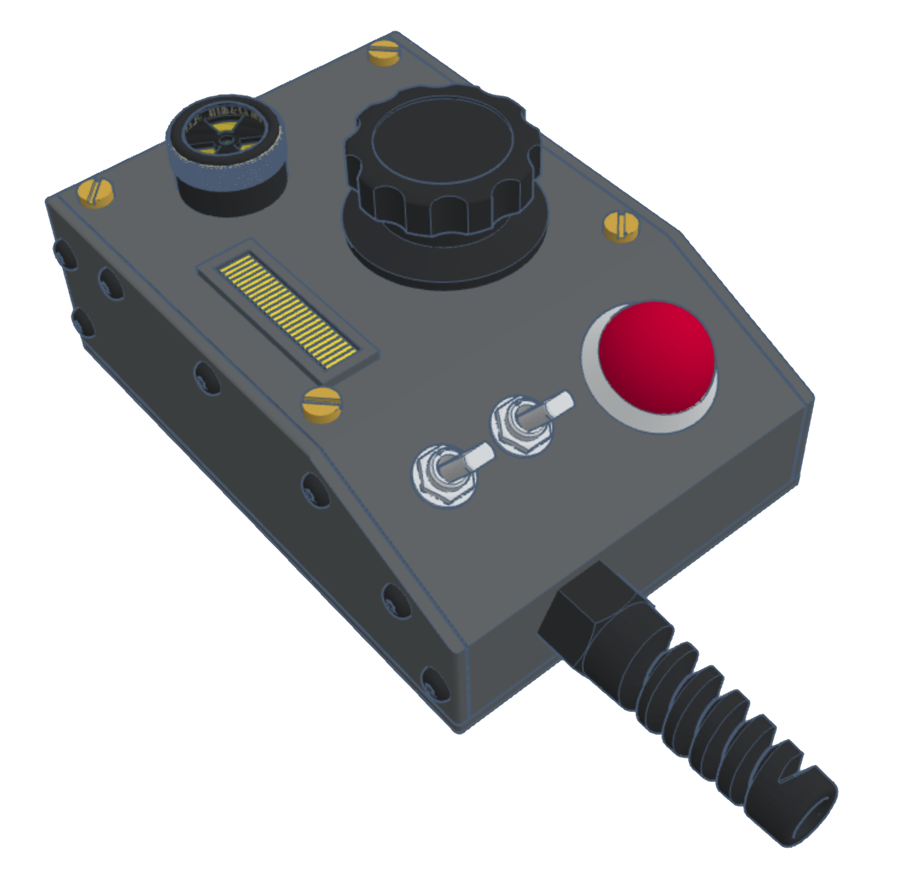

# Pack Attenuator (Optional)

"If Egon had kept on using and modifying his pack and modifying it, what might it look like?"

That was the question posed by Jason Reitman to Adam Savage with regards to the 2021 Ghostbusters Afterlife film. So in 2022 [Adam Savage's Tested YouTube channel released a video](https://www.youtube.com/watch?v=dloSR3a57IA) for a "1 Day Build" which featured propmaster Ben Eadie to create a unique item which brings more life to the front of the Proton Pack.

This guide demonstrates the build process for replicating the "Pack Attenuator" device first created by Adam and Ben which fully integrates into the GPStar electronics kit. The ability to control and receive feedback from the devices makes this more than just an aesthetic improvement but a truly usable piece of the pack-wand combination.

### Potential Backstory

The device was rediscovered by Phoebe Spengler from notes in her grandfather’s underground workshop on the “Dirt Farm”. The device was theorized and prototyped but never put into service until now.

The attenuator device alters the magnetic field to maintain a correct “rate of feed” of positrons into the cyclotron, thus allowing the user to extend the time to ensnare a ghost by preventing an overheat event within the Proton Pack. Ahead of an overheat (aka. vent sequence) the device will provide physical and audiovisual cues as to the impending event. Interacting with the device will cancel the warning and stave off the venting sequence.

### Special Notes

[Attenuator Preview Demonstration](https://www.youtube.com/watch?v=k-u7S7Ctcbc) (YouTube, August 2023).

[Attenuator Backstory and Updates](https://www.youtube.com/watch?v=BLHyUAcyqoI) (YouTube, October 2023).

## Building Your Own

Please see the dedicated [ATTENUATOR_DIY](ATTENUATOR_DIY.md) guide for how to construct the electronics for your own device.

## GPStar Kits

Please see the [ATTENUATOR_FINISHING](ATTENUATOR_FINISHING.md) guide for advice on how to assemble and finish your device.

## Firmware Flashing

Please see the [ATTENUATOR_FLASHING](ATTENUATOR_FLASHING.md) guide for details on compiling and/or uploading software to your Attenuator controller.

## Operation

### Physical Operation

While not attached to a compatible Proton Pack (read: standalone mode) the device will simply provide some lights and effects. The left toggle switch will turn on the bargraph animations while the right toggle switch will turn on the LEDs.

Ideally, the device is intended be connected to the GPStar Proton Pack Controller which will allow it to provide all extended functionality. Under normal use the main dial will allow adjusting the overall volume, starting/stopping music tracks, navigating to the next track, and adjusting the effects volume.

* Left Toggle: Turns the pack on or off, similar to use of the switch under the Ion Arm
* Right Toggle: Turns the LEDs on the device on or off
* Main Dial - Long Press: Alternates between two modes of operation
	* Mode 1 (Default) - Indicated by a high buzzer tone
		* Main Dial - Short Press: Starts or stops the current music track
 		* Main Dial - Double Press: Mutes or unmutes all pack/wand audio
		* Main Dial - Turn CW/CCW: Adjusts the overall volume for pack/wand
	* Mode 2 - Indicated by a low buzzer tone
		* Main Dial - Short Press: Advances to the next music track
 		* Main Dial - Double Press: Move to the previous music track
		* Main Dial - Turn CW/CCW: Adjusts the effects volume for pack/wand

Note that during an overheat warning, the device will emit sounds and vibrations in addition to lighting effects as the pack reaches a critical state. At this time the pack operator can turn the primary dial either direction to "attenuate" the pack and cancel the current warning. If the warning time is allowed to expire the the pack will enter the venting sequence.

### Web Operation

For instructions on using the web interface to control your equipment, please see the [Wireless Operations](WIRELESS_OPERATION.md) guide.
