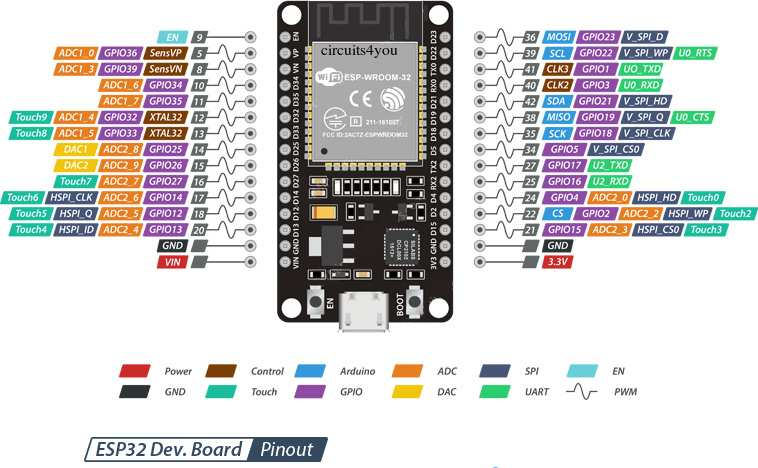
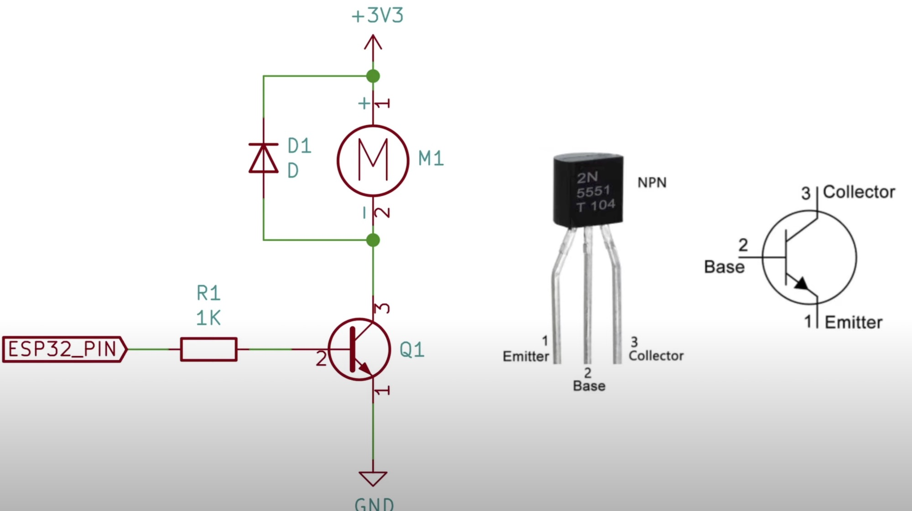

# Pack Attenuator - DIY Guide

This guide is intended to document the parts and processes required to build the internals of an Attenuator device for your Proton Pack. Please note that while both the Arduino Nano is supported, there is much more functionality and room for improvements by using an ESP32 controller. This document supports both paths in their own sub-sections.

[Video Assembly Guide](https://www.youtube.com/watch?v=iuZ5ij_PN44) (YouTube, December 2023).

## Bill of Materials

This device has it's own BOM which is separate from any other build items related to the pack or wand. This utilizes the same ArduinoIDE for writing software as the other controllers and we'll be using the same type of serial protocol as used between the pack and wand.

**Core Electronics**

* Proton Pack Connector: [4 Pin Aviation Connector](https://a.co/d/gPiOSzL)
* Proton Pack Cable: [20 AWG 4 Conductor Wire w/ PVC Jacket](https://a.co/d/iglELZR)
* Cable Covering: [1/4 Inch Braided PET Wire Loom](https://a.co/d/cDQPSk0)
* [PG7 Rubber Strain Relief Connector](https://a.co/d/h1Hxh5T)
* [Single-Pixel 5V WS2812B RGB Addressable RGB LEDs](https://a.co/d/90SO4AQ) (You will use 3 pixels from this set1)
* [Pre-soldered SPST Mini Toggle Switches](https://a.co/d/8SfEpVH) or [Flat Toggles w/o Wires](https://a.co/d/9oIRMAG)
* [Rotary Encoder Knob w/ Switch](https://a.co/d/3dWJTzi)
* [3V 10mm x 2mm Vibration Motor](https://a.co/d/8p7mP9x)
* [9mm Passive Piezo Buzzer](https://a.co/d/b39ELcm)
* [28-Segment Bargraph from Frutto Technology](https://fruttotechnology.com/ols/products/preorder-28-segment-bargraph-pcb-for-spengler-neutrona-wand)
* 2x NPN2222 transistors, 2x 1N4001 diodes, and various resistors (see schematics)

1 These [pre-soldered LED modules](https://a.co/d/2Y9HvIK) will likely be offered for use in future kits, though in both cases the price point is high considering the need for only 3 LEDs.

**Microprocessor Control Unit (MCU)**

The preferred processor for this device is an ESP32 though you may also use an Arduino Nano although the latter may be phased out in the future. **Note that wireless capabilities are only available with the ESP32.**

* [ESP-WROOM-32 30-pin Dev Board w/ Terminal Shield](https://a.co/d/hDxXluE) or [ESP-WROOM-32 Dev Board w/out Headers](https://a.co/d/62ywBNo)

or

* [Arduino Nano Microcontroller](https://a.co/d/ev1LPea) plus [Arduino Nano Terminal Shield](https://a.co/d/7xNKJtO) - Note that this device will not offer WiFi capabilities!

**Exterior Decorations**

This device was designed to allow for certain "real" parts as opposed to being 100% 3D printed. To finish the look of the exterior the following are **merely suggestions**. These parts may be sourced from any vendor you prefer (in the US most ACE Hardware locations have extensive selections of metrics screws). If a certain item is improbable or unavailable you may substitute as you wish--regardless of material used for printing it should be possible to install a similar sized screw for the provided holes in the shell.

* [M3x4 Button Hex Head Screws](https://a.co/d/h5No0N9) (Qty: 14) - Used for decoration on the sides of the body.
* [M4x6 Cheese Head Slotted Screws](https://a.co/d/eUhDiRO) (Qty: 4) - Used for decoration on the top of the body.
	* You could also use [8-40 x 1/4" Fillister Head Slotted Screws](https://a.co/d/es5eXBC)
	* M4 nuts may be required to secure the screws to the Attenuator shell.

The back plate will be attached using either M5 or M4 screws depending on the material used. For screws, your best value is to purchase an assorted set as this cost less than buying a single size of screw.

* [M4x8 Button Hex Head Screws](https://a.co/d/0fcUDN5) (Qty: 4) - Used to secure the base plate to metal body.

or

* [M4x8 Button Hex Head Screws](https://a.co/d/0fcUDN5) (Qty: 4) - Used to secure the base plate to plastic body.
* [M4x6 Heat-set Inserts](https://a.co/d/dMBuRqA) (Qty: 4) - Used to secure the base plate to a plastic body.

Device labels can be obtained or created by any means desired. The sizes [offered by this product on GBFans](https://www.gbfans.com/shop/pack-vinyl-labels/) should be sufficient.

* Lower Mode/Indicator: [Clear Dome Lens](https://www.digikey.com/en/products/detail/carclo-technical-plastics/10403/2641656) or [Fluted Dome Lens](https://www.lvelectronics.com/details/item?itemid=CML%2025P-326C#)
* Top Mode/Indicator: [Clip-in Lens SML&#95;190&#95;CTP](https://www.digikey.com/en/products/detail/visual-communications-company-vcc/SML-190-CTP/4515623)

## Dimensions

It is worth noting that the device is meant to attach to the left shoulder strap of a standard ALICE pack. The width of the strap is typically around 80mm while worn, so this device will fit near perfectly once the strap is pressed against your shoulder/chest. These are the overall dimensions if you wish to approximate the needed space or design your own enclosure. Maintaining these dimensions ensures the components above will fit within the enclosure.

	Width: 80mm
	Height: 115mm
	Depth: 38mm

## WiFi Connectivity

When using the ESP32 controller it is possible to connect to the device via WiFi. The SSID (Network Name) will be broadcast as **"ProtonPack_####"** where "####" is the last 4 hexadecimal values for the MAC address of the WiFi interface. This will differ for each ESP32 device, making each network unique to the attached pack. The default password is **"555-2368"** and can (and should) be changed via the web interface after successfully connecting to the network. The IP address for the device will be hardcoded as "192.168.1.2" with the web interface accessible at `http://192.168.1.2`.

**Security Notice**

Once you have successfully paired with the WiFi network for the Proton pack, you are HIGHLY encouraged to change the default password. This is accessible via a link at the bottom of the main device page as noted above. Follow the prompts to enter and confirm a new password then re-join your pack's WiFi network with the new credentials.

For instructions on using the web interface to control your equipment, please see the [Wireless Operations](WIRELESS_OPERATION.md) guide.

## ESP32 - 30-Pin Reference

📝 **Note:** There are typically 30-pin and 38-pin versions of the ESP32 development modules and matching terminal shields. Both should work, though there will be some minor differences to the order of pins. ALWAYS match the GPIO pin by label not position or index. This guide uses the more compact 30-pin packaging.

## ESP32 - Pin Connections

The following is a diagram of the ESP32 pins from left and right, when oriented with the USB connection facing down (south) like the pinout diagram above. This follows the standard pinout for a 30-pin device.

| Connection    | ESP32 (L) |     | ESP32 (R) | Connection    |
|---------------|-----------|-----|-----------|---------------|
|               | EN        |     | GPIO23    | Neopixels (2) |
|               | GPIO36    |     | GPIO22    | SCL Bargraph  |
|               | GPIO39    |     | GPIO1     |               |
| Left Toggle   | GPIO34    |     | GPIO3     |               |
| Right Toggle  | GPIO35    |     | GPIO21    | SDA Bargraph  |
| Encoder A     | GPIO32    |     | GPIO19    | PN2222        |
| Encoder B     | GPIO33    |     | GPIO18    | Piezo Buzzer  |
|               | GPIO25    |     | GPIO5     |               |
|               | GPIO26    |     | GPIO17    | to Pack RX1   |
|               | GPIO27    |     | GPIO16    | to Pack TX1   |
|               | GPIO14    |     | GPIO4     | Encoder Post  |
|               | GPIO12    |     | GPIO2     |               |
|               | GPIO13    |     | GPIO15    |               |
| Ground (Pack) | GND       |     | GND       | Common Ground |
| +5V (Pack)    | VIN       |     | 3.3V      | Vib. Motor +  |
|               |         | **USB** |         |               |

When connecting to the pack, the following wiring scheme was used with the recommended 4-pin connector:

	1 - GND (Black)
	2 - VIN (Red)
	3 - TX2 (White) to Pack RX1
	4 - RX2 (Yellow) to Pack TX1

It is advised to add a 330uF capacitor to the VIN+GND pins to help regulate power which will be shared with the controller, bargraph, and addressable LEDs.

**Note:** Bargraph power (+5V) should be split from the VIN terminal which delivers power from the Proton Pack.

## Arduino Nano - Standard Pinout Reference

## Arduino Nano - Pin Connections

The following is a diagram of the Arduino Nano pins from left and right, when oriented with the USB connection facing down (south) like the pinout diagram above.

| Connection    | Nano (L) |     | Nano (R) | Connection    |
|---------------|----------|-----|----------|---------------|
| to Pack RX1   | TX1      |     | VIN      | +5V (Pack)    |
| to Pack TX1   | RX0      |     | GND      | Ground (Pack) |
|               | RST      |     | RST      |               |
| Common Ground | GND      |     | 5V       | To Bargraph   |
| Encoder A     | D2       |     | A7       |               |
| Encoder B     | D3       |     | A6       |               |
| Encoder Post  | D4       |     | A5       | SCL Bargraph  |
| Left Toggle   | D5       |     | A4       | SDA Bargraph  |
| Right Toggle  | D6       |     | A3       |               |
|               | D7       |     | A2       |               |
|               | D8       |     | A1       |               |
| Neopixels (2) | D9       |     | A0       |               |
| Piezo Buzzer  | D10      |     | REF      |               |
| PN2222        | D11      |     | 3V3      | Vib. Motor +  |
|               | D12      |     | D13      |               |
|               |        | **USB** |        |               |

When connecting to the pack, the following wiring scheme was used with the recommended 4-pin connector:

	1 - GND (Black)
	2 - VIN (Red)
	3 - TX1 (White) to Pack RX1
	4 - RX0 (Yellow) to Pack TX1

It is advised to add a 330uF capacitor to the VIN+GND pins to help regulate power which will be shared with the controller, bargraph, and addressable LEDs.

### Connections by Component

Wire colors are suggestions, and meant to help differentiate the components. You may use your own scheme as desired. Microcontroller (MCU) pins are labelled using their Nano (D#) or ESP (GPIO#) designations. Common pins will retain a singular name.

**Toggles - Arduino Nano**

| LEFT TOGGLE                    |   | MCU Pin | Notes |
|--------------------------------|---|---------|-------|
| Blue | → | GND     | Shouldn’t matter which wire goes where |
| Blue | → | D5      | Shouldn’t matter which wire goes where |

| Right TOGGLE                     |   | MCU Pin | Notes |
|----------------------------------|---|---------|-------|
| Green | → | GND     | Shouldn’t matter which wire goes where |
| Green | → | D6      | Shouldn’t matter which wire goes where |

**Toggles - ESP32**

For the ESP32 controller, GPIO pins 34 and 35 are input-only and do not have internal pull-up resistors. In order to get an accurate reading from the state of the switch it is necessary to add a 3.8k Ω resistor between the 3.3V (3V3) pin and the respective GPIO pin where the toggle switch connects to the controller. This is essentially a wire from the V+ pin to the noted GPIO pin, with the stated resistor on the wire. Both wires for the pull-up resistor and toggle switch will terminate at the same point on the controller.

| LEFT TOGGLE                    |   |        | MCU Pin | Notes |
|--------------------------------|---|--------|---------|-------|
| Blue | → |   →    | GND     | Shouldn’t matter which wire goes where |
| Blue | → |   →    | GPIO34  | Shouldn’t matter which wire goes where |
| Red   | ↑ | 3.8K Ω | 3V3     | External Pull-up Resistor |

| Right TOGGLE                     |   |        | MCU Pin | Notes |
|----------------------------------|---|--------|---------|-------|
| Green | → |   →    | GND     | Shouldn’t matter which wire goes where |
| Green | → |   →    | GPIO35  | Shouldn’t matter which wire goes where |
| Red     | ↑ | 3.8K Ω | 3V3     | External Pull-up Resistor |

**Rotary Encoder w/ Switch**

The rotary encoder is similar to that used on the Proton Pack and Neutrona Wand in that it will rotate without an end-stop, though unlike the other devices this has a center post which acts like a momentary switch. It requires a common ground connection with positive voltage, and sends data via the A/B signal wires to indicate which direction it was turned or the center post was pushed.

**Note: This is based on the KY-040 pre-soldered module with 5 pins.**

| ROTARY ENCODER (DIAL)             |   | MCU Pin   |
|-----------------------------------|---|-----------|
| GND                               | → | GND       |
| + (VCC)  | → | VIN (5V)  |
| SW     | → | D4/GPIO4  |
| DT (B)  | → | D2/GPIO33 |
| CLK (A) | → | D3/GPIO32 |

**Addressable LEDs**

| LED'S                           |   | Component | MCU Pin |
|---------------------------------|---|-----------|---------|
| Red    | → | 100uf | 5V/VIN    |
| Green  | → | 470 Ω | D9/GPIO23 |
| Black | → | 100uf | GND       |

**Note:** It is advised to place a 100uf capacitor across the positive and negative connections to these devices, just to buffer any current fluctuations.

Addressable LEDs have a distinct data flow with solder pads labelled `DIN` and `DOUT`. It is crucial to chain these devices starting from the Arduino to an LEDs `DIN` pad first, then the same device's `DOUT` pad to the next LED's `DIN` pad, and so on.

**Audio &amp; Physical Feedback**

| PIEZO BUZZER                   | Component(s) | MCU Pin |
|--------------------------------|--------------|---------|
| Red   | →     | VIN/5V |
| Black                          | NPN C |          |
|                                | NPN B | R 270 Ω → D10/GPIO18 |
|                                | NPN E | GND      |

| VIBRATION MOTOR                | Component(s) | Component(s) | MCU Pin |
|--------------------------------|--------------|--------------|---------|
| Red   | 1N4001 (s)   | →     | 3V3/3.3V |
| Blue | 1N4001       | NPN C |          |
|                                |              | NPN B | R 270 Ω → D11/GPIO19 |
|                                |              | NPN E | GND      |

**Note:** The vibration motor (60mA) requires use of a transistor as the higher current draw exceeds the maximum 40mA recommended for the microcontroller's pin. To safely deliver power we will use an 2N2222/2N5551, an NPN Bipolar Transistor (BJT). A diode is recommended as this is a motor and thus could cause a small induction current in reverse when power is removed.

## Bargraph

This is a separate but critical device and should be a relatively easy connection when using the Frutto Technology packaging which has only 2 ports: 5V/GND and SDA/SCL. Power will be connected to the "5V" on the Arduino and a common ground (GND). F0r the Arduino Nano connect the SDA and SCL to the A4 and A5 pins, respectively. For the ESP32 these are GPIO pins 21 and 22 for SDA and SCL, respectively.

**Note:** For the ESP32 controller, GPIO pins 21 (SDA) and 22 (SCL) do not have internal pull-up resistors. In order to detect attached devices it is necessary to add a 3.8k Ω resistor between the 3.3V (3V3) pin and the respective GPIO pin where the bargraph connects to the controller. This is essentially a wire from the V+ pin to the noted GPIO pin, with the stated resistor on the wire. Both wires for the pull-up resistor and data line will terminate at the same point on the controller.

| Bargraph                        |     |   |        | MCU Pin | Notes |
|---------------------------------|-----|---|--------|---------|-------|
| Red    |     | ↓ | 3.8K Ω | 3V3    | External Pull-up Resistor     |
| White | SDA | → |   →    | GPIO21 | Check wire labels on bargraph |
| White | SCL | → |   →    | GPIO22 | Check wire labels on bargraph |
| Red    |     | ↑ | 3.8K Ω | 3V3    | External Pull-up Resistor     |

## ESP32 Break-out Board

To simplify installation it is suggested to create a break-out board for connections when using the ESP32 microcontroller. This is due to the need for pull-up resistors on select pins and can be accomplished by using a solderable ½ size protoboard.

|        | **A** | **B** | **C** | **D** | **E** |   | **F** | **G** | **H** | **I** | **J** |
|--------|-------|-------|-------|-------|-------|---|-------|-------|-------|-------|-------|
| **1**  | GPIO23 |  |  | R 470 Ω | ↔ | ↔ | ↔ |  R 470 Ω |  |  | Addressable&nbsp;LEDs |
| **2**  | 3V3 | Z+ |  | R&nbsp;3.8K&nbsp;Ω | ↔ | ↔ | ↔ | R&nbsp;3.8K&nbsp;Ω |  | GPIO21 | Bargraph&nbsp;SDA (JST&dash;PH) |
| **3**  | | Z+ | Y+ | R&nbsp;3.8K&nbsp;Ω | ↔ | ↔ | ↔ | R&nbsp;3.8K&nbsp;Ω |  | GPIO22 | Bargraph&nbsp;SCL (JST&dash;PH) |
| **4**  | V+ | X+ | Y+ | R&nbsp;3.8K&nbsp;Ω | ↔ | ↔ | ↔ | R&nbsp;3.8K&nbsp;Ω |  | GPIO34 | Left Toggle |
| **5**  |  |  |  |  |  |  |    | V- |  |  | Left Toggle (-) |
| **6**  |  |  |  |  |  |  | W- | V- |  |  | Right Toggle (-) |
| **7**  |  | X+ | W+ | R&nbsp;3.8K&nbsp;Ω | ↔ | ↔ | ↔ | R&nbsp;3.8K&nbsp;Ω |  | GPIO35 | Right Toggle |
| **8**  |  |  |  |  |  |  |  |  |  |  |  |
| **9**  |  |  |  |  |  |  |  | V+ | NPN&nbsp;C |  | Buzzer&nbsp;(+) |
| **10** | GPIO18 |  |  | R 270 Ω | ↔ | ↔ | ↔ | R 270 Ω | NPN&nbsp;B |  |  |
| **11** |  |  |  |  |  |  |  | X- | NPN&nbsp;E |  | Buzzer&nbsp;(&dash;) |
| **12** |  | Z- |  | Rot.&nbsp;Enc.&nbsp;(GND) |  |  |  | W+ |  | 1N4001 (s) | Vib. Motor (+) |
| **13** | GND (-) | Z- | Y- | X- | W- |  |  |  |  | ↕ |  |
| **14** |  |  |  |  |  |  |  |  |  | ↕ |  |
| **15** |  |  |  |  |  |  |  |  | NPN&nbsp;C | 1N4001 | Vib. Motor (-) |
| **16** | GPIO19 |  |  | R 270 Ω | ↔ | ↔ | ↔ | R 270 Ω | NPN&nbsp;B |  |  |
| **17** |  |  |  |  |  |  |  | Y- | NPN&nbsp;E |  |  |

## Pack Connection Cable

In order to connect to the pack you will need to create a custom cable for the device. This will consist of running the 4-conductor jacketed wire through the braided wire loom, and terminating with the 4-pin connector at one end and passing through the strain relief at the other end. The bare wires can be soldered directly to the microcontroller or use a terminal shield.

Where the socket for this connection cable is mounted on the pack is up to you--this device is meant to integrate how you think it should. You will be able to use 2 existing JST-XH connections on the gpstar Pack PCB controller: 5V-OUT and TX1/RX1. Please refer to the wiring notes above for how to make this connections. Just remember that TX/RX from the Attenuator will go to RX/TX on the pack (read: the wires flip).

Please see the notes above for the correct pin names for connections based on your choice of microcontroller.

## Component Fitment

The dimensions of the project housing allows for easy access into all areas of the device. It should be no problem to fit the available components within the final device. Note that you will want to build the connection cable in full and run it through the strain relief before attached to the device housing.

For assembly, the shell contains 4 holes meant to take heat-set inserts which provide metal-threaded junctions for screws to hold on the bottom plate. Because the plat must then be attached to the ALICE pack strap these should be secure but removable in the case of re-flashing software updates to the device.
