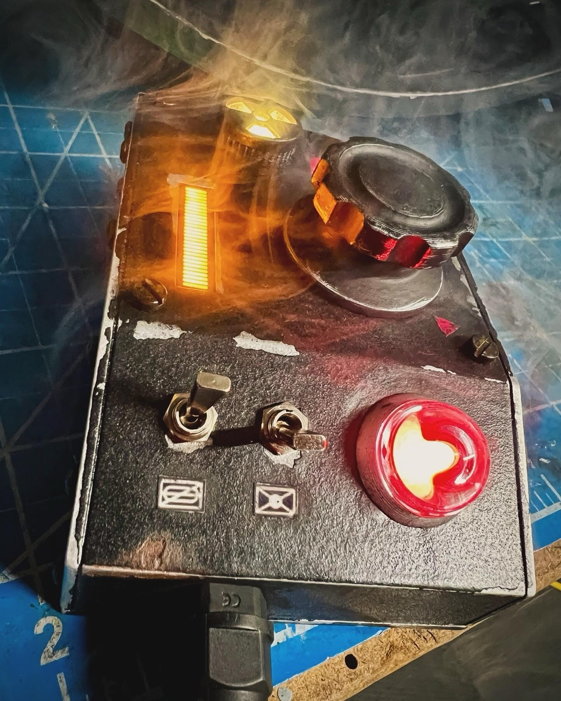
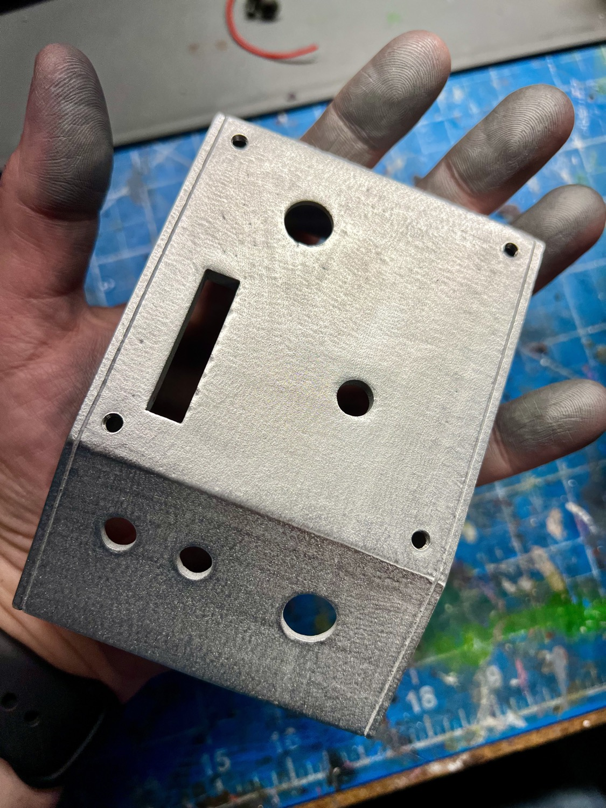
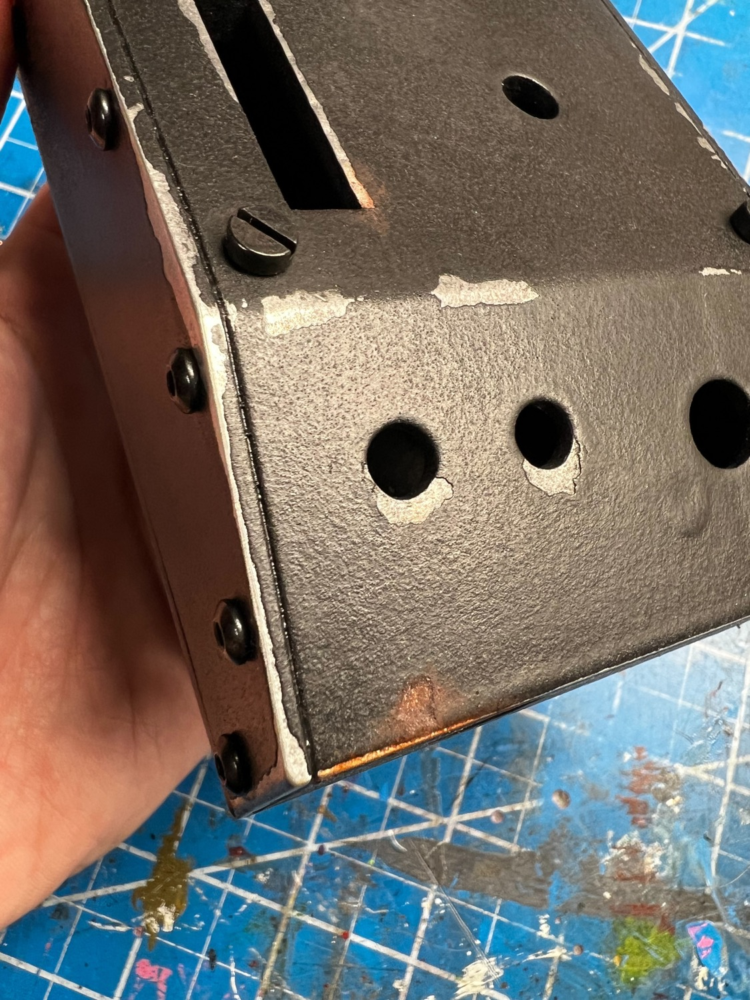

# Pack Attenuator - Finishing Guide

## Assembly Guide

See the [installation guide](extras/Attenuator-Install-Guide.pdf) located in the /extras/ folder for details on how to install the electronics into your Attenuator shell. Alternatively, watch this [Attenuator Kit Finishing video from February 2024](https://www.youtube.com/watch?v=vBww_2N0M-k) which covers the electronics, finishing, and fitment of your components: 

## Paint Guide

The look of your device is just as important as the internals, though this is highly subjective to your personal tastes. Therefore, it's hard to say precisely what look you may be wanting to achieve so this portion will offer some guidance on what materials may be useful. This portion of the guide will assume you will want a chipped-paint style weathering though you can adjust to suite your taste as necessary.

### Resin Shells

These shells are practically ready for painting as-is. You can optionally give a light sanding to enhance the texture and promote paint adhesion, or use a spray which can help bond any paint to the surface. Below are some products which will help you get a smooth, metallic under-layer to act as your exposed metal when weathering the device.

* [Dupli-Color Adhesion Promoter](https://a.co/d/b7cgghV)
* [Rustoleum Metallic Aluminum](https://a.co/d/bASBF62)

### Aluminum Shells

For the aluminum printed shells, you may want to first sand the exterior smooth prior to painting. This can be done easily using "sanding sponges" which come in a variety of grits from course to fine (available at most hardware stores). Generally 220 and higher will work well and not remove too much material. If you sand in only one direction across the surface you can achieve a brushed aluminum appearance in the final look. Regardless of whether you sand or not, be sure to wash your aluminum print with soap and water to remove any oil residues from your fingers during handling, and use gloves while finishing to ensure maximum adhesion for paint.

### General Supplies

If you wish to have a chipped paint look you will want a solid, flat black paint. Rustoleum's truck bed liner is a heavy, textured paint which is used often for the Proton Pack shells and works well to give the needed look. You'll also want to mask some areas of the shell to help reveal those paint chips.

* [Latex Masking Fluid](https://a.co/d/8V2Wkzw)
* [Silicone Brushes](https://a.co/d/0DYPN6F)
* [Truck Bed Liner Spray Paint](https://a.co/d/4TvnJ51)

Use the silicone brushes to paint on a bit of the masking fluid where you do not wish the final coat of paint to stick, meaning the areas you want to show as chipped. These would typically be near edges or corners where you might see normal wear and tear from use, and can be somewhat chaotic or irregular. Be careful if applying a second coat as the latex may stick to the brush and peel away. Once the latext dries, you can apply a single coat of the truck bed liner. Apply a second coat per the product instructions to ensure any metallic areas are fully covered. Allow to dry thoroughly which may take upwards of 48 hours.

Once dried, you can begin peeling away the latex-coated areas which will appear bumpy. Rub with your finger or scrape with your fingernail or a soft plastic scraper to avoid marring any metallic surface below (this is most important for the resin shell). Once your shell is painted and has the worn look you desire, you can use standard acrylic paints to add dirt, rust, or other effects for the final appearance.