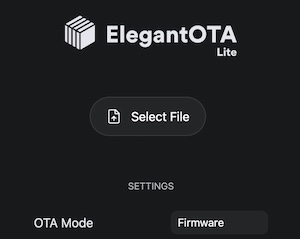
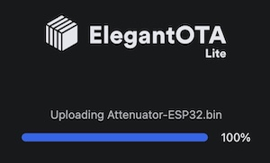
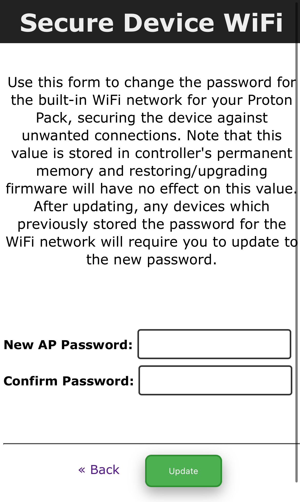

# Flashing the Attenuator

Separate firmware files exist for the Arduino Nano vs. the ESP32 version of the Attenuator, though the "Wireless Adapter" is simply an ESP32 controller without the inputs/outputs of an Attenuator. Therefore, the processes in this document will be the same for either use of an ESP32 controller.

For the Arduino Nano you may use the same flashing utility as the other gpstar PCB devices as outlined in the [FLASHING](FLASHING.md) guide. For the ESP32 that will require a different process as outlined below. Since both the Arduino Nano and ESP development board have their own USB connection it will **not** be necessary to use a separate UART programming cable.

## For Arduino Nano

Just as you used the gpstar flashing utility for Windows or MacOS to upload to your Proton Pack or Neutrona Wand, you will do the same for this device. Plug in your device using a standard USB cable and note the serial COM port used. Select the "Attenuator-Nano.hex" file from the `/binaries/attenuator` directory and upload to the attached device.

## For ESP32

This device supports Over-The-Air (OTA) updates for firmware, meaning you will need to utilize a desktop web browser from a computer (not a mobile device) and the built-in WiFi access point provided by the controller. **However, the software which enables the WiFi access point isn't yet loaded so you'll need to follow a specific process for the initial upload to your device.**

**Troubleshooting:** If your ESP32 controller does not appear as a serial device it may be required to install a driver for the "CP210x USB to UART Bridge" onto your computer. A driver for Windows and macOS is available [via Silicon Labs](https://www.silabs.com/developers/usb-to-uart-bridge-vcp-drivers?tab=downloads) and has proved useful.

📝 **Tip:** Before proceeding, be sure to use a high-quality USB cable which supports data transfer. Some cheap cables may only support charging (not data), or not fully support the power requirements of the device. If you have successfully flashed your ESP32 device and do not see the available WiFi access point, try plugging your USB cable directly into the Talentcell battery or try another USB port on your computer. In rare cases the USB port and/or cable cannot supply enough voltage to run the ESP32's WiFi radio.

### ESP32: First-Time Upload

If you do not see a WiFi network for your Proton Pack, the device has likely not been flashed with the GPStar firmware to enable that feature. You will need to upload the software using a USB cable via either of the 2 methods listed here.

**Via Web Uploader**

This uses a 3rd-party website to upload using the Web Serial protocol which is only available on the Google Chrome, Microsoft Edge, and Opera desktop web browsers. Mobile browsers are NOT supported, and you will be prompted with a message if your web browser is not valid for use.

1. Plug your device into a USB port on your computer and go to [https://esp.huhn.me](https://esp.huhn.me)
1. Click on the **CONNECT** button and select your USB serial device from the list of options and click on "Connect".
1. Locate the following files from the `/binaries/attenuator` directory.
	* [extras/Attenuator-ESP32-bootloader.bin](binaries/attenuator/extras/Attenuator-ESP32-Bootloader.bin)
	* [extras/Attenuator-ESP32-partitions.bin](binaries/attenuator/extras/Attenuator-ESP32-Partitions.bin)
	* [extras/boot_app0.bin](binaries/attenuator/extras/boot_app0.bin)
	* [Attenuator-ESP32.bin](binaries/attenuator/Attenuator-ESP32.bin)
1. Once connected, select the above files for the following address spaces:
	* 0x1000 &rarr; [Attenuator-ESP32-bootloader.bin](binaries/attenuator/extras/Attenuator-ESP32-Bootloader.bin)
	* 0x8000 &rarr; [Attenuator-ESP32-partitions.bin](binaries/attenuator/extras/Attenuator-ESP32-Partitions.bin)
	* 0xE000 &rarr; [boot_app0.bin](binaries/attenuator/extras/boot_app0.bin)
	* 0x10000 &rarr; [Attenuator-ESP32.bin](binaries/attenuator/Attenuator-ESP32.bin)
1. Click on the **PROGRAM** button to begin flashing. View the "Output" window to view progress of the flashing operation.

**Via Command-Line**

You will need to utilize a command-line tool to upload the firmware to your device from your local computer.

1. Download [Python](https://www.python.org/downloads/) and install the latest v3.x release for your operating system (assumed: Linux/Windows/macOS).
1. From a terminal (command line) prompt run the following:
	* `python3 -m pip install setuptools`
	* `python3 -m pip install esptool`
	* If you do not have the `pip` tool installed, run the following:
		* `curl https://bootstrap.pypa.io/get-pip.py -o get-pip.py`
		* `python3 get-pip.py`
	* If the above utilities do not work using `python3` try using just `python`
1. Locate the following files from the `/binaries/attenuator` directory.
	* [extras/Attenuator-ESP32-bootloader.bin](binaries/attenuator/extras/Attenuator-ESP32-Bootloader.bin)
	* [extras/Attenuator-ESP32-partitions.bin](binaries/attenuator/extras/Attenuator-ESP32-Partitions.bin)
	* [extras/boot_app0.bin](binaries/attenuator/extras/boot_app0.bin)
	* [Attenuator-ESP32.bin](binaries/attenuator/Attenuator-ESP32.bin)
1. Run the following command, where `<PORT>` is your ESP32 controller as a serial (USB) device. For Linux/macOS this may be `/dev/cu.usbserial-0001` or similar, while on Windows it would simply be something like `COM3`:
	`
	python3 -m esptool --chip esp32 --port <PORT> -b 921600 write_flash --flash_mode dio --flash_size detect --flash_freq 80m
	0x1000 Attenuator-ESP32-bootloader.bin 0x8000 Attenuator-ESP32-partitions.bin 0xe000 boot_app0.bin 0x10000 Attenuator-ESP32.bin
	`

📝 **Tip:** To find your device on Linux it may be necessary to use the `lsusb` utility to list attached USB devices. For MacOS run `ls /dev/{tty,cu}.*` to list available USB devices. For Windows, use the "Device Manager" and look at the "Ports (COM & LPT)" section.

These guides may be of some help as a reference:

* [Expressif - esptool Installation](https://docs.espressif.com/projects/esptool/en/latest/esp32/installation.html#installation)
* [Expressif - Flashing Firmware](https://docs.espressif.com/projects/esptool/en/latest/esp32/esptool/flashing-firmware.html)

### ESP32: Additional/Future Updates

This applies to any updates after the first-time upload of the firmware for the device, when the WiFi network for the Proton Pack is enabled and available.

1. Power up your Proton Pack and device.
1. Open the WiFi preferences on your computer and look for the SSID which begins "ProtonPack_".
	* If this is your first connection to the access point, use the default password "555-2368".
1. Navigate directly to the URL: [http://192.168.1.2/update](http://192.168.1.2/update)
1. Use the "Select File" button and select the [Attenuator-ESP32.bin](binaries/attenuator/Attenuator-ESP32.bin) file from the `/binaries/attenuator` directory.
1. The upload will begin immediately. Once at 100% the device will reboot.
1. Navigate to [http://192.168.1.2](http://192.168.1.2) to confirm that the device is able to communicate with the Proton Pack PCB.

**Note:** If the upload fails, this is not uncommon. Simply attempt the upload again using the OTA updater.

## WiFi Security

While every device gets a unique SSID for the wireless network, the password is always the same default of "555-2368". Therefore, to keep your device private and out of reach of others you are **strongly** encouraged to change this password.

### Setting a WiFi Password

Once you are able to reach the web UI at [http://192.168.1.2](http://192.168.1.2) scroll to the bottom of the page to find the "Change WiFi Password" link. Follow the instructions on the page to set a new password for your device. This will be unique to the ESP32 controller and will persist as the new default even if the device is power-cycled. Passwords must only be at least 8 characters and you will be required to enter a matching password as confirmation to ensure you entered the expected string of characters.

### Forgot Your WiFi Password?

Since you won't have the ability to use the OTA update process above, you will need to follow a manual process using a USB cable and a utility for your OS of choice. Since you will not have access to the OTA update capability, this will follow the same process as the "First-Time Upload" instructions posted above, though you will instead load the [Attenuator-ESP32-Reset.bin](binaries/attenuator/Attenuator-ESP32-Reset.bin) file from the `/binaries/attenuator` directory.

Once flashed, this will allow you to get back into the web UI at `http://192.168.1.2` using the default password ("555-2368") and change to your choice of password. **Once changed, you will need to re-flash the device using the standard firmware--otherwise, the device will always use the default WiFi password while this firmware is loaded**! The new password will be used automatically to secure the WiFi access point once the regular firmware is in use.

📝 **Note:** When using this firmware there will be additional debug messages enabled for the device. Therefore, this firmware image may also be used to help debug WiFi issues by checking the output via the Arduino IDE's serial console. Be sure to set the baud rate to 112500 to view the output correctly.

---

## Software Development Requirements

To build or edit the code for this device you must have an ArduinoIDE environment set up similar to what is needed for the pack/wand software. Download and install the Arduino IDE 2.x or higher. This will be used to compile and upload the code to your Proton Pack and Neutrona Wand.

[Arduino IDE 2.x](https://www.arduino.cc/en/software)

The following libraries are required to be installed. All but the MillisDelay library can be found within the Arduino Library Manager with the app. Go to `Sketch -> Include Library -> Manage Libraries...` to access the Library Manager. Search for the libraries by name and install the latest version available.

### Common Libraries (Nano+ESP32)

- **FastLED** by Daniel Garcia
- **ezButton** by ArduinoGetStarted.com
- **SerialTransfer** by PowerBroker2
- **SafeString** by Matthew Ford

### Additional ESP32 Libraries

- **ArduinoJSON** by Benoit Blanchon
- **AsyncTCP** by dvarrel
- **ESP Async WebServer** by Mathieu Carbou (note spaces in library name)
- **ElegantOTA** by Ayush Sharma `See Below`

To build for the ESP32 hardware you will need to use the `Boards Manager` to install the `esp32 by Expressif Systems` package. When selecting a board for compilation and upload, simply use the board `ESP32 Dev Module` for satisfactory results. For reference, the FQBN for builds is "esp32:esp32:esp32".

### ElegantOTA

The ElegantOTA library must be enabled to utilize the Asynchronous Web Server.

1. Go to your Arduino libraries directory, typically found at `~/Documents/Arduino/library`.
1. Open the `ElegantOTA` folder and then open the `src` folder
1. Locate the `ELEGANTOTA_USE_ASYNC_WEBSERVER` macro in the `ElegantOTA.h` file, and set it to 1:
	`#define ELEGANTOTA_USE_ASYNC_WEBSERVER 1`
1. Save the changes to the `ElegantOTA.h` file.

**Alternative:**

A fork of the `ElegantOTA` library can be downloaded from GitHub which contains the above modifications for use with the ESPAsyncWebServer package. Download the code as a zip use the `Sketch -> Add .ZIP Library` option to import the downloaded file.
[https://github.com/DustinGrau/ElegantOTA.git](https://github.com/DustinGrau/ElegantOTA.git)

No further configuration is needed for this library.
