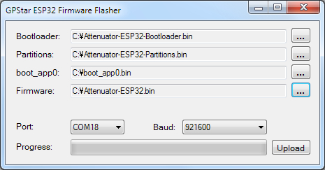

# Flashing the Attenuator

Separate firmware files exist for the Arduino Nano vs. the ESP32 version of the Attenuator, though the "Wireless Adapter" is simply an ESP32 controller without the inputs/outputs of an Attenuator. Therefore, the processes in this document will be the same for either use of an ESP32 controller.

For the Arduino Nano you may use the same flashing utility as the other gpstar PCB devices as outlined in the [FLASHING](FLASHING.md) guide. For the ESP32 that will require a different process as outlined below. Since both the Arduino Nano and ESP development board have their own USB-Micro connection it will **not** be necessary to use a Serial to UART programming cable as you do for the Proton Pack and Neutrona Wand.

## For Arduino Nano

Just as you used the gpstar flashing utility for Windows or MacOS to upload to your Proton Pack or Neutrona Wand, you will do the same for this device. Plug in your device using a standard USB cable and note the serial COM port used. Select the "Attenuator-Nano.hex" file from the `/binaries/attenuator` directory and upload to the attached device.

If you are using an Arduino Nano as part of a standalone Attenuator (meaning, a device not connected to a GPStar Proton Pack controller) you will want to use the `Attenuator-Nano-Standalone.hex` firmware which disables the serial communications. This will allow the device to operate without waiting for an attached pack and only requires a power source. There will be no control of your Proton pack but the toggles will work to provide lights and default bargraph animations.

## For ESP32

This device is capable of supporting Over-The-Air (OTA) updates for firmware, meaning you will need to utilize a desktop web browser from a computer (not a mobile device or tablet) and the built-in WiFi access point provided by the controller (prefix: "ProtonPack_"). **However, please note the following special conditions!**

1. If you used an off-the-shelf ESP32 device, then the software which enables the WiFi access point is **not yet loaded** so you will need to follow the "First-Time Upload" for the initial upload of firmware to your device.
1. If you are performing your first upgrade to the version v6.x firmware, you will need to perform the exact same process as the "First-Time Upload" to re-partition your device to accept the larger firmware files.

### Important Partition Upgrades: V5.x &rarr; V6.x

&#128721; **STOP, PLEASE READ!**

**The partition scheme for the ESP32-based controllers has changed as of v6.0.0 to support a larger firmware file. This requires an update via USB cable for any users who were previously on a firmware release in v5.x or earlier.** You will need to follow the "First-Time Upload" process to use a new, custom partition scheme on the device which provides a larger storage areas for Over-the-Air (OTA) updates. The standard flash memory of the ESP-WROOM-32 modules we use is limited to 4MB and must provide space to upload new firmware. For context, the default partition prioritized a "SPIFFS" area which was intended for file storage but is not used for our purposes. By removing that storage area we can allocate more space for larger firmware images (app0/app1), and adds an additional area for non-volatile storage (NVS).

**Old Scheme:**

- nvs: 20kb
- otadata: 8kb
- app0: 1280kb (ota_0)
- app1: 1280kb (ota_1)
- spiffs: 1408kb
- coredump: 64kb

**New Scheme:**

- nvs: 20kb
- otadata: 8kb
- app0: 1920kb (ota_0)
- app1: 1920kb (ota_1)
- nvs2: 128kb
- coredump: 64kb

Once you have updated to a firmware from v6.x or later using the USB process, then then you may proceed to using the instructions for over-the-air (OTA/WiFi) updates **without** a USB cable as described in the **"Standard Updates"** section.

For a more visual representation, please refer to this flowchart:


### ESP32: First-Time Upload (via USB)

The following steps MUST be taken if either of these situations applies to you:

- If you are using your own ESP32 controller direct from Amazon or another supplier, then the microcontroller has not been flashed with the GPStar firmware to enable the OTA upload feature and the manual flashing process is required.
- Or, if you are performing the first firmware update since the introduction of v6.x you will need to perform the manual flashing process. We need to make room for larger firmware files and this can only be done by repartitioning the device's internal 4MB storage area.

If you encounter any issues while attempting to access your ESP32 device via a USB cable, please see the **"[USB Troubleshooting](#usb-troubleshooting)"** section at the bottom of this guide.

**Option 1: Using GPStar ESP32 Firmware Uploader**

This uses a purpose-built flash tool just like the tools for the Proton Pack, Neutrona Wand, Single-Shot Blaster and GPStar Audio. Thanks to its ease of use, this is our recommended method for performing the first-time USB upload process. First, download either the Windows or Mac OSX flash tool from the [extras](extras/) folder. If you are on Windows x86 or Linux, try Option 2 below instead.

**Windows (x64 only):** [GPStar ESP32 Firmware Flasher](extras/gpstarESP32FirmwareFlasher.exe?raw=1)

**MacOS Intel/M1:** [GPStar ESP32 Firmware Flasher (Mac OSX)](extras/GPStar-ESP32-Flasher.dmg?raw=1)

1. Plug your device into a USB port on your computer.
2. Locate the following files from the `/binaries/attenuator` directory.

	* [extras/Attenuator-ESP32-Bootloader.bin](binaries/attenuator/extras/Attenuator-ESP32-Bootloader.bin?raw=1) = This is the standard bootloader for the ESP32 itself.
	* [extras/Attenuator-ESP32-Partitions.bin](binaries/attenuator/extras/Attenuator-ESP32-Partitions.bin?raw=1) = This specifies the partition scheme for the flash memory.
	* [extras/boot_app0.bin](binaries/attenuator/extras/boot_app0.bin?raw=1) = This is the software for selecting the available/next OTA partition.
	* [Attenuator-ESP32.bin](binaries/attenuator/Attenuator-ESP32.bin?raw=1) = This is the custom firmware for the GPStar kit.

3. Open the GPStar ESP32 Firmware Flasher and browse to the files specified in step 2 above for each of the four requested file locations (see below screenshot).



4. The program should automatically detect the correct COM port and baud rate (see above screenshot). If it did not, use the drop-down menus to select the correct one for your PC.

5. Click the Upload button to flash the new firmware to your ESP32. Be patient, this process can take between 15 seconds and several minutes depending on the selected baud rate.

6. Once the flash has completed successfully, your ESP32 should now be broadcasting a WiFi network and you should be ready to install it into your Proton Pack. If the flash failed, please see Solution 2 in the **"[USB Troubleshooting](#usb-troubleshooting)"** section at the bottom of this guide to manually switch the ESP32 into bootloader mode. You may also try lowering the baud rate to 115200 (if available), though note this will increase the time it takes to flash the firmware.

**Option 2: Via Web Uploader**

This uses a 3rd-party website to upload using the Web Serial protocol which is only available on the Google Chrome, Microsoft Edge, and Opera desktop web browsers. Mobile browsers are NOT supported, and you will be prompted with a message if your web browser is not valid for use.

1. Plug your device into a USB port on your computer and go to [http://espwebtool.ghostbusters.engineering](http://espwebtool.ghostbusters.engineering) (which [redirects to https://esp.huhn.me](https://esp.huhn.me)).

1. Locate the following files from the `/binaries/attenuator` directory.

	* [extras/Attenuator-ESP32-Bootloader.bin](binaries/attenuator/extras/Attenuator-ESP32-Bootloader.bin?raw=1) = This is the standard bootloader for the ESP32 itself.
	* [extras/Attenuator-ESP32-Partitions.bin](binaries/attenuator/extras/Attenuator-ESP32-Partitions.bin?raw=1) = This specifies the partition scheme for the flash memory.
	* [extras/boot_app0.bin](binaries/attenuator/extras/boot_app0.bin?raw=1) = This is the software for selecting the available/next OTA partition.
	* [Attenuator-ESP32.bin](binaries/attenuator/Attenuator-ESP32.bin?raw=1) = This is the custom firmware for the GPStar kit.

1. Click on the **CONNECT** button and select your USB serial device from the list of options and click on "Connect".

1. Once connected, select the files (noted above) for the following address spaces:

	* 0x1000 &rarr; [Attenuator-ESP32-Bootloader.bin](binaries/attenuator/extras/Attenuator-ESP32-Bootloader.bin?raw=1)
	* 0x8000 &rarr; [Attenuator-ESP32-Partitions.bin](binaries/attenuator/extras/Attenuator-ESP32-Partitions.bin?raw=1)
	* 0xE000 &rarr; [boot_app0.bin](binaries/attenuator/extras/boot_app0.bin?raw=1)
	* 0x10000 &rarr; [Attenuator-ESP32.bin](binaries/attenuator/Attenuator-ESP32.bin?raw=1)

1. Click on the **PROGRAM** button to begin flashing. View the "Output" window to view progress of the flashing operation.

1. Once the device has completely flashed (100%) unplug the USB cable and remove any remaining power source from the device. Restore power to reboot the device and confirm operation.

View [a quick video](images/ESP_Firmware_Update.mp4) of what this process should look like. Your list of USB devices may differ, and it may require selecting a different device if you cannot immediately determine which connected device is your ESP32.

📝 **NOTE:** If your device still cannot be found automatically you may need to view the **"[USB Troubleshooting](#usb-troubleshooting)"** section at the bottom of this guide.

**Option 3: Via Command-Line**

You will need to utilize a command-line tool to upload the firmware to your device from your local computer. Note this is *not recommended* unless you are using a platform other than Windows x64 or Mac OSX, such as Linux.

1. Install the latest Python 3.x utility based on your operating system:

	- 	Windows: Download the installer from [Python](https://www.python.org/downloads/windows/). When installing you may be prompted to "Add Python to PATH", and it is recommended to accept that option.
	-  Linux: Execute `sudo apt update && sudo apt install -y python3 python3-pip`
	-  MacOS: Execute `brew install python` using Homebrew ([instructions here](https://brew.sh/))

1. From a terminal (command line) prompt run the following which will install the `pip` tool along with the `esptool` utility:

	```
	python3 -m ensurepip
	python3 -m pip install --upgrade pip setuptools esptool
	```

1. Confirm that python was installed successfully by running the commands `python --version` and `python3 --version`. Use the command that reports a 3.x version (`python` or `python3`) for all following steps. We will assume `python3` is available.

1. Navigate to the `binaries/attenuator` directory within the extracted GPStar-proton-pack software release:

	`cd <extracted_location>/binaries/attenuator`

1. Ensure your ESP32 is plugged into your computer using a data-capable USB cable. Run the following command to detect and display information about your ESP32, including the serial port used for communication:

	`python3 -m esptool flash_id`

	- If this lists multiple devices, unplug the device and run the command; then replug the device and run the command again.
	- Look for differences in the results to identify which USB device belongs to your ESP32.
	- For **Linux/MacOS** the port name may begin with `/dev/cu.usbserial` or `/dev/cu.wchusbserial` and **is** case-sensitive when used.
	- For **Windows** it would be `COM[0-9]` (eg. `COM4` or `COM12`) and **is not** case-sensitive.

1. Run the following command to flash the bootloader and firmware, providing the correct `<PORT>` value discovered from the previous step:

	```
	python3 -m esptool --port <PORT> --chip esp32 --baud 921600 write_flash --flash_mode dio --flash_size detect --flash_freq 40m 0x1000 extras/Attenuator-ESP32-Bootloader.bin 0x8000 extras/Attenuator-ESP32-Partitions.bin 0xe000 extras/boot_app0.bin 0x10000 Attenuator-ESP32.bin
	```

📝 **NOTE:** If your device still cannot be found automatically you may need to view the **"[USB Troubleshooting](#usb-troubleshooting)"** section at the bottom of this guide.

### ESP32: Standard Updates (via WiFi)

This applies to all updates you will perform AFTER the first-time upload of the firmware for the device, when the private WiFi network for the Proton Pack is available via the custom firmware.

1. Power up your Proton Pack and ESP32 device (whether standalone or as part of the Attenuator hardware).
1. Open the WiFi preferences on your computer/device and look for the SSID which begins **"ProtonPack_"**.
	* If this is your first connection to this access point, use the default password **"555-2368"**.
1. Navigate directly to the URL: [http://192.168.1.2/update](http://192.168.1.2/update)
1. Use the "Select File" button and select the [Attenuator-ESP32.bin](binaries/attenuator/Attenuator-ESP32.bin?raw=1) file from the `/binaries/attenuator` directory.
1. The upload will begin immediately. Once at 100% the device will reboot.
1. Navigate to [http://192.168.1.2](http://192.168.1.2) or `http://protonpack_####.local` to confirm that the device is able to communicate with the Proton Pack PCB.


**Note:** If the upload fails, this is not uncommon. Simply attempt the upload again using the OTA updater.

## WiFi Security

While every device gets a unique SSID for the wireless network, the password is always the same default of "555-2368". Therefore, to keep your device private and out of reach of others you are **strongly** encouraged to change this password.

### Setting a WiFi Password

Since this device will make use of a private WiFi network with a default password, it is STRONGLY encouraged that you take a moment to change the password to something you prefer to avoid unauthorized access of your equipment.

Once you are able to reach the web UI at [http://192.168.1.2](http://192.168.1.2) or `http://protonpack_####.local` scroll to the bottom of the page to find the "Secure Device WiFi" link. Follow the instructions on the page to set a new password for your device. This will be unique to the ESP32 controller and will persist as the new default even if the device is power-cycled. Passwords must only be at least 8 characters and you will be required to enter a matching password as confirmation to ensure you entered the expected string of characters.

The password you choose will be stored in an area of the device's flash memory that is unaffected by future firmware updates. Therefore, if you forget your password you may need to load a special version of the firmware which can bypass that stored value and allow you to use the default password again. This process is covered in the next section.

### Forgot Your WiFi Password?


The following is only applicable to users on firmware PRIOR to the v5.2.2 release. As of that release the ability to boot up with the default password was introduced by pressing down on the center dial when power is applied to the device.

If you have forgotten the password to the private WiFi network, you will need to load a special firmware to allow you to access the device and reset the password. Though if you have opted to connect your device to a preferred WiFi network using the built-in WiFi settings, simply return to your device's IP address on that network and change the password for the private WiFi network as desired.

In the case where you do not have access to your device via an external WiFi network, you will need to follow a special process using a USB cable and a utility for your OS of choice. This will follow the same process as the "First-Time Upload" instructions posted above, though you will instead load the [Attenuator-ESP32-Reset.bin](binaries/attenuator/Attenuator-ESP32-Reset.bin?raw=1) file from the `/binaries/attenuator` directory.

Once flashed, this will allow you to get back into the web UI at [http://192.168.1.2](http://192.168.1.2) or `http://protonpack_####.local` using the default password ("555-2368") and change to your choice of password. **Once changed, you will need to re-flash the device using the standard firmware--otherwise, the device will always use the default WiFi password while this firmware is loaded**! The new password will be used automatically to secure the WiFi access point once the regular firmware is in use.

📝 **Note:** When using this firmware there will be additional debug messages enabled for the device. Therefore, this firmware image may also be used to help debug WiFi issues by checking the output via the Arduino IDE's serial console. Be sure to set the baud rate to 112500 to view the output correctly.

---

## USB Troubleshooting

Before beginning any actions when using a USB cable, be sure to use a high-quality USB cable which supports data transfer. Some cheap cables may only support charging (not data), or not fully support the power requirements of the device.

**Problem 1:** Your ESP32 controller does not appear as a serial device in your operating system (COM# for Windows, /dev/cu.usb* for macOS/Linux).

**Solution 1:** It is necessary to install a driver for the **"CP210x USB to UART Bridge"** onto your computer for some devices. A driver for Windows and macOS is available [via Silicon Labs](https://www.silabs.com/developers/usb-to-uart-bridge-vcp-drivers?tab=downloads) and has proved useful.

**Problem 2:** The ESP32 device can be detected when using the [ESPWebTool website](https://esp.huhn.me/) but can't connect. Alternatively, you get a notice that the device must be reset.

**Solution 2:** You must put the device into bootloader mode. To help with this, use the [SerialTerminal website](https://serial.huhn.me/) to connect to your device first:

1. Plug ESP32 into computer
2. Hold down BOOT button
3. While holding BOOT, click EN once
4. Continue holding BOOT until the firmware update tool says "Connecting..." then release

You should see a message similar to the following which indicates the device is ready to flash:

```
rst:0x1 (POWERON_RESET),boot:0x3 (DOWNLOAD_BOOT(UART0/UART1/SDIO_REI_REO_V2))
waiting for download
```

Without disconnecting the device from your computer, and using the **same** browser tab, return to the ESPWebTool website](https://esp.huhn.me/) and complete the flashing process as described earlier in this guide as "Option 2".

**Note:** If you get garbage on the screen when using the serial terminal, use the gear icon at the top right to make sure the baud rate is set to 115200.

**Problem 3:** The process described in Solution 2 did not work, help!

**Solution 3:** Try using Option 1 instead. For users not on Windows x64 or Mac OSX, use Option 3 to run `esptool` manually.

**Problem 4:** For Linux users, if you get a "Permission denied" error when running `esptool` you may need to add your user to the dialout group.

**Solution 4:** Run this command, then log out and back in for the changes to take effect:

	`sudo usermod -aG dialout $USER`

📝 **Tip:** If you have successfully flashed your ESP32 device and do not see the available WiFi access point, try plugging your USB cable directly into the Talentcell battery or try another USB port on your computer. In rare cases the USB port and/or cable cannot supply enough voltage to run the ESP32's WiFi radio.

📝 **Tip:** To identify the USB device requires different methods based on the operating system used:

- For **Linux** use the `lsusb` utility (or `lsusb -v`) to list attached USB devices.
- For **MacOS** run `ls /dev/{tty,cu}.*` to list available USB devices.
- For **Windows**, use the "Device Manager" and look at the **"Ports (COM & LPT)"** section.

These guides from Espressif may be of some help as a reference:

* [Espressif - esptool Installation](https://docs.espressif.com/projects/esptool/en/latest/esp32/installation.html#installation)
* [Espressif - Flashing Firmware](https://docs.espressif.com/projects/esptool/en/latest/esp32/esptool/flashing-firmware.html)
* [Espressif - Boot Mode Selection](https://docs.espressif.com/projects/esptool/en/latest/esp32/advanced-topics/boot-mode-selection.html)

---

## Software Development Requirements

As of the v5.4.0 release the development platform of choice for this device has been migrated from Arduino IDE to the [VSCode with PlatformIO](VSCODE.md). Please follow the linked guide for installing the core software and plugins required. The source code for the Attenuator has also been divided into separate projects for the Arduino Nano vs. the ESP32 which allows for the respective libraries to be downloaded automatically as necessary.
