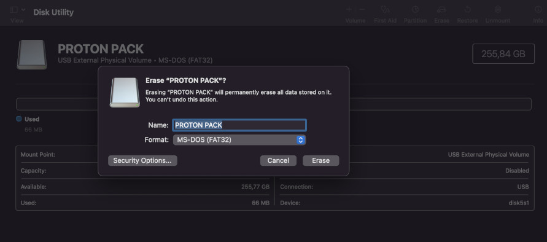
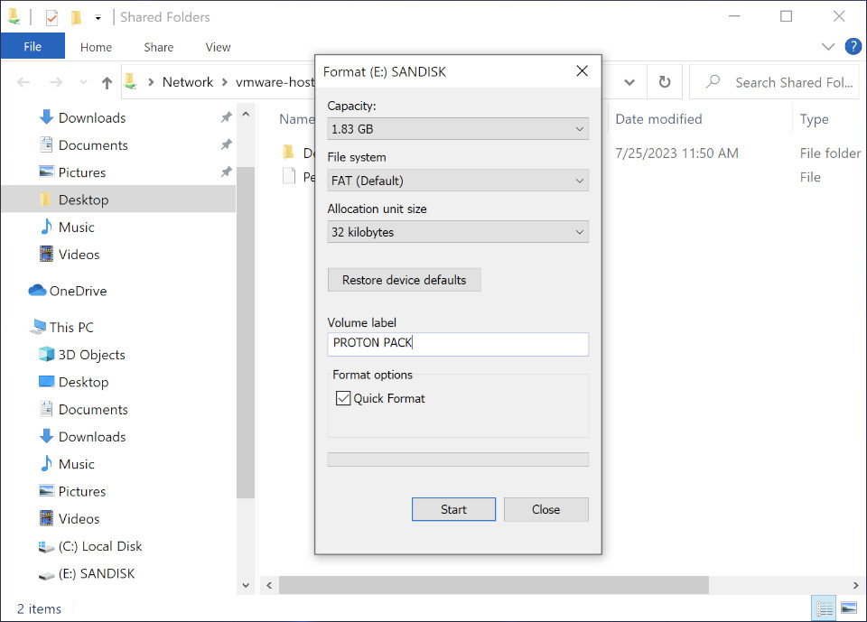
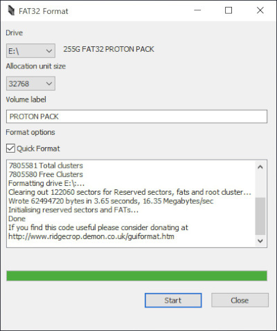
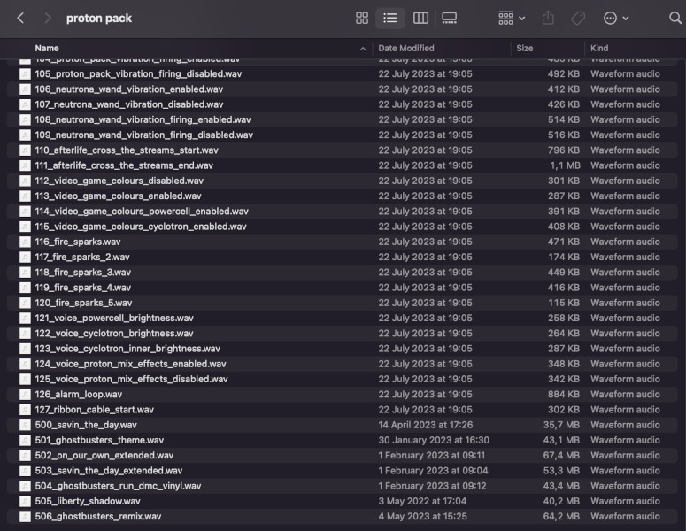

## Loading Audio Files (Effects + Music)

This repository (for somewhat obvious reasons) does not provide music tracks for your project other than a single track which was graciously approved by the independent artist for inclusion. You will need to prepare any music tracks for use by exporting MP3 or AAC audio files as 44.1kHz 16-bit WAV files. This can be done easily using a program such as [Audacity](https://www.audacityteam.org/) to open the music file and export to WAV format. See the instructions below for how to name your files for loading onto the SD cards.

## Format your SD Card to FAT32
`Please consider high-quality, name-brand SD Cards. We recommend Sandisk Extreme A1/A2 U3 V30 32GB Micro SD Cards.`

Your SD cards **MUST** be formatted as FAT32 using 32KB block size. Use a full formatting option for the SD cards not a quick formatting for best results.

## SD Cards with capacities larger than 32GB in FAT32.

### MAC and Linux
Mac and Linux users can format SD Cards larger than 32GB as FAT32 normally with their standard disk utility software.

### WINDOWS
SD Cards with capacities of **32GB OR LESS** can be formatted normally in the Windows Explorer.

**SD Cards with capacities larger than 32GB** for Windows users will need to be formatted a different way. We recommend the free tool Fat32Format by Tom Thornhill. It can be found in the `extras` folder of this repository or in the direct download link below

(Web Site)
[Fat 32 Format GUI version](http://ridgecrop.co.uk/index.htm?guiformat.htm)

(Direct Download link)
[fat32format (exe)](https://github.com/gpstar81/haslab-proton-pack/raw/main/extras/sound/guiformat.exe)

`Thank you to Tom Thornhill for allowing us to distribute his FAT32 formatter for Windows users. If you find his software useful, you can donate directly to him by clicking on the button below`

## Loading Files to the SD Cards

Load [all sound files from the "sounds" folder](sounds) (and music, optionally) onto both SD cards. The file names must be identical and match between the SD cards so that any synchronized effects are both played by both Proton Pack and Neutrona Wand at the same time. Although only some of the same tracks are played on the wand and pack while firing, some tracks play the same like the firing tail end, video game firing sounds, etc. For the proton stream, the wand plays a different sound vs the pack, so they overlap and mix in person for a nice effect.

Sound effects are prefixed with numbers 001-499 while music files will be prefixed as 500 and above. `DO NOT LEAVE GAPS IN PREFIXES WHEN NUMBERING FILES!` The only exception is between the last sound effect and first music track.

To add more music, copy stereo WAV tracks (16-bit 44khz stereo WAV files) onto the SD card of the pack and wand. File naming of the music tracks start at 500. So for example, `500_somesong.wav`, `501_somesong.wav`, `502_somesong.wav`, etc. **Do not leave any gaps in the number sequencing!** (For example of what NOT to do, `500_somesong.wav` followed by `502_somesong.wav` leaving off `501_somesong.wav` on the SD card.) The most and only important part in the naming is the XXX_ prefix for all tracks.

📝 You **MUST** remove any metadata that may be present in the music WAV files that you add. This can cause problems with loading and playing back your music tracks

`The below photo is a example of the prefixing and music sequencing`

