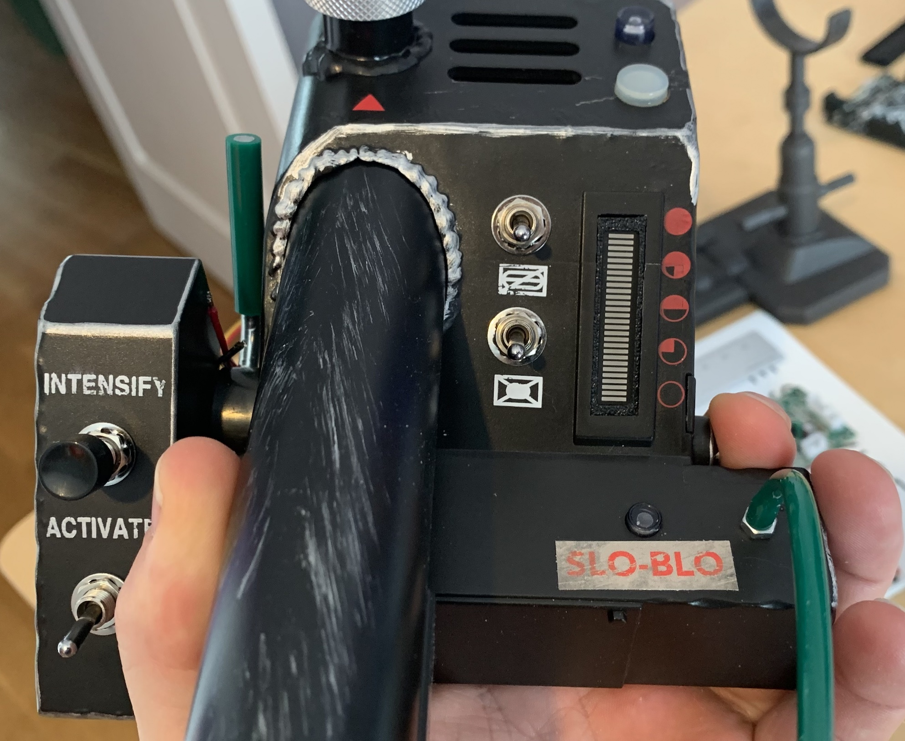
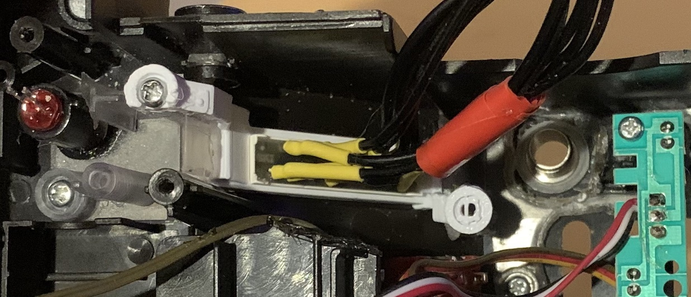
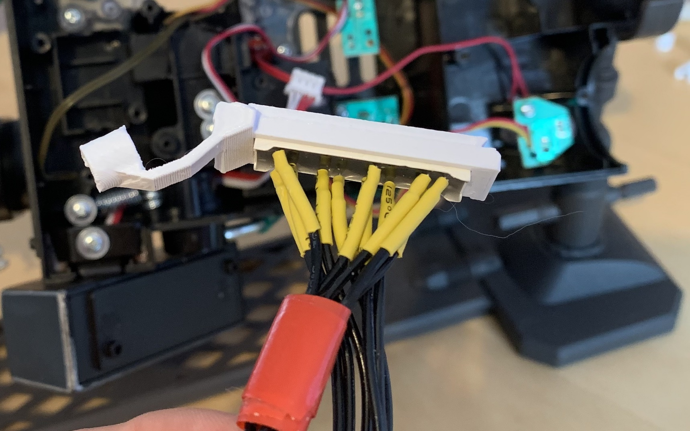

# Wand Bargraph Upgrade

**NOTE: Only supported with the gpstar Neutrona wand micro controller**

This guide outlines the **optional** upgrade from the 5-LED stock bargraph to a more animated 28-segment bargraph (BL28Z-3005SA04Y). Additional parts will be required, as well as a more invasive disassembling of the wand.

| Qty | Desc | Use | Link |
|-----|------|-----|------|
| 1   | Barmeter 28 Segment Bargraph | Please use the part number ***BL28Z-3005SA04Y*** | [https://www.aliexpress.us/item/3256803648954593.html](https://www.aliexpress.us/item/3256803648954593.html) |
| 1   | Adafruit 16x8 LED Matrix Driver Backpack - HT16K33 Breakout | This will be the display driver for the bargraph elements using I2C serial communication | [https://www.adafruit.com/product/1427](https://www.adafruit.com/product/1427) |

### BARMETER 28 SEGMENT BARGRAPH

You will find the Barmeter pin reference below which will connect the bargraph to the matrix driver board. See the component fitment guide at the bottom of this page for how to mount this Bargraph into your wand body.

| HT16K33 Board | PCB    | Nano Pin | Barmeter Pin |
|---------------|--------|----------|--------------|
| VDD           | +5V    |          |              |
| GND           | Ground |          |              |
| SDA           | →      | Pin A5   |              |
| SCL           | →      | Pin A4   |              |
| A0            | →      | →        | 22 (C1)      |
| A1            | →      | →        |  1 (C2)      |
| A2            | →      | →        | 19 (C3)      |
| A3            | →      | →        | 18 (C4)      |
| A4            | →      | →        |  7 (C5)      |
| A5            | →      | →        | 10 (C6)      |
| A6            | →      | →        | 11 (C7)      |
| C0            | →      | →        | 21 (L1)      |
| C1            | →      | →        | 15 (L2)      |
| C2            | →      | →        | 13 (L3)      |
| C3            | →      | →        | 16 (L4)      |

**Note** - If using the all-in-one PCB controller, connect the SDA and SCL pins directly to the expansion port available on that board. Additionally, the VDD and GND pins may make use of the 5V-OUT connection on that controller.

### BARMETER 28 SEGMENT BARGRAPH - BL28Z-3005SA04Y - Pin Layout Reference

The following is Barmeter's internal reference for the numbered pins alone the edge of the bargraph packaging and their internal names. This is for technical reference only--the only concern for connections should be from the bargraph to the HT16K33 board.

| 1  | 2 | 3 | 4 | 5 | 6 | 7  | 8 | 9 | 10 | 11 | 12 | 13 | 14 | 15 | 16 | 17 | 18 | 19 | 20 | 21 | 22 |
|------|----|---|---|---|---|---|----|---|---|----|----|----|----|----|----|----|----|----|----|----|----|----|
| C2 |  |  |  |  |  | C5 |  |  | C6 | C7 |  |  |  |  |  |  | C4 | C3 |  |  | C1 |
|  |  |  |  |  |  |  |  |  |  |  |  | L3 |  | L2 | L4 |  |  |  |  | L1 |  |

### Inverted Bargraph Sequences

If your bargraph is inverted or upside down, you can either flip it physically in the wand, or you can set enabled or disable the:

**#define GPSTAR&nbsp;INVERT&nbsp;BARGRAPH** 

setting in the Neutrona Wand Configuration.h, please see the [Advanced Configuration](ADVCONFIG.md) guide for more information.

### Fitment & Installation

The 28-segment bargraph is intended to take the place of the 5-LED + PCB assembly from the stock Haslab equipment. The only means of accessing this is to remove the barrel release assembly and a portion of the plastic base which sits below the stock controller board. This may require some cutting as the center of that piece is glued directly to the wand handle. Once removed, access to the old bargraph is quite easy and takes removal of 2 screws. The circuit board with the LED's resides under a small black cover and can be removed from the wand once that cover is removed.

To fit the new bargraph in place, it needs a suitable holder to keep it in the correct orientation. Thankfully, it can be seen quite well without removing the clear/frosted plastic from the wand housing, though some minor trimming may be necessary at the bottom (when oriented with the rotary encoder facing up) of the bargraph socket. 

If you have access to a 3D printer, the file [bargraph_insert.stl](stl/wand/bargraph_insert.stl) should fit the bargraph tightly while also slotting into the clear plastic. 

There is an alternative mounting solution which when you cut the original clear plastic away, you can fit the bargraph into the [bargraph_mount.stl](stl/wand/bargraph_mount.stl) and [bargraph_block.stl](stl/wand/bargraph_block.stl) which uses the stock mounting screw positions.

