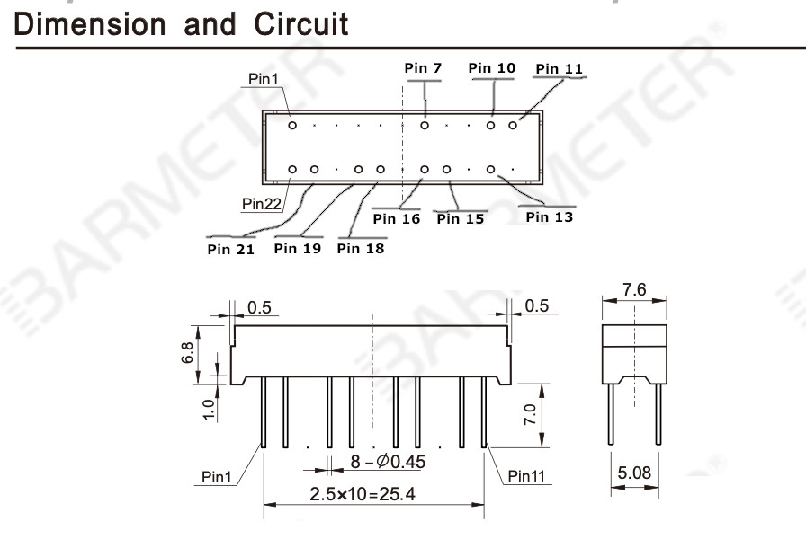

# Neutrona Wand Bargraph

**NOTE: The 28 Segment Bargraph upgrade is only supported with the GPStar Neutrona Wand microcontroller**

This guide outlines the **optional** upgrade from the 5-LED stock bargraph to a more animated 28-segment bargraph (BL28Z-3005SA04Y) or the 28 Segment Bargraph and Power Cell from [Frutto Technology](https://fruttotechnology.com).

## Frutto Technology 28 Segment Bargraph Installation Video Guide
[28 Segment Bargraph Installation Video Guide](https://www.youtube.com/watch?v=8smqGQ_Wr_c) (YouTube)

## Frutto Technology 28 Segment Bargraph and Power Cell Overview and Demo
[Frutto Technology Bargraph and Power Cell Overview and Demo Video](https://www.youtube.com/watch?v=CrQuCUjera4) (YouTube)

## Fitment & Installation

The 28-segment bargraph is intended to take the place of the 5-LED + PCB assembly from the stock Hasbro equipment. The only means of accessing this is to remove the barrel release assembly and a portion of the plastic base which sits below the stock controller board. This may require some cutting as the center of that piece is glued directly to the wand handle. Once removed, access to the old bargraph is quite easy and takes removal of 2 screws. The circuit board with the LEDs resides under a small black cover and can be removed from the wand once that cover is removed.

To install the bargraph, you will want to remove and cut the clear plastic piece away and the original barrel wire cover plastic. You can fit the bargraph into the [28_Segment&#95;Bargraph&#95;Mount.stl](stl/wand/28%20Segment%20Bargraph/28_Segment_Bargraph_Mount.stl) and [28&#95;Segment&#95;Bargraph&#95;Block.stl](stl/wand/28%20Segment%20Bargraph/28_Segment_Bargraph_Block.stl) which uses the stock mounting screw positions.

It is important to know, after cutting the clear plastic piece, you will want to cut/grind the top part at the indicated red arrows so the bargraph mount fits over it without having to bend.

There is an alternative mounting solution using the one piece mount. The file [28_Segment&#95;Bargraph&#95;Insert.stl](stl/wand/28%20Segment%20Bargraph/28_Segment_Bargraph_Insert.stl) should fit the bargraph tightly while also slotting into the clear plastic.

[Frutto_28_Segment&#95;Bargraph&#95;Insert.stl](stl/wand/28%20Segment%20Bargraph/Frutto_28_Segment_Bargraph_Insert.stl)

Also available to download in this repository, or purchase from the [gpstartechnologies.com](https://gpstartechnologies.com) website are 2 versions (short or long depending on how much plastic you remove) of a barrel wire cover, to protect your wires from getting caught on the retractable wand barrel mechanism. This cover screws onto the existing holes that the previous Hasbro board was screwed into, making it easy to remove and to do service inside your wand.

## DIY 28 Segment Bargraph
Additional parts will be required, as well as a more invasive disassembling of the wand.

| Qty | Desc | Use | Link |
|-----|------|-----|------|
| 1   | Barmeter 28 Segment Bargraph | Please use the part number ***BL28Z-3005SA04Y*** | [https://www.aliexpress.us/item/3256803648954593.html](https://www.aliexpress.us/item/3256803648954593.html) |
| 1   | Adafruit 16x8 LED Matrix Driver Backpack - HT16K33 Breakout | This will be the display driver for the bargraph elements using I2C serial communication | [https://www.adafruit.com/product/1427](https://www.adafruit.com/product/1427) |

### BARMETER 28 SEGMENT BARGRAPH

You will find the Barmeter pin reference below which will connect the bargraph to the matrix driver board. See the component fitment guide at the bottom of this page for how to mount this Bargraph into your wand body.

| HT16K33 Board | Wand PCB |  Barmeter Pin |
|---------------|--------|---------------|
| VDD           | +5V    |               |
| GND           | Ground |               |
| SDA           | SDA    |               |
| SCL           | SCL    |               |
| A0            | →      |  22 (C1)      |
| A1            | →      |   1 (C2)      |
| A2            | →      |  19 (C3)      |
| A3            | →      |  18 (C4)      |
| A4            | →      |   7 (C5)      |
| A5            | →      |  10 (C6)      |
| A6            | →      |  11 (C7)      |
| C0            | →      |  21 (L1)      |
| C1            | →      |  15 (L2)      |
| C2            | →      |  13 (L3)      |
| C3            | →      |  16 (L4)      |

**Note** - If using the all-in-one PCB controller, connect the SDA and SCL pins directly to the expansion port available on that board. Additionally, the VDD and GND pins may make use of the 5V-OUT connection on that controller.

### BARMETER 28 SEGMENT BARGRAPH - BL28Z-3005SA04Y - Pin Layout Reference

The following is Barmeter's internal reference for the numbered pins along the edge of the bargraph packaging and their internal names. This is for technical reference only--the only concern for connections should be from the bargraph to the HT16K33 board.

| Pin #  | 1  | 2 | 3 | 4 | 5 | 6 | 7  | 8 | 9 | 10 | 11 | 12 | 13 | 14 | 15 | 16 | 17 | 18 | 19 | 20 | 21 | 22 |
|---------|----|---|---|---|---|---|----|---|---|----|----|----|----|----|----|----|----|----|----|----|----|----|
|         | C2 |   |   |   |   |   | C5 |   |   | C6 | C7 |    |    |    |    |    |    | C4 | C3 |    |    | C1 |
|         |    |   |   |   |   |   |    |   |   |    |    |    | L3 |    | L2 | L4 |    |    |    |    | L1 |    |

### Inverted Bargraph Sequences

If your bargraph is inverted or upside down, you can either flip it physically in the wand, or you can invert / de-invert it from within the EEPROM Configuration Menu System. Please see the [EEPROM Menu System](OPERATION_EEPROM.md) guide for more information.
