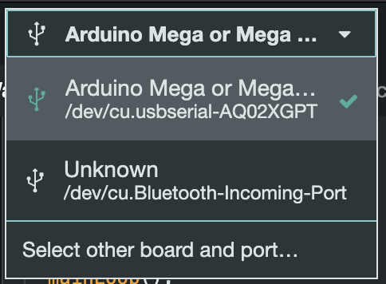
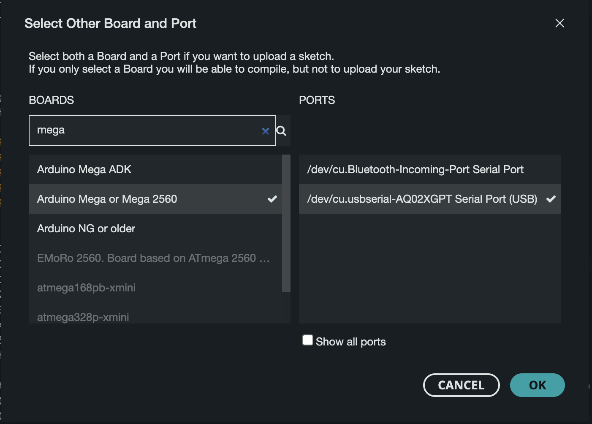
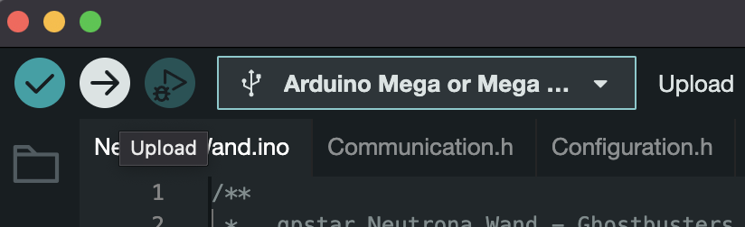

# Compiling & Flashing via IDE Setup

The custom software needed for operation must be compiled and uploaded to your devices which can be accomplished using an interactive development environment (IDE). This guide provides the list of required libraries for compilation and outlines the changes needed to support each board.

## Supported Devices

Please refer to the table below for a list of devices and their supported software release.

| Controller Device | v1.x | v2.x | v3.x | v4.x | v5.x | v6.x |
|-------------------|------|------|------|------|------|------|
|  GPStar Proton Pack PCB   | Yes | Yes | Yes | Yes | Yes | Yes |
|  GPStar Neutrona Wand PCB | Yes | Yes | Yes | Yes | Yes | Yes |
| d1 DIY Arduino Mega Proton Pack   | Yes | Yes 2 | Yes 3 | Yes 3 | Yes 3 | Yes 3 |
| d1 DIY Arduino Mega Neutrona Wand | Yes | Yes 2 | Yes 2 | Yes 2 | Yes 2 | Yes 2 |

d1 These are now considered as "legacy" devices and have distinct end-of-life notes in later versions (see additional superscript notations).

2 Support for the Arduino Nano as a wand controller ended after the release of v2.2.0. That device must be replaced with a [Mega 2560 Pro Mini](https://www.amazon.com/s?k=Mega+2560+PRO+MINI) to support the later software releases.

3 If paired with an Arduino Nano for the Neutrona Wand, this arrangement is deprecated. To continue using the DIY Arduino Mega you will need to upgrade the Neutrona Wand to use the GPStar Neutrona Wand PCB or a [Mega 2560 Pro Mini](https://www.amazon.com/s?k=Mega+2560+PRO+MINI).

## Prerequisites

Download and install the Arduino IDE. This will be used to compile and upload the code to your Proton Pack and Neutrona Wand.

[Arduino IDE](https://www.arduino.cc/en/software)

The following libraries are required to be installed. All can be found within the Arduino Library Manager with the app. Go to `Sketch -> Include Library -> Manage Libraries...` to access the Library Manager. Search for the libraries by name and install the latest version available.

- **ArduinoINA219** by Flavius Bindea (1.1.1+)
- **CRC32** by Christopher Baker (2.0.0+)
- **digitalWriteFast** by Watterott and Armin Joachimsmeyer (1.2.0+)
- **ezButton** by ArduinoGetStarted.com (1.0.6+)
- **FastLED** by Daniel Garcia (3.7.0+)
- **Ramp** by Sylvain Garnavault (0.6.1+)
- **SafeString** by Matthew Ford (4.1.33+)
- **SerialTransfer** by PowerBroker2 (3.1.3+)
- **Simple ht16k33 Library** by Ipaseen (1.0.2+)
- **Switch** by Albert van Dalen (1.2.4+)
- **GPStar Audio Serial Library** by Michael Rajotte (1.2.0+)

You will also need some basic Boards libraries:

- **Arduino AVR** Boards by Arduino (1.8.6+)
- **Arduino megaAVR** Boards by Arduino (1.8.8+)

## +++ IMPORTANT WHEN FLASHING UPDATES +++

If you are flashing updates to your existing setup, make sure that both your Proton Pack and Neutrona Wand Micro SD Cards have all the latest sound effects from this repository.

## Connection to your GPStar Proton Pack and Neutrona Wand PCB

Use the included FTDI to USB programming cable that comes with your GPStar kit or use any other suitable FTDI 5V basic serial connector. The UART Pins on the PCB should align with with the standard wire order for FTDI-to-USB cables which use a single Dupont 6-pin connector. Observe these common colours and notes to ensure proper orientation:

- The ground pin will typically be a black wire, while VCC will typically be red.
- The DTR pin on the PCB will connect to a wire labelled either DTR or RTS.
- Any wire labelled CTS will be connected to the 2nd pin labelled GND on the PCB.
- Be careful to not reverse the connector!

## Compiling and Flashing the Software

Once your have connected your GPStar board to your computer via the FTDI to USB cable, you will need to select it from your devices in the Arduino IDE and search for "2560" as these use the "Mega 2560" microcontroller.

Next click on the UPLOAD button (arrow pointing to the right) and wait for it to complete.

[Firmware Flashing Instructional Video](https://www.youtube.com/watch?v=J-P8rl3Hzck) (YouTube)

## Advanced User Configurations

To modify defaults within the software, please see the [Advanced Configuration](ADVCONFIG.md) guide.
