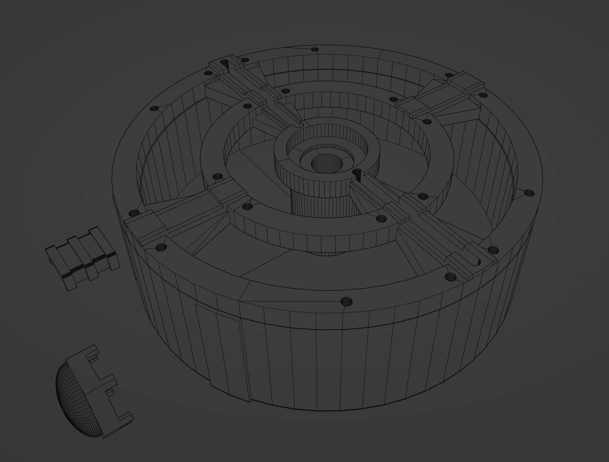

# Cyclotron Lights

These are *OPTIONAL* additions for use within the Proton Pack.

## Light Switch Panel (Optional)

There is a included STL file that you can 3D Print to replace the cyclotron switch plate. You can add 5mm LED's into here. See reference in the [Pack Setup](PACK.md) for wiring to the Arduino Mega. You can use cliplites to hold the LED’s in place. Refer to the parts list on where to source them.

## Inner Cyclotron Lights (Optional)
You can run either a NeoPixel ring (35 pixel ring recommended) or chain together 8 NeoPixel Jewels (see photo below) that you can run inside a modified inner cyclotron or any 3D printable one. See reference in the [Pack Setup](PACK.md) for wiring to the Arduino Mega. NeoPixel ring size and or jewels settings can be toggled in the user editable variables at the top of the proton pack code. 35 Pixel NeoPixel ring is the default setting.

Included is also a set of stl files if you wish to print a new inner cyclotron. The lid is held down onto the bottom part of this printable cyclotron with m3x12 hex screws.
