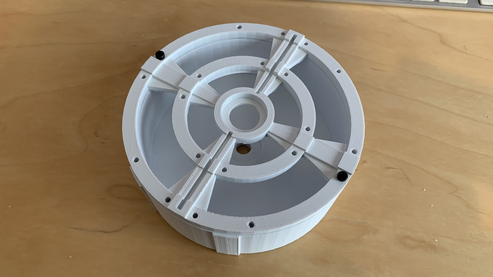

# Cyclotron Lights

These are *OPTIONAL* additions for use within the Proton Pack.

## Light Switch Panel (Optional)

There is a included STL file that you can 3D Print to replace the cyclotron switch plate. You can add 5mm LED's into the holes. See reference in the [Pack Setup](PACK.md) for wiring to the Arduino Mega. You can use cliplites to hold the LED’s in place. Refer to the parts list on where to source them.

## Inner Cyclotron Lights (Optional)

You can run a NeoPixel ring (35 pixel ring recommended) inside a modified inner cyclotron or any 3D printable one. See reference in the [Pack Setup](PACK.md) for wiring to the Arduino Mega. NeoPixel ring size can be toggled in the user editable variables at the top of the proton pack code. 35 Pixel NeoPixel ring is the default setting.

Included is also a set of STL files if you wish to print a new inner cyclotron. The lid is held down onto the bottom part of this printable cyclotron with m3x10 hex screws on the outer ring. The inner ring you can use smaller m3x8 hex screws for decoration. Enlarge or drill any holes for wire decoration or feeding wires into the cyclotron as necessary.

## Cyclotron Lid (Optional)

TBD - Questions have been raised as to whether the LED's for the cyclotron lid can be replaced with RGB[W] LED's. This is being investigated...