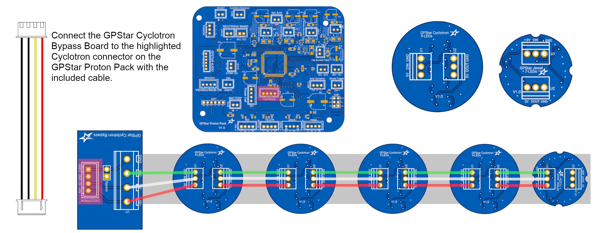

# GPStar Cyclotron Bypass

The GPStar Cyclotron Bypass is used to connect your GPStar Cyclotron LEDs or any addressable LED ring or lights to the GPStar Proton Pack electronics.

With the removal of the bypass shunt (included with the connectors variant), you can even make use of Proton Pack shells with removable cyclotron lids by breaking the ground connection loop with a simple switch system.

## Installation

Refer to the connection diagram photo below:

