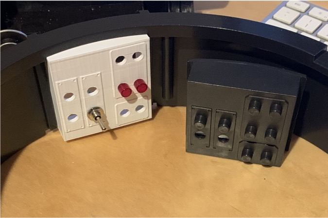
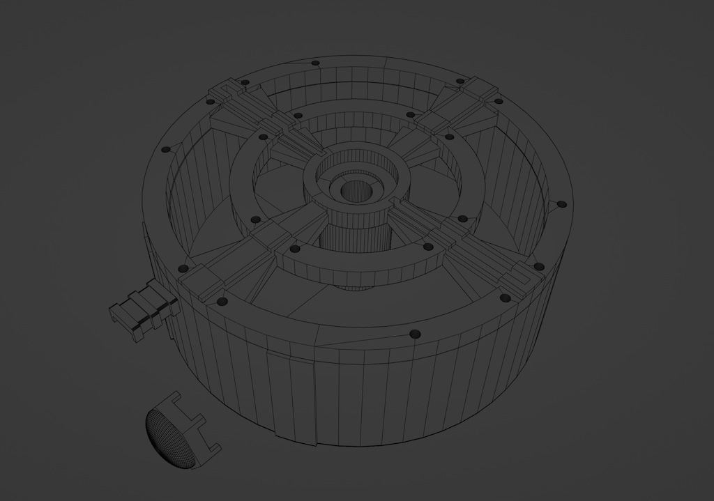

# Inner Cyclotron Lights

These are *OPTIONAL* add-on additions for use within the Proton Pack.

## Light Switch Panel (Optional)

There is a included STL file that you can 3D Print to replace the Cyclotron switch plate. You can add 5mm LEDs into the holes. See reference in the [Pack Setup](PACK.md) for wiring to the Arduino Mega. You can use cliplites to hold the LEDs in place. Refer to the [parts list](BOM.md) on where to source them.

If using the Frutto 8-LED PCB for RGB lighting, you will want to substitute [8 clear CLF-280-CTP cliplites](https://www.digikey.com/en/products/detail/visual-communications-company-vcc/CLF-280-CTP/4515438). This panel will sit between the pack controller and the inner cyclotron "cake" lights.

For reference, if using all of the optional parts which use addressable LEDs this is the correct order for installation:

`Pack Controller -> Inner LED Panel PCB -> Inner Cake Ring -> Cavity Lights`

Connections should be made to the side opposite the LEDs using JST-XH connectors. Plug J1 will be connected to the pack controller's "NEO-C" (aka. "Inner Cyclotron") port. This will be a straight-through cable for Data/VCC/GND. The inner cake lights should be attached to Plug J2 also using the pattern of Data/VCC/GND. Note that the order of wiring on the connection may need to be adjusted to match the LED ring light in use.

## Inner Cyclotron Lights (Optional)

You can run a NeoPixel ring (24, 25, or 35-Pixel ring recommended) inside a modified Inner Cyclotron or any 3D printable one. See reference in the [Pack Setup](PACK.md) for wiring to the Arduino Mega. NeoPixel ring size can be toggled in the user editable variables at the top of the Proton Pack code. A 35-Pixel NeoPixel ring is the default setting and maximum supported for this device.

Included is also a set of STL files if you wish to print a new Inner Cyclotron. The lid is held down onto the bottom part of this printable Cyclotron with M3x10 hex screws on the outer ring. The inner ring you can use smaller m3x8 hex screws for decoration. Enlarge or drill any holes for wire decoration or feeding wires into the Cyclotron as necessary.

## Sparking Cyclotron Lights (Optional)

For the effect seen in the Frozen Empire movie, it is possible to extend the LEDs beyond the end of the NeoPixel ring used within the inner cyclotron and run them inside the cavity between the "cake" and the copper blocks. These [addressable "fairy lights"](https://a.co/d/eFa8CNg) have been used successfully for the effect. They use an enamel-coated copper wire which makes them unobtrusive and they don't stand out like LED strips.

**Note:** This feature is currently only enabled via the web UI of the Attenuator/wireless device as part of the Proton Pack Settings.

## Motorised Cyclotron Support (Optional)

As of firmware 5.4.0, we now support connecting a motor control relay to the GPStar Proton Pack in case a user wishes to either replicate a prop-accurate Afterlife/Frozen Empire outer cyclotron effect or fit a spinning Inner Cyclotron cake. Connect a 5V tolerant relay trigger to Plug M1 (Vibration) on the Proton Pack PCB, then either use the Neutrona Wand menu or web UI Proton Pack Settings to change the Proton Pack Vibration Mode to "Motorised Cyclotron".

**WARNING:** Do not attempt to connect a motor directly to Pin M1! This pin was only ever designed to run the small toy vibration motor that came stock in the HasLab Proton Pack. Make sure that you only connect a motor control relay's trigger to Pin M1, and we highly recommend powering the motor with a power source independent of the GPStar kit itself so as not to steal current needed by the Pack and Wand.
