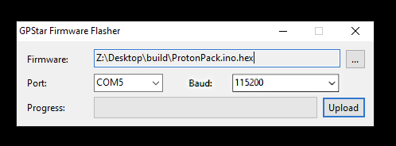

# Software Flashing Guide

## Supported Devices

Please refer to the table below for a list of devices and their supported software release.

| Controller Device | v1.x | v2.x | v3.x | v4.x | v5.x |
|-------------------|------|------|------|------|------|
|  GPStar Proton Pack PCB   | Yes | Yes | Yes | Yes | Yes |
|  GPStar Neutrona Wand PCB | Yes | Yes | Yes | Yes | Yes |
| d1 DIY Arduino Mega Proton Pack   | Yes | Yes 2 | Yes 3 | Yes 3 | Yes 3 |
| d1 DIY Arduino Mega Neutrona Wand | Yes | Yes 2 | Yes 2 | Yes 2 | Yes 2 |
| s1 Attenuator (Arduino Nano) | Yes | Yes | Yes | Yes | Yes |
| s1 Attenuator (ESP32)        | N/A | N/A | Yes | Yes | Yes |
| s1 Wireless Adapter (ESP32)  | N/A | N/A | Yes | Yes | Yes |

d1 These are now considered as "legacy" devices and have distinct end-of-life notes in later versions.

s1 These are referred to as "Serial1" devices as they attach to the GPStar Proton Pack PCB though they are considered separate devices and will be flashed independently. Please see the [ATTENUATOR_FLASHING](ATTENUATOR_FLASHING.md) guide for those instructions.

2 Support for the Arduino Nano as a wand controller ended after the release of v2.2.0. That device must be replaced with a [Mega 2560 Pro Mini](https://www.amazon.com/s?k=Mega+2560+PRO+MINI) to support the later software releases.

3 If paired with an Arduino Nano for the Neutrona Wand, this arrangement is deprecated. To continue using the DIY Arduino Mega you will need to upgrade the Neutrona Wand to use the GPStar Neutrona Wand PCB or a [Mega 2560 Pro Mini](https://www.amazon.com/s?k=Mega+2560+PRO+MINI).

## 📝 IMPORTANT NOTES FOR FLASHING UPDATES 📝

1. The same software version should be updated to **ALL** available devices, even if the changelog does not advertise modifications for a certain component. This ensures proper serial communication between devices.
1. If you are flashing updates to your existing setup, make sure that **BOTH** your Proton Pack and Neutrona Wand Micro SD Cards have all the latest sound effects from this repository as found in the `/sounds` directory.

## Connection to your GPStar Proton Pack and Neutrona Wand PCBs
Use the included FTDI to USB programming cable that comes with the GPStar kits or use any other suitable FTDI 5V basic serial connector. The UART Pins on the PCB should align with with the standard wire order for FTDI-to-USB cables which use a single Dupont 6-pin connector. Observe these common colours and notes to ensure proper orientation:

- The ground pin will typically be a black wire, while VCC will typically be red.
- The DTR pin on the PCB will connect to a wire labelled either DTR or RTS.
- Any wire labelled CTS will be connected to the 2nd pin labelled GND on the PCB.
- **Be careful to not reverse the connector!**

## Flashing Updates
After connecting your GPStar Proton Pack or Neutrona Wand board to your computer with the included FTDI to USB programming cable, download the GPStar firmware flasher from the extra folder and run the program.

**Windows:** [gpstarFirmwareFlasher.exe](https://github.com/gpstar81/haslab-proton-pack/raw/main/extras/gpstarFirmwareFlasher.exe)

**MacOS Intel/M1:** [GPStar-Firmware-Flasher-Mac.dmg](https://github.com/gpstar81/haslab-proton-pack/raw/main/extras/GPStar-Firmware-Flasher-Mac.dmg)

The latest pre-compiled firmware binaries can be found in the binaries folder of this repository.

[https://github.com/gpstar81/haslab-proton-pack/tree/main/binaries](https://github.com/gpstar81/haslab-proton-pack/tree/main/binaries)

When downloading the binaries via GitHub, click on the file then on the **`Download raw file`** button.

**It is recommended to have both the Proton Pack and Neutrona Wand on the same, latest version of their respective firmware.**

## Using the Flashing Software

## Windows ##

1. Open the firmware flasher, then select the firmware from the firmware selection box then select the firmware from the firmware selection box for the GPStar board you wish to flash.
1. Then select the PORT for the connection to your GPStar Board. `Microsoft Windows users: The Default baud rate of 115200 should already be automatically selected.` `The PORT will be different for every user and may not look like what you see in the screenshot image. If you attempt to flash and your GPStar board can not be found, please select another PORT from the drop down menu and try again.`
1. Click on the UPLOAD button and wait for it to complete.

`Note: If connecting the programming cable for the first time to your computer, it may take Windows a few minutes to setup the USB/TTL drivers automatically before it start working.`

## macOS ##

1. Open the firmware flasher by double-clicking the .DMG file. This will mount a new drive for the application.
1. Go to the mounted drive "GPSTAR-FIRMWARE-FLASHER" and double-click on the `GPStar-Firmware-Flasher.app` to start the program.
1. Select the firmware from the firmware selection box for the GPStar board you wish to flash.
1. Then select the PORT for the connection to your gpstar Board after connecting the gpstar board to your computer with the programming cable. `The PORT will be different for every user and may not look like what you see in the screenshot image.`
1. Click on the UPLOAD button and wait for it to complete.

## Flashing Update Instruction Video ##

[Firmware Update Instruction Video](https://www.youtube.com/watch?v=Hbk-RCVR1ew) (YouTube)

## (Optional) Compiling Source Code and Manually Flashing ##

If you prefer to make adjustments to the source code configuration options instead of flashing pre-compiled binaries, refer to the Compiling and Flashing link below.

* [Compiling and Flashing](COMPILING_FLASHING.md)
