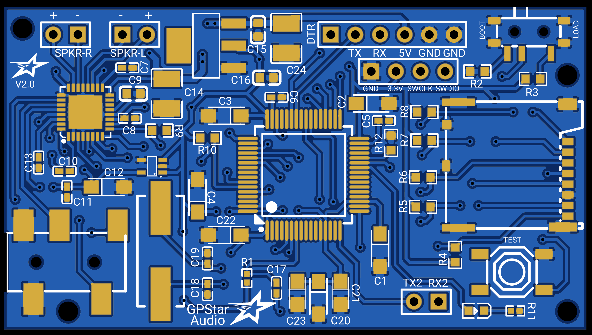

## GPStar Audio - Connection Details

GPStar Audio is a polyphonic audio player capable of playing and mixing together multiple audio tracks at the same time to create a smooth, rich and fluid audio experience. Support for GPStar Audio was introduced in GPStar Proton Pack and Neutrona Wand firmware versions V5.0.0
 

### Standard Connection UART (JST-XH 6-pin)

| Pins | Notes |
|------|-------|
| DTR/TX/RX/5V/GND/GND | ****See Below**** This connection serves as the main power source and communication but it also serves as a UART programming header for software updates (optional).  `Connector type: 6pin JST-XH` |

For connecting the UART pins, use a suitable FTDI chip such as the same **FTDI Basic 5V** used for programming the GPStar Proton Pack or Neutrona Wand. Pins on the PCB should align with with the standard wire order for FTDI-to-USB cables which use a single Dupont 6-pin connector. Observe these common colors and notes to ensure proper orientation:

- The ground pin will typically be a black wire, while VCC will typically be red.
- The DTR pin on the PCB will connect to a wire labelled either DTR or RTS.
- Any wire labelled CTS will be connected to the 2nd pin labelled GND on the PCB.
- Be careful to not reverse the connector!

---

### Special Connectors & Switches

| Label | Notes |
|-------|-------|
| BOOT/LOAD | A slide switch button located next to the JST-XH 6 pin UART connector. When set to BOOT, the system will operate, however when set to LOAD, then the system enters a programming mode and allows you to flash updated firmware over the UART connection. Make sure it is set to BOOT afterwards for it to operate. |
| SPKR-R | Right Speaker output from the on-board stereo amplifier. Capable of powering either a 4Ω 2.5W or 8Ω 1.25W speaker at 5V. ****See Below****   `Connector type: 2pin Terminal Block` |
| SPKR-L | Left Speaker output from the on-board stereo amplifier. Capable of powering either a 4Ω 2.5W or 8Ω 1.25W speaker at 5V. ****See Below****   `Connector type: 2pin Terminal Block` |
| AUX | ****Not labelled**** The on-board stereo auxiliary headphone jack outputs stereo sound and can be fed to any type of amplifier or audio device with a 3.5mm auxiliary input port. When a cable is inserted, the system will turn off the on-board stereo amplifier and output sound from this port instead. 

#####If you are using the on board stereo amplifier with only one speaker for a mono output setup, then connect the single speaker to either SPKR-R or to SPKR-L only. 

#####The on-board stereo amplifier is capable of powering either a 4Ω 2.5W or 8Ω 1.25W speaker at 5V from each channel.

---

### Optional Connectors

| Label | Pins | Notes |
|-------|------|-------|
| ST-LINK | GND/3.3V/SWCLK/SWDIO | ****Not Labelled**** These 4 pins grouped together can be connected to a ST-LINK for debugging or as a alternative way to flash updated firmware. |
| TX2/RX2 | TX2/RX2 | Alternative serial communication port used for debugging. |
| TEST |  | A button located on the lower right corner of the board. Currently unused. |
