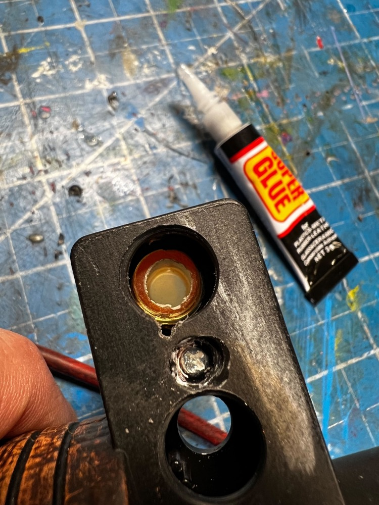
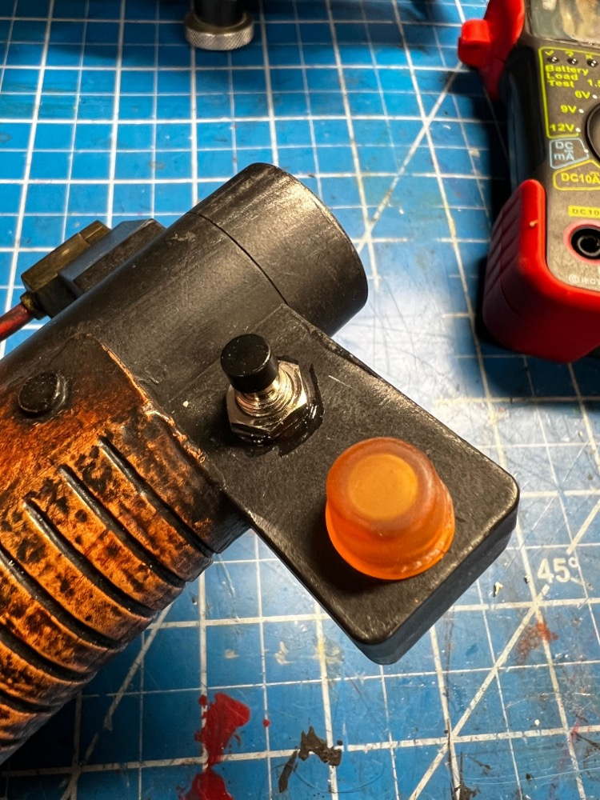
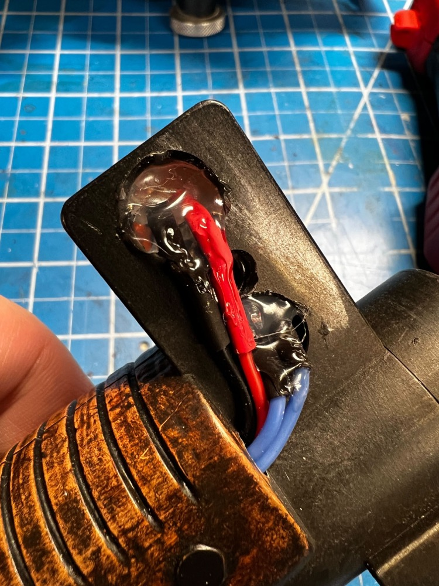
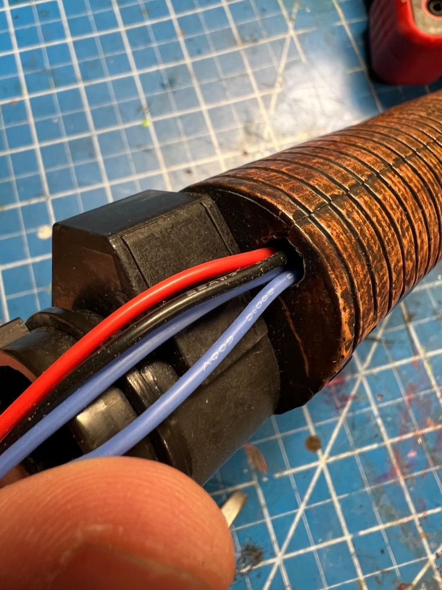
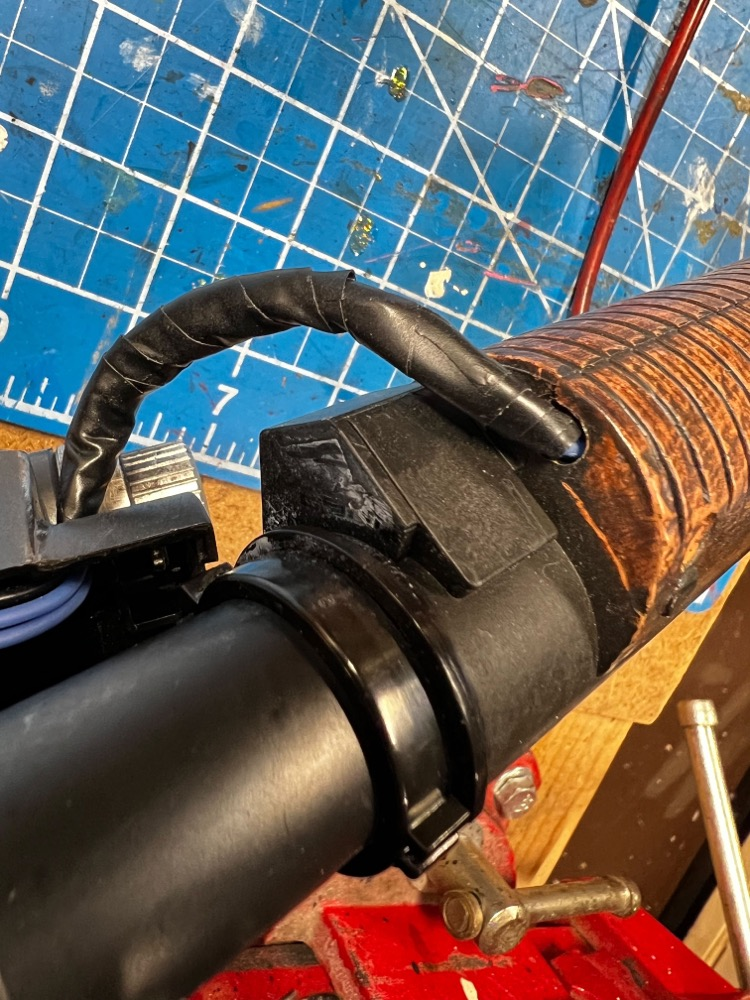
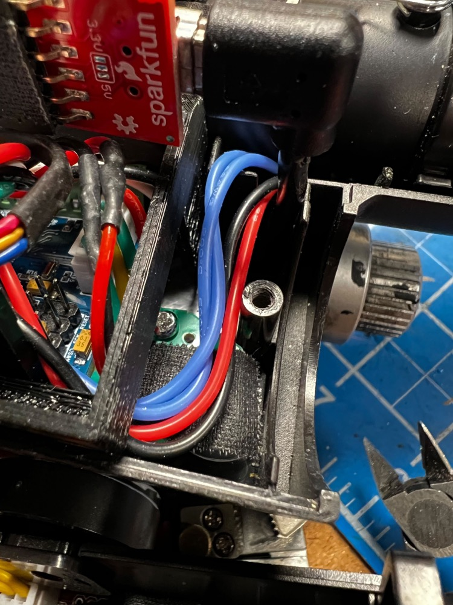

# Hat Lights

The hat lights are a special add-on which replace the solid orange, plastic dome on the top of the wand gun box and the orange selector switch at the end of the wand barrel. Support for both lights exists as part of the Wand PCB kit.

## Gun Box Hat

This is the easiest of the 2 modifications to make. The orange dome (fake light) can be sanded down with a dremel, then drilled out to accomodate an orange lens. This will drill through the black plastic exterior and a portion of the clear plastic which is part of the vent light and bargraph assembly. Secure the lens using any supplied washer/nut combination.

An LED can be hot-glued into the lens socket and attached to the HAT2 socket (JST-PH) on the Wand PCB. Use of a red LED with 2VDC forward voltage and 20mA current is expected.

## Barrel Wing Hat (+Selector Button)

This is the more complex assembly as it requires replacing the stock selection switch with a new momentary pushbutton type, along with drilling out a significant portion of the barrel wing. This solution is suggested to be undertaken if also considering adding the wand-tip strobe LED as the barrel must be signficantly disassembled.

To match the original Afterlife aesthetic, wrapping in black electrical tape will complete the look and keep the wiring protected.

The wiring in the gun box will need to cross from one side to the other. Making a small notch in the plastic in what would be above the barrel, the wiring can be run in that space to reach the PCB. Connect to the HAT1 and SW6 sockets using JST-PH connectors.

To finish off the barrel wing look and hide the wiring, use of 1.5" marine-grade heatshrink tubing can be used to cover the entire plastic assembly. This is similar in appearance to the Afterlife wand serving both aesthetic and functional uses.

