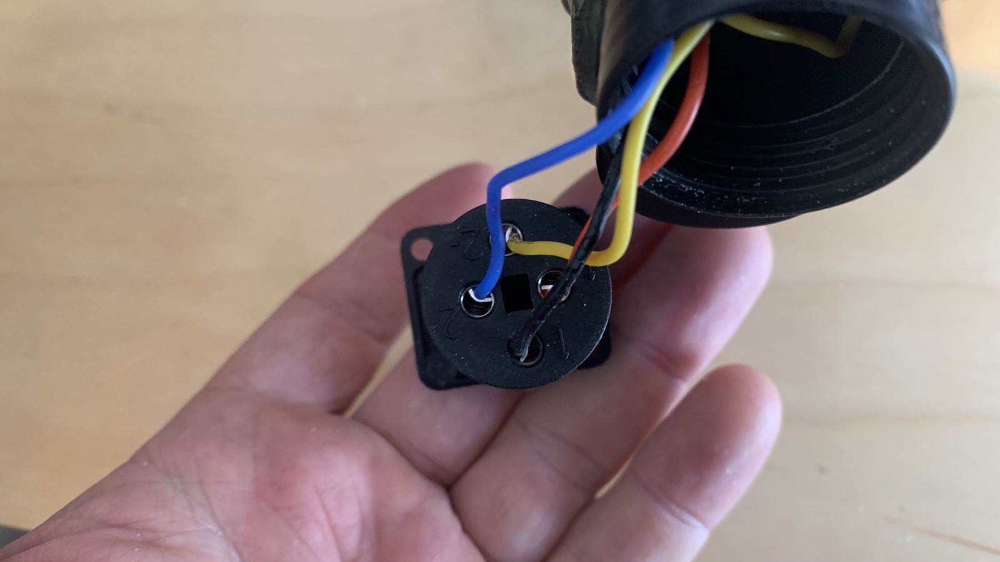
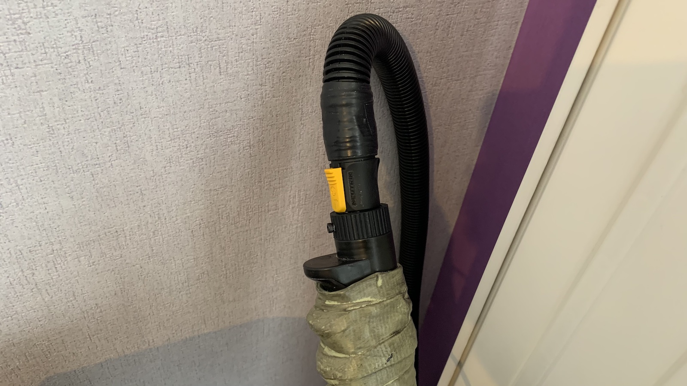

# Pack Hose Replacements

## Hose Example #1

* 1 - Amphenol MS3106A14S-2P (4 pin) -> https://www.mouser.com/ProductDetail/654-MS3106A14S-2P
* 1 - Amphenol MS3102A14S-2S (4 pin) -> https://www.mouser.com/ProductDetail/654-MS3102A14S-2S
* 3/4 inch splitless loom (you can find this at almost any hardware store) -> https://www.gbfans.com/shop/pack-parts/34-splitless-wire-loom/
* Black electrical tape
* 1 - Neutrik NAC3FX-W (discontinued, see below)-> https://www.neutrik.com/en/product/nac3fx-w
* 1 - Neutrik NL4FC -> https://www.neutrik.com/en/product/nl4fc
* 1 - Neutrik NL4MP-ST -> https://www.neutrik.com/en/product/nl4mp-st

In this example, I use 4 pin Amphenol connectors. The 4 pin version is slightly smaller than the 16s versions, however it does still work. You will need to enlarge the holes on the pack side Amphenol connector. I used the reamer on a swiss knife and slowly enlarged it until all 4 screws can bolt onto the pack. Take your time and go slow. You also need to remove some plastic in the center of the pack hole for the connector to slide on. After feeding the 4 wires running from the Wand to the Pack connector through both ends of the 3/4 inch splitless loom, solder the wires onto the approriate ends on the connector.

On the wand side, I used a modified Neutrik  NAC3FX-W connector. This is a 3 pin connector, but you can take it apart and use the 4 pin internals of the NL4FC which is a 4 pin connector. The NAC3FX-W is discontinued, so if you can not find one, you can just straight up use the NL4FC instead and not have to modify anything. 

**READ BELOW IF USING A MODIFIED NAC3FX-W with a NL4FC.**

If you are using the NAC3FX-W with the NL4FC internals, you will need to slightly modify it. In the photo below, the 3-pin NAC3FX-W internal piece is on the left. On the right is the NL4FC 4-pin internal piece that needs to be modified to work corectly inside the NAC3FX-W shell. You have to grind off some of the indicated plastic on the NL4FC internal piece on the right. Compared to the NAC3FX-W on the left, the tab sits too high, which blocks it from going all the way into the NAC3FX-W shell. A small plastic tab needs to be removed. If you are using the NL4FC shell and not the NAC3FX-W, then you can ignore this.

## Hose Example #2

Another type of connector which is similar in appearance to the Neutrik are [CNLINKO connectors](https://www.amazon.com/s?k=cnlinko) which can be found with various pin connections (from 2 to 12). The square end matches nearly perfectly to the stock screw holes of the packs, though it may take some drilling to widen the center hole. Meanwhile, the plug end should screw into the end of the stock hose loom and can be secured with electrical tape. Similar to example #1 a 4-pin connector should be sufficient, though CNLINKO also makes an ethernet connector which can be useful for anyone who may wish to have additional connections in the future and to run a standard Cat-5 cable down the center of the wire loom.