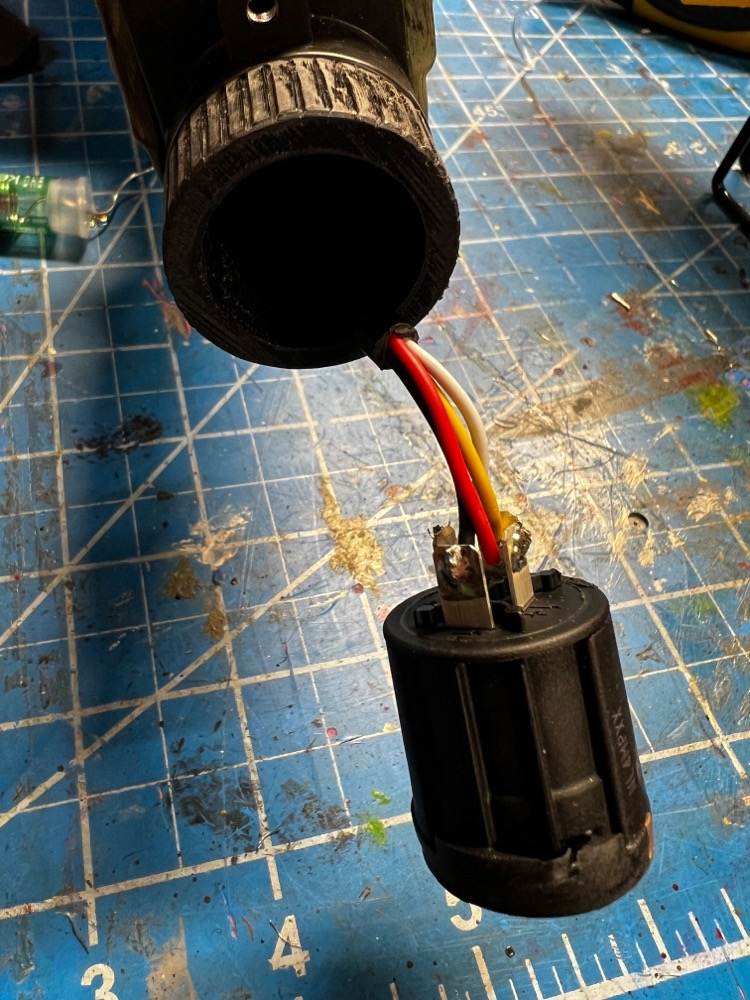

# Pack Hose Replacements

In order to deliver both power and data signals to the wand, a new set of cabling is required. As wiring is typically desired to remain internal to the hose the following approaches have been used to replace the stock 2-wire (power-only) hose with a new 4-wire solution. The existing wire loom (black hose) can be reused if desired, or replaced with a more flexible brand.

## PCB Kit Hose

For those who have purchased the PCB kits with the hose replacement, the following parts are utilized:

* 1 - [CNLINKO 4 Pin Connector](https://a.co/d/8ALa9Gq) - This is the new connector for the pack which uses a square-based connector roughly the size of the stock connection
* 1 - [Neutrik NL4FX 4 pole Locking SpeakON Cable Mount Connector](https://a.co/d/9c7djjo) - This is the connector at the wand end of the hose
* 1 - [Neutrik NL4MP Speakon Panel Mount](https://a.co/d/atMuNfz) - This is the socket for the wand itself

For the CNLINKO, the receptacle on the pack uses soldered ports for a secure connection.

The socket for the wand is a panel connector which has 4 screw holes which must be sanded off. This can be done with a belt sander or hand sander. A 3D printed adapter is furnished with kits to allow the socket to be secured using the existing screw base for the original battery pack.

The SpeakON connector uses a twist-lock mechanism for a secure fit to the panel socket and 3D printed adapter.

The panel connector, like the pack connection, uses a soldered connection to secure the wires. Both connections at each end of the wand will use screw terminals to attach the wiring.

## DIY Hose Example

This approach uses parts which are slightly more accurate to the movie pack, though they may be more difficult to obtain. More work is needed to convert these to Haslab use.

* 1 - [Amphenol MS3106A14S-2P (4 pin)](https://www.mouser.com/ProductDetail/654-MS3106A14S-2P)
* 1 - [Amphenol MS3102A14S-2S (4 pin)](https://www.mouser.com/ProductDetail/654-MS3102A14S-2S)
* [3/4 inch splitless loom (you can find this at almost any hardware store)](https://www.gbfans.com/shop/pack-parts/34-splitless-wire-loom/)
* Black electrical tape
* 1 - [Neutrik NAC3FX-W](https://www.neutrik.com/en/product/nac3fx-w) (discontinued, see below)
* 1 - [Neutrik NL4FC](https://www.neutrik.com/en/product/nl4fc)
* 1 - [Neutrik NL4MP-ST](https://www.neutrik.com/en/product/nl4mp-st)

In this example, I use 4 pin Amphenol connectors. The 4 pin version is slightly smaller than the 16s versions, however it does still work. You will need to enlarge the holes on the pack side Amphenol connector. I used the reamer on a swiss knife and slowly enlarged it until all 4 screws can bolt onto the pack. Take your time and go slow. You also need to remove some plastic in the center of the pack hole for the connector to slide on. After feeding the 4 wires running from the Wand to the Pack connector through both ends of the 3/4 inch splitless loom, solder the wires onto the approriate ends on the connector.

On the wand side, I used a modified Neutrik NAC3FX-W connector. This is a 3 pin connector, but you can take it apart and use the 4 pin internals of the NL4FC which is a 4 pin connector. The NAC3FX-W is discontinued, so if you can not find one, you can just use the NL4FC instead and not have to modify anything. 

I use black electrical tape to secure the 3/4 splitless wire loom to the Neutrik connector on the Wand side and the Amphenol connector on the Proton Pack side.

Provided in the wand STL folder is a printable connector which threads into the handle of the Hasbro Neutrona Wand. With this connector, you can shave down the square corners of the 4 pin Neutrik NL4MP-ST connector so it is round, and it can slide into the 3d printable connector. I then screw the 3d printable connector into the wand handle and make a mark on the bottom side of it. I remove the connector and make a hole in it. I then use a m3x5 hex socket screw (or which ever set screw you want to use) to secure the Neutrik NL4MP-ST connector into the Neutrona Wand handle.

**READ BELOW IF USING A MODIFIED NAC3FX-W with a NL4FC.**

If you are using the NAC3FX-W with the NL4FC internals, you will need to slightly modify it. In the photo below, the 3-pin NAC3FX-W internal piece is on the left. On the right is the NL4FC 4-pin internal piece that needs to be modified to work corectly inside the NAC3FX-W shell. You have to grind off some of the indicated plastic on the NL4FC internal piece on the right. Compared to the NAC3FX-W on the left, the tab sits too high, which blocks it from going all the way into the NAC3FX-W shell. A small plastic tab needs to be removed. If you are using the NL4FC shell and not the NAC3FX-W, then you can ignore this.

