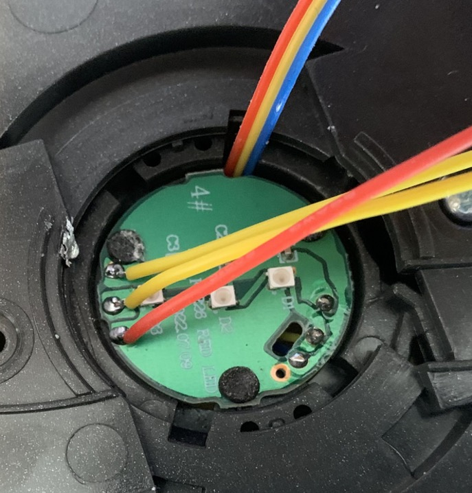
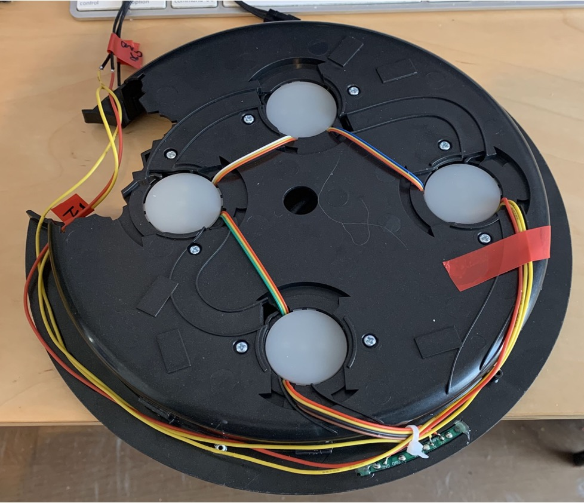
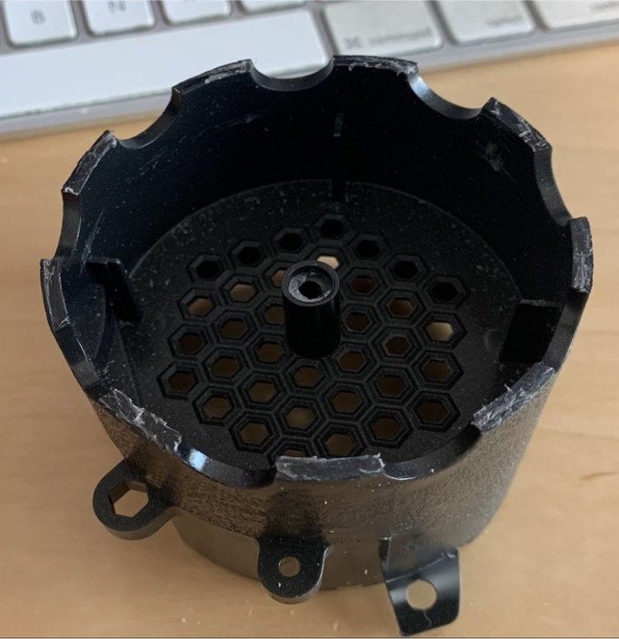
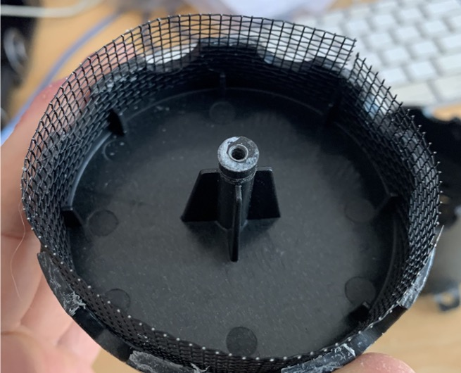
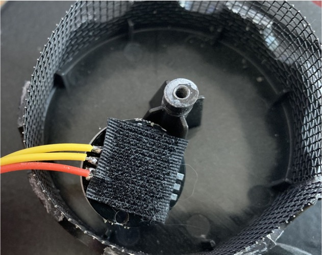
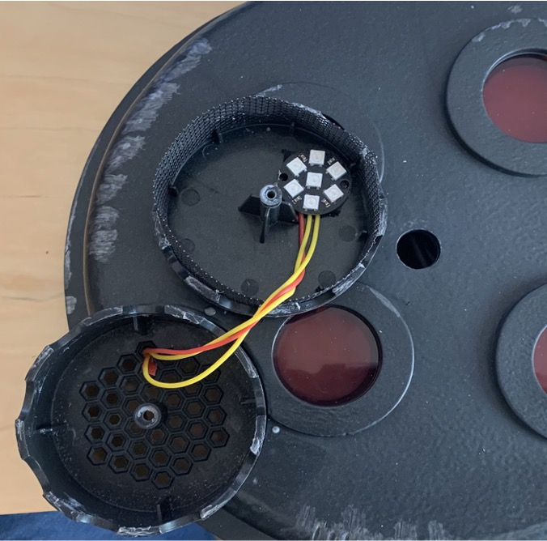

# N-Filter Vent Light

Written in the code is support for chaining 1 NeoPixel Jewel off the last LED in the cyclotron lid (see photos below) (**NOTE: This can be chained off any addressable LEDs, for example if you add a NeoPixel ring in your cyclotron lid**). This NeoPixel jewel is timed to go off during overheating or anytime the pack is activating the smoke pins. 

To access the cyclotron led, you will have to take apart the cyclotron lid. There are several plastic tabs that are glued. When taking apart the lid, you will end up either breaking the tabs or the glue bonds. KEEP THIS IN MIND IF YOU DO THIS MOD.

The trick to taking apart the lid to break the tabs or glue bonds is using 2 flathead screw drivers, work your way around the lid seam, until you reach a pin, then slightly force it up/pry slightly to break the pin or glue bond. You only want to pry/lift up when you get to a pin. Take your time and go easy.

When you eventually access LED #4 (see photos below), you want to solder wires from the 5V out, GND Out and OUT pin onto the 5V IN, GND IN and IN pin on the NeoPixel Jewel.
In the photos below, my red wire is GROUND, middle yellow wire is the OUT signal wire, and the outer yellow wire is 5V out. (cyclotron lid LED I wire into to connect to the NeoPixel jewel)
Note that the lid can be pressed fit back together and stay in place, no glue required as the N-Filter keeps/holds it together.

**If you replace the cyclotron LEDs with for example a NeoPixel ring, you can chain the N-Filter NeoPixel jewel from that.**

## N-Filter Disassembly (Optional)

You can run the wires from this Jewel around the lid and into the N-Filter. I used velcro to hold the jewel inside the filter. The N-Filter cap can be removed, there is 1 screw on the backside holding the cap together plus lots of glue around the outside seam of the cap on the N-Filter. I used a shaving Razor Blade and worked it around the seam of the N-Filter cap, scraping all the glue off. Take your time, this is a lengthly process.

Finally there is glue in the inner post where the screw for the n-filter screws into. You have to twist and pull gently on the n-filter cap to break this bond. Take your time. I found taking the lid apart to remove the N-Filter unit made it easier to to remove the glue on the N-Filter cap.

NOTE: The single screw holding the n-filter together keeps the cap from coming off when you re-assemble it, however the glue bonds that you remove keep the cap from wiggling/moving. The screw alone does not keep it tight together.

If you wand a clean tight fit again, you will need to re-glue the cap back on the N-Filter. KEEP THIS IN MIND IF YOU DO THIS MOD.

