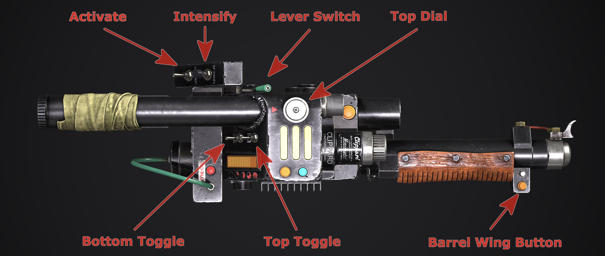
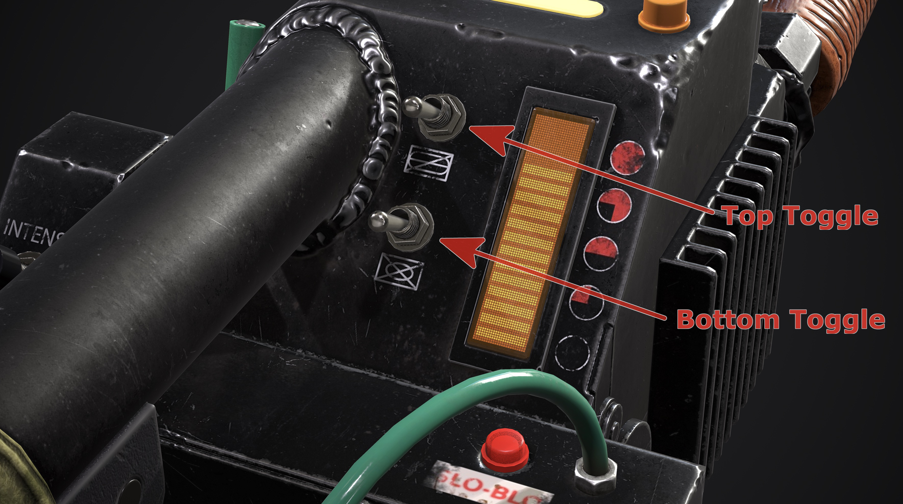
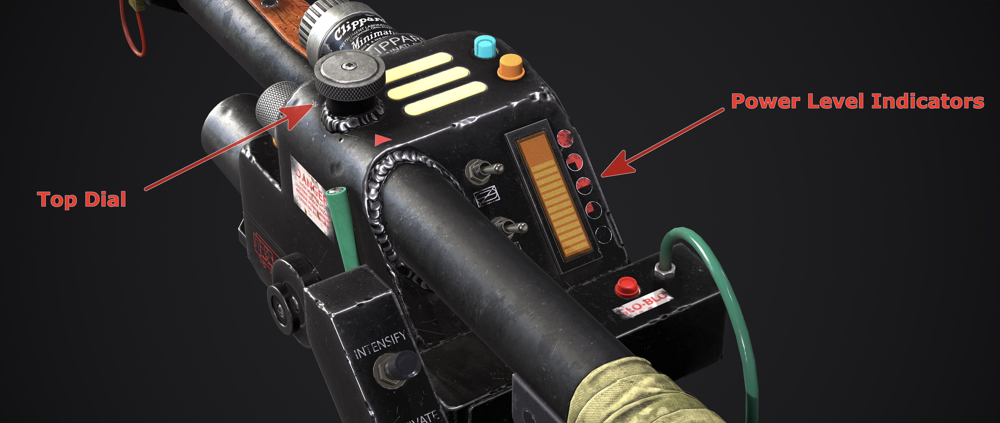
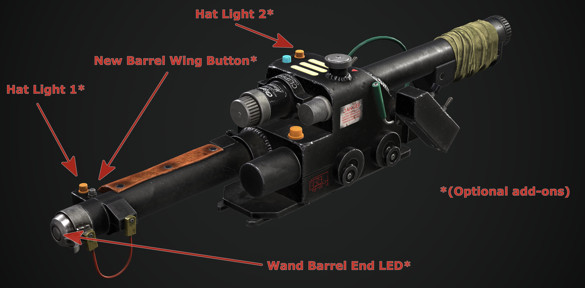
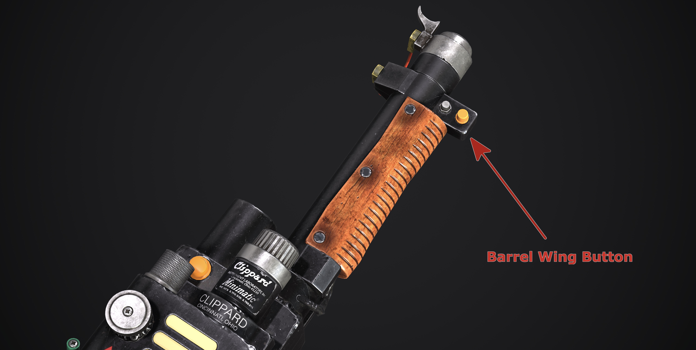
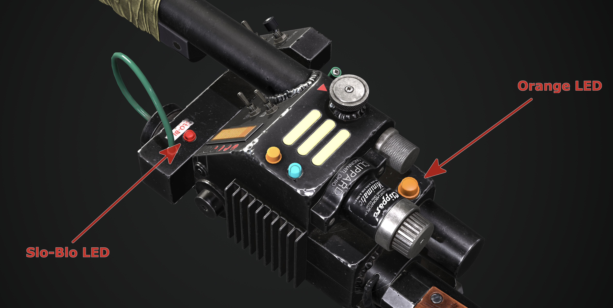
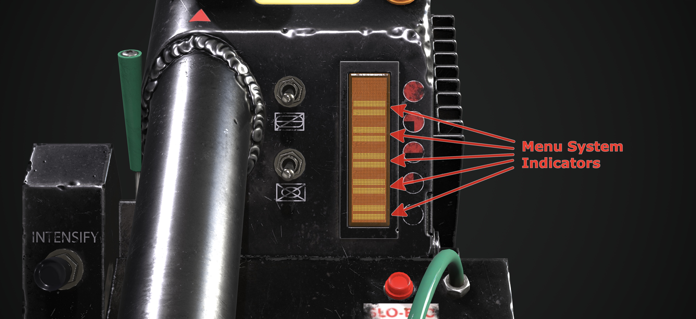
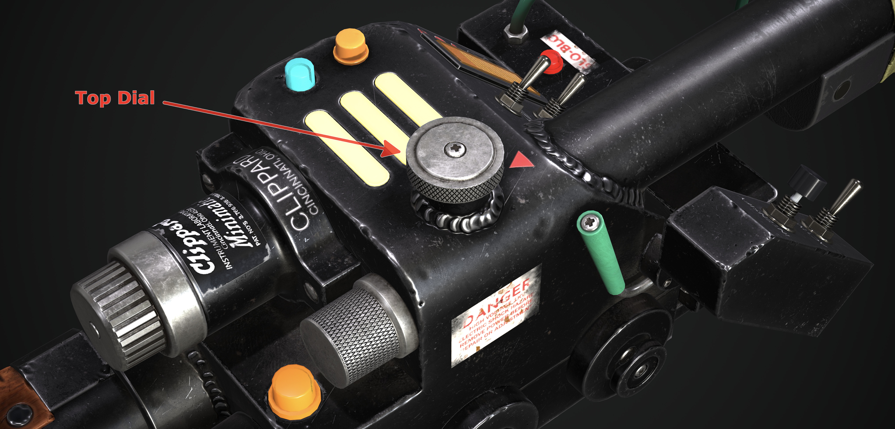
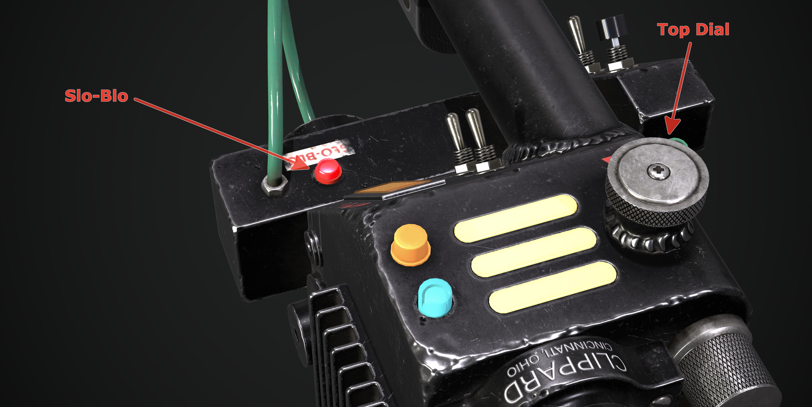

<h1>gpstar Proton Pack and Neutrona Wand Operation Manual</h1>

### Standard Proton Pack Features

- The switch underneath the ion arm can turn the pack on or off.
- You can run the pack without the cyclotron lid attached.
- The volume for the pack and wand can be controlled via the Crank Generator knob.
   - Clockwise to raise volume, counter-clockwise to lower it.
- When the ribbon cable is disconnected it will activate the alarm mode and degraded the cyclotron spin.
- The pack can run without a wand, though it can only be activated via the switch under the Ion Arm.
- Vibration switch in the cyclotron switch plate enables or disables the vibration motors for both the pack and wand.
- 1984/2021 (Afterlife) year switch in the cyclotron switch plate changes the pack and wand from 1984 (OG) to 2021 (Afterlife) modes.
- The Proton Pack vibrates only while firing. This can be changed to vibrate at all times or entirely disabled. Vibration can be enabled or disabled by the vibration toggle switch in the Proton Pack. Vibration settings can be toggled via the wand menu system or the advanced user configuration settings. **\*see below\***
- Single (centered) LED per cyclotron lens for 1984/1989 modes by default.
	- This can be toggled back to 3 LED's per cyclotron lens via the wand menu system.
- The Power Cell, Cyclotron and other lighting on the Proton Pack can have the bightness independently adjusted. **\*see below\***

### Optional Proton Pack Features

- 1989 sound effects mode is available on the pack, it can be accessed from the Wand sub menu system or set with the advanced user configuration settings. **\*see below\***
- Support for switches for cyclotron direction and to enable or disable smoke effects.
- Support for smoke effects with dedicated fans for the Booster Tube and N-filter. See [Smoke Effects](SMOKE.md) addendum.
- Additional Lights available for the cyclotron panel, internal "cake" cyclotron and Power Cell.
	- Automatically switches to internal "cake" cyclotron, if implemented (optional).
	- This supports a 35 LED ring light (by default) to be installed in the "cake". Other size LED rings or LED setups are supported in the configuration settings.
- Video game colours supported if using RGB supported LEDs for the Cyclotron Lid, internal "cake" cyclotron and Power Cell.

## Neutrona Wand				
### Standard Wand Features

- Activate toggle on the gun box turns on both the pack and wand, regardless of the theme mode.
	- The switch under the Proton Pack's ion arm does not need to be engaged for this to work.
- Right-hand toggles (Bottom and Top) affect the vent light and additional sound effects depending on the mode. 
	- The Neutrona Wand will not fire unless these switches are turned on.
	- **Boot-Up Errors**: If you attempt to boot up your Neutrona Wand while the top toggle switch is on, the Neutrona Wand will boot into a error mode. Turn this top toggle switch off and restart your Neutrona Wand to boot normally. **This is the default behaviour**, though this feature can be disabled in the advanced user configuration settings by setting **b&#95;wand&#95;boot&#95;errors** to false. **\*see below\***

- Additionally, the lever switch near the gunbox acts as a safety switch and it must be pulled to extend the barrel before firing.
	
- The Neutrona Wand vibrates only while firing. This can be changed to vibrate at all times or entirely disabled. Vibration can enabled or disabled by the vibration toggle switch in the Proton Pack. Vibration settings can be toggled via the wand menu system or the advanced user configuration settings. **\*see below\***

**Right-Hand Toggle Switch Behavior**

- While in 1984/1989 theme modes:
	- Bottom toggle switch turns on the vent light and plays the wand power up sound.
	- Top toggle switch plays a single beep sound.
- While in Afterlife theme mode:
	- Bottom toggle switch turns on the vent light and the wand plays a ramp up sound.
 	- Top toggle switch turns on the looping beeping sounds.

**Top Dial Behavior**

- The top dial on the top of the gun box changes the power mode of the wand, affecting the intensity of the stream effects, indicated by increasing or decreasing the bargraph lights (just as the stock wand did).
   - Clockwise to raise power/volume, counter-clockwise to lower these values.
- There are 5 wand power levels as based on the original bargraph which has only 5 LED's available:
	- The wand can be user-configured in the Neutrona Wand code to overheat the pack in any of the power levels. When not set to overheat, you can fire continiously.
	- The pack can also be user configured in the Proton Pack Code to adjust the duration of smoke effects (for each power level), which smoke effects are activated (for each power level), use of overheating smoke effects (for each power level), or whether smoke disabled entirely.
	Default settings: The wand will fire forever on power levels level 1 through 4 and overheat on power level 5.
- The pack will emit smoke effects during longer firing (if enabled).
- For lower power levels, the proton stream is more red. On higher power levels, the stream will appear more yellow.
- As the top dial is turned, any beeping rate will increase or decrease depending on the theme in use.
- This dial will be used to navigate the menu system and adjust volume in certain cases (see "Wand Settings Menu System" section).

### Optional Wand Features

- Support for additional lights such as the wand hat lights and wand barrel end LED strobe. A New Barrel Wing Button can then be added.
- Serial connection and power for a 28-segment bargraph support (to replace stock 5 LED bargraph).

## Runtime Modes

The following features require the use of both the pack and wand replacement controllers which implements a menu system to access special features which affects overall operation. Details for the menu system will be covered below, but it's important to describe the various operating modes first.

**Video Game Mode (Default)**

- The Barrel Wing Button at the end of the Neutrona Wand switches between these available firing modes while the wand is active:
	1. Proton Stream (Default)
	1. Slime Gun
	1. Stasis Beam
	1. Meson Collider
	1. Manual Venting Mode (Manual vent your Proton Pack)
	1. Special: Setting 6 is a settings menu system (see "Wand Settings Menu System" section below).

**Manual Venting Mode**

- When in manual venting mode, the Slo-Blo LED and the Orange LED on the front of the wand body will blink to indicate that you are in the manual venting mode. Press Intensify on the wand to manually vent your Proton Pack. (All the toggle and safety switches on the wand must be activated).

**Alternate Firing Mode: Cross The Streams (CTS) / Cross The Streams Mix (CTS Mix)**

- The Barrel Wing Button at the end of the wand acts as a alternate fire mode button--it does not switch stream modes.
- The overheat features can only be triggered when holding the alternate fire mode button (Barrel Wing Button).
- Pressing both the Intensify and Barrel Wing Button at the same time enables the "Cross the Streams" (CTS) audio and visual effects. Releasing one of the 2 firing buttons will continue these effects.
	- During Cross The Streams Mix, you need to hold both the Intensify and Barrel Wing Button at the same time. Releasing one or the other will end crossing the streams but continue firing a regular proton stream. The Proton Pack and Neutrona Wand can still overheat if enabled while crossing the streams in the power level you are at.

To enable a Cross The Streams (CTS) mode and alternate firing by default, please see the [Advanced Configuration](ADVCONFIG.md) guide, otherwise these can be accessed from the Wand settings menu system.

## Wand Settings Menu System

### Entering The Menu System
There are 2 ways to enter the Menu System.

- When the Neutrona Wand is in Video Game Mode and powered on, cycle through the various modes with the `Barrel Wing Button` until you reach the Menu System.
- While the Neutrona Wand and Proton Pack are powered down, press the `Barrel Wing Button`.

### Navigation
Use the Top Dial on the top of the wand to navigate up and down through the menu system.

When you are in the settings menu system the bargraph's 5 LED's begin flashing (or 5 distinct segments when using the 28-segment bargraph). All other functions of the wand (such as firing) are temporarily disabled while in the menu system. There are 5 different menu settings, which are indicated by the bargraph LED's/segments 1 through 5 (from bottom to top) with menu level 5 being the default upon entering this mode. For example in navigation, when 1 LED (or bargraph segment) is flashing/displayed that means you are on menu 1.

### Actions

Changes are made by pressing either the `Intensify` button on the gun box or the `Barrel Wing Button` at the end of the wand.

## Top Level Menu

| Top&nbsp;Menu&nbsp;Level | Purpose | Intensify Button | Barrel Wing Button |
|----------------|---------|------------------|--------------------|
| 5 | Music&nbsp;Track&nbsp;Looping | Enable/disable looping of current track1 | Exit the menu system2 |
| 4 | Proton Pack Light Dimming | `(Intensify + Top Dial)` Increases/Decreases the Proton Pack lights brightness. | Toggles between Power Cell, Cyclotron or Inner Cyclotron |
| 3 | Sound & Music&nbsp;Volume | `(Intensify + Top Dial)` Increases/Decreases effects volume | `(Intensify + Top Dial)` Increases/Decreases music volume |
| 2 | Switch&nbsp;Music&nbsp;Track | Cycle forward in music queue | Cycle backwards in music queue |
| 1 | Play&nbsp;or&nbsp;Stop&nbsp;Music / System Mute | Start/stop playing of music | Mute the Proton Pack and Neutrona Wand  or revert back to the previous volume3 |

1 Note that the LED/segment #5 will stay solid when the single-track loop is enabled while in the top menu system; it will blink on/off when looping is disabled.

2 When you navigate back to the `Setting 5` while in Video Game Mode and press the Barrel Wing Button, the wand will return the proton stream mode (accompanied by an audio cue to indicate this return to firing readiness). When in CTS mode this will exit the menu and allow the wand to be powered on. Note that music will continue to play (and advance/loop) even when the pack and wand are turned off. 

3 Note that the LED/segment #1 will stay solid when the Proton Pack and Neutrona Wand volume is muted.

## Sub Level Menu

`Important: The Neutrona Wand sub-menu settings can only be reached while both the Neutrona Wand and Proton Pack are powered down.`

To access the sub level menu, use the `Top Dial` on the top of the wand. When you reach the sub level menu, the Slo-blo LED will light up to indicate this menu state.

| Sub&nbsp;Level&nbsp;Menu | Purpose | Intensify Button | Barrel Wing Button |
|----------------|---------|------------------|--------------------|
| 5 | Firing&nbsp;Mode&nbsp;Selection | Cycle through VG/CTS operation modes3 | Cycle through VG color modes4 |
| 4 | Smoke&nbsp;Settings&nbsp;/&nbsp;Overheating| Enable/Disable smoke effects | Enable/Disable overheating |
| 3 | Cyclotron&nbsp;LED&nbsp;Control | Change cyclotron rotation | Toggle between 1 (centered) or 3 LED's in cyclotron lid for 1984/1989 modes |
| 2 | Vibration Settings | Proton Pack Enable/Disable vibration or vibration during firing. | Neutrona Wand Enable/Disable vibration or vibration during firing. |
| 1 | Year&nbsp;Mode&nbsp;Selection | Cycle through Afterlife (2021), 1984, or 1989 modes | Enable or Disable the Proton Stream impact sound effects. |

3 Switch between Video Game and Cross the Stream (CTS) operation modes. Note that the LED/segment #5 will stay solid when CTS is enabled while in the sub menu system. Remember that CTS Mix requires holding down both intensify and the alternate firing button at the same time.

4 Enables/disables the video game colour modes for the Proton Pack's powercell and cyclotron lights. This only affects the pack when in Video Game mode, not for CTS modes, and offers the following states:

- Disable all the video game colours (powercell remains blue, cyclotron remains red).
- Enable only the powercell LED's to change colors (requires RGB powercell such as that offered by Frutto Technology).
- Enable only the cyclotron LED's to change colors (requires RGB replacement such as a Neopixel ring).
- Enable both the powercell and cyclotron to use video game colours.

To exit the menu system, navigate to the top menu in **Setting 5** (Slo-blo LED is no longer illuminated) and press the Barrel Wing button button. A small beep will be heard when transitioning between the top and sub menu levels.

`When music is playing while the pack and wand are turned off, you can use the Top Dial on the top of the Neutrona Wand to easily access the independent music volume control.`

Refer to the [Loading The Audio Files](AUDIO.md) for more information on loading additional music tracks.

## EEPROM Menu
The EEPROM menu system can be used to configure different LED setups within your Proton Pack. All changes can be saved directly to the Proton Pack EEPROM and will be loaded automatically even if you turn off the power to your devices.

To access the EEPROM menu system, hold the `Intensify Button` down and toggle the right hand `Top Toggle` button 5 times. You will then hear a beep noise and your bargraph will light up to indicate you are in the EEPROM menu system.

`The EEPROM menu system can only be reached while both the Neutrona Wand and Proton Pack are powered down.`

`The EEPROM memory has a specified life of 100,000 write/erase cycles. You will generally not reach this limit in your life time, but if you did, it can be disabled to bypass it. Refer to the Advanced User Configurations below for more information.`

| EEPROM&nbsp;Menu&nbsp;Level | Purpose | Intensify Button | Barrel Wing Button |
|----------------|---------|------------------|--------------------|
| 5 | Save or Clear the EEPROM settings | Clear all the settings in the Proton Pack EEPROM.  ***The Proton Pack will instead load the software defined defaults.***| Save the current settings to the Proton Pack EEPROM. |
| 4 | Cyclotron LED Count Toggle| Toggle between 40, 20 or 12 LEDs for your Cyclotron. | - |
| 3 | Power Cell LED Count Toggle | Toggle between 15 or 13 LEDs for your Power Cell. | - |
| 2 | Inner Cyclotron LED Count Toggle | Toggle Between 35, 24, 23 or 12 LEDs for your Inner Cyclotron Cake. | - |
| 1 | Inner Cyclotron GRB Toggle | Toggle your Inner Cyclotron from RGB or GRB LEDs. | - |

## Advanced User Configurations

To modify defaults within the software, please see the [Advanced Configuration](ADVCONFIG.md) guide.

## Video Demos
Video Demo: [Features and Menu Walkthrough](https://www.youtube.com/watch?v=ePXz99UawLQ) (YouTube, July 2023)

Wand Menu Settings Video Demo: [Proton Pack Wand Menu Settings Video Demo](https://www.youtube.com/watch?v=QrevSoQo_3M) (YouTube)

 
 
 
**Neutrona Wand renders courtesy of Luis Peña*
