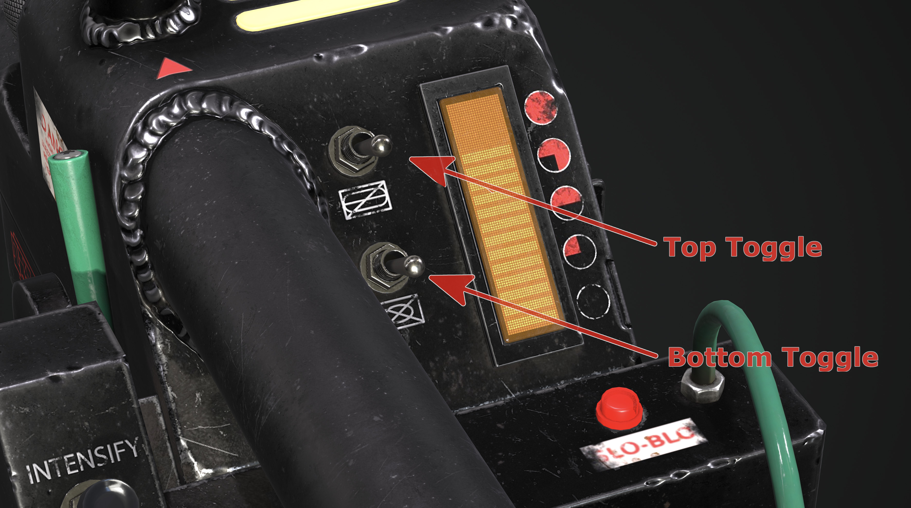

  

 

<h1> GPStar Proton Pack &amp; Neutrona Wand Operation Manual</h1>

 

Neutrona Wand renders courtesy of Luis Peña

# Operational Guide - Table of Contents

- [Standard Features](#standard-features)
- [Optional Features](#optional-features)
- [Toggle Operation Modes](#toggle-operation-modes)
- [System Modes](#system-modes)
- [Neutrona Wand Menu System](#neutrona-wand-menu-system)
- [Additional Resources](#additional-resources)

# Standard Features

- The switch underneath the Ion Arm can turn the Proton Pack on or off.
- You can run the pack without the Cyclotron Lid attached.
- The volume for the pack and wand can be controlled via the Crank Generator knob.
   - Clockwise to raise volume, counter-clockwise to lower it.
- When the ribbon cable is disconnected it will activate the alarm mode and degrade the Cyclotron spin.
- The Proton Pack can run without a wand, though it can only be activated via the switch under the Ion Arm.
- Vibration switch in the Cyclotron switch plate enables or disables the vibration motors for both the Proton Pack and Neutrona Wand.
- 1984/Afterlife year switch in the Cyclotron switch plate changes the Proton Pack and Neutrona Wand from 1984 to Afterlife modes.
- The Proton Pack vibrates only while firing. This can be changed to vibrate at all times or entirely disabled. Vibration can be enabled or disabled by the vibration toggle switch in the Proton Pack. Vibration settings can be toggled via the Neutrona Wand menu system or the advanced user configuration settings.
- The Neutrona Wand vibrates only while firing. This can be changed to vibrate at all times or entirely disabled. Vibration can enabled or disabled by the vibration toggle switch in the Proton Pack. Vibration settings can be toggled via the wand menu system or the advanced user configuration settings.
- Single (centered) LED per Cyclotron lens for 1984/1989 modes by default.
	- This can be toggled back to 3 LEDs per Cyclotron lens via the Neturona Wand menu system.
- The Power Cell, Cyclotron and other lighting on the Proton Pack can have the brightness independently adjusted.
- 1989 sound effects mode is available on the pack, it can be accessed from the Neutrona Wand menu systems or set with the advanced user configuration settings.
- Super Hero and Mode Original system operation modes.
- Menu system with the ability to customise various settings for both your Proton Pack and Neutrona Wand.
- Up to 5 different power levels as indicated on the Neutrona Wand bargraph.
	- The Neutrona Wand can be configured within the menu system to adjust the overheat settings. When not set to overheat, you can fire continuously.
	- The Proton Pack can also be configured within the Neutrona Wand menu system to adjust the duration of smoke effects (for each power level), which smoke effects are activated (for each power level), use of overheating smoke effects (for each power level), or whether smoke is enabled or disabled entirely (for each power level).
	Default settings: The Neutrona Wand will fire forever on power levels level 1 through 4 and overheat on power level 5.
- The Proton Pack will emit smoke effects during longer firing (Default setting: enabled). This can be configured from the Neutrona Wand menu system.

### System Power Inactivity Indicator
- The LED at the front of the Neutrona Wand body next to the Clippard valve will start to blink after 1 minute of inactivity while the Neutrona Wand and Proton Pack are powered down to indicate the system still has power.

# Optional Features

- Support for changing Cyclotron direction and to enable/disable smoke effects.
- Support for smoke effects with dedicated fans for the Booster Tube and N-Filter.
	- See the [Smoke Effects](SMOKE.md) addendum for more information.
- Additional Lights available for the Cyclotron panel, internal "cake" Cyclotron, and Power Cell.
	- Automatically switches to internal "cake" Cyclotron, if implemented (optional).
	- This supports a 35-LED RGB ring light (by default) to be installed in the "cake". Other size LED rings or LED setups are supported in the configuration settings.
- Video game colours supported if using RGB-supported LEDs for the Cyclotron Lid, internal "cake" Cyclotron and Power Cell.
- Support for the Attenuator add-on device. See the [Attenuator](ATTENUATOR.md) addendum for more information.
- Support for additional lights such as the wand hat lights and wand barrel end LED strobe.
	- When adding the Hat1 light a New Barrel Wing Button can also be added.
- Serial connection and power for a 28-segment bargraph support (to replace the stock 5-LED bargraph).

Location of optional hardware for Neutrona Wand, requires advanced modifications.

## Top Dial Behaviour

- The top dial on the top of the gun box changes the power mode of the wand, affecting the intensity of the stream effects, indicated by increasing or decreasing the bargraph lights (just as the stock wand did).
   - Clockwise to raise power/volume, counter-clockwise to lower these values.
- There are 5 wand power levels in Super Hero mode and 4 in Mode Original.
- For lower power levels, the proton stream is more red. On higher power levels, the stream will appear more yellow.
- This dial will be used to navigate the menu systems and adjust volume in certain cases (see "Wand Settings Menu System" section).

**Tip:** When music is playing while the pack and wand are turned off, you can use the Top Dial on the top of the Neutrona Wand to easily access the independent music volume control.

Refer to the [Loading The Audio Files](AUDIO.md) for more information on loading additional music tracks.

# Toggle Operation Modes

There are two modes available which replicate movie or prop-accurate behaviors of the available toggle switches. These operational modes can be altered via an [EEPROM menu](OPERATION_EEPROM.md) and will affect the startup sequence for your Proton Pack and Neutrona Wand.

## Super Hero Mode Operation Guide

**Super Hero**: This is the default operation mode based primarily on the 2021 film.

### Activate Toggle

- Activate toggle on the gun box turns on both the Proton Pack and Neutrona wand.
	- The switch under the Proton Pack's Ion Arm does not need to be engaged for this to work. The switch under the Ion Arm will turn the cyclotron on.
- The lever switch near the gunbox acts as a safety switch and it must be pulled to extend the barrel before firing.
- Right-hand toggles (Bottom and Top) affect the vent light and additional sound effects.
	- The Neutrona Wand will not fire unless these switches are turned on.
	- **Boot-Up Errors**: If you attempt to boot up your Neutrona Wand while the top toggle switch is on, the Neutrona Wand will boot into a error mode. Turn the top toggle switch off and restart your Neutrona Wand to boot normally. **This is the default behaviour**, though this feature can be disabled in Neutrona Wand Config EEPROM Menu.
- While firing, the default bargraph animations slide/split the bargraph in half and scroll up and down simultaneously.

### Right-Hand Toggle Switch Behaviour

- While in 1984/1989 theme modes:
	- Bottom toggle switch turns on the vent light and plays the wand power up sound.
	- Top toggle switch plays a single beep sound.
- While in Afterlife theme mode:
	- Bottom toggle switch turns on the vent light and the wand plays a ramp up sound.
 	- Top toggle switch turns on the looping beeping sounds.

## Original (Prop) Mode Operation Guide

**Mode Original**: This mode reflects original production documentation from 1984 on how the Proton Pack and Neutrona Wand operate together. Other variation differences are the bargraph animations, Neturona Wand sound effects and power levels.

- There are 4 power levels in mode original. When the Neutrona Wand is in stand by mode (see toggle switch behaviours below), the bargraph settles on the first level.
- The switch under the Ion Arm on the Proton Pack must be switched on. This gives power to the entire system. The slo-blo light on the Neutrona Wand will turn solid red to indicate power to the system.
- While firing, the default bargraph animations slide the bargraph up and down small increments to indicate the instability and power of the proton stream.

### Right-Hand Toggle Switch Behaviours

- The bottom toggle will put the Neutrona Wand into standby mode. The slo-blo LED will begin to blink, and the vent lights will turn on.
- The top toggle turns on the bargraph. It will ramp up and back down to the lowest level setting.

### Activate Toggle

- Activate toggle on the gun box turns on the cyclotron of the Proton Pack. To activate the cyclotron, all the right hand toggle switches on the Neutrona Wand must be activated.
	- The Cyclotron will not turn on unless all the toggle switches on the Neutrona Wand are activated and the Ion Arm switch on the Pack is in the ON position.
- The lever switch near the gunbox acts as a safety switch and it must be pulled to extend the barrel before firing.

# System Modes

## Video Game Mode (Default)

- Pressing the Barrel Wing Button while you are already throwing a Proton Stream with the Intensify button will initiate "Cross the Streams".

- The Barrel Wing Button at the end of the Neutrona Wand switches between these available system modes while the wand is active and not throwing a stream:
	1. Proton Stream (Default)
	1. Slime Blower
	1. Stasis Stream
	1. Meson Collider
	1. 1 `Spectral (Rainbow)`
	1. 2 `Spectral (Holiday)`
	1. 3 `Spectral (Custom)`
	1. Manual Venting Mode (Manual vent your Proton Pack)
	1. Special: Setting 6 is a settings menu system (see "Wand Settings Menu System" section below).

1 Spectral Mode (Rainbow) is a system mode which gives a RAINBOW effect. If your Proton Pack has RGB LEDs, they will change to match.

2 Spectral (Holiday) is a system mode which gives a RED/GREEN effect. If your Proton Pack has RGB LEDs, it will match these colours.

3 Spectral (Custom) is a user defined colour mode. You can independently adjust the Neutrona Wand Barrel, Power Cell, Cyclotron and Inner Cyclotron colours directly from the EEPROM LED Menu ystem. The default colours are purple.

📝 **Note:** Spectral modes are disabled by default but can be enabled from the EEPROM Menu or flashed directly to the Neutrona Wand board. They take advantage of RGB coloured LED add-ons if installed.

## Manual Venting Mode

- When in manual venting mode, the Slo-Blo LED and the Orange LED on the front of the wand body will blink to indicate that you are in the manual venting mode. Press Intensify on the wand to manually vent your Proton Pack. (All the toggle and safety switches on the wand must be activated).

**Alternate System Firing Modes: Cross The Streams (CTS) / Cross The Streams Mix (CTS Mix)**

- The Barrel Wing Button at the end of the wand acts as a alternate firing button. When Cross The Streams is enabled, Video Game Modes are disabled and you will only have the Proton Stream.
- The overheat features can only be triggered when holding the alternate firing button (Barrel Wing Button) when Cross The Streams mode is enabled.
- Pressing both the Intensify and Barrel Wing Button at the same time enables the "Cross the Streams" (CTS) audio and visual effects. Releasing one of the 2 firing buttons will continue these effects.
	- With Cross The Streams Mix, you need to hold both the Intensify and Barrel Wing Button at the same time. Releasing the Barrel Wing Button will end crossing the streams but continue firing a regular proton stream, and releasing Intensify will end firing completely.

To enable Cross The Streams (CTS) or Cross The Streams Mix (CTS Mix) mode by default, you can set this setting from the Wand Settings Menu System.

# Neutrona Wand Menu System

## Entering The Menu System

There are 2 ways to enter the Menu System.

- When the Neutrona Wand is in Video Game Mode and powered on, cycle through the various modes with the `Barrel Wing Button` until you reach the Menu System.
- While the Neutrona Wand and Proton Pack are powered down, press the `Barrel Wing Button`.

## Navigation

Use the Top Dial on the top of the wand to navigate up and down through the menu system.

When you are in the settings menu system the bargraph's 5 LEDs begin flashing (or 5 distinct segments when using the 28-segment bargraph). All other functions of the wand (such as firing) are temporarily disabled while in the menu system. There are 5 different menu settings, which are indicated by bargraph LED segments 1 through 5 (from bottom to top) with menu level 5 being the default upon entering this mode. For example in navigation, when 1 LED (or bargraph segment) is flashing/displayed that means you are on menu 1.

## Actions

Changes are made by pressing either the `Intensify` button on the gun box or the `Barrel Wing Button` at the end of the wand.

### Menu Level 1

| Option | Purpose | Intensify Button | Barrel Wing Button |
|:------:|---------|------------------|--------------------|
| 5| Music&nbsp;Track&nbsp;Looping | Enable/disable looping of current track1 | Exit the menu system2 |
| 4 | Proton&nbsp;Pack&nbsp;Light&nbsp;Dimming | `(Intensify + Top Dial)` Increases/Decreases the Proton Pack device LED brightness | Toggles between Power Cell, Cyclotron, or Inner Cyclotron devices |
| 3 | Music & Effects Volume | `(Intensify + Top Dial)` Increases/Decreases Music Volume | `(Barrel Wing Button + Top Dial)` Increases/Decreases Effects Volume |
| 2 | Switch&nbsp;Music&nbsp;Track | Cycle forward in music queue | Cycle backwards in music queue |
| 1 | Play&nbsp;or&nbsp;Stop&nbsp;Music / System Mute | Start/stop playing of music | Mute the Proton Pack and Neutrona Wand  or revert back to the previous volume3 |

1 Note that the LED/segment #5 will stay solid when the single-track loop is enabled while in the top menu system; it will blink on/off when looping is disabled.

2 When you navigate back to the `Option 5` while in Video Game Mode and press the Barrel Wing Button, the wand will return the proton stream mode (accompanied by an audio cue to indicate this return to firing readiness). When in CTS mode this will exit the menu and allow the wand to be powered on. Note that music will continue to play (and advance/loop) even when the pack and wand are turned off.

3 Note that the LED/segment #1 will stay solid when the Proton Pack and Neutrona Wand volume is muted.

### Menu Level 2

📝 **Note:** The Neutrona Wand Menu Level 2 can only be reached while Cyclotron is turned off in Proton Pack.

To access the Menu Level 2, use the `Top Dial` on the top of the wand to move down and past option 1 on Menu Level 1. When you reach the the next menu level, the Slo-Blo LED will light up to indicate this menu state and also audio cues from the system.

| Option | Purpose | Intensify Button | Barrel Wing Button |
|:------:|---------|------------------|--------------------|
| 5 | Firing&nbsp;Mode&nbsp;Selection | Cycle through VG/CTS operation modes4 | Cycle through VG colour modes 5 |
| 4 | Overheating / Smoke | Enable/Disable Overheating Ability | Enable/Disable Smoke Effects |
| 3 | Cyclotron&nbsp;LED&nbsp;Control | Change Cyclotron Rotation | Toggle between 1 (centered) or 3 LEDs in the Cyclotron Lid for 1984/1989 modes |
| 2 | Vibration Settings | Enable/Disable Proton Pack vibration or vibration during firing | Enable/Disable Neutrona Wand vibration or vibration during firing |
| 1 | Year&nbsp;Mode&nbsp;Selection | Cycle through Afterlife (2021), 1984, or 1989 modes | Enable/Disable the Proton Stream impact sound effects |

4 Switch between Video Game and Cross the Streams (CTS) operation modes. Note that the LED/segment #5 will stay solid when CTS is enabled while in the sub menu system. Remember that CTS Mix requires holding down both intensify and the alternate firing button at the same time.

5 Enables/disables the video game colour modes for the Proton Pack's Power Cell and Cyclotron lights. This only affects the pack when in Video Game mode, not for CTS modes, and offers the following states:

- Disable all the video game colours (Power Cell remains blue, Cyclotron remains red).
- Enable only the Power Cell LEDs to change colours (requires RGB Power Cell such as that offered by Frutto Technology).
- Enable only the Cyclotron LEDs to change colours (requires RGB replacement such as a Neopixel ring).
- Enable both the Power Cell and Cyclotron to use video game colours.

To exit the menu system, navigate to the top menu in `Option 5` (Slo-blo LED is no longer illuminated) and press the Barrel Wing Button. A small beep will be heard when transitioning between the top and sub menu levels.

# Additional Resources

## EEPROM Menu Guide

Please view the [supplemental operation guide for EEPROM menus](OPERATION_EEPROM.md) which can be used to alter hardware configurations and to set user preferences which will persist across battery power-down events.

## PDF Operational Guide

(Direct Download link)
[gpstar Operational Guide [pdf]](extras/gpstar-Operational-Guide.pdf)

## Video Demos

Video Demo: [Features and Menu Walkthrough](https://www.youtube.com/watch?v=ePXz99UawLQ) (YouTube, July 2023)

Wand Menu Settings Video Demo: [Proton Pack Wand Menu Settings Video Demo](https://www.youtube.com/watch?v=QrevSoQo_3M) (YouTube)

