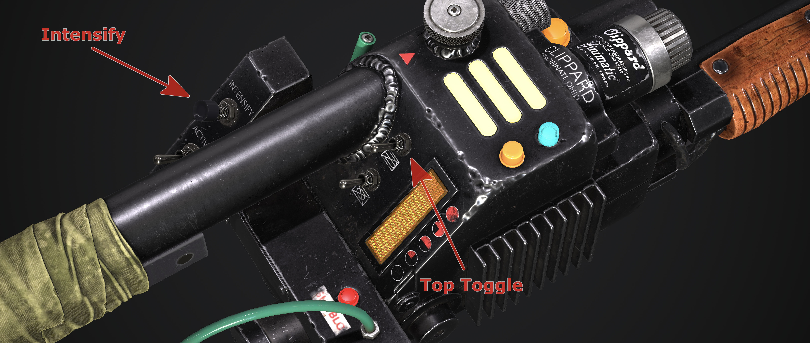

  

 
 

<h1>Proton Pack &amp; Neutrona Wand Operation Manual</h1>

 
 

# EEPROM Menus

There are two EEPROM menus available which can be accessed to adjust and save configurations onto either the Proton Pack and Neutrona Wand EEPROM memory. These are the **EEPROM LED Menu** and the **EEPROM Configuration Menu**.

⚠️ **NOTICE:** The EEPROM memory has a specified life of 100,000 write/erase cycles. You will generally not reach this limit in your lifetime, but if you did, it can be disabled to bypass it. Refer to the Advanced User Configurations below for more information.

## EEPROM LED Menu

The EEPOM LED Menu can be used to configure different LED setups for your Proton Pack. All changes can be saved directly to the Proton Pack EEPROM and will be loaded automatically even if you turn off the power to your devices.

To access the EEPROM LED Menu System, hold down the `Intensify Button` and toggle the right hand `Top Toggle` button 5 times (up and down). You will then hear a beep noise and your bargraph will light up to indicate you are in the EEPROM LED Menu System. The Neutrona Wand barrel and all the Proton Pack LEDs will light up to the default Spectral Custom colours when you enter the EEPROM LED Menu.

📝 **Note:** EEPROM menus can only be reached while both the Neutrona Wand and Proton Pack are powered down.

**EEPROM LED Menu Level 1**

| Option | Purpose | Intensify&nbsp;Button | Barrel&nbsp;Wing&nbsp;Button |
|:------:|---------|------------------|--------------------|
| 5 | Save or Clear the EEPROM settings | Clear all the LED settings in the Proton Pack EEPROM.  **The Proton Pack will instead load the software defined defaults the next time you turn the battery power off.** | Save the current settings to the Proton Pack EEPROM. |
| 4 | Cyclotron LED Count Toggle / Spectral Custom (Barrel) Colour| Toggle between 40, 20 or 12 LEDs for your Cyclotron. | `(Barrel Wing Button + Top Dial)` Changes the colour hue of the **Neutrona Wand barrel** for the Spectral Custom mode. |
| 3 | Power Cell LED Count Toggle / Spectral Custom (Power Cell) Colour | Toggle between 15 or 13 LEDs for your Power Cell. | `(Barrel Wing Button + Top Dial)` Changes the colour hue of the **Power Cell** for the Spectral Custom mode. |
| 2 | Inner Cyclotron LED Count Toggle  / Spectral Custom (Cyclotron) Colour | Toggle Between 35, 24, 23 or 12 LEDs for your Inner Cyclotron Cake. | `(Barrel Wing Button + Top Dial)` Changes the colour hue of the **Cyclotron Lid** for the Spectral Custom mode. |
| 1 | Inner Cyclotron GRB Toggle / Spectral Custom (Inner Cyclotron) Colour | Toggle your Inner Cyclotron from RGB or GRB LEDs. | `(Barrel Wing Button + Top Dial)` Changes the colour hue of the **Inner Cyclotron (Cake)** for the Spectral Custom mode. |

## EEPROM Configuration Menu

The EEPROM Configuration Menu can be used to save certain behaviours of your Neutrona Wand and Proton Pack as the standard settings.

To access the EEPROM Configuration Menu, hold down the `Intensify Button` and toggle the right hand `Bottom Toggle` button 5 times (up and down). You will then hear a beep noise and your bargraph will light up to indicate you are in the EEPROM Configuration Menu System.

To access the EEPROM Configuration menus, use the `Top Dial` on the top of the wand. When you reach the a new menu level, the Slo-blo LED and other lights on the Neutrona Wand will illuminate to indicate these menu levels, along with audio cues from the system.

	Menu Level 1 -> No additional wand lights will be illuminated
	Menu Level 2 -> Slo-Blo illuminated
	Menu Level 3 -> Slo-Blo and vent light illuminated
	Menu Level 4 -> Slo-Blo, vent light, and top gun box light illuminated
	Menu Level 5 -> Slo-Blo; vent light, top gun box light, and front gun box light illuminated

📝 **Note:** EEPROM menus can only be reached while both the Neutrona Wand and Proton Pack are powered down.

Please note whatever settings you have temporarily changed in the regular menus and sub menus will be applied automatically and saved if you exit the EEPROM menu by saving the settings.

**EEPROM Configuration Menu Level 1**

| Option | Purpose | Intensify&nbsp;Button | Barrel&nbsp;Wing&nbsp;Button |
|:------:|---------|------------------|--------------------|
| 5 | Save or Clear the EEPROM settings | Clear all the configuration only settings in the Proton Pack and Neutrona Wand EEPROM.  ***The Proton Pack and Neutrona Wand will instead load the software defined defaults the next time the battery power is turn back on.***| Save the current settings to the Proton Pack and Neutrona Wand EEPROM. |
| 4 | Firing&nbsp;Mode&nbsp;Selection / Spectral Modes | Cycle through VG/CTS operation modes to set as your default.3 | Enable/Disable the Spectral Modes. |
| 3 | Overheating / Smoke | Enable/Disable Overheating Ability | Enable/Disable Smoke Effects |
| 2 | Cyclotron&nbsp;LED&nbsp;Control | Cyclotron rotation direction. Clockwise or counter clockwise. | Enable/Disable the Cyclotron Lid Ring Simulation in Afterlife (2021) mode. ONLY applies to use of the 12 or 20 LED hardware options. |
| 1 | Sound Effects | Enable/Disable the proton stream impact sound effects. | Enable/Disable extra Neutrona Wand sound effects to be played by the Proton Pack. |

3 Choose between Video Game and Cross the Streams (CTS) operation modes. Cross the Streams modes is like what you see in the films.

**EEPROM Configuration Menu Level 2**

| Option | Purpose | Intensify Button | Barrel Wing Button |
|:------:|---------|------------------|--------------------|
| 5 | Quick&nbsp;Vent / Wand&nbsp;Boot&nbsp;Errors | Enable/Disable the Quick Venting feature. When enabled, you can manually vent your Proton Pack by pressing the Intensify button while the top right toggle switch is switched down.   📝 `Super Hero mode only` | Enable to disable the Wand boot error mode. When enabled, if you turn on the Neutrona Wand while the top right toggle is up and activated, the Neutrona Wand enters an error mode and remains locked out until the switches are all turned off.   📝 `Super Hero mode only` |
| 4 | Auto Vent Light Intensity / Barrel LED Count | Enable/Disable the Auto Vent Light Intensity. When enabled, the vent light will adjust the intensity based on the power level of the wand. | Set the barrel led count between 5 (default), 48 and 60. |
| 3 | Beep Loop / VGA&nbsp;Colour&nbsp;Mode&nbsp;Toggles | Enable/Disable the looping beep sound effect in Afterlife Mode. | Cycle through VG colour modes.5 |
| 2 | Overheat Lights | Enable/Disable the N-Filter LEDs from strobing during overheating. | Enable/Disable the Proton Pack lights to turn off during overheating. When disabled, after ramping down to a slower pace, the lights stay on.
| 1 | Default Year&nbsp;Mode / Overheat&nbsp;Sync&nbsp;to&nbsp;Fan | Set your default year mode between 1984/1989/Afterlife/Default. When set, the system will ignore the year mode toggle switch during bootup. However the toggle switch can still be used while the Proton Pack is on. If set to Default, the system picks the year mode based on the position of the year mode toggle switch in the Proton Pack. | Enable/Disable the overheat sync to fan. When enabled, the fan connections in the Proton Pack will only activate at the same time as the smoke connections. When disabled, the fan connections activate slightly after the smoke connections which allows some build of smoke before the fans activate. |

5 Enables/disables the video game colour modes for the Proton Pack's Power Cell and Cyclotron lights. This only affects the pack when in Video Game mode, not for CTS modes, and offers the following states:

- Disable all the video game colours (Power Cell remains blue, Cyclotron remains red).
- Enable only the Power Cell LEDs to change colours (requires RGB Power Cell such as that offered by Frutto Technology).
- Enable only the Cyclotron LEDs to change colours (requires RGB replacement such as a Neopixel ring).
- Enable both the Power Cell and Cyclotron to use video game colours.

**EEPROM Configuration Menu Level 3**

| Option | Purpose | Intensify Button | Barrel Wing Button |
|:------:|---------|------------------|--------------------|
| 5 | System Default Volume / Neutrona Wand Year Mode | Hold the `Intensify Button` down while turning the `top dial` to adjust and set the default volume for the system. (Uses audio beeps for indication of volume.) | Set the year mode your Neutrona Wand operates in. Options are: 1984/1989/Afterlife and System Default. When set to System Default, the Neutrona Wand matches the same year mode as that the Proton Pack is in. |
| 4 | Invert&nbsp;Bargraph / Bargraph&nbsp;Overheat&nbsp;Blinking | Toggles inverting of the bargraph in the Neutrona Wand (depending on installation orientation). | Enable/Disable the bagraph to blink on and off during overheat. When disabled, the bargraph will ramp down and turn off during the overheat sequence before ramping back up when overheating has finished. |
| 3 | Bargraph Animations / Bargraph Firing Animations | Toggle between animation modes as default for the idle bargraph: **Super Hero**, **Bargraph Original**, or **System Default** **System Default** chooses the default animation based on the year mode and system mode. | Toggle between animation modes as default for the bargraph when firing: **Super Hero**, **Bargraph Original**, or **System Default** **System Default** chooses the default animation based on the year mode and system mode. |
| 2 | Demo Light Mode / Cyclotron 3 LED Toggle | Enable/Disable the Demo Light mode. When enabled, the Proton Pack and Neutrona Wand will automatically boot up as soon as the system has power. | Toggle between 1 LED or 3 LEDs in each cyclotron lens in 1984/1989 year mode. |
| 1 | System&nbsp;Mode / CTS&nbsp;Override | Toggle between the available system operation modes: **Super Hero** or **Mode Original** | Toggle between options for default CTS mode: **1984**, **1989**, **Afterlife**, or **System Default** System Default automatically chooses the CTS mode based on the current year mode of your system. |

**EEPROM Configuration Menu Level 4**

Adjust the vent smoke duration during overheat events and overheat start delay for each wand power level.

| Option | Purpose | `Intensify Button + Top Dial` | `Barrel Wing Button + Top Dial` |
|:------:|---------|------------------|--------------------|
| 5 | Power&nbsp;Level&nbsp;5 | Smoke vent duration during overheat `Range: 2 to 60 seconds` `Default: 6 seconds` | Overheat start delay `Range: 2 to 60 seconds` `Default: 12 seconds` |
| 4 | Power&nbsp;Level&nbsp;4 | Smoke vent duration during overheat `Range: 2 to 60 seconds` `Default: 5 seconds` | Overheat start delay `Range: 2 to 60 seconds` `Default: 15 seconds` |
| 3 | Power&nbsp;Level&nbsp;3 | Smoke vent duration during overheat `Range: 2 to 60 seconds` `Default: 4 seconds` | Overheat start delay `Range: 2 to 60 seconds` `Default: 20 seconds` |
| 2 | Power&nbsp;Level&nbsp;2 | Smoke vent duration during overheat `Range: 2 to 60 seconds` `Default: 3 seconds` | Overheat start delay `Range: 2 to 60 seconds` `Default: 30 seconds` |
| 1 | Power&nbsp;Level&nbsp;1 | Smoke vent duration during overheat `Range: 2 to 60 seconds` `Default: 2 seconds` | Overheat start delay `Range: 2 to 60 seconds` `Default: 60 seconds` |

**EEPROM Configuration Menu Level 5**

Toggles overheating ability and continuous smoke effects during firing for each wand power level. The continuous smoke effects will randomly activate for very short bursts while continuously firing for long periods.

### ⚠️ WARNING

**Running your smoke devices for long periods can potentially damage them, and/or reduce battery life. Adjust these settings with caution and use at your own risk!**

| Option | Purpose | Intensify Button | Barrel Wing Button |
|:------:|---------|------------------|--------------------|
| 5 | Power&nbsp;Level&nbsp;5 | Enable/Disable Overheating `Default: enabled` | Enable/Disable continuous firing smoke effects `Default: enabled` |
| 4 | Power&nbsp;Level&nbsp;4 | Enable/Disable Overheating `Default: disabled` | Enable/Disable continuous firing smoke effects `Default: enabled` |
| 3 | Power&nbsp;Level&nbsp;3 | Enable/Disable Overheating `Default: disabled` | Enable/Disable continuous firing smoke effects `Default: enabled` |
| 2 | Power&nbsp;Level&nbsp;2 | Enable/Disable Overheating `Default: disabled` | Enable/Disable continuous firing smoke effects `Default: enabled` |
| 1 | Power&nbsp;Level&nbsp;1 | Enable/Disable Overheating `Default: disabled` | Enable/Disable continuous firing smoke effects `Default: enabled` |

# Advanced User Configurations

To modify defaults within the software rather than the EEPROM menus, please see the [Advanced Configuration](ADVCONFIG.md) guide.
