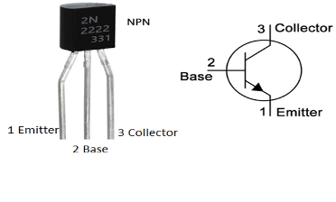

# Pack Setup

## Reference

**A Note on Transistors**

Transistors will be used to allow switching high-current elements on or off. This is because the Arduino hardware recommends less than 20mA draw per pin (40mA maximum), so for items which may require more power the transistor acts as a switch to allow more current to flow through the transistor instead of the Arduino hardware. The most-used component for this build will be the 2N2222/PN2222 or NPN Bipolar Transistor (BJT). The NPN type allows the flow of power from the Collector to Emitter pin, dictated by applying power (VCC) to the Base pin.

| Pin | Description |
|---|---|
| NPN E  | Emitter |
| NPN B | Base |
| NPN C | Collector |

**A Note on the Rotary Encoder**

Rotary encoder pin layout reference to be used for volume control. Contains pins 1-2-3 (viewed facing you, see below).

**HasLab Legacy Connections - Reused Connections Only**

| **Connector Label** | **Header Color** | **Wire Color**  | **Purpose** | **Notes** |
|---|---|---|---|---|
| M1 | Green | Red | VCC | Pack vibration motor; cannot be turned on or off when pack is "active", only when in "powered down" state. |
|  |  | Black | GND |  |
| JP3 | White | Green | B0 | Power, ground, and data (DI) for Powercell LED's; Contains LED's D1-D13 and returns data signal back to board via the B0 pin. |
|  |  | Black | GND |  |
|  |  | Yellow | DI |  |
|  |  | Red | VCC | Cyclotron LED's continue from B0 as data on RI (unplugging JP3 will stop cycling of cyclotron LED's). |
| JP4 | Red | Red | VCC | Power, ground, and data (RI) for Cyclotron; Additional ground connection triggers the malfunction sequence when cyclotron lid is opened. Each "lens" contains 3 LED's for a total of 12. |
|  |  | Yellow | RI |  |
|  |  | Black | GND |  |
|  |  | Brown | GND | Used for detection of the cyclotron lid |
| SW1 | White | Black | GND | Main "power" switch under the ion arm, enables all pack operations. |
|  |  | Red | VCC |  |
| SW3-SW4 | Blue | Green | SPDT Toggle | Toggle switches inside the cyclotron. Left: Turns rumble motor on (up) or off (down); Right: Change cyclotron spin and sound theme between Afterlife/2021 (up) or OG/1984 (down) |
|  |  | Blue |  |  |
|  |  | Green | SPDT Toggle |  |
|  |  | Red |  |  |
| SW6 | Red | Black | GND | Sensor on the cyclotron cable, triggers alarm beeps when disconnected |
|  |  | Red | VCC |  |

## Circuit Schematic

You may choose one of two routes for implementing the new Proton Pack controller:

1. A minimal approach which only focuses on reusing the stock connections and hardware.
	- For this approach, see the PDF document for the [Pack Schematic Minimal](circuits/PackSchematic-Minimal.pdf)
1. The above, but with room for additional features, each of which is considered optional.
	- Keep reading to continue with this approach.

Use a half size protoboard like ([1609 Adafruit](https://www.adafruit.com/product/1609)) or by any other brand. These work similar to a breadboard, where LETTERED columns run horizontal and are connected as a group, and each side contains 2 rails for (+) and (-) connections and run vertically along the board, also connected together.

Connections from stock JST-XH connectors may be split to maximize use of the smallest protoboard possible. This is a non-reversible change and removes the ability to swap components without de-soldering wires. *This is your last caution before proceeding!*

**Special Component Naming Conventions**

| Name | Description |
|---|---|
| 1N4001 (Diode) | Use of (s) denotes the striped end (cathode) |
| NPN [EBC] | Standard PN2222 Transistor [Denotes Pin] |
| ### Ω | Denotes a resistor with given Ohms rating |
| SW-CYC | Cyclotron Spin Direction Switch |
| SW-SMOKE | Smoke Switch (enable or disable smoke) |
| LED-R# | 2x Red LED for cyclotron switch plate (OPTIONAL) |
| LED-Y# | 2x Yellow LED for cyclotron switch plate (OPTIONAL) |
| LED-G# | 2x Green LED for cyclotron switch plate (OPTIONAL) |
| LED-MSW | 1x Green LED for mode year switch (OPTIONAL) |
| LED-VSW | 1x Yellow LED for vibration switch (OPTIONAL) |
| NEO-CYC | 8 NeoPixel jewels chained together (OPTIONAL) (56 LED's total) [See Cyclotron Lights](CYCLOTRON.md) |
| SMOKE1 | This is a standard 5V Air/Vacuum pump motor I use. (see below for more info) |
| SMOKE2 | This is a standard 5V Air/Vacuum pump motor I use. (see below for more info) |

| Power Connections | Description |
|---|---|
| BAT (+) | Positive 5V from your power source. |
| BAT (-) | Ground from your 5V power source. |
| WAND (+) | Runs to your wand (5V) + power rail [on the ¼ board](https://www.adafruit.com/product/1608) (see [wand section](WAND.md)) |
| WAND (-) | Runs to your wand ground rail on the ¼ board (see [Wand Setup](WAND.md)) |

### Protoboard Layout

| | **+** | **-** | **A** | **B** | **C** | **D** | **E** |  | **F** | **G** | **H** | **I** | **J** | **+** | **-** |
|---|---|---|---|---|---|---|---|---|---|---|---|---|---|---|---|
| **1** | BAT&nbsp;(+) |  | A+ | Mega&nbsp;(+) | WavTrig&nbsp;(+) | WAND&nbsp;(+) |  |  |  | WAND&nbsp;(-) | WavTrig&nbsp;(-) | Mega&nbsp;(-) | B- |  | BAT&nbsp;(-) |
| **2** | A+ |  |  |  |  |  |  |  |  |  |  |  |  |  | B- |
| **3** |  |  | SW1&nbsp;(Red) | PIN&nbsp;31 |  |  |  |  | SW1&nbsp;(Black) | SW3&nbsp;(Green) | SW4&nbsp;(Red) | SW6&nbsp;(Black) | C- |  | C- |
| **4** |  |  | SW3&nbsp;(Blue) | PIN&nbsp;25 |  |  |  |  | SW-CYC (Black) | SW-SMOKE (Black) | ROT&nbsp;(2) |  | D- |  | D- |
| **5** |  |  | SW4&nbsp;(Green) | PIN&nbsp;27 |  |  |  |  | LED-R1 (-) | LED-R2 (-) | LED-Y1 (-) | LED-Y2 (-) | E- |  | E- |
| **6** |  |  | SW6&nbsp;(Red) | PIN&nbsp;23 |  |  |  |  | LED-G1 (-) | LED-G2 (-) | LED-MSW (-) | LED-VSW  (-) | F- |  | F- |
| **7** |  |  | ROT (1) | PIN 3 |  |  |  |  | ROT (3) | PIN 2 |  |  |  |  |
| **8** | JP3&nbsp;(Red) |  | JP3&nbsp;(Yellow) |  |  |  | 470 Ω | ↔ | 470 Ω | PIN 53 |  |  |  |  | JP3&nbsp;(Black) |
| **9** |  |  | JP3&nbsp;(Green) | JP4&nbsp;(Yellow) |  |  |  |  |  |  |  |  |  |  |  |
| **10** | JP4&nbsp;(Red) |  | JP4&nbsp;(Brown) | PIN&nbsp;51 |  |  |  |  |  |  |  |  |  |  | JP4 (Black) |
| **11** | NEO-CYC (+) |  | NEO-CYC (Data) |  |  |  | 470 Ω | ↔ | 470 Ω | PIN&nbsp;13 |  |  |  |  | NEO-CYC (-) |
| **12** |  |  |  |  |  |  |  |  |  |  |  |  |  |  |  |
| **13** | G+ |  | G+ |  | 1N4001&nbsp;(s) | FAN-1&nbsp;(+) |  |  | H+ |  | 1N4001&nbsp;(s) | M1&nbsp;(Red) |  |  |  |
| **14** | H+ |  |  |  | ↕ |  |  |  |  |  | ↕ |  |  |  |  |
| **15** |  |  |  |  | ↕ |  |  |  |  |  | ↕ |  |  |  |  |
| **16** |  |  | NPN C |  | 1N4001 | FAN-1&nbsp;(-) |  |  | NPN C |  | 1N4001 | M1&nbsp;(Black) |  |  |  |
| **17** |  |  | NPN B |  | 330 Ω |  |  |  | NPN B |  | 330 Ω |  |  |  |  |
| **18** |  |  | NPN E |  | ↕ |  | I- |  | NPN E |  | ↕ |  | J- |  | J- |
| **19** |  |  |  |  | ↕ |  |  |  |  |  | ↕ |  |  |  | I- |
| **20** |  |  |  |  | 330 Ω |  | PIN&nbsp;33 |  |  |  | 330 Ω |  | PIN&nbsp;45 |  |  |
| **21** |  |  |  |  |  |  |  |  |  |  |  |  |  |  |  |
| **22** | K+ |  | K+ |  | 1N4001&nbsp;(s) | SMOKE2&nbsp;(+) |  |  | L+ |  | 1N4001&nbsp;(s) | SMOKE1&nbsp;(+) |  |  |  |
| **23** | L+ |  |  |  | ↕ |  |  |  |  |  | ↕ |  |  |  |  |
| **24** |  |  |  |  | ↕ |  |  |  |  |  | ↕ |  |  |  |  |
| **25** |  |  | NPN C |  | 1N4001 | SMOKE2&nbsp;(-) |  |  | NPN C |  | 1N4001 | SMOKE1&nbsp;(-) |  |  |  |
| **26** |  |  | NPN B |  | 330 Ω |  |  |  | NPN B |  | 330 Ω |  |  |  |  |
| **27** |  |  | NPN E |  | ↕ |  | M- |  | NPN E |  | ↕ |  | N- |  | N- |
| **28** |  |  |  |  | ↕ |  |  |  |  |  | ↕ |  |  |  | M- |
| **29** |  |  |  |  | 330 Ω |  | PIN&nbsp;35 |  |  |  | 330 Ω |  | PIN&nbsp;39 |  |  |
| **30** |  |  |  |  |  |  |  |  |  |  |  |  |  |  |  |

**Bread Board Diagram Reference and Interpretations:**

When you see a letter or code in a cells above, it references where component needs to be inserted or what needs to be connected there. Reference the photos below for more information.

**Letters should be connected together by a length of wire.**

Example #1: You see "A+" in space "+2" (Column "+", Row 2) on the breadboard and again on "A1" (Column "A", Row 1). You need to connect a wire to these 2 points. In this case, the result is positive power on the "+" rail being delivered into all of row 1 for any connections in columns A through E.

Example #2: In space "J1" you have a connection "B-" and you need to run a wire from "J1" to "-1" on the right side of the breadboard. This will deliver ground from the "-" rail to columns F through J on row 1.

**Components will be connected in multiple adjacent spaces.**

Example #1: In E8 you have one end of 470ohm resistor. You need to put the other end of this resistor onto F8 on the board. Resistors do not have polarity and so either end can be placed into either of the marked spaces.

Example #2: In H16 you have one end of a 1n4001 diode. You need to then put the STRIPED end of the diode to H13 on the board as indicated with the (s). Diodes have a polarity which affects the flow of current, so pay close attention to these markings.

Example #3: In C29 is one end of a 330 resistor, and the other end runs to vertically C26. This is indicated by the ↕ which shows the direction of the component. The symbol ↔ is also used to show when an item is connected horizontally.

**Spaces leading with "PIN" indicates an Arduino connection.**

Example #1: G10 says PIN 53. You need to run a wire from this point to PIN 53 to the Arduino Mega. (See chart below protoboard photo.)

## Wires to the Arduino MEGA

These are connections which are not covered in the diagram above, but connect directly to the Arduino board.

| Connection → Pin | Optional? |
|---|---|---|
| MEGA TX3 → WavTrigger RX | NO, Req. for sound |
| MEGA RX3 → WavTrigger TX | NO, Req. for sound |
| MEGA TX2 → Wand Nano RX | YES |
| MEGA RX2 → Wand Nano TX | YES |
| SW-CYC (Red) → Pin 29 | YES |
| SW-SMOKE (Red) → Pin 37 | YES | 
| LED-R1 (+) soldered to R 140 Ω → Pin 4 | YES |
| LED-R2 (+) soldered to R 140 Ω → Pin 5 | YES |
| LED-Y1 (+) soldered to R 140 Ω → Pin 6 | YES |
| LED-Y2 (+) soldered to R 140 Ω → Pin 7 | YES |
| LED-G1 (+) soldered to R 90 Ω → Pin 8 | YES  |
| LED-G2 (+) soldered to R 90 Ω → Pin 9 | YES |
| LED-MSW (+) soldered to R 90 Ω → Pin 10 (Resistor set for Green LED) | YES |
| LED-VSW (+) soldered to R 140 Ω → Pin 11 (Resistor set for Yellow LED) | YES |
| FAN-1 → Pin 33 → Goes 5V high, is timed to go off during over heat sequence. You can hook up any device to this. I used a fan for testing purposes. Future plan is run a DC motor off this that is connected to the n-filter cone. See YELLOW SECTION on the chart above for reference. What you put in this section depends on what device you hook up to the Mega if anything at all. DO NOT DRAW MORE THAN 40MA from a pin. Use a transistor setup if you need more power. | (Optional) | NOTE: If you change LED colours, use the appropriate resistor. The resistors I reference here are the minimum required for these particular 5mm LED diodes. You can go up to the nearest resistor value if you do not have a 140. For example I used 150 since I do not have any 140’s in my resistor kit, and 100 instead of 90 for my green LEDs. |
| SMOKE-2 →Pin 35 → Goes 5V high, is timed to go off occasionally during the wand firing sequences. You can hook up any device to this. I used DC pump motor for drawing smoke from a e-vape pen and push it out of the booster tube. It is referenced as the smoke_booster in the pack code. ‘See matching colour section in chart above. What you hook up here depends on what device you intend to run. **DO NOT DRAW MORE THAN 40ma FROM A PIN. Use a transistor setup if you need more power.** | (Optional) |
| SMOKE-1 → Pin 39 → Goes 5V high, is timed to go off during over heat sequence and occasionally during the wand firing sequences. You can hook up any device to this. I used DC pump motor for drawing smoke from a e-vape pen and run it to the n-filter. This is referenced as smoke_pin in the pack code. See matching colour section in chart above. What you hook up here depends on what device you intend to run. **DO NOT DRAW MORE THAN 40ma FROM A PIN. Use a transistor setup if you need more power.** | (Optional) |

## Optional Pack Upgrades

The following are *OPTIONAL* builds for use within the Proton Pack.

 - [Cyclotron Lights](CYCLOTRON.md)
 - [N-Filter Vent Light](NFILTER.md)
