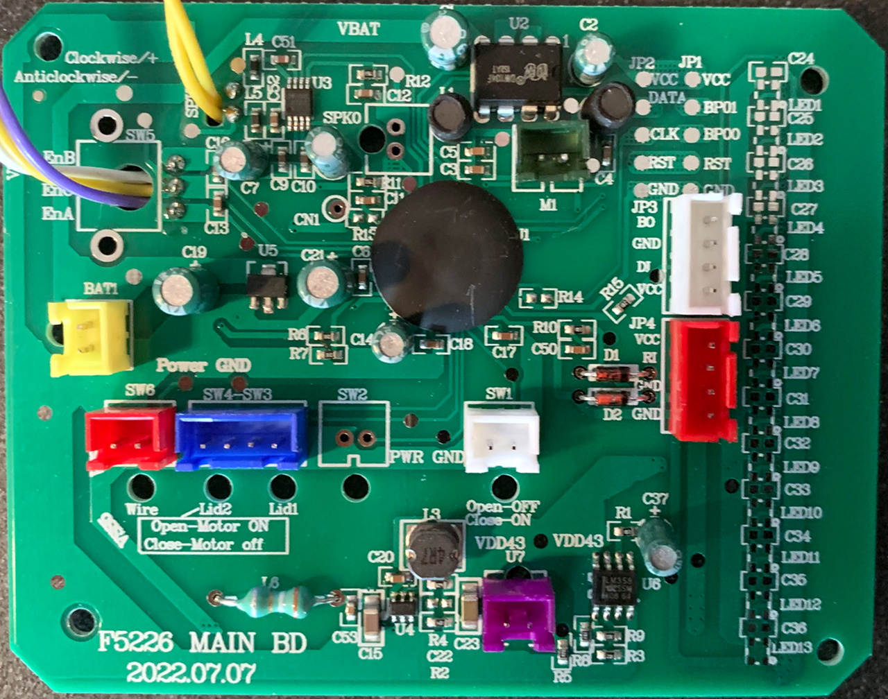

# Proton Pack Setup

This guide begins with some explanations for common items you will encounter during the upgrade process. Note that if the wand electronics will be replaced it will be necessary to upgrade the hose and conductors between the pack and wand. This exercise is left to individual preferences on connectors and style of replacement, though you will need 4 conductors at a minimum (+5V, Ground, and TX/RX for communications.

## Component Reference

**A Note on Transistors**

Transistors will be used to allow switching high-current elements on or off. This is because the Arduino hardware recommends less than 20mA draw per pin (40mA maximum), so for items which may require more power the transistor acts as a switch to allow more current to flow through the transistor instead of the Arduino hardware. The most-used component for this build will be the 2N2222/PN2222 or NPN Bipolar Transistor (BJT). The NPN type allows the flow of power from the Collector to Emitter pin, dictated by applying power (VCC) to the Base pin.

| Pin | Description |
|-----|-------------|
| NPN E | Emitter |
| NPN B | Base |
| NPN C | Collector |

**A Note on the Rotary Encoder**

Rotary encoder pin layout reference to be used for volume control. Contains pins 1-2-3 (viewed facing you, see below).

**HasLab Legacy Connections**

This chart lists only the components in the stock pack which will be reused, while others will be replaced (such as the speaker output and rotary encoder which are both soldered to the stock controller). There are several new and optional components which can be added as part of this guide. These items are expected to be implemented at a minimum for basic operation.

| **Connector Label** | **Header Color** | **Wire Color**  | **Purpose** | **Notes** |
|---|---|---|---|---|
| M1 | Green | Red | VCC | Pack vibration motor; cannot be turned on or off when pack is "active", only when in "powered down" state. (This is the only stock item which may be considered optional.) |
|  |  | Black | GND |  |
| JP3 | White | Green | B0 | Power, ground, and data (DI) for Powercell LED's; Contains LED's D1-D13 and returns data signal back to board via the B0 pin. |
|  |  | Black | GND |  |
|  |  | Yellow | DI | Data input; cyclotron LED's continue from B0 as data on RI (unplugging JP3 will stop cycling of cyclotron LED's). |
|  |  | Red | VCC |  |
| JP4 | Red | Red | VCC | Power, ground, and data (RI) for Cyclotron; Each "lens" contains 3 LED's for a total of 12. |
|  |  | Yellow | RI | Data input; starts on JP3-DI pin and continues from JP3-B0 |
|  |  | Black | GND |  |
|  |  | Brown | GND | Used for detection of the cyclotron lid |
| SW1 | White | Red | VCC | Main "power" switch under the ion arm, enables all pack operations. |
|  |  | Black | GND |  |
| SW3 | Blue | Green | SPDT Toggle | Left toggle switch inside the cyclotron: Turns rumble motor on (up) or off (down)  |
|  |  | Blue |  |  |
| SW4 |  | Green | SPDT Toggle | Right toggle switch inside the cyclotron: Change cyclotron spin and sound theme between Afterlife/2021 (up) or OG/1984 (down) |
|  |  | Red |  |  |
| SW6 | Red | Red | VCC | Sensor on the cyclotron cable, triggers alarm beeps when disconnected |
|  |  | Black | GND |  |

## Circuit Schematic

You may choose one of two routes for implementing the new Proton Pack controller:

1. A minimal approach which only focuses on reusing the stock connections and hardware (switches, LED's, motor).
	- For this approach, see the PDF document for the [Pack Schematic Minimal](circuits/PackSchematic-Minimal.pdf)
	- This provides power to the Neutrona Wand but no interactions with the Proton Pack.
1. Use all stock hardware as above, but with room for additional features, each of which is considered optional.
	- This will provide full interation with the new controller for the Neutrona Wand.
	- Keep reading to continue with this approach.

**Prototyping and Connections**

Use a half size protoboard like ([1609 Adafruit](https://www.adafruit.com/product/1609)) or by any other brand. These work similar to a breadboard, where LETTERED columns run horizontal and are connected as a group, and each side contains 2 rails for (+) and (-) connections and run vertically along the board, also connected together.

Connections from stock JST-XH connectors may be split to maximize use of the smallest protoboard possible. This is a non-reversible change and removes the ability to swap components without de-soldering wires. *This is your last caution before proceeding!*

**Special Component Naming Conventions**

| Name | Description |
|---|---|
| 1N4001 (Diode) | Use of (s) denotes the striped end (cathode) |
| NPN [EBC] | Standard PN2222 Transistor [Denotes Pin] |
| CAP ###uf | Denotes an electrolytic capacitor with given microfarad rating |
| R ### Ω | Denotes a resistor with given Ohms rating |
| SW-CYC | Cyclotron Spin Direction Switch |
| SW-SMOKE | Smoke Switch (enable or disable smoke) |
| LED-R# | 2x Red LED for cyclotron switch plate (OPTIONAL) |
| LED-Y# | 2x Yellow LED for cyclotron switch plate (OPTIONAL) |
| LED-G# | 2x Green LED for cyclotron switch plate (OPTIONAL) |
| LED-MSW | 1x Green LED for mode year switch (OPTIONAL) |
| LED-VSW | 1x Yellow LED for vibration switch (OPTIONAL) |
| NEO-CYC | 8 NeoPixel jewels chained together (OPTIONAL) (56 LED's total) [See Cyclotron Lights](CYCLOTRON.md) |
| SMOKE1 | This is a standard 5V Air/Vacuum pump motor I use. (see below for more info) |
| SMOKE2 | This is a standard 5V Air/Vacuum pump motor I use. (see below for more info) |

Regarding the smoke effects, I am using [eroll mac joytech vape pen](https://www.joytech.fr/accueil/168-eroll-mac-joytech.html). I hook up with tubing the mini pump which is [linked in the parts lists](BOM.md). One end of the pump creates suction and sucks the smoke in, and the other end of the pump pushes the smoke out. The vape pen itself is activating when suction is applied by the motor. The vape pens are battery powered but come with a usb cable for charging, so I can feed it 5V with a usb cable directly to the pen and not have to rely on the battery it has in it.

When the pump is controlled with the transistor/diode setup as in the diagrams, it is the only device which draws power from the 5V rail. **CAUTION: If you implement your own smoke solution using a different design, test your setup independent of the described circuit and with adequate measurement tools to ensure you will not draw power through the Arduino!** Most designs which use a vape pen (cartomizer) and mini air pump require ~3.6V to run correctly, and while less than the 5V supplied to the circuit below some solutions can require nearly 1 Amp of current to run these devices together. This can also overwhelm the 2N2222 transistor used in this schematic.

By comparison, the current required for a small fan or the vibration motor are perfectly fine for the transistors as described, while the diodes prevent any backflow of current when those devices power down (but may still spin briefly).

| Power Connections | Description |
|---|---|
| BAT (+) | Positive 5V from your power source. |
| BAT (-) | Ground from your 5V power source. |
| WAND (+) | Runs to your wand (5V) + power rail [on the ¼ board](https://www.adafruit.com/product/1608) (see [wand section](WAND.md)) |
| WAND (-) | Runs to your wand ground rail on the ¼ board (see [Wand Setup](WAND.md)) |

### Protoboard Layout

Some connections to components will be made directly to the Arduino Mega. Please see the section below for these additional items not addressed in the layout here. An explanation of this layout can be found just below the protoboard sample photo.

|        | **+** | **-** | **A** | **B** | **C** | **D** | **E** |   | **F** | **G** | **H** | **I** | **J** | **+** | **-** |
|--------|-------|-------|-------|-------|-------|-------|-------|---|-------|-------|-------|-------|-------|-------|-------|
| **1**  | BAT&nbsp;(+) |  | A+ | Mega&nbsp;(+) | WavTrig&nbsp;(+) | WAND&nbsp;(+) |  |  |       | WAND&nbsp;(-) | WavTrig&nbsp;(-) | Mega&nbsp;(-) | B- |  | BAT&nbsp;(-) |
| **2**  | A+ |  |  |  |  |  |  |  |  |  |  |  |  |  | B- |
| **3**  |  |  | SW1&nbsp;(Red) | PIN&nbsp;31 |  |  |  |  | SW1&nbsp;(Black) | SW3&nbsp;(Green) | SW4&nbsp;(Red) | SW6&nbsp;(Black) | C- |  | C- |
| **4**  |  |  | SW3&nbsp;(Blue) | PIN&nbsp;27 |  |  |  |  | SW-CYC (Black) | SW-SMOKE (Black) | ROT&nbsp;(2) |  | D- |  | D- |
| **5**  |  |  | SW4&nbsp;(Green) | PIN&nbsp;25 |  |  |  |  | LED-R1 (-) | LED-R2 (-) | LED-Y1 (-) | LED-Y2 (-) | E- |  | E- |
| **6**  |  |  | SW6&nbsp;(Red) | PIN&nbsp;23 |  |  |  |  | LED-G1 (-) | LED-G2 (-) | LED-MSW (-) | LED-VSW  (-) | F- |  | F- |
| **7**  |  |  | ROT (1) | PIN 3 |  |  |  |  | ROT (3) | PIN 2 |  |  |  |  |
| **8**  | JP3&nbsp;(Red) |  | JP3&nbsp;(Yellow) |  |  |  | R&nbsp;470&nbsp;Ω | ↔ | R&nbsp;470&nbsp;Ω | PIN 53 |  |  |  |  | JP3&nbsp;(Black) |
| **9**  |  |  | JP3&nbsp;(Green) | JP4&nbsp;(Yellow) |  |  |  |  |  |  |  |  |  |  |  |
| **10** | JP4&nbsp;(Red) |  |  | JP4&nbsp;(Brown) | PIN&nbsp;51 |  |  |  |  |  |  |  |  |  | JP4 (Black) |
| **11** | NEO-CYC (+) |  | NEO-CYC (Data) |  |  |  | R&nbsp;470&nbsp;Ω | ↔ | R&nbsp;470&nbsp;Ω | PIN&nbsp;13 |  |  |  |  | NEO-CYC (-) |
| **12** |  |  |  |  |  |  |  |  |  |  |  |  |  |  |  |
| **13** | G+ |  | G+ |  | 1N4001&nbsp;(s) | FAN-1&nbsp;(+) |  |  | H+ | CAP 100uf | 1N4001&nbsp;(s) | M1&nbsp;(Red) |  |  |  |
| **14** | H+ |  |  |  | ↕ |  |  |  |  | ↕ | ↕ |  |  |  |  |
| **15** |  |  |  |  | ↕ |  |  |  |  | ↕ | ↕ |  |  |  |  |
| **16** |  |  | NPN C |  | 1N4001 | FAN-1&nbsp;(-) |  |  | NPN C | CAP 100uf | 1N4001 | M1&nbsp;(Black) |  |  |  |
| **17** |  |  | NPN B |  | R&nbsp;330&nbsp;Ω |  |  |  | NPN B |  | R&nbsp;330&nbsp;Ω |  |  |  |  |
| **18** |  |  | NPN E |  | ↕ |  | I- |  | NPN E |  | ↕ |  | J- |  | J- |
| **19** |  |  |  |  | ↕ |  |  |  |  |  | ↕ |  |  |  | I- |
| **20** |  |  |  |  | R&nbsp;330&nbsp;Ω |  | PIN&nbsp;33 |  |  |  | R&nbsp;330&nbsp;Ω |  | PIN&nbsp;45 |  |  |
| **21** |  |  |  |  |  |  |  |  |  |  |  |  |  |  |  |
| **22** | K+ |  | K+ |  | 1N4001&nbsp;(s) | SMOKE2&nbsp;(+) |  |  | L+ |  | 1N4001&nbsp;(s) | SMOKE1&nbsp;(+) |  |  |  |
| **23** | L+ |  |  |  | ↕ |  |  |  |  |  | ↕ |  |  |  |  |
| **24** |  |  |  |  | ↕ |  |  |  |  |  | ↕ |  |  |  |  |
| **25** |  |  | NPN C |  | 1N4001 | SMOKE2&nbsp;(-) |  |  | NPN C |  | 1N4001 | SMOKE1&nbsp;(-) |  |  |  |
| **26** |  |  | NPN B |  | R&nbsp;330&nbsp;Ω |  |  |  | NPN B |  | R&nbsp;330&nbsp;Ω |  |  |  |  |
| **27** |  |  | NPN E |  | ↕ |  | M- |  | NPN E |  | ↕ |  | N- |  | N- |
| **28** |  |  |  |  | ↕ |  |  |  |  |  | ↕ |  |  |  | M- |
| **29** |  |  |  |  | R&nbsp;330&nbsp;Ω |  | PIN&nbsp;35 |  |  |  | R&nbsp;330&nbsp;Ω |  | PIN&nbsp;39 |  |  |
| **30** |  |  |  |  |  |  |  |  |  |  |  |  |  |  |  |

**Recommended: Capacitors for Motors and LED "Pixels"**

To provide smooth power to certain components, it is recommended to place a small electrolytic capacitor across the positive and negative terminals for the following. It is better to place this closer to the component than the PCB when possible.

| Positive  | Capacitor | Negative    |
|-----------|-----------|-------------|
| JP3 (Red) | CAP 100uf | JP3 (Black) |
| JP4 (Red) | CAP 100uf | JP4 (Black) |
| NEO-CYC (+)                        | CAP 100uf | NEO-CYC (-) | 
| M1 (Red)  | CAP 100uf | M1 (Black)  |

**Protoboard Diagram Reference and Interpretations:**

When you see a letter or code in a cells above, it references where component needs to be inserted or what needs to be connected there. Reference the photos below for more information.

- **Letters should be connected together by a length of wire.**

	- These are jumper wires to provide power or ground connections to a specific row of connections on the board. They do not indicate a specific space to make the connection. Each letter should have a (+) or (-) designation to help identify it as +5V or Ground.

		- Example #1: You see "A+" in space "+2" (Column "+", Row 2) on the breadboard and again on "A1" (Column "A", Row 1). You need to connect a wire to these 2 points. In this case, the result is positive power on the "+" rail being delivered into all of row 1 for any connections in columns A through E.

		- Example #2: In space "J1" you have a connection "B-" and you need to run a wire from "J1" to "-1" on the right side of the breadboard. This will deliver ground from the "-" rail to columns F through J on row 1.

- **Components will be connected in multiple adjacent spaces.**

	- Components will span rows or across the mid-gap in the board to allow one or more connections at each end. Note the arrows which will indicate the orientation (vertical or horizontal) for these items and which spaces they will span. Connections to the board will only be noted in designated spots.

		- Example #1: In E8 you have one end of 470ohm resistor. You need to put the other end of this resistor onto F8 on the board. Resistors do not have polarity and so either end can be placed into either of the marked spaces.

		- Example #2: In H16 you have one end of a 1n4001 diode. You need to then put the STRIPED end of the diode to H13 on the board as indicated with the (s). Diodes have a polarity which affects the flow of current, so pay close attention to these markings.

		- Example #3: In C29 is one end of a 330 resistor, and the other end runs to vertically C26. This is indicated by the ↕ which shows the direction of the component. The symbol ↔ here is used to show an item is oriented horizontally.

- **Spaces leading with "PIN" indicates an Arduino connection.**

	- A length of wire (to be determined by the placement of the final switch, LED, or other component) must be soldered to the board at the designated spot and connected to the Arduino Mega at the noted pin.

		- Example #1: G10 says PIN 53. You need to run a wire from this point to PIN 53 to the Arduino Mega. (See chart below protoboard photo.)

## Additional Connections to the Arduino MEGA

These are connections which are not covered in the diagram above and can connect directly to the Arduino board. For the WavTrigger these are the same connections which are used for the FTDI breakout board to program the WavTrigger. Use pins and sockets for an easy connection to that device should a firmware upgrade be required in the future.

| Connection → Pin         | Notes |
|--------------------------|-----------|
| MEGA&nbsp;TX3&nbsp;→&nbsp;WavTrigger&nbsp;RX | Required for sound |
| MEGA&nbsp;RX3&nbsp;→&nbsp;WavTrigger&nbsp;TX | Required for sound |
| MEGA&nbsp;TX2&nbsp;→&nbsp;Wand&nbsp;Nano&nbsp;RX  | Optional if not replacing wand controller |
| MEGA&nbsp;RX2&nbsp;→&nbsp;Wand&nbsp;Nano&nbsp;TX  | Optional if not replacing wand controller |
| SW-CYC (Red) → Pin 29    | Optional, switch for cyclotron direction |
| SW-SMOKE (Red) → Pin 37  | Optional, switch to enable smoke effects | 
| FAN-1 → Pin 33           | Optional Feature Goes 5V high, is timed to go off during over heat sequence. You can hook up any device to this. I used a fan for testing purposes. What you put in this section depends on what device you hook up to the Mega if anything at all. **WARNING: DO NOT DRAW MORE THAN 40ma FROM A PIN. Use a transistor setup if you need more power.**  |
| SMOKE-2 → Pin 35         | Optional Feature Goes 5V high, is timed to go off occasionally during the wand firing sequences. You can hook up any device to this. I used DC pump motor for drawing smoke from a e-vape pen and push it out of the booster tube. It is referenced as the smoke_booster in the pack code. ‘See matching colour section in chart above. What you hook up here depends on what device you intend to run. **WARNING: DO NOT DRAW MORE THAN 40ma FROM A PIN. Use a transistor setup if you need more power.** |
| SMOKE-1 → Pin 39         | Optional Feature Goes 5V high, is timed to go off during over heat sequence and occasionally during the wand firing sequences. You can hook up any device to this. I used DC pump motor for drawing smoke from a e-vape pen and run it to the n-filter. This is referenced as smoke_pin in the pack code. See matching colour section in chart above. What you hook up here depends on what device you intend to run. **WARNING: DO NOT DRAW MORE THAN 40ma FROM A PIN. Use a transistor setup if you need more power.** |

### Cyclotron Panel LED's

NOTE: If you change LED colours, use an appropriate resistor based on the forward voltage stated for the LED. The resistors referenced here are the minimum required for these particular 5mm LED diodes. You can always go up to the nearest resistor value if you do not have the specified value. For example you may use 150 if do not have any 140’s in your resistor kit, and 100 instead of 90s. Most resistors are  expected to be within 5% of their stated value.

| Connection → Pin         | Notes |
|--------------------------|-----------|
| LED-R1 (+) soldered to R 140 Ω → Pin 4 | Optional cyclotron panel light |
| LED-R2 (+) soldered to R 140 Ω → Pin 5 | Optional cyclotron panel light |
| LED-Y1 (+) soldered to R 140 Ω → Pin 6 | Optional cyclotron panel light |
| LED-Y2 (+) soldered to R 140 Ω → Pin 7 | Optional cyclotron panel light |
| LED-G1 (+) soldered to R 90 Ω → Pin 8 | Optional cyclotron panel light  |
| LED-G2 (+) soldered to R 90 Ω → Pin 9 | Optional cyclotron panel light |
| LED-MSW (+) soldered to R 90 Ω → Pin 10 (Resistor set for Green LED) | Optional mode indicator |
| LED-VSW (+) soldered to R 140 Ω → Pin 11 (Resistor set for Yellow LED) | Optional vibration enabled indicator |

## Optional Pack Upgrades

The following are *OPTIONAL* builds for use within the Proton Pack.

 - [Cyclotron Lights](CYCLOTRON.md)
 - [N-Filter Vent Light](NFILTER.md)

## Component Fitment

Given the large spaces and "compartments" within the pack, finding a place for the protoboard, Arduino, WavTrigger, audio amplifier, and battery should be no problem. Reusing the space from the old controller is ideal for the protoboard and Arduino. Most modders have found that the removal of the case for a Talencell battery allows it to fit under the original battery compartment--just use care that the sides of the batteries are covered with electrical tape and nothing can accidentally damage or short the components which may be exposed. Additionally, it's worth covering the bottom contacts on any circuit boards which are in close proximity to each other just in case shifting occurs while wearing the pack.

## Arduino Mega Pinout Reference

