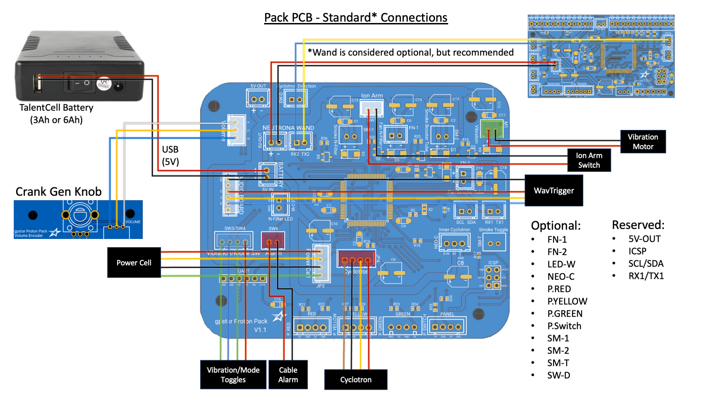
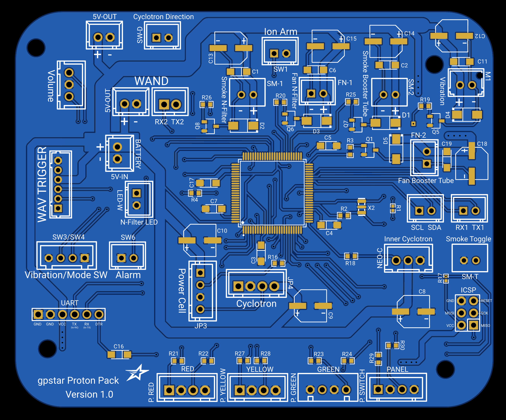

# Pack PCB Hookup

This guide is part of the kit approach to providing a minimally-invasive upgrade to the stock HasLab controllers. For the Proton Pack all stock connections can be made using the available JST-XH connectors on all existing wiring. The diagram below details the standard HasLab connections.

## Proton Pack - Connection Details

Connections for the pack should be made according to the tables below.

- Ordering aligns with PCB labels or when viewed left-to-right with the connector keyhole at the bottom.
- Pins denoted D# correspond to the internal code and connection to the controller chip.
- Ground may be designated as "GND" or simply "-".

### Stock Connectors

| Label | Pins | Notes |
|-------|------|-------|
| BATTERY 5V-IN | +/\- | Power from battery. **This MUST be a regulated 5V source!** |
| Volume | D3/GND/D2 | Rotary encoder connection for pack volume adjusted via crank generator knob |
| SW1 | D31/GND | Stock connection for main switch under the Ion Arm |
| SW3/SW4 | GND/D27/D25/GND | Stock connection for Cyclotron panel toggles, Vibration and Mode Switch |
| SW6 | GND/D23 | Stock connection for ribbon cable disconnection alarm (wire order does not matter) |
| M1 | VCC/GND | Stock connection for pack vibration motor (D45) |
| Power Cell | VCC/D53/GND/PCCYC | Stock connection for Power Cell LEDs (continues to Cyclotron Lid) |
| Cyclotron | D43/GND/PCCYC/VCC | Stock connection Cyclotron lens LEDs (continues from Power Cell), includes lid sensor |

### Special Connectors

| Label | Pins | Notes |
|-------|------|-------|
| AUDIO BOARD | GND/NC/VCC/TX/RX/NC | Communication and Power for the pack's WAV Trigger.  `Connector type: JST-PH` |
| NEUTRONA WAND 5V-OUT | +/\- | Power to the Neutrona Wand.  `Connector type: JST-XH` |
| NEURTONA WAND (Serial) | RX2/TX2 | Serial communication to the Neutrona Wand.  `Connector type: JST-XH` |
| ICSP | DO NOT USE! | Reserved header for bootloader updates (reserved).  `Connector type: Header pins` |
| UART | See Below | Programming header for software updates (optional).  `Connector type: Header pins` |

For connecting the UART pins, use a suitable FTDI chip such as the same **FTDI Basic 5V** chip used for programming the WAV Trigger. Pins on the PCB should align with with the standard wire order for FTDI-to-USB cables which use a single Dupont 6-pin connector. Observe these common colors and notes to ensure proper orientation:

- The ground pin will typically be a black wire, while VCC will typically be red.
- The DTR pin on the PCB will connect to a wire labelled either DTR or RTS.
- Any wire labelled CTS will be connected to the 2nd pin labelled GND on the PCB.
- Be careful to not reverse the connector!

### Optional Connectors

| Label | Pins | Notes |
|-------|------|-------|
| SW-D | D29/GND | Cyclotron direction switch (wire order does not matter).  `Connector type: JST-XH`|
| SM-T | GND/D37| Smoke Toggle switch to enable/disable smoke effects (wire order does not matter).  `Connector type: JST-XH`|
| SM-1 | \-/+ | Smoke effects for the N-Filter (D39). SM-1 provides 5V during N-Filter smoke effects. You can connect a 5V pump to this pin to power it, or use it to trigger a relay for off the shelf smoke solutions.  `Connector type: JST-XH`  `Do not draw more than 1.5amps from this connector.` |
| FN-1 | \-/+ | Fan for N-Filter smoke (D33). FN-1 provides 5V during N-Filter smoke effects. During the overheat sequence, it is timed to go off at the same time as the N-Filter light. You can connect a 5V fan to this pin if desired or to trigger a relay.  `Connector type: JST-XH`  `Do not draw more than 1.5amps from this connector.` |
| SM-2 | \-/+ | Smoke effects for the Booster Tube (D35). SM-2 provides 5V during Booster Tube smoke effects. You can connect a 5V pump to this pin to power it, or use it to trigger a relay for off the shelf smoke solutions.  `Do not draw more than 1.5amps from this connector.` |
| FN-2 | \-/+ | Fan for the Booster Tube smoke (D50). FN-2 provides 5V during Booster Tube smoke effects. You can connect a 5V fan to this pin if desired or use it to trigger a relay.  `Connector type: JST-XH`  `Do not draw more than 1.5amps from this connector.` |
| NEO-C | D13/VCC/GND | Neopixel LED ring for Inner Cyclotron "Cake".  `Connector type: JST-XH`|
| P.RED | D4/GND/D5/GND | Cyclotron Panel LEDs: 2x Red. D4 and D5 provides 5V and has a 150Ω resistor connected to each of them.  `Do not draw more than 40mA from each LED connection.`|
| P.YELLOW | D6/GND/D7/GND | Cyclotron Panel LEDs: 2x Yellow. D6 and D7 provides 5V and has a 150Ω resistor connected to each of them.  `Connector type: JST-XH`  `Do not draw more than 40mA from each LED connection.`|
| P.GREEN | D8/GND/D9/GND | Cyclotron Panel LEDs: 2x Green. D8 and D9 provides 5V and has a 100Ω resistor connected to each of them.  `Connector type: JST-XH`  `Do not draw more than 40mA from each LED connection.` |
| P.SWITCH | D10/GND/D11/GND | `JST-XH` Cyclotron Panel LEDs: 1x Green (Mode Indicator, D10) and 1x Yellow (Vibration Enabled, D11). D10 and D11 provides 5V. D10 and has a 100Ω resistor connected to it and D11 has a 150Ω resistor connected to it.  `Connector type: JST-XH`  `Do not draw more than 40mA from each LED connection.` |
| LED-W | D46/GND | Connection for a standalone white LED in the N-Filter. D46 provides 5V and has a 100Ω resistor connected to it.  `Connector type: JST-XH`  `Do not draw more than 40mA from this connector.` |
| 5V-OUT | +/\- | Power for additional accessories.  `Connector type: JST-XH`  `Do not draw more than 1.5amps from this connector.` |
| SCL/SDA | SCL/SDA | Expansion serial port using I2C.  `Connector type: JST-XH`|
| RX1/TX1 | RX1/TX1 | Expansion serial port.  `Connector type: JST-XH`|

