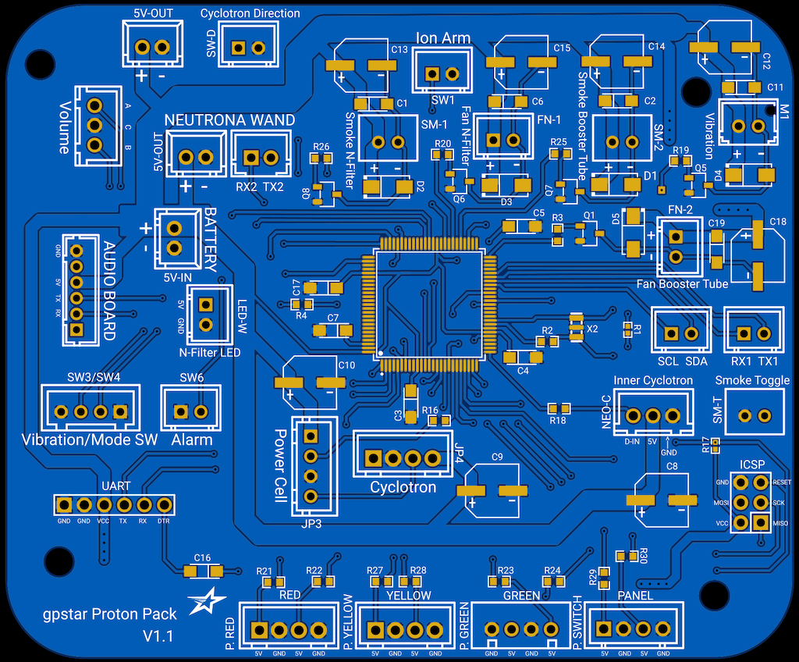

# Pack and Wand PCB Hookup

This guide is part of the kit approach to providing a minimally-invasive upgrade to the stock HasLab controllers. For the Proton Pack all stock connections can be made using the JST-XH connectors on all wiring. For the Neutrona Wand all available connections for JST-PH wiring is present, though a significant amount of wire-cutting will be required to separate the stock controller and re-attach using terminal blocks on the new PCB.

IMPORTANT: This solution still requires 2 of the WavTrigger devices, whether supplied as part of a kit or if obtained on your own. The design of the PCB's will allow for completing the power and communication connections.

## Proton Pack

Connections for the pack should be made according to the table below.

| Label | Pins | Notes |
|-------|------|-------|
| BATTERY 5V-IN | +/\- | Power from battery. **This MUST be a regulated 5V source!** |
| Volume | | Rotary encoder connection for pack volume (crank generator knob) |
| SW-D | | Cyclotron direction switch (optional) |
| SW1 | | Stock connection for main switch under the Ion Arm |
| SW3/SW4 | | Stock connection for cyclotron panel switches, Vibration and Mode SW |
| SW6 | | Stock connection for ribbon cable disconnection alarm |
| SM-T | | Smoke Toggle switch to enable/disable smoke effects (optional) |
| SM-1 | | Smoke effects for N-Filter (optional) |
| FN-1 | | Fan for N-Filter smoke (optional) |
| SM-2 | | Smoke effects for Booster Tube (optional) |
| FN-2 | | Fan for Booster Tube smoke (optional) |
| M1 | | Stock connection for pack vibration motor |
| Power Cell | | Stock connection power cell LED's |
| Cyclotron | | Stock connection cyclotron lens LED's |
| NEO-C | | LED ring light for Inner Cyclotron, aka. "Cake" (optional) |
| P.RED | | Connection for 2x red LED's in cyclotron inner panel (optional) |
| P.YELLOW | | Connection for 2x yellow LED's in cyclotron inner panel (optional) |
| P.GREEN | | Connection for 2x green LED's in cyclotron inner panel (optional) |
| P.SWITCH | | Connection for 2x blue? LED's in cyclotron inner panel (optional) |
| LED-W | | Connection for standalone white LED in N-Filter (optional) |
| WT-5V | +/\- | Power for the pack's WavTrigger |
| RX3/TX3 | | Communication for the pack's WavTrigger |
| WAND 5V-OUT | +/\- | Power for the Neutrona Wand |
| WAND RX2/TX2 | | Communication for the Neutrona Wand |
| 5V-OUT | +/\- | Power for additional accessories (optional) |
| SCL/SDA | | Expansion serial port using I2C (optional) |
| RX1/TX1 | | Serial connection for ??? |
| ICSP | | Header for bootloader updates, DO NOT USE! |
| UART | | Programming header for software updates |

## Neutrona Wand

Connections for the wand should be made according to the table below.

| Label | Pins | Notes |
|-------|------|-------|
| 5V-IN | +/\- | Power from Proton Pack. **This MUST be a regulated 5V source!** |
| TX1/RX1 | | Communication for the Proton Pack |
| WT-5V | +/\- | Power for the wand's WavTrigger |
| TX3/RX3 | | Communication for the wand's WavTrigger |
| Q2 | | Stock connection for barrel LED's |
| SW45/SW4 | | Stock connection for the Intensify button and Activate toggle |
| SW6 | | Orange barrel-end mode/alt switch |
| HAT1 | | Connection for hat LED (optional) |
| HAT2 | | Connection for hat LED (optional) |
| BARREL-LED | | Connection for white wand tip light (optional) |
| A7 | | Barrel retraction switch |
| GND | | Barrel retraction switch |
| D8 | | Slo-Blo VCC |
| GND | | Slo-Blo GND |
| D9 | | Front-left LED VCC |
| GND | | Front-left LED GND |
| A0 | | Upper-right Toggle |
| GND | | Upper-right Toggle |
| D4 | | Lower-right Toggle |
| GND | | Lower-right Toggle |
| R+ | | Rumble (vibration) motor VCC |
| R- | | Rumble (vibration) motor GND |
| VCC | | Power for stock bar graph |
| A1 | | Stock bar graph LED |
| A2 | | Stock bar graph LED |
| A3 | | Stock bar graph LED |
| A4 | | Stock bar graph LED |
| A5 | | Stock bar graph LED |
| D12 | | Stock connection for vent lights |
| D13 | | Stock connection for vent lights |
| VL+ | | VCC for vent lights |
| D6 | | Rotary encoder A |
| D7 | | Rotary encoder B |
| ROT- | | Ground for rotary encoder |
| 5V-OUT | +/\- | Power for additional accessories (optional) |
| SCL/SDA | | Expansion serial port using I2C (optional) |
| ICSP | | Header for bootloader updates, DO NOT USE! |
| UART | | Programming header for software updates |

