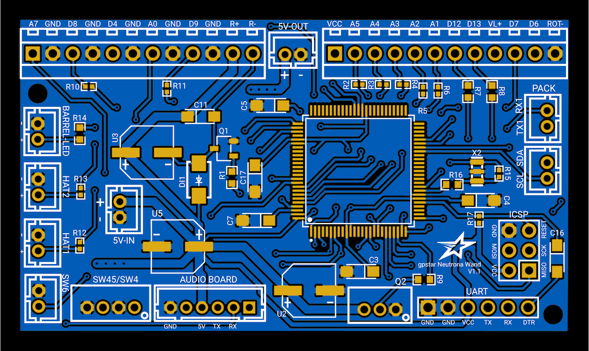

# Pack and Wand PCB Hookup

This guide is part of the kit approach to providing a minimally-invasive upgrade to the stock HasLab controllers. For the Proton Pack all stock connections can be made using the JST-XH connectors on all wiring. For the Neutrona Wand all available connections for JST-PH wiring is present, though a significant amount of wire-cutting will be required to separate the stock controller and re-attach using terminal blocks on the new PCB.

IMPORTANT: This solution still requires 2 of the WavTrigger devices, whether supplied as part of a kit or if obtained on your own. The design of the PCB's will allow for completing the power and communication connections.

## Proton Pack

Connections for the pack should be made according to the table below.

- Ordering aligns with PCB labels or when viewed left-to-right with the connector keyhole at the bottom.
- Pins denoted D# correspond to the internal code and connection to the controller chip.
- Ground may be designated as "GND" or simply "-".

### Stock Connectors

| Label | Pins | Notes |
|-------|------|-------|
| BATTERY 5V-IN | +/\- | Power from battery. **This MUST be a regulated 5V source!** |
| Volume | D3/GND/D2 | Rotary encoder connection for pack volume adjusted via crank generator knob |
| SW1 | D31/GND | Stock connection for main switch under the Ion Arm |
| SW3/SW4 | GND/D27/D25/GND | Stock connection for cyclotron panel toggles, Vibration and Mode Switch |
| SW6 | GND/D23 | Stock connection for ribbon cable disconnection alarm (wire order does not matter) |
| M1 | GND/VCC | Stock connection for pack vibration motor (D45) |
| Power Cell | VCC/D53/GND/CYC | Stock connection for power cell LED's (continues to cyclotron) |
| Cyclotron | D43/GND/PC/VCC | Stock connection cyclotron lens LED's (continues from power cell), includes lid sensor |

### Special Connectors

| Label | Pins | Notes |
|-------|------|-------|
| WAV TRIGGER | GND/NC/VCC/TX/RX/NC | Communication and Power for the pack's Wav Trigger |
| WAND 5V-OUT | +/\- | Power to the Neutrona Wand |
| WAND (Serial) | RX2/TX2 | Serial communication for the Neutrona Wand |
| ICSP | DO NOT USE! | Reserved header for bootloader updates (reserved) |
| UART | See Below | Programming header for software updates (optional) |

For connecting the UART pins, use a suitable FTDI chip such as the same **FTDI Basic 5V** chip used for programming the WavTrigger. Connect each pin to the respective label on each side. If using an FTDI to USB cable, the DTS pin will connect to the RTS pin. The CTS pin on most FTDI headers will not be used (connects to GND on the board).

### Optional Connectors

| Label | Pins | Notes |
|-------|------|-------|
| SW-D | D29/GND | Cyclotron direction switch (wire order does not matter) |
| SM-T | D37/GND | Smoke Toggle switch to enable/disable smoke effects (wire order does not matter) |
| SM-1 | \-/+ | Smoke effects for N-Filter (D39) |
| FN-1 | \-/+ | Fan for N-Filter smoke (D33) |
| SM-2 | \-/+ | Smoke effects for Booster Tube (D35) |
| FN-2 | \-/+ | Fan for Booster Tube smoke (D50) |
| NEO-C | D13/VCC/GND | LED ring light for Inner Cyclotron "Cake" |
| P.RED | D4/GND/D5/GND | Connection for 2x red LED's in cyclotron inner panel |
| P.YELLOW | D6/GND/D7/GND | Connection for 2x yellow LED's in cyclotron inner panel |
| P.GREEN | D8/GND/D9/GND | Connection for 2x green LED's in cyclotron inner panel |
| P.SWITCH | GND/D11/GND/D10 | Connection for 1x red LED and 1x yellow LED in the cyclotron inner panel beneath the 2 switches that toggle vibration and the Proton Pack year mode |
| LED-W | D46/GND | Connection for standalone white LED in N-Filter |
| 5V-OUT | +/\- | Power for additional accessories |
| SCL/SDA | SCL/SDA | Expansion serial port using I2C |
| RX1/TX1 | RX1/TX1 | Expansion serial port |

## Neutrona Wand

Connections for the wand should be made according to the table below.

- Ordering aligns with PCB labels or when viewed left-to-right with the connector keyhole at the bottom.
- Pins denoted A#/D# correspond to the internal code and connection to the controller chip.
- Ground may be designated as "GND" or simply "-".

### Stock Connectors (JST-PH)

| Label | Pins | Notes |
|-------|------|-------|
| 5V-IN | +/\- | Power from Proton Pack. **This MUST be a regulated 5V source!** |
| Q2 | VCC/D10/GND | Stock connection for addressable barrel LED's |
| SW45/SW4 | GND/D2/GND/D3 | Stock connection for the Intensify button and Activate toggle |
| SW6 | A6/GND | Stock connection for the orange wand-end mode/alt switch |

### Stock Connectors (Terminal Blocks)

| Label/Pin | Color | Notes |
|-----------|-------|-------|
| A7 | Orange | Barrel extension switch (wire order does not matter) |
| GND | Orange | Barrel extension switch (wire order does not matter) |
| D8 | Red | Slo-Blo VCC |
| GND | Black | Slo-Blo GND |
| D4 | Brown | Lower-right Toggle (wire order does not matter) |
| GND | Brown | Lower-right Toggle (wire order does not matter) |
| A0 | Red | Upper-right Toggle (wire order does not matter) |
| GND | Red | Upper-right Toggle (wire order does not matter) |
| D9 | Red | Clippard LED (Top Left) VCC |
| GND | Yellow | Clippard LED (Top Left) GND |
| R+ | Red | Rumble (vibration) motor VCC |
| R- | Black | Rumble (vibration) motor GND |
| VCC | Blue | Power for stock bar graph |
| A1 | Brown | Stock bar graph LED |
| A2 | Red | Stock bar graph LED |
| A3 | Orange | Stock bar graph LED |
| A4 | Yellow | Stock bar graph LED |
| A5 | Green | Stock bar graph LED |
| D12 | White | Blinking top right LED |
| D13 | Black | White vent light LED |
| VL+ | Red | VCC for vent lights |
| D7 | Orange | Rotary encoder B |
| D6 | Red | Rotary encoder A |
| ROT- | Brown | Ground for rotary encoder |

### Special Connectors

| Label | Pins | Notes |
|-------|------|-------|
| PACK (Serial) | TX1/RX1 | Serial communication for the Proton Pack |
| WAV TRIGGER | GND/NC/VCC/TX/RX/NC | Communication and Power for the wands's Wav Trigger |
| ICSP | DO NOT USE! | Programming header for bootloader updates (reserved) |
| UART | See Below | Programming header for software updates (optional) |

For connecting the UART pins, use a suitable FTDI chip such as the same **FTDI Basic 5V** chip used for programming the WavTrigger. Connect each pin to the respective label on each side. If using an FTDI to USB cable, the DTS pin will connect to the RTS pin. The CTS pin on most FTDI headers will not be used (connects to GND on the board).

### Optional Connectors

| Label | Pins | Notes |
|-------|------|-------|
| HAT1 | D22/GND | Connection for hat LED |
| HAT2 | D23/GND | Connection for hat LED |
| BARREL-LED | D24/GND | Connection for white wand tip light |
| 5V-OUT | +/\- | Power for additional accessories |
| SCL/SDA | SCL/SDA | Expansion serial port using I2C |

**Note:** If using the [28-segment bargraph](BARGRAPH.md), power may be delivered via the 5V-OUT while the SCL/SDA serial connection will provide data/control.

