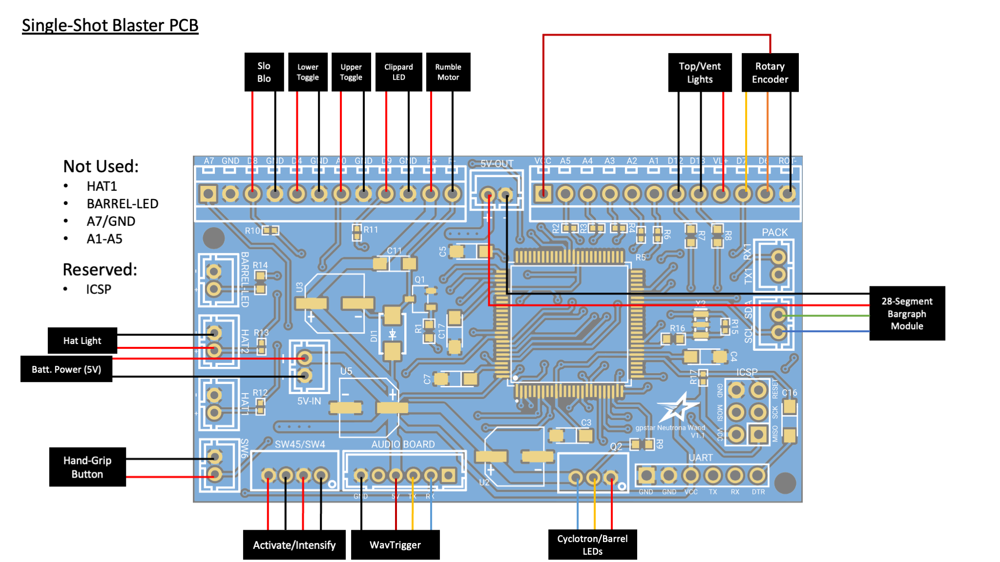
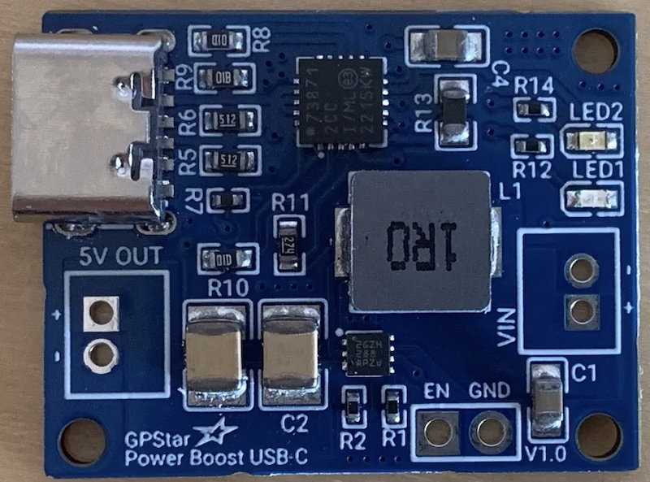

# Single-Shot Blaster

### aka. Wrist Thrower, Compact Arm Thrower, Frozen Empire Arm Gauntlet

It may go by many names, though we know it as the arm-mounted Neutrona Wand as seen in Frozen Empire. For purposes of this guide we'll use the official name straight from the source when [Adam Savage met the propmaster for a look at the device](https://www.youtube.com/watch?v=2YypkmcPjQ8). This guide covers the use of components as typically used for a standard Neutrona Wand, repurposed to bring life to this device.

## External Shell - Completed or Models

There is no shortage of resources for the device shell itself, as it has been modeled and remixed by several members of the Ghostbusters community. Below are some of the found sources offering either the 3D files or pre-printed parts. If you know of another resource for either please let us know and we'll update this list.

- [3D Files by EctoLabs](https://github.com/EctoLabs/wrist-thrower)
- [3D Files by Right Coast Creative (Craig Rivest, aka. @scoleri_brothers)](https://rightcoastcreative.com/ghostbusters/p/frozen-empire-arm-gauntlet)
- [Ghostbusters Frozen Empire Compact Arm Thrower by ShapeforgeProps](https://www.etsy.com/listing/1700904381/ghostbusters-frozen-empire-compact-arm)

## Bill of Materials

The following list of parts will allow you to assemble the electronics and internal components to run the device. For a complete list of additional cosmetic parts and advice on assembly of the external components please see the incredibly detailed [Build Guide on GBFans](https://www.gbfans.com/forum/viewtopic.php?t=51824) by EctoLabs.

| Qty | Desc | Use | Link |
|-----|------|-----|------|
|  1  | GPStar Neutrona Wand PCB | Main device controller | [Direct from GPStar](https://gpstartechnologies.com/products/gpstar-neutrona-wand) |
|  1  | GPStar Audio Controller | Sound driver with amplifier | [Direct from GPStar](https://gpstartechnologies.com/products/gpstar-audio) |
|  2  | GPStar 7-LED Jewel | RGB lighting for barrel and cyclotron | [Direct from GPStar](https://gpstartechnologies.com/products/gpstar-jewel) |
|  1  | GPStar Power Boost USB-C | For battery1 power + charging | [Direct from GPStar](https://gpstartechnologies.com/products/gpstar-power-boost-usb-c) |
|  1  | 4Ohm 40mm 3W Speaker | Primary speaker (under heatsink) | [https://a.co/d/bNin47P](https://a.co/d/bNin47P) |
|  1  | KY-040 Rotary Encoder | Top rotary dial | [https://a.co/d/0wo1bSq](https://a.co/d/0wo1bSq) |
|  1  | 12mm Momentary Push Button | Hand grip button | [https://a.co/d/8QxaSBm](https://a.co/d/8QxaSBm) |
|  1  | DC Coreless Vibration Motors | Vibration feedback | [https://a.co/d/iMxmbfp](https://a.co/d/iMxmbfp) |
|  3  | Mini SPST Toggle Switches | Device switches | [https://a.co/d/84qX5Yz](https://a.co/d/84qX5Yz) |
|  2  | Mini Momentary Switches | Device buttons | [https://a.co/d/6e83Clb](https://a.co/d/6e83Clb) |
|  1  | 15mm x 5mm Convex Lens | Barrel lens | [https://a.co/d/8Mr8ZMc](https://a.co/d/8Mr8ZMc) |
|  5  | 5MM 3V Prewired LEDs | Various colored lights | [https://a.co/d/hqEyph8](https://a.co/d/hqEyph8) |
|  1  | OPTIONAL: Micro UART Programmer | For built-in programming via USB | [https://a.co/d/ibHTVA5](https://a.co/d/ibHTVA5) |
|  1  | Micro Slide Switch | Turn battery output on/off | [https://a.co/d/hVaKDSl](https://a.co/d/hVaKDSl) |
|  1  | 3.7V LiPo or Li-Ion Battery2 | Rechargeable lithium battery (min 2500mAh) | [https://a.co/d/gQlJsY0](https://a.co/d/gQlJsY0) [https://a.co/d/gML6MVC](https://a.co/d/gML6MVC) |

1 While most Lithium batteries come with a JST-PH connector by default, the polarity may be reversed. Please observe the correct polarity for the booster/charger device! With the silver tabs up and the JST socket facing toward you, the positive (red) lead should be on the right. There will be -/+ markings on the power connector to the GPStar Power Boost to help you confirm BEFORE plugging in the battery.

2 Battery power must be at least 2500mAh (2.5Ah) to provide sufficient power to the booster. This device will draw around 0.8A at full volume.

## PCB Connection Details

Connections for the device should be made according to the tables below.

- Ordering aligns with PCB labels or when viewed left-to-right with the connector keyhole at the bottom right.
- Pins denoted A#/D# correspond to the internal code and connection to the controller chip.
- Ground may be designated as "GND" or simply "-".

### Socket Connections (JST-PH)

| Label | Pins | Notes |
|-------|------|-------|
| 5V-IN | +/\- | 2-pin JST-PH for power from internal battery **This MUST be a regulated 5V source!** |
| Q2 | VCC/D10/GND | 3-pin JST-PH connection for all addressable LEDs3 |
| SW45/SW4 | GND/D2/GND/D3 | 4-pin JST-PH connection for the Intensify button and Activate toggle |
| SW6 | GND/A6 | 2-pin JST-PH connection for the hand-grip mode/fire switch |

3 The 3-pin connector for the LEDs will connect to a pair of 7-LED "jewel" boards as built by GPStar Technologies. These will be installed and addressed by the controller in the order of the barrel first, followed by the cyclotron.

### Wire Connectors (Terminal Blocks)

| Label/Pin | Notes |
|-----------|-------|
| D8 | Slo-Blo VCC |
| GND | Slo-Blo GND |
| D4 | Lower-right Toggle (wire order does not matter) |
| GND | Lower-right Toggle (wire order does not matter) |
| A0 | Upper-right Toggle (wire order does not matter) |
| GND | Upper-right Toggle (wire order does not matter) |
| D9 | Clippard LED (Top Left) VCC |
| GND | Clippard LED (Top Left) GND |
| R+ | Rumble (vibration) motor VCC |
| R- | Rumble (vibration) motor GND |
| VCC | Power (+) for rotary encoder |
| D12 | Blinking top right LED |
| D13 | White vent light LED |
| VL+ | VCC for top/vent lights |
| D7 | Rotary encoder B (DT) |
| D6 | Rotary encoder A (CLK) |
| ROT- | Ground for rotary encoder |

### Special Connectors

| Label | Pins | Notes |
|-------|------|-------|
| HAT2 | GND/D23 | Connection for the wand box hat LED.  The left (top in the photo) pin is GND, the right (bottom in the photo) pin is D23 provides 5V and has a 150Ω resistor connected to it.  `Connector type: JST-PH`  `Do not draw more than 40mA from this connector.`|
| SCL/SDA | SCL/SDA | Reserved for the [28-segment bargraph](BARGRAPH.md) using I2C.  `Connector type: JST-PH`|
| 5V-OUT | +/\- | Power for the bargraph.  `Connector type: JST-PH` |
| AUDIO BOARD | GND/NC/VCC/TX/RX/NC | Communication and Power for the wands's GPStar Audio or WAV Trigger.  `Connector type: JST-PH` |
| ICSP | DO NOT USE! | Programming header for bootloader updates (reserved).  `Connector type: Header pins` |
| UART | See Below | Programming header for software updates (optional).  `Connector type: Header pins` |

For connecting the UART pins, use a suitable FTDI chip such as the same **FTDI Basic 5V** used for programming the GPStar Audio or WAV Trigger. Pins on the PCB should align with with the standard wire order for FTDI-to-USB cables which use a single Dupont 6-pin connector. Observe these common colors and notes to ensure proper orientation:

- The ground pin will typically be a black wire, while VCC will typically be red.
- The DTR pin on the PCB will connect to a wire labelled either DTR or RTS.
- Any wire labelled CTS will be connected to the 2nd pin labelled GND on the PCB.
- Be careful to not reverse the connector!

## Battery Power

Per the BOM above, use of a 2000mAh or higher battery is crucial for supplying enough power for a full day of use. This **MUST be a Lithium battery** (either LiPo or Li-Ion) with a 3.7V output. The charging circuit is intended for use with Lithium batteries only. **Again, Lithium!**

Both the GPStar Power Boost device for boosting and charging your battery offer 2 pairs of pins which are of importance here:

### Power Switch (Optional, but Recommended)

Adding a switch to the GPStar Power Boost device will allow you to fully turn off the device without draining the rechargeable battery. By default the device is always on and converting the 3.7V source to 5V for the electronics.

**EN** - This is the 'enable' pin. To turn off the booster, connect this pin to ground. The switch can be as small as you like, it is just a signal. When the chip is disabled the output is completely disconnected from the input.

**GND** - This is the shared ground connection which may be used with the 'EN' pin.

### Boosted Output

**5V OUT** - This is the boosted output. The pin closest to the USB-C port is the (+) while the further pin is (-).

## Operation Guide

Full guide will be written as features are completed and operation is determined.

## Firmware Updates

Please follow the standard [FLASHING guide](FLASHING.md) using the `binaries/blaster/SingleShot.hex` firmware file.