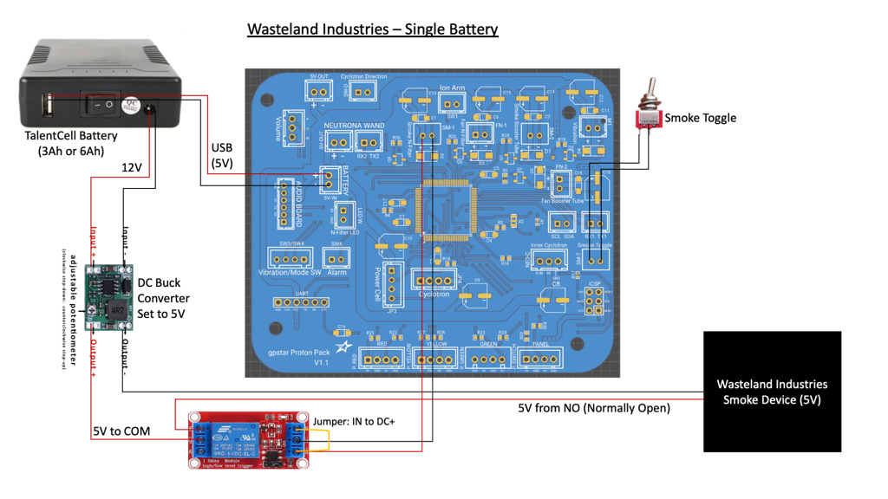
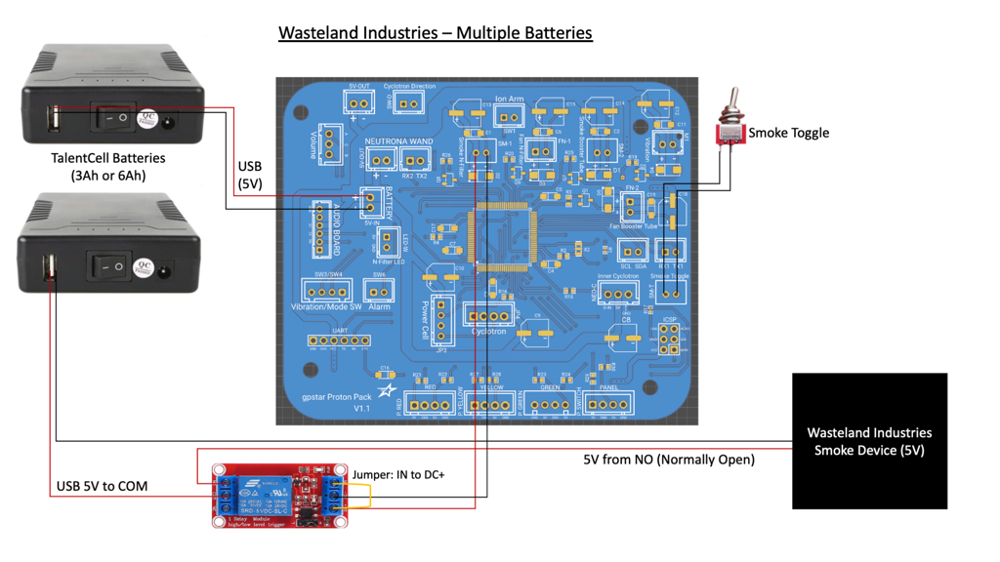

# Smoke Effects

Below are some examples of how to implement smoke into your Proton Pack. There are 4 outputs on the DIY Arduino Mega and gpstar Proton Pack PCB that are configured to go 5V HIGH during smoke effect phases:

- Smoke1 `SM-1 - gpstar Proton Pack PCB` or `Pin 39 - Arudino Mega` aka. N-Filter Smoke
- Smoke2 `SM-2 - gpstar Proton Pack PCB` or `Pin 35 - Arduino Mega` aka. Booster Smoke
- Fan1 `FN-1 - gpstar Proton Pack PCB` or `Pin 33 - Arduino Mega` aka. N-Filter Fan
- Fan2 `FN-2 - gpstar Proton Pack PCB` or `Pin 50 - Arduino Mega` aka. Booster Fan

**Note: Fan1 is set to go off during overheat sequence only. It is useful for pushing smoke through the N-Filter**

**Note: Fan2 is set to go off at the same time as Smoke2. This was requested if you want to repurpose Smoke2 from the booster tube for another purpose. For the purpose of smoke in the booster tube, this is not required.**

Each pin is designed to make use of a transistor to activate pumps, external devices, etc.

**WARNINGS**

- For `gpstar Proton Pack PCB boards`, the `SM-1, SM-2, FN-1 and FN-2` connectors provide 5V of power and can power devices such as pumps and fans. However do not connect any device which draws more than 1 Amp of current. Use a relay module (such as [this](https://a.co/d/4BXJ9J1) or [this](https://a.co/d/iEuGPYK)) to drive such devices.
	- For devices which require a dedicated power source (such as 12V) ALWAYS use a relay module.
- For DIY Arduino Users: `DO NOT DRAW MORE THAN 40mA FROM AN ARDUINO MEGA PIN`. Use a transistor setup or relay module as previously noted.

## Schematic Examples

The following diagrams demonstrate the connections required for several smoke devices. These have been either directly verified or confirmed as "expected" by their respective makers. Other kits may be used, provided they adhere to the use of a relay for applying power directly to a vape coil device.

## Booster Tube Example

*Provided by gpstar*

For this example, I used the following parts:

- 1 - [Air Pump and Vacuum DC Motor 4.5V](https://www.adafruit.com/product/4699) 
- 1 - [Vape Pen](https://www.joyetech.com/product/eroll-mac/)
- [Silicone Tubing for Air Pumps](https://www.adafruit.com/product/4661)
- 1 - [1n4001 Diode](https://www.adafruit.com/product/755)
- 1 - 330 ohm Resistor -> Refer to [Bill of Materials](BOM.md)
- 1 - PN2222 NPN Transitor -> Refer to [Bill of Materials](BOM.md)
- 100% Pure Vegetable Glycerine for the vape pen to generate smoke

This will be using SMOKE2, which is Pin #35 on the Arduino Mega or the SM-2 connector on the gpstar Proton Pack PCB. In the pack schematic diagrams if you are using an Arduino Mega, refer to SMOKE2 setup on the breadboard for the connection guide in the PACK instructions for more detail instructions. A quick rundown on what happens is, Pin #35 on the Arduino Mega or the SM-2 connector on the gpstar Proton Pack PCB goes high during smoke events, which makes the transistor open and the connected DC pump will then have 5V power which begins to operate. I removed the original battery compartment in the HasLab motherboard, so I have quick access to the vape pen from the battery door on the motherboard when it needs recharging and refilling with more vegetable glycerine.

Here are some photos the basic smoke setup. 

## N-Filter Example

*Provided by JustinDustin*

This also uses a vape coil approach with a 6V mini air pump, and can be run from a 5V relay module. Alternatively, any smoke kit which offers a combination of vape coil plus air pump which can run on 5V may be substituted. The content below will assume use of a DIY approach and fully examines the creation and fitment of the following components.

- [Kanger T2 Clearomizer Tank (Pack of 5)](https://www.ecigmafia.com/products/kanger-t2-clearomizer-tank-pack-of-5.html) - Note that for many US states the online ordering of vaping supplies may be restricted. This supplier has successfully shipped to Georgia, which is one such restricted state. Be sure to make sure the supplier can ship to your state before ordering!
- [6V Mini Air Pump](https://a.co/d/0gUOvwu) - Sits below the N-filter to push smoke out
- [5V Relay Module with Optocoupler](https://a.co/d/h0b5SN5) - Must use a HIGH signal to turn the relay on!
- [2W 1 Ohm Axial Lead Metal Film Resistor](https://a.co/d/6BQW8AU) - Reduces voltage/power to vape coil
- [DC Buck Converter](https://a.co/d/7GAJham) - For reducing voltate when using the 12V output of the Talentcell
- [50mm 5V Blower Fan](https://a.co/d/iaizRpN) - Ideal for the small space and limits cutting of the pack
- [3mm ID Silicone Tubing](https://a.co/d/5PaWppP) - For connecting the vape coil to the air pump
- [4mm ID Silicone Tubing](https://a.co/d/7qeekAG) - For connecting the vape coil to the N-filter
- [Push Connect Fitting 6mm ID](https://a.co/d/dLrPN3C) - For connecting silicone tubing to the vape coil
- [Vegetable Glycerine & Propylene Glycol 70/30](https://a.co/d/5PaWppP) - Safe, non-toxic, and mostly odorless

**Electronics**

For basic instructions on creating the smoke machine itself, you may follow [this video tutorial](https://www.youtube.com/watch?v=uDISX8MMLak) which essentially pairs the clearomizer tank with the air pump and provides the wiring for that module. You can successfully run both devices off of a single pair of shared positive and negative wires.

While the pump will work perfectly well at 5V, the vape coil (T2 Clearomizer style) uses a 1.8 ohm coil and wants about 3.6-4V to make decent smoke, and can potentially draw over 2 Amps of power. The solution here is to add a metal-film resistor to the positive lead on the vape coil to reduce the power demands and prevent it from burning out prematurely.

For the 5V relay, this was paired with a dedicated DC buck converter taking 12V from a Talentcell battery down to 5V. A toggle switch (optional) was used completely cut the power to the converter and anything downstream from it. The relay module needs 5V and requires 60mA to activate, and so this can be safely used with the provided smoke pins noted above.

To activate and trigger with only the 2 wires provided by the SMOKE1 pin #39 on the Arduino Mega or SM-1 connector on the gpstar Proton Pack PCB, connect the positive (+) from the smoke pin to both the DC+ and IN terminals of the relay module (a small length of wire can be used as a jumper). Connect the negative (\-) to the DC- terminal. The purpose of this relay is to electrically isolate the power source for the vape coil and air pump, which may require 1 Amp of current (or more) and a voltage which differs from the 5V used by the controller. This allows you to also use a completely separate battery for smoke if you wish, as there is no need for a common ground or other connection to the microcontroller.

The vape coil and air pump should have their positive leads connected together, and the negative leads connected together. The positive OUT terminal of the DC buck converter is connected to the NO (normally-open) terminal on the relay module while the combined positive leads are connected to the COM (common) terminal. The negative leads should connect directly to the DC buck converter's negative OUT terminal.

**Installation**

For this phase of the process it does not matter how you generate smoke, only how you allow it to exit the pack. This will make use of the SM-1, FN-1, and LED-W ports on the gpstar PCB controller for the Proton Pack. Silicone air line tubing will be used with a push-connect fitting attached to the end of the vape tank and fed to the center of the cone under the filter. The middle of the cone is drilled out to allow the tubing to come up from below--which means drilling a hole into the base under the cone for the tubing plus a small hole for the blower fan. The blower fan is then simply placed vertically under the base of the cone and will help push any smoke out the top of the N-Filter. I used some scrap EVA foam and hot glue to keep the fan in place, oriented vertically under the N-Filter.

The following 3D models are provided for those able to print components for their pack. These are designed to fit perfectly within the Hasbro equipment and provide a familiar look to the end solution for getting smoke out of your pack.

- [N-Filter Blower Mount](stl/pack/N-Filter Smoke/N-Filter Blower.stl) - Holds the 50mm blower in an upright position
- [N-Filter Blower Mount](stl/pack/N-Filter Smoke/N-Filter Cone.stl) - Replaces the stock cone and allows smoke and air to exit
- [N-Filter Blower Mount](stl/pack/N-Filter Smoke/N-Filter Template.stl) - Used to mark where to cut into the pack for smoke tubing and blower air hole

One issue encountered is that within the N-Filter portion of the Cyclotron Lid is a screw post which sits directly over the cone and will block smoke flow. Using a small drill bit, it is possible to slowly drill out 2-3 holes within the plastic screw post which will let smoke enter the top of the N-Filter, and will be vented by the blower fan via the screened holes. The preview below shows how effective the fan can be at pushing the smoke generated.

