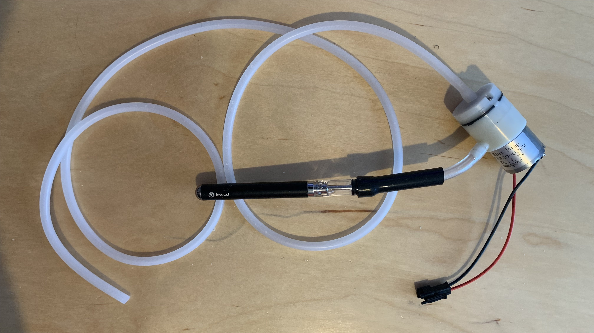
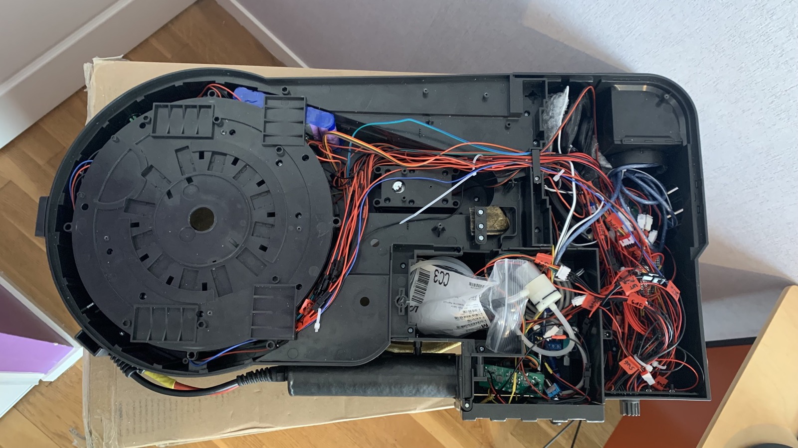
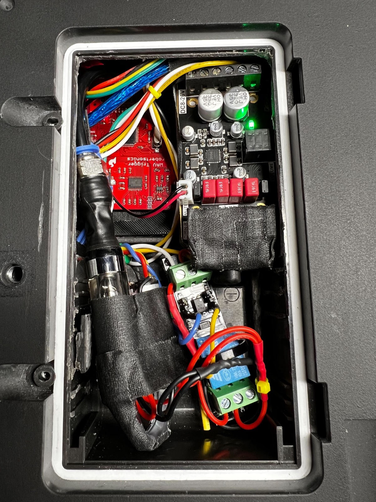

# Smoke Configuration

Below are some examples of how to implement smoke into your Proton Pack.

There are 3 pins on the Mega configured to go HIGH during smoke effect phases. Smoke1 -> Pin 39, Smoke2 -> Pin 35 and Fan 1 - Pin 33. With a simple transistor setup, you can activate pumps, external smoke machine devices, etc.

**WARNING: DO NOT DRAW MORE THAN 40ma FROM A PIN. Use a transistor setup if you need more power.**

## Booster Tube Example

*Provided by gpstar*

For this example, I used the following parts:

- 1 - [Air Pump and Vacuum DC Motor 4.5V](https://www.adafruit.com/product/4699) 
- 1 - [Vape Pen](https://www.joyetech.com/product/eroll-mac/)
- [Silicone Tubing for Air Pumps](https://www.adafruit.com/product/4661)
- 1 - [1n4001 Diode](https://www.adafruit.com/product/755)
- 1 - 330 ohm Resistor -> Refer to main parts list
- 1 - PN2222 NPN Transitor -> Refer to main parts list
- 100% Pure Vegetable Glycerine for the vape pen to generate smoke

I will be using SMOKE2, which is Pin #39 on the Mega. In the pack schematic diagrams, refer to SMOKE2 setup on the breadboard for the connection guide in the PACK instructions for more detail instructions. A quick rundown on what happens is, Pin #39 on the Mega goes high during smoke events, which makes the transistor open and the connected DC pump will then have 5V power which begins to operate. I removed the original battery compartment in the HasLab motherboard, so I have quick access to the vape pen from the battery door on the motherboard when it needs recharging and refilling with more vegetable glycerine.

Here are some photos the basic smoke setup. 

## N-Filter Example

*Provided by JustinDustin*

This also uses a vape pen approach with a 3V mini aquarium pump, and can be run from a 3V relay module. The vape pen (T2 Clearomizer style) uses a 1.8 ohm coil and wants about 3.6-4V to make decent smoke. Meanwhile, the pump doesn't like much above 3V and 4V is pushing it. Since both run for short bursts you can split the difference and use 3.8V which is about right for decent smoke AND to push everything out of the cartridge and so far only the coil gets the hottest of all the components.

- [Kanger T2 Clearomizer Tank (Pack of 5)](https://www.ecigmafia.com/products/kanger-t2-clearomizer-tank-pack-of-5.html) - Note that for many US states the online ordering of vaping supplies may be restricted. This supplier has successfully shipped to Georgia, which is one such restricted state. Be sure to make sure the supplier can ship to your state before ordering.
- [3V Aquarium Mini Air Pump](https://a.co/d/ghiL09S)
- [3V Relay Module with Optocoupler](https://a.co/d/a3myUJs)
- [50mm 5V Blower Fan](https://a.co/d/iaizRpN)
- [3mm ID Silicone Tubing](https://a.co/d/5PaWppP)
- [Vegetable Glycerine & Propylene Glycol 70/30](https://a.co/d/5PaWppP)
- [1/4" (6mm) OD Airline Tubing w/ Connectors](https://a.co/d/6C7jndS)

For basic instructions on creating the smoke machine itself, you may follow [this video tutorial](https://www.youtube.com/watch?v=uDISX8MMLak) which essentially pairs the clearomizer tank with the air pump and provides the wiring for that module. You can successfully run both devices off of a single pair of shared positive and negative wires.

For the 3V relay, this was paired with a dedicated DC buck converter taking 12V from a Talentcell battery down to the 3.8V, and runs through a toggle so you can completely cut the power to the converter and anything downstream from it. The relay module has an optoisolator and also allows for powering the relay coil from a separate source from the signal, so using  3.8V power it's possible to run both the relay coil and the smoke/pump combo (the relay controls the +3.8V to the smoke/pump combo). This allows the Arduino to send a signal (found to work with 3.3V or 5V) at any time to trigger the relay, but if there's no power from the buck converter via the toggle it's just a no-op (does nothing). This setup with the relay allows the nearly 1amp needed by the vape coil (and pump), so at worst it may only burn out the DC buck converter as the Arduino remains electrically isolated. And if you wanted to use a separate power source just for smoke effects then you can easily do that as well (so long as you have a common ground between. your power sources).

The relay module uses power from the dedicated buck converter set to 3.8V to power both the coil for the relay as well as the smoke device. This fully separates the electrical connections from the Arduino (which normally outputs 5V and 20ma to each pin) from the smoke solution which is lower voltage but higher amperage. Per the diagram above, the relay module with the optocoupler allows a 3V-ish connections to the V+ pin on the JP1 and a ground connection on V- for JP2. The positive (power) is split between that V+ pin and the COM (common) on the relay, while the ground is split between the V- pin and the smoke device. The vape+pump combo's positive power is then connected to the NO (normally-open) terminal. In order to trigger the smoke device, there must be a signal sent to the relay which will be from the Smoke1 Pin #39 on the Arduino Mega. The pin must be connected to the VCC terminal with a jumper from VCC to the IN terminal. A shared ground connection is made from the Arduino to the GND terminal. This allows the Arduino's Pin 39 to go HIGH when needed, which will trigger the relay module.

It is possible to fit this smoke solution into the existing battery compartment, though removal of some material may be required. This allows the vape tank to be refilled easily without fully removing the back of the pack. As seen here a portion of the battery tray was removed to vit some audio components while the relay and vape tank and air pump can fit in the bottom.

To deliver smoke to the N-Filter, air line tubing is used with a quick-connect attached to the end of the vape tank and fed to the center of the cone under the filter. The middle of the cone is drilled out to allow the tubing to come up from below--which means drilling a hole into the base under the cone for the tubing plus a small hole for the blower fan. The blower fan is then simply placed under the base for the cone and will help push any smoke out the top of the N-Filter.

One issue encountered is that within the N-Filter portion of the cyclotron lid is a screw post which sits directly over the cone and will block smoke flow. Using a small drill bit, it is possible to slowly drill out 2-3 holes within the plastic screw post which will let smoke enter the top of the N-Filter, and will be vented via the screened holes by the blower fan.

