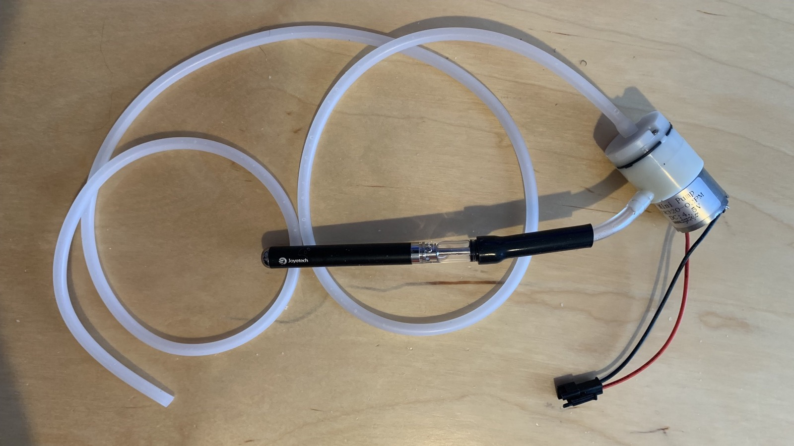

# DIY Smoke Generator

This guide is intended to explain the process of creating your own smoke generator for the Proton Pack. For installation and connections to the gpstar Pack PCB or Arduino Mega please [follow this guide](SMOKE.md).

## Booster Tube Example

*Provided by gpstar*

For this solution, the following parts were used:

- [Air Pump/Vacuum DC Motor 4.5V](https://www.adafruit.com/product/4699) 
- [Vape Pen w/ Battery](https://www.joyetech.com/product/eroll-mac/)
- 100% Pure Vegetable Glycerine for the vape pen to generate smoke

This will be attached to the Smoke2 connector per the explanation in the main smoke guide. The vape pen used in this solution contains its own battery and automatically turns on when air is pulled through the device. The air pump is configured in reverse to pull air through the pen and connected using silicone tubing and heatshrink tubing. No fan is required for this solution.

## N-Filter Example

*Provided by JustinDustin*

This also uses a vape coil approach with a 6V mini air pump, and can be run from a 5V relay module. The content below will assume use of a DIY approach and fully examines the creation and fitment of the following components.

- [Kanger T2 Clearomizer Tank (Pack of 5)](https://www.ecigmafia.com/products/kanger-t2-clearomizer-tank-pack-of-5.html) - Note that for many US states the online ordering of vaping supplies may be restricted. This supplier has successfully shipped to Georgia, which is one such restricted state. Be sure to make sure the supplier can ship to your state before ordering!
- [6V Mini Air Pump](https://a.co/d/0gUOvwu) - Sits below the N-filter to push smoke out
- [2W 1 Ohm Axial Lead Metal Film Resistor](https://a.co/d/6BQW8AU) - Reduces voltage/power to vape coil
- [50mm 5V Blower Fan](https://a.co/d/iaizRpN) - Ideal for the small space and limits cutting of the pack
- [3mm ID Silicone Tubing](https://a.co/d/5PaWppP) - For connecting the vape coil to the air pump
- [Push Connect Fitting 6mm ID](https://a.co/d/dLrPN3C) - For connecting silicone tubing to the vape coil
- [Vegetable Glycerine & Propylene Glycol 70/30](https://a.co/d/5PaWppP) - Safe, non-toxic, and mostly odorless
- [DC Buck Converter](https://a.co/d/7GAJham) - For reducing voltate when using the 12V output of the Talentcell

**Electronics**

For basic instructions on creating the smoke machine itself, you may follow [this video tutorial](https://www.youtube.com/watch?v=uDISX8MMLak) which essentially pairs the clearomizer tank with the air pump and provides the wiring for that module. You can successfully run both devices off of a single pair of shared positive and negative wires.

While the pump will work perfectly well at 5V, the vape coil (T2 Clearomizer style) uses a 1.8 ohm coil and wants about 3.6-4V to make decent smoke, and can potentially draw over 2 Amps of power. The solution here is to add a metal-film resistor to the positive lead on the vape coil to reduce the power demands and prevent it from burning out prematurely.