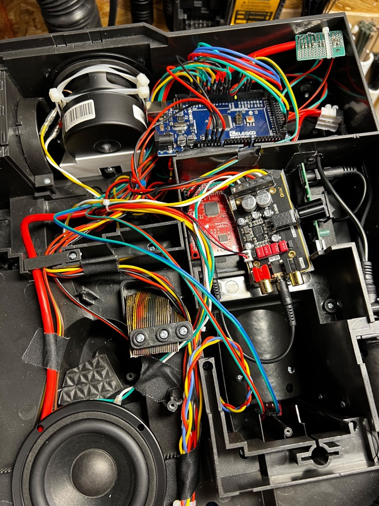
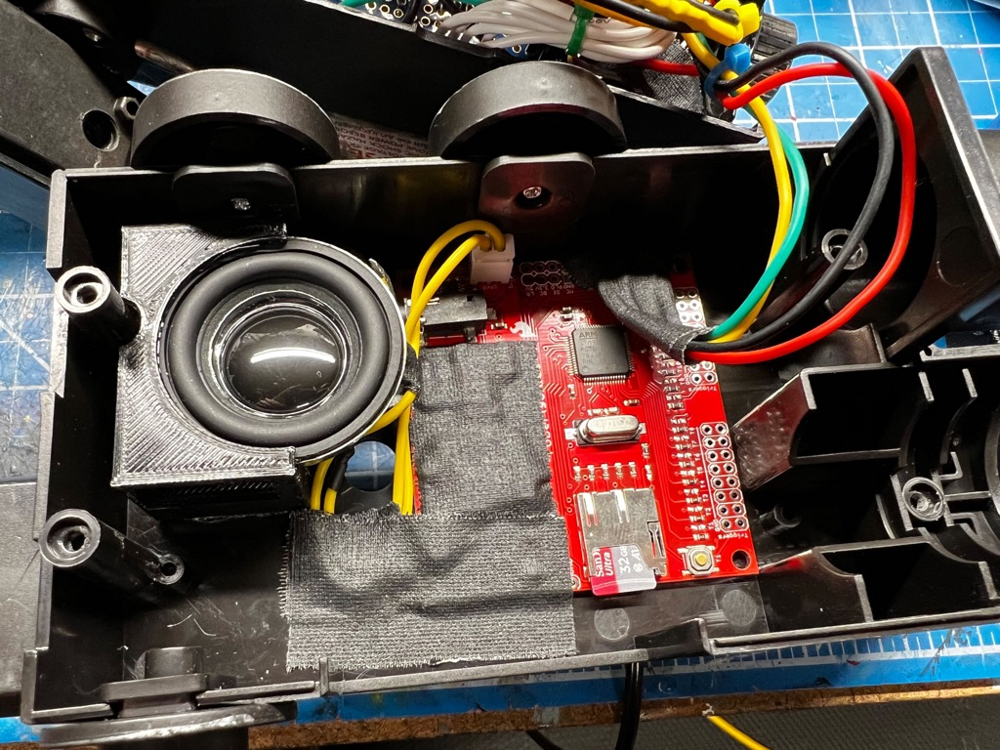

# Sound Output Options

"Listen! You smell something?" - Ray Stantz

Sound is a huge component of this build and the options are relatively open for how best you wish to proceed. For the wand you will be limited by space, but for the pack you can go as big and as bold as you wish. The following options should give you an idea of what is possible with hardware given certain space constraints.

For instructions on loading audio files to a microSD card, please see the [AUDIO Guide](AUDIO.md).

## Audio Controllers

Sounds are output via one of the supported polyphonic WAV audio controllers: Robertsonics WAV Trigger or GPStar Audio. The former is a 3rd-party component originally included with all GPStar kits up until early 2024, while the latter is a fully custom solution which is part of the GPStar family of controllers for your cosplay needs.

**Firmware Compatibility**

The compatibility matrix below notes whether a device is compatible with major versions of the GPStar software for the Proton Pack and Neutrona Wand controllers. The version number inside each cell is the minimum firmware version required or strongly recommended for the respective device.

| Audio Device | v1.x | v2.x | v3.x | v4.x | v5.0.x | v5.1.x | v5.4.x |
|-------------------|------|------|------|------|------|------|------|
| Robertsonics WAV Trigger  | v134 | v134 | v140 | v140 | v140 | v140 | v140 |
| GPStar Audio | &mdash; | &mdash; | &mdash; | &mdash; | v1001 | v1022 | v1033 |

1 All initial orders for GPStar Audio controllers shipped with v100 firmware which delivers all of the basic functionality needed for a Pack+Wand operation.

2 The GPStar Audio v102 firmware added the Pause/Resume ability which is only accessible via the WiFi Web UI, while also providing stability improvements.

3 The GPStar Audio v103 firmware adjusts the internal gain for the line-out levels to improve audio quality prior to amplification (primarily with Proton Pack usage which relies on an external amp to drive larger speakers).

**Firmware Updates**

All firmware files for the audio controllers can be found in the [extras/sound/ folder](extras/sound/). Files are grouped by their device name, and a firmware update tool for the GPStar Audio firmware is available for ease of flashing that device.

## Pack Audio

This is where you can branch out to other options as desired and can really go all-out with your choice of audio. Neither of the GPStar Audio or WAV Trigger controllers recommended for use in the Proton Pack will use their onboard amplifier by default. In both cases the 3.5mm / ⅛" stereo phono jack will be used. This means you can use virtually any amplifier which accepts that type of connection as an input. When you choose your amplifier, that should dictate the choice of speakers to match.

### Amplifiers

We recommend a handful of small form-factor audio amplifiers which will provide the loudness demanded by many kit users. The following are listed in order of their peak output, but also compatibility within the GPStar ecosystem.

- [GPStar Amplifier II - 50W @ 4Ω 24V Class D Stereo Amplifier](https://gpstartechnologies.com/products/gpstar-amplifier-ii)
	- This beast of an amplifier is capable of running some serious wattage through matched speakers. When provided with the recommended 24V supply voltage the output is closer to 60W @ 4Ω, and is therefore reserved for the most serious of users willing to install and carry a suitable battery system on their Proton Pack.
	- It is possible to run this amplifier at 12V as well for considerable sound output at around 30W @ 4Ω.
	- If using 8Ω speakers, expect roughly 30W @ 24V and 15W @ 12V.
- [GPStar Amplifier - 15W @ 8Ω 12V Class D Stereo Amplifier](https://gpstartechnologies.com/products/gpstar-amplifier)
	- A more common class of amplifier with a 12V input. This is the same form-factor as the GPStar Amplifier II, but without the built-in heatsink. Output is identical to the Drok 15W listed next.
- [Drok 15W Class D Stereo Amplifier](https://a.co/d/9VnB8e9)
	- While rated at 15W that is only when driven at 24V. Expect closer to 10W @ 8Ω when driven with a standard 12V TalentCell battery.
	- This is an off-the-shelf item which has been tested successfully with the full replacement kits and various speaker recommendations. In terms of capability this is identical to the GPStar Amplifier, though it has a built-in volume control if that is something you desire (otherwise the audio input will be controlled by the Proton Pack controller).

It should go without saying that for any amplifier which can run on 12V, the more wattage it can output and will drain the battery faster at higher volumes. Testing of the 12V amplifiers shows a draw of 1-1.25A at full power, hence a 6000 mAh TalentCell is going to be recommended for a full day of audio playback.

### Speakers

Speakers may be subjective to your personal tastes and budget, so kits do not ship with speakers. However, we have tested and do recommend several options which are listed below in order of quality and availability. The most important criteria is to match the speakers to the maximum output of the amplifier chosen. For instance, you would want speakers which can handle at least 60W @ 4Ω for the GPStar Amplifier II.

- [2x LaVoce FSN030.71 3" Neodymium Full-Range Woofer 8Ω](https://www.parts-express.com/LaVoce-FSN030.71-3-Neodymium-Full-Range-Woofer-8-Ohm-293-706)
	- Considered by our team as the peak of performance, weight, and quality this 30W @ 8Ω speaker is going to provide the lightest option with the most compatibility with all amplifiers recommended.
- [2x LaVoce FSF030.70 3" Ferrite Full-Range Woofer 8Ω](https://www.parts-express.com/LaVoce-FSF030.70-3-Full-Range-Woofer-8-Ohm-293-705)
	- Identical to the LaVoce FSN030.71 in specs, this is a standard magnet driver with a reduced cost per speaker. Consider this as a budget alternative.
- [2x 3" Dayton Audio DMA-80 8Ω Full Range Drivers](https://www.daytonaudio.com/product/1619/dma80-8-3-dual-magnet-aluminum-cone-full-range-driver-8-ohm)
	- These speakers are a mix of lightest weight due to their neodymium core and aluminum cone, with decent quality at 25W RMS (50W peak).
- [Pair of 3" Full Range Bookshelf Speaker (15W @ 8Ω)](https://a.co/d/cMg5Vrt)
	- These are the most economical options and can be perfectly suitable with the GPStar or Drok 15W amplifiers. However, their quality is not as good as the LaVoce or Dayton Audio speakers.

### Accessories

The following items are optional and may not even be necessary depending on the amplifier chosen. For instance, if using either of the GPStar amplifiers it is not necessary to provide a Ground Loop Isolator as this is built into those amplifiers already.

- [8" Auxiliary Stereo Audio Cable w/ 90&deg; Jack](https://a.co/d/3H4zxZw)
  - Optional: Useful in tight locations, depending on where the amp is mounted
- [Ground Loop Isolator](https://a.co/d/faBkok9) - Not required for the GPStar Amplifier
  - Recommended for 3rd-party Amps: Prevents unwanted hum and noise from the amplifier due to the LEDs
- [2 Input to 1 Output Passive Mixer](https://a.co/d/6tI6nVJ)
	- For users who may want to mix a second source into their Proton Pack, such as an Aux-In or Bluetooth device, this is a good option to mix your GPStar Audio (or WAV Trigger) input with an external source.

**Note:** As of mid-2024 all kits which include an amplifier will ship with the new GPStar Amplifier which is a high-powered Class D stereo amp. This device is very similar to the Drok amplifier noted, though it includes more 12V pass-through options for chaining other devices which need the full power offered by the Talentcell battery. It also includes a built-in 5V regulator which may be used for powering other kit devices via JST-XH connectors.

The placement of your speakers is up to you. Though it is possible to mount a 3" speaker in the location used for the original pack speaker, a mount should be used to help offload some of the added weight from that device. And if the stock vibration motor is not important (as the solution above will provide some physical feedback in that regard), removal of that device opens up a cavity just behind and above the cross-bar of a standard ALICE frame for another speaker. For the latter, it will be necessary to carefully  drill some small holes into the motherboard of the pack for sound output.

Shown below is an example of how a pair of stereo speakers may be mounted inside of the pack. The upper speaker is located where the original speaker was mounted, while the lower speaker occupies the space where the vibration motor casing was secured into the pack. Note the WAV Trigger and amplifier as shown here are mounted in the space normally occupied by the D-cell battery compartment, primarily so the volume control for the amplifier can be accessed from the service door when the pack is reassembled. That portion of the motherboard would need to be partially or fully removed if you wish to use this space as shown.

Optional Part Shown: [3D Model for Pack - Upper Speaker Mount](stl/pack/Speaker_Mount.stl)

### Note: Amplifier Volume Controls

Most amplifier boards will contain their own dedicated volume control (potentiometer) which will adjust output from that device only. The built-in controls for the pack/wand will control the source audio (sound effects vs. music) and the overall volume output for both of the WAV Trigger boards, which will affect the input level to your choice of amplifier and in turn affect the output relative to that device.

**tl;dr:** You should mount your amplifier in a space where you also have access to its volume control so you can adjust the pack to balance with the wand (or make it the domninant audio source) as necessary.

*Under normal operating conditions setting the recommended Drok 15W amplifier to 1/2 power will be sufficient and capable of outputting over 80dB from the suggested pack speakers. Higher volume may also result in faster battery drain with very little improvement in volume.*

*The GPStar Amplifier does not contain a volume control and is preset to output at its maximum volume. To control the volume level use the available controls on the pack or wand to adjust the overall system volume.*

## Wand Audio

This is the most restrictive of spaces which means the device which provides audio must also double as an amplifier. Luckily, both options for sound can provide output directly to a speaker. While the GPStar Audio can output stereo sound to 2 speakers, there is only room for 1 speaker in the wand as mounted behind the heatsink.

The stock speaker is rated at 0.25W @ 16Ω and uses a cone made from plastic--essentially more of a tweeter than a full-range speaker, so it is advised that if you would like better quality sound you will need a replacement speaker. Otherwise, you can still use the original Hasbro wand speaker. Below are the listed specifications of the on-board amplifiers depending on which audio board you are using, which will affect which speaker should be purchased.

---

### GPStar Audio on-board amplifier (stereo output) ###
Rated for 2.5W @ 4Ω or 1.5W @ 8Ω per channel.

### WAV Trigger on-board amplifier (mono output only) ###
Rated for 2W @ 4Ω or 1W @ 8Ω.

---

There has been success in using [this 40mm speaker](https://a.co/d/93sbe2V) rated for 3W @ 4Ω. While this does not fit in the standard speaker location under the heatsink (its size interferes with the retraction of the wand) it can be mounted within the base of the gun box and offers just enough sound to be heard (indoors at least) and can double as a rumble motor due to being able to reproduce the low-end sounds which the stock speaker cannot. This larger speaker can also be fitted into a optional Heatsink located in the STL folder of this repository.

A potential example of how the upgraded 40mm speaker might be installed into the gun box is shown below in a DIY build. Note that in order to fit these components as shown the barrel connector for power was CAREFULLY removed (as it will not be used), and the screw posts for the wand mount were filed down to ensure they do not interfere with fitment.

Other users in the community have reported satisfactory results with the Visaton speakers available through DigiKey which are both of identical specs (300 Hz to 20 kHz) and closer in size to the stock speaker. The Visaton speaker fits in the standard heatsink with little modifications or it can fit in a alternative heatsink which is provided in the STL folder of this repository:

* [K-36-WP 8ohm](https://www.digikey.com/en/products/detail/visaton-gmbh-co-kg/K-36-WP-8-OHM/9842373)
* [K-36-MO 8ohm](https://www.digikey.com/en/products/detail/visaton-gmbh-co-kg/K-36-MO-8-OHM/9842375)

Optional Part Shown: [3D Model for Wand - 40mm Speaker Mount](stl/wand/speaker_mount.stl)

### For more wand mounting solutions, refer to the [Wand Setup](WAND.md) page ###