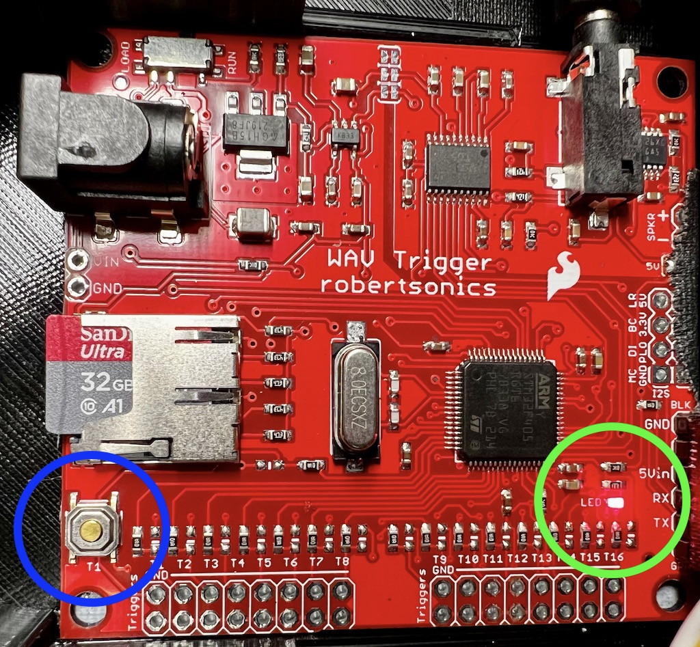

# Troubleshooting

If you are experiencing issues during the installation process there are a few ways to get back on track. Use the guides below to help narrow down where you are having an issue and try the suggested remedies. Should you need additional assistance, reach out to the [GPStar Technologies Facebook group](https://www.facebook.com/groups/gpstartechnologies) and either post a question or message one of the group administrators.

Regardless of the device, whether pack or wand, there are no built-in LEDs on the PCBs for diagnostics which can be consulted for status. Though there will be certain devices which should be available once connected which can help narrow down a root cause of the issue. For audio-related issues please refer to the image below which highlights the location of the test button (blue circle) and red status LED (green circle) on the WavTrigger device.

### General Guidance

Before continuing, be certain whether the following items have been reviewed:

- The operation switch on the WavTrigger should be set to RUN (not LOAD).
- Check that the microSD card is fully seated (pushed) into its socket.
- Check the JST connector on the PCB controller is fully seated into its socket.
- Verify the connections are intact and solid for GND, 5Vin, Rx, and Tx on the device.
- Sound files should start with a file having a prefix of `001_` and increment by 1.
- Music files should start with a file having a prefix of `500_` and increment by 1.
- Switch to SanDisk brand media as these SD cards have proven reliable in every use-case.

**Blinking Patterns:**

- 10x - This indicates that the SD card is no good or the formatting was bad. Re-format fully using your OS or the provided `guiformat.exe` utility in `/extras/` (for Windows only). Name brand microSD cards are highly recommended, with SanDisk having been proven the most reliable so far.
- 3x - This is the normal pattern at initial power-up to indicate the device has initialized without issues.
- 1x - The WavTrigger will blink once every ~4 seconds when the PCB and device are powered on. This indicates a regular serial connection checking the status of the WavTrigger and is to be expected.

## Proton Pack

Since all connections to the Proton Pack utilize standard JST-XH connections to the available devices, please re-check any connections for incorrect seating and polarity before continuing. If these are in place then at a minimum you should be able to turn on the pack using the red switch under the ion arm which should cause the Powercell lights to activate. This will be the primary means of validating that the pack controller is enabled.

### Pack will not power on (no lights or sounds)

Confirm that the battery pack is sufficiently charged, switched to the on state, and USB-to-JST connection is in place.

### Pack has lights but does not play audio

Press the test button on the WavTrigger to play the first audio file on the SD card and observe the status LED state.

If the red LED illuminates, this indicates the WavTrigger is receiving power and can play the audio files.

* Re-check the 3.5mm audio cable is connected to the audio amplifier, and that the audio amplifier has power, is connected to at least 1 speaker, and volume has been turned up to at least 30%.
* If possible, connect the 3.5mm audio cable to a known-good audio source such as a smartphone, Alexa device, or similar to confirm that the amplifier is capable of receiving a signal.

If the red LED does not illuminate, this could mean a connection or data problem.

* Reformat the microSD card as FAT32 using the provided utility and re-copy the audio files to the microSD card.
* Re-check the connections to the WavTrigger, taking note of the power and Rx/Tx connections. Note that is it normal to see some empty pins/sockets on the connecting wire.

## Neutrona Wand

The wand assumes successful operation of the pack, so please only proceed once that has been established.

### Wand will not power on (no lights or sounds)

The wand is expects to communicate with the pack and will only power on when that connection is successfully established. If no lights or audio are observed when using the Activate switch, please consider the following options.

* Re-check the Power/GND connections in the hose to make sure they are not reversed. Also check if the ends of the wires are making contact on the Neutrik connectors when clamping down. You can tin the ends of the wires to make it a bit thicker or simply fold them over to double them up. Just make sure the Neutrik connectors are not clamping down on the rubber part of the wire.
* If you are using the 28 Segment bargraph from Frutto Technology, make sure the connection cables are plugged into the proper connectors. If the power cable for the bargraph is plugged into the SCL/SDA connector on the wand board and the communication cable is plugged into the 5V power connector on the wand board, then the wand will not start up.

### Wand has a blinking vent light but does not start up

When the wand is trying to establish communication to the GPStar Proton Pack controller, the LED beside the vent light blinks. When a successful connection is made, the light will stop blinking.

* Re-check the TX/RX serial connections in the hose to make sure they are not reversed. Also check if the ends of the wires are making contact on the Neutrik connectors when clamping down. You can tin the ends of the wires to make it a bit thicker or simply fold them over to double them up. Just make sure the Neutrik connectors are not clamping down on the rubber part of the wire.

### Wand has no audio

Troubleshooting will be similar to the process used with the pack, though there will not be an external amplifier or audio cable in use. With the wand attached to the pack, press the test button on the WavTrigger to play the first audio file on the SD card and observe the status LED state.

If the red LED illuminates, this indicates the WavTrigger is receiving power and can play the audio files.

* Re-check the connection to the speaker. Polarity should be observed for the best audio quality, though a reversed connection should still support some form of audio playback.
* Re-flash the latest software to both the pack and wand controllers. These devices must be in agreement for the communication layer to operate correctly.
* Re-check the Tx/Rx connections to the pack. If these are reversed it will prevent proper communication. Attempt to switch the wires at the pack-side connector which use screw terminals, and retry the Activate switch.

If the red LED does not illuminate, this could mean a connection or data problem.

* Reformat the microSD card as FAT32 using the provided utility and re-copy the audio files to the microSD card.
* Re-check the connections to the WavTrigger, taking note of the power and Rx/Tx connections. Note that is it normal to see some empty pins/sockets on the connecting wire.
* Re-check the power connection to the wand. If you have a digital multimeter available, set the device to the DC power measurement and check that the 5V-OUT connection is supplying the expected voltage. Be careful to not short out the pins and mind the polarity.

### The music I added is not playing back
* Make sure to following the naming conventions that are indicated in the [Loading The Audio Files](AUDIO.md) guide.
* Remove any metadata that may be embedded in your wav files. This can cause problems with loading the music.
* The Proton Pack at a minimum must contain all the music, however it is advised for the Neutrona Wand to have the same files as well if you want music to also play back from the Neutrona Wand audio system.

### Bench Test Mode

If you wish to test (or use) the Neutrona Wand without a Proton Pack, flash the `binaries/wand/extras/NeutronaWand-BenchTest.hex` to the device to enable a special mode which will allow the wand to operation without waiting for a response from the pack. This is useful for debugging whether the serial connection is incorrect.
