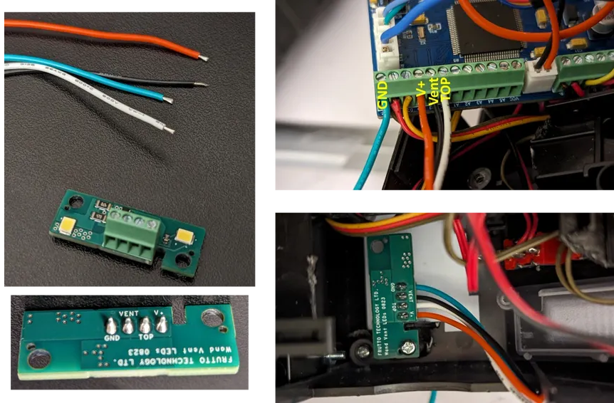

# Frutto Technology High Intensity Vent Lights

A brighter high intensity vent light from Frutto Technology can be installed very easily with the gpstar Neutrona Wand PCB with no soldering required.

## Installation

Mount the board and wire the connections as indicated in the photo below. Note that the GND wire for the vent light board shares the same connection in the terminal blocks as the top dial ROT- terminal. This circuit draws around 100mA, so that is why you need to provide the GND pin.

`WARNING: The light is very intense, do not look at it directly.`

`Also available in the pre-compiled binaries for the Neutrona Wand is an alternate pre-compiled Neutrona Wand build which adjusts the intensity of the Frutto Technology vent lights based on power levels and status of the wand.`

