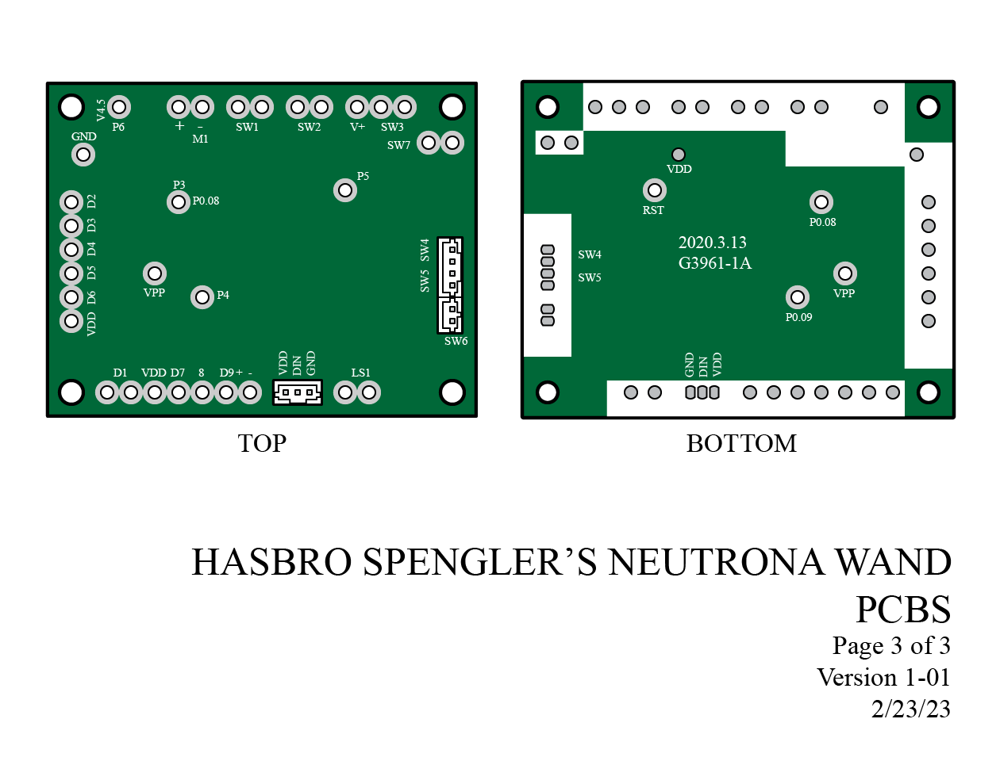
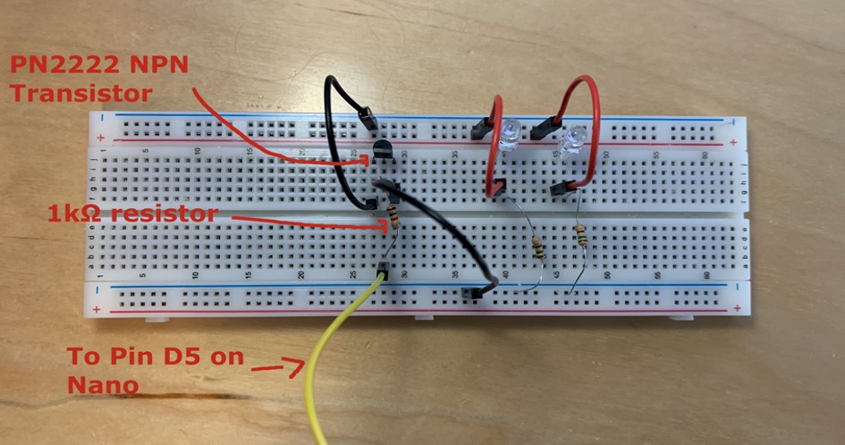
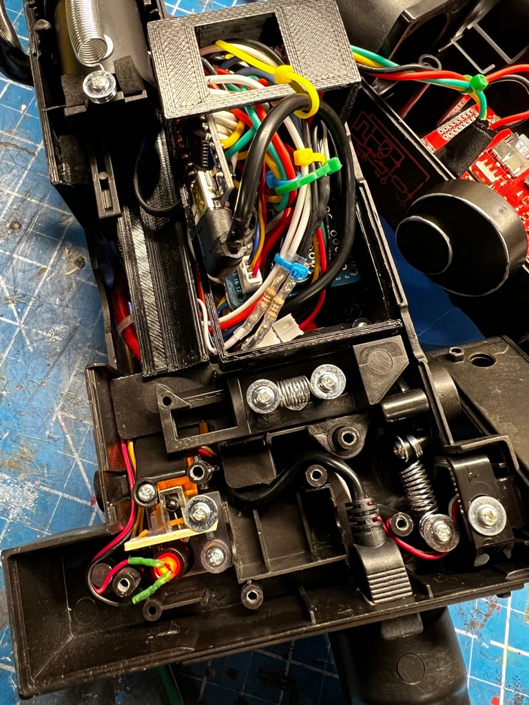
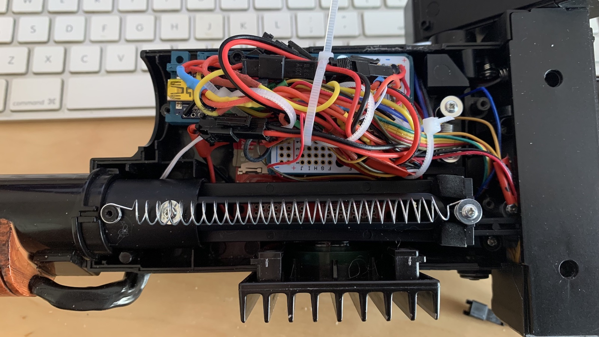
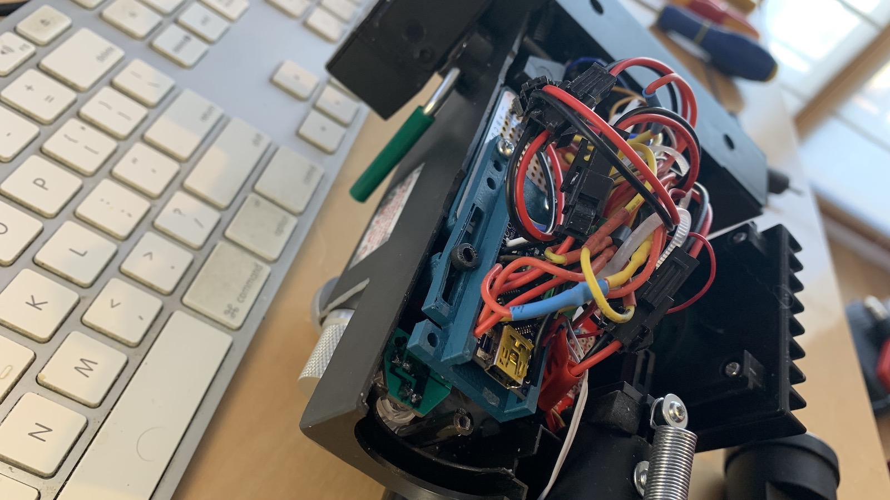
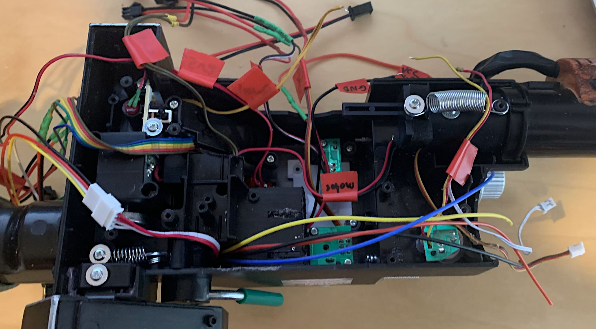
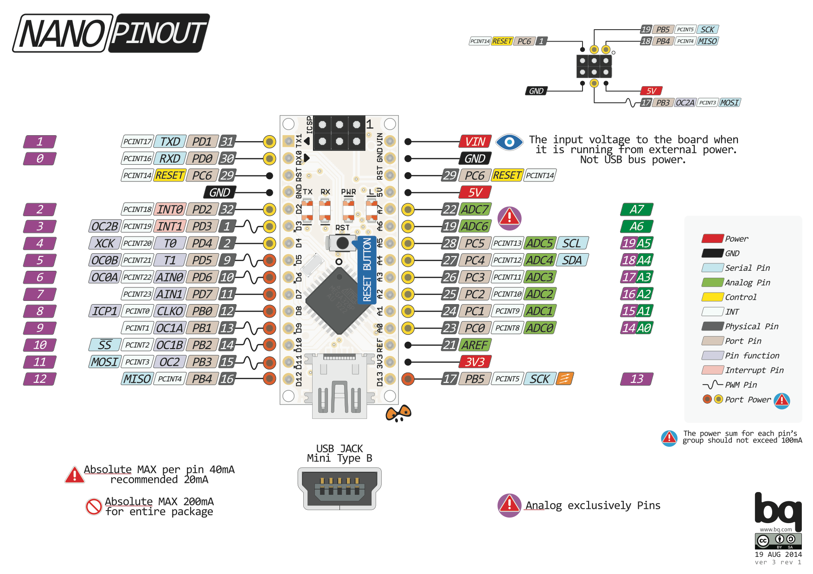

# Neutrona Wand Setup

**As of November 2023 the last release to support software builds for the Arduino Nano was v2.2.0. Due to memory limitations of this device no further software updates are possible. This guide exists solely for educational/legacy purposes only and is considered deprecated.**

This guide begins with some explanations for common items you will encounter during the upgrade process. Note that it will be necessary to upgrade the hose and conductors between the pack and wand. This exercise is left to individual preferences on connectors and style of replacement, though you will need 4 conductors at a minimum (+5V, Ground, and TX/RX for communications).

The space within the Neutrona Wand is extremely limited, though multiple components must be fit into this space. To maximize what is available, some wires from the original controller (PCB) can be directly soldered onto the Arduino Nano. Where resistors or inline components are required, these may be soldered between the wire and Arduino Nano to reduce need for an additional protoboard. If needed, a [a ¼ protoboard from Adafruit](https://www.adafruit.com/product/1608) or any similar size from another manufacturer will be used.

## Special Cautions and Warnings

You will find that the wand poses some challenges due to confined spaces and fragile wires to all the stock components. The following are suggestions to help you minimize damage to existing wiring, unless you plan to remove all the stock components and connect new wires.

- Remove what you can of any plastic covers over the switches internally, and use a hot glue gun to carefully drip glue over the soldered ends of the toggles, rotary encoder, and any other wire connections to reinforce them as they stand.
- Gently separate any wires that are bonded together, allowing about 1" of excess for stripping.
- Use a mechanical wire stripper to ensure you quickly strip back the sheathing for each wire.
- Use silicone-coated **stranded** wiring (22AWG down to 26AWG) to allow for maximum flexibility.
- Solder on extensions to every wire in the wand and use heat-shrink tubing to reinforce extended connections to make a better bond with the stock wire to prevent breakage.
- Continue the extended wire to either a PCB or the Nano for soldering, making sure that ALL of the strands of wire make it through the holes. Twist your bare wires tightly, and you can pre-tin the ends with a bit of solder to keep everything together as you fit the wire through any PCB holes (this also works well for making breadboard connections).
- Optionally, this is where you may consider a full replacement of some wires if they break off at the component you are connecting.
- It's too easy to have some strands that get missed which could cause a short--check your connections after soldering. A magnifying glass and good lighting is your friend!

## Original Connection References

You may wish to refer to this PCB drawing and the following table to help identify the original components in the Neutrona Wand.

*[Wand Reference Diagrams](https://github.com/Tomdf/Ghostbusters/tree/main/Haslab%20Pack%20Illustrations/Neutrona_Wand_Illustration) by Tomdf*

| Name | Socket | Color | Hasbro Pin | Notes |
|------|--------|-------|------------|-------|
| J3   |        | Brown | D2 | Bar Graph LEDs (5) |
|      |        | Red | D3 |  |
|      |        | Orange | D4 |  |
|      |        | Yellow | D5 |  |
|      |        | Green | D6 |  |
|      |        | Blue | VDD |  |
| M1   |        | Red | VCC | Wand vibration motor |
|      |        | Black | GND |  |
| SW1  |        | Brown | SPDT Toggle | Lower Right Toggle (Main Power) |
|      |        | Brown |  |  |
| SW2  |        | Red | SPDT Toggle | Upper Right Toggle (Bargraph Power)  |
|      |        | Red |  |  |
| SW3  |        | Brown | V+ | Rotary encoder (intensity) on top of wand |
|      |        | Red | A  |  |
|      |        | Orange | B |  |
| SW7  |        | Orange | SPST Switch | Wand tip retraction/extension sensor |
|      |        | Orange |  |  |
| SW4  | JST-PH | Red | SPDT Toggle | Activate toggle on left control box |
|      |        | Red |  |  |
| SW5  | JST-PH | White | SPST Button | Intensify button on left control box |
|      |        | White |  |  |
| SW6  | JST-PH | White | SPST Button | Orange button at end of wand, changes modes |
|      |        | White |  |  |
| D1   |        | Red | VCC | SLO-BLO LED |
|      |        | Black | GND | |
| NA   |        | Red | VDD | Power to D7 & D8 |
| D7   |        | White | GND | Top Right LED |
| D8   |        | Black | GND | Top Vent LED |
| D9   |        | Red | VCC | Clippard LED (Top Left) |
|      |        | Yellow | GND |  |

# (Important) Neutrona Wand Barrel LEDs wire colour differences.

It appears some of the silver tip generation 1 Neutrona Wands and orange tip generation 2 Neutrona Wands may have different wire colour combinations for the barrel LED lights:

## Generation 1 (Silver tip Neutrona Wands)
| Name | Socket | Color | Hasbro Pin | Notes |
|------|--------|-------|------------|-------|
| Q2   | JST-PH | Yellow | VCC | Addressable LEDs for wand tip effects (5 total) |
|      |        | Red | Data |  |
|      |        | Brown | Gnd |  |

## Generation 2 (Orange tip Neutrona Wands)
| Name | Socket | Color | Hasbro Pin | Notes |
|------|--------|-------|------------|-------|
| Q2   | JST-PH | Blue | VCC | Addressable LEDs for wand tip effects (5 total) |
|      |        | Yellow | Data |  |
|      |        | Red | Gnd |  |

## WAV Trigger Connections

These are the same connections which are used for the FTDI breakout board to program the WAV Trigger. Use pins and sockets for an easy connection should a firmware upgrade be required in the future.

| WAV Trigger | Connection |
|------------|------------|
| 5Vin       | +5V        |
| GND        | Ground     |
| RX         | PIN D9     |
| TX         | PIN D8     |
| SPKR+      | Speaker +  |
| SPKR-      | Speaker -  |

## Arduino Nano - Pin Reference vs. Hasbro Controller

The following is a diagram of the Arduino Nano pins from left and right, when oriented with the USB connection facing up (north).

You can also reference the PDF document for the [Pack Schematic Minimal](circuits/PackSchematic-Minimal.pdf) for additional visual guidance on the Wand wiring configuration.

| Connection    | Nano (L) | USB | Nano (R) | Connection |
|---------------|----------|-----|----------|------------|
| D8 (Red)      | D13   |     | D12   | D7 (Red)      |
|               | 3V3   |     | D11   | Motor-NPN     |
|               | REF   |     | D10   | Q2 (Yellow) or (Red)     **\*See note above about Barrel LED wire colour differences\***   Generation 1 Neutrona Wands (silver tip) data line is (Red) while generation 2 Neutrona Wands (orange tip) data line is (Yellow) |
| SW2 (Red)     | A0    |     | D9    | WAV Trigger RX |
| D2 (Brown)    | A1    |     | D8    | WAV Trigger TX |
| D3 (Red)      | A2    |     | D7    | ROT (Yellow)  |
| D4 (Orange)   | A3    |     | D6    | ROT (Red)     |
| D5 (Yellow)   | A4    |     | D5    | D1 & D9 (Red) |
| D6 (Green)    | A5    |     | D4    | SW1 (Brown)   |
| SW6 (White)   | A6    |     | D3    | SW4 (Red)     |
| SW7 (Orange)  | A7    |     | D2    | SW45 (White)  |
|               | 5V    |     | GND   |               |
|               | RST   |     | RST   |               |
| Ground (Pack) | GND   |     | RX0   | TX (to Pack)  |
| +5V (Pack)    | VIN   |     | TX1   | RX (to Pack)  |

### Connections by Component

**Toggles and Buttons**

| LOWER RIGHT TOGGLE → SW1         |   |        |     | Nano Pin | Hasbro Ref | Notes |
|----------------------------------|---|--------|-----|----------|-----|----------------------------------------|
| Brown | → | Ground |     |          | SW1 | Shouldn’t matter which wire goes where |
| Brown | → | →      | →   | Pin D4   | SW1 | Shouldn’t matter which wire goes where |

| UPPER RIGHT TOGGLE → SW2         |   |        |     | Nano Pin | Hasbro Ref | Notes |
|----------------------------------|---|--------|-----|----------|-----|----------------------------------------|
| Red     | → | Ground |     |          | SW2 | Shouldn’t matter which wire goes where |
| Red     | → | →      | →   | Pin A0   | SW2 | Shouldn’t matter which wire goes where |

| SW45/SW4 Connector: SW45 = Intensify / SW4 = Activate |   |        |    | Nano Pin | Hasbro Ref |
|-------------------------------------------------------|---|--------|----|----------|------------|
| White | → | Ground |    |        | SW45 |
| White | → | →      | →  | Pin D2 | SW45 |
| Red    | → | Ground |    |        | SW4  |
|  Red   | → | →      | →  | Pin D3 | SW4  |

**Special Switches**

These switches utilize a "pull down" resistor to measure the difference in voltage when the button or switch is depressed. Each switch will get +5V power on one wire, while the other wire will connect to both a 10K resistor and an Arduino Nano pin. The other side of the resistor will connect to ground. This allows the pin to go to ground (low) when power is not supplied (read: the switch is not depressed), and the pin gets when +5V is present when the switch is depressed.

| MODE SWITCH → SW6 |    |            |    | Nano Pin | Hasbro Ref |                                       |
|-------------------|----|------------|----|----------|------------|---------------------------------------|
| White | → | +5V    |   |        | SW6 | Shouldn’t matter which wire goes where |
| White | → | &bull; | → | Pin A6 | SW6 | Shouldn’t matter which wire goes where |
|                                 |   | ↓      |   |        |     |                                        |
|                                 |   | 10k Ω  |   |        |     |                                        |
|                                 |   | ↓      |   |        |     |                                        |
|                                 |   | Ground |   |        |     | Need to pull to ground (for reference) |

| BARREL EXTENSION SWITCH → SW7 |   |        |    | Nano Pin | Hasbro Ref |                                   |
|-------------------------------|---|--------|----|----------|------------|-----------------------------------|
| Orange | → | +5V    |   |        | SW7 | Shouldn’t matter which wire goes where |
| Orange | → | &bull; | → | Pin A7 | SW7 | Shouldn’t matter which wire goes where |
|                                    |   | ↓      |   |        |     |                                        |
|                                    |   | 10k Ω  |   |        |     |                                        |
|                                    |   | ↓      |   |        |     |                                        |
|                                    |   | Ground |   |        |     | Need to pull to ground (for reference) |

The rotary encoder is similar to that used on the Proton Pack. It requires a common ground connection and sends data via the A/B signal wires to indicate which direction it was turned.

| ROTARY ENCODER (ROT) → SW3 |   |              |    | Nano Pin | Hasbro Ref |
|----------------------------|---|--------------|----|----------|------------|
| Brown   | → | Ground |    |        | V+ |
| Red       | → | →      | →  | Pin D6 | SW3 |
| Orange | → | →      | →  | Pin D7 | SW3 |

**Motors**

Considered optional as this can be left out if desired, and without impact to normal operation.

| VIBRATION&nbsp;MOTOR |   |            | Motor Wire | Nano&nbsp;Pin | Notes                                     |
|----------------------|---|------------|------------|---------|-------------------------------------------------|
|                      |   | 1N4001 (s) | Red | +5V     | 1N4001 diode (s = striped end of the diode) |
| NPN C                | → | 1N4001     | Black                        |         | NPN* = PN2222                               |
| NPN B                | → | 330 Ω      | →                            | Pin D11 |                                             |
| NPN E                | → | →          | →                            | Ground  |                                             |

### Hasbro Bargraph
| BARGRAPH → J3                      |   |       |    | Nano Pin | Hasbro Ref |
|------------------------------------|---|-------|----|----------|------------|
| Blue     | → | +5V   |    |          | VDD  |
| Green   | → | 140 Ω | →  | Pin A5   | D6   |
| Yellow | → | 140 Ω | →  | Pin A4   | D5   |
| Orange | → | 140 Ω | →  | Pin A3   | D4   |
| Red       | → | 140 Ω | →  | Pin A2   | D3   |
| Brown   | → | 140 Ω | →  | Pin A1   | D2   |

Note for Bargraph: If you want to replace LEDs, the bargraph uses 3mm LED diodes.
**Use the appropriate resistor for your replacement LEDs based on their forward voltage given a 5V source!**

### Wand LEDs ###

| VENT LIGHT LED BOARD → D7 & D8  |   |      |    | Nano Pin | Hasbro Ref |                                        |
|---------------------------------|---|------|----|----------|------------|----------------------------------------|
| Red    | → | +5V  |    |          | VDD        |                                        |
| White | → | 90 Ω | →  | Pin D12  | D7         | Blinking white LED on top of the wand  |
| Black                           | → | 90 Ω | →  | Pin D13  | D8         | White LED inside the wand (vent light) |

*NPN Bipolar Transistor. Reference Pack page for more info.

For the SLO-BLO and Front-Left LED which share on 1 pin from the Nano. The spec sheet for the Nano states a max 40mA draw on a pin. With 2 LEDs it is at that threshold. I have been testing this setup extensively and have not blown out the pin. I prefer this solution as it requires less space than using a transistor method.

| SLO-BLO → D1         |    |       |    | Nano Pin     | Hasbro Ref | Notes |
|----------------------|----|-------|----|--------------|----|-------------------------------------|
| Red | → | 140 Ω | → | Pin D5 | D1 | Nano pin shared with FRONT LEFT LED |
| Black                        | → | →     | → | Ground | D1 |                                     |

| FRONT LEFT LED → D9 |    |       |    | Nano Pin     | Hasbro Ref | Notes |
|---------------------|----|-------|----|--------------|----|-------------------------------------|
| Red       | → | 140 Ω | → | Pin D5 | D9 | Nano pin shared with SLO-BLO |
| Yellow | → | →     | → | Ground | D9 |                              |

**OPTIONAL** - See below for transistor method to drive the 2 LEDs from the same pin if you wish to use that method instead. See example breadboard setup photo below that you can replicate onto [a ¼ protoboard](https://www.adafruit.com/product/1608).

| NPN* = PN2222 |   | Slo-Blo (B) | Front Left LED (Y)| Nano Pin |
|---------------|---|-------------|-------------------|----------|
|               |   | 140 Ω       | 140 Ω             |          |
|               |   | ↕           | ↕                 |          |
| NPN C         | → | Ground      | ← (Ground)        |          |
| NPN B         | → | 1k Ω        | →                 | Pin D5   |
| NPN E         | → | Ground      |                   |          |

*NPN Bipolar Transistor. Reference Pack page for more info.

## Wand Barrel LEDs

**\*See note near the top of this page about the Neutrona Wand barrel LED wire colours differences between the silver tip and orange tip Neutrona Wands\***

**Generation 1 (Silver Tip Wands)**
| WAND-TUBE → Q2 |   |              |   | Nano Pin | Hasbro Ref | Notes                                  |
|----------------|---|--------------|---|----------|------------|----------------------------------------|
| Yellow     | → | +5V    |    |         | Q2 | Power to 5 wand LEDs                |
|                                    |   | ↕      | CAP 100uf |  |    | Capacitor across the +/- power wires |
| Brown       | → | Ground |    |         | Q2 | Ground to 5 wand LEDs               |
| Red | → | 470Ω   | →  | Pin D10 | Q2 | Data input for addressing LEDs      |

**Generation 2 (Orange Tip Wands)**
| WAND-TUBE → Q2 |   |              |   | Nano Pin | Hasbro Ref | Notes                                  |
|----------------|---|--------------|---|----------|------------|----------------------------------------|
| Blue     | → | +5V    |    |         | Q2 | Power to 5 wand LEDs                |
|                                    |   | ↕      | CAP 100uf |  |    | Capacitor across the +/- power wires |
| Red       | → | Ground |    |         | Q2 | Ground to 5 wand LEDs               |
| Yellow | → | 470Ω   | →  | Pin D10 | Q2 | Data input for addressing LEDs      |

## Component Fitment

As noted at the start of this guide the space inside of the gun box for the wand is extremely limited. Creative placement of any protoboards, the Arduino, WAV Trigger, and speaker (if upgraded) will be left to each individual. As a matter of advice, placing the WAV Trigger under the wand barrel is an advised option with other items "stacked" above and beside the spring-loaded mechanism.

### (See the alternate component fitment section below for more information on the stacking option) ###

For another fitment option, the WAV Trigger can also fit in the opposite half of the gun box if the barrel jack is removed--this is to avoid the spring which attaches to the wand barrel.

### (See the Audio Output addendum for more information on the opposite half gun box mounting solution)
[Audio Output Addendum](SOUND.md)

Below is a view of the wand internals showing the Arduino Nano, a PCB for connections, and many of the wires which extend the stock wiring. This solution is using several of the included STL files: a small spacer is meant to fit under the barrel if you removed some of the plastic from the old controller mount; another 3D printed part is meant to protect the wiring from intruding on the barrel latching mechanism while still allowing the wires to connect to the barrel. And lastly, a mini USB cable has been routed through the casing to allow updating of the Arduino without removing the cover--in this case the vibration motor had already been removed to save space and make this area more accessible.

## Alternate component fitment
This solution requires removing plastic within the wand, and printing some of the included STL mount files and stacking the PCB board then Arduino Nano on top of the WAV Trigger. Everything is then screwed into one of the remaining holes in the wand body.

## Arduino Nano Pinout Reference

