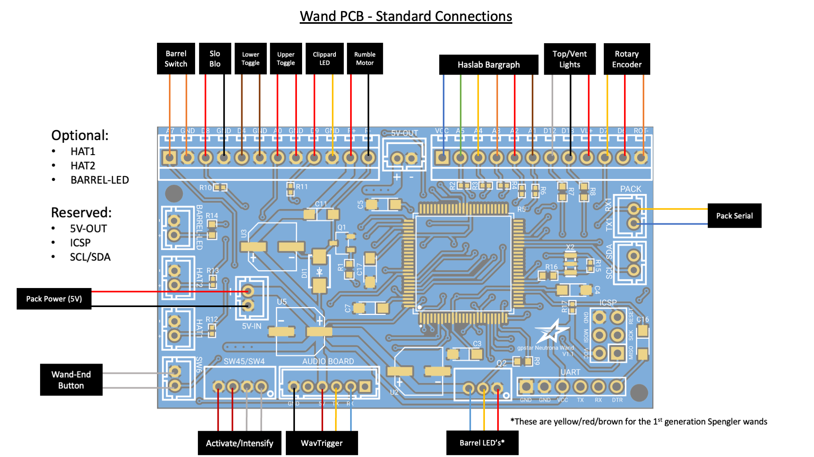
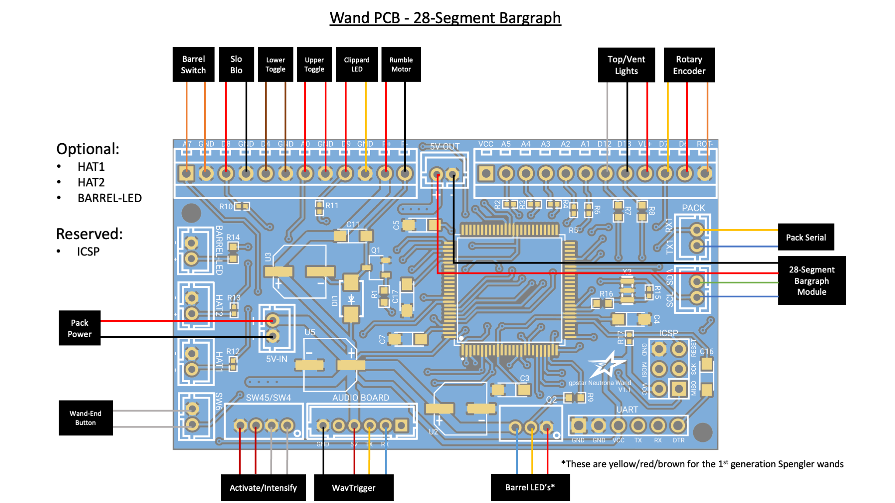

# Wand PCB Hookup

This guide is part of the kit approach to providing a minimally-invasive upgrade to the stock HasLab controllers. For the Neutrona Wand all available connections for JST-PH wiring is present, though a significant amount of wire-cutting will be required to separate the stock controller and re-attach using terminal blocks on the new PCB. The diagrams below detail the standard HasLab connections, or when using the 28-segment bargraph from Frutto Technology.

## Neutrona Wand - Connection Details

Connections for the wand should be made according to the tables below.

- Ordering aligns with PCB labels or when viewed left-to-right with the connector keyhole at the bottom.
- Pins denoted A#/D# correspond to the internal code and connection to the controller chip.
- Ground may be designated as "GND" or simply "-".

### Stock Connectors (JST-PH)

| Label | Pins | Notes |
|-------|------|-------|
| 5V-IN | +/\- | Power from Proton Pack. **This MUST be a regulated 5V source!** |
| Q2 | VCC/D10/GND | Stock connection for addressable barrel LEDs |
| SW45/SW4 | GND/D2/GND/D3 | Stock connection for the Intensify button and Activate toggle |
| SW6 | GND/A6 | Stock connection for the orange wand-end mode/alt switch |

### Stock Connectors (Terminal Blocks)

| Label/Pin | Color | Notes |
|-----------|-------|-------|
| A7 | Orange | Barrel extension switch (wire order does not matter) |
| GND | Orange | Barrel extension switch (wire order does not matter) |
| D8 | Red | Slo-Blo VCC |
| GND | Black | Slo-Blo GND |
| D4 | Brown | Lower-right Toggle (wire order does not matter) |
| GND | Brown | Lower-right Toggle (wire order does not matter) |
| A0 | Red | Upper-right Toggle (wire order does not matter) |
| GND | Red | Upper-right Toggle (wire order does not matter) |
| D9 | Red | Clippard LED (Top Left) VCC |
| GND | Yellow | Clippard LED (Top Left) GND |
| R+ | Red | Rumble (vibration) motor VCC |
| R- | Black | Rumble (vibration) motor GND |
| VCC | Blue | Power for stock bar graph |
| A5 | Green | Stock bar graph LED 5 |
| A4 | Yellow | Stock bar graph LED 4 |
| A3 | Orange | Stock bar graph LED 3 |
| A2 | Red | Stock bar graph LED 2 |
| A1 | Brown | Stock bar graph LED 1 |
| D12 | White | Blinking top right LED |
| D13 | Black | White vent light LED |
| VL+ | Red | VCC for top/vent lights |
| D7 | Orange | Rotary encoder B |
| D6 | Red | Rotary encoder A |
| ROT- | Brown | Ground for rotary encoder |

### Special Connectors

| Label | Pins | Notes |
|-------|------|-------|
| PACK (Serial) | TX1/RX1 | Serial communication to the Proton Pack.  `Connector type: JST-PH` |
| AUDIO BOARD | GND/NC/VCC/TX/RX/NC | Communication and Power for the wands's WAV Trigger.  `Connector type: JST-PH` |
| ICSP | DO NOT USE! | Programming header for bootloader updates (reserved).  `Connector type: Header pins` |
| UART | See Below | Programming header for software updates (optional).  `Connector type: Header pins` |

For connecting the UART pins, use a suitable FTDI chip such as the same **FTDI Basic 5V** used for programming the WAV Trigger. Pins on the PCB should align with with the standard wire order for FTDI-to-USB cables which use a single Dupont 6-pin connector. Observe these common colors and notes to ensure proper orientation:

- The ground pin will typically be a black wire, while VCC will typically be red.
- The DTR pin on the PCB will connect to a wire labelled either DTR or RTS.
- Any wire labelled CTS will be connected to the 2nd pin labelled GND on the PCB.
- Be careful to not reverse the connector!

### Optional Connectors

| Label | Pins | Notes |
|-------|------|-------|
| HAT1 | GND/D22 | Connection for top of the barrel tip hat LED.  The left (top in the photo) pin is GND, the right (bottom in the photo) pin is D22 which provides 5V and has a 150Ω resistor connected to it.  `Connector type: JST-PH`  `Do not draw more than 40mA from this connector.` |
| HAT2 | GND/D23 | Connection for the wand box hat LED.  The left (top in the photo) pin is GND, the right (bottom in the photo) pin is D23 provides 5V and has a 150Ω resistor connected to it.  `Connector type: JST-PH`  `Do not draw more than 40mA from this connector.`|
| BARREL-LED | GND/D24 | Connection for white wand tip light.  The left (top in the photo) pin is GND, the right (bottom in the photo) pin is D24 which provides 5V and has a 100Ω resistor connected to it.  `Connector type: JST-PH`  `Do not draw more than 40mA from this connector.` |
| 5V-OUT | +/\- | Power for additional accessories.  `Connector type: JST-PH` |
| SCL/SDA | SCL/SDA | Expansion serial port using I2C.  `Connector type: JST-PH`|

**Note:** If using the [28-segment bargraph](BARGRAPH.md), power may be delivered via the 5V-OUT while the SCL/SDA serial connection will provide data/control.
