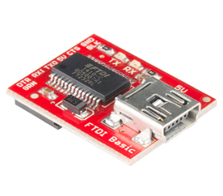
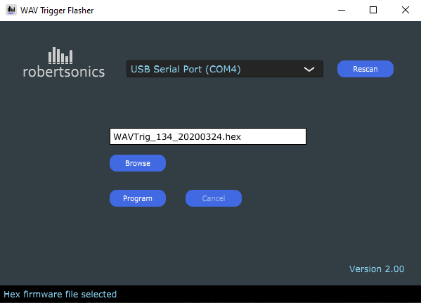
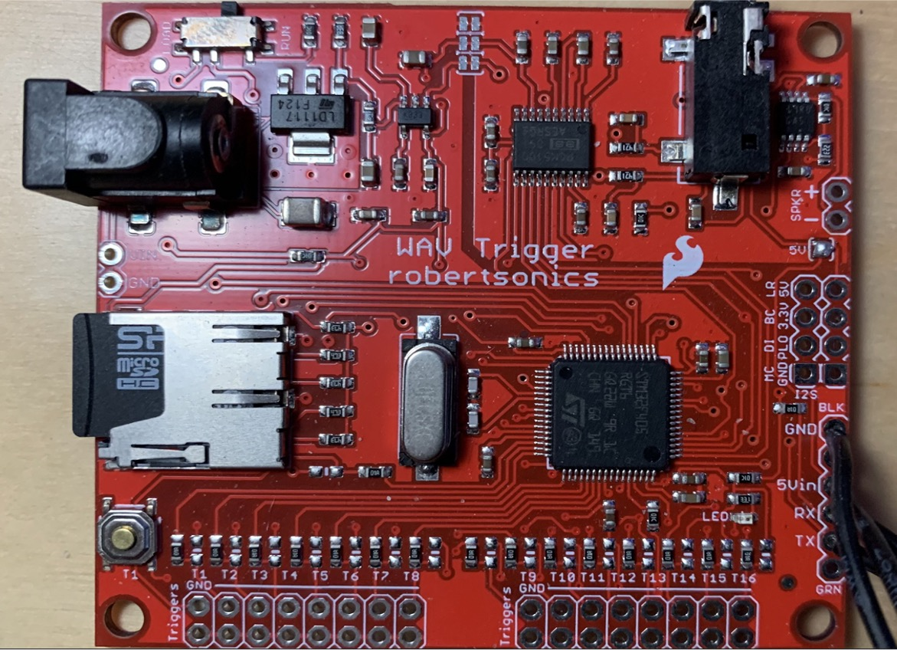

# WavTrigger Configuration

The first thing to take care of is updating the firmware on the WavTrigger boards. They all currently ship with version 1.34, and 1.40 is required for some unique features of the gpstar Proton Pack. Version 1.40 can be found here in this respository in the `extras` folder.

The WavTrigger software updater and instructions [can be found on the Robertsonics website](https://www.robertsonics.com/wav-trigger). To update the firmware, an [FTDI Basic (5V version)](https://www.sparkfun.com/products/9716) from Sparkfun should be used to interface with the WavTrigger. You may also use any USB-to-serial adaptor, so long as it is a TTL-level device, not RS- 232. **Plugging RS-232 level signals into the WAV Trigger serial interface will damage the WAV Trigger!**

[WAV Trigger Firmware v1.40](https://github.com/gpstar81/haslab-proton-pack/tree/main/extras)

[WAV Trigger Flasher Utility v2.00 Windows Executable (zip)](https://www.robertsonics.com/s/WTFlasher_20230108_v200.zip)

[WAV Trigger Flasher Utility v2.00 OS X (10.11 and above) (dmg)](https://www.robertsonics.com/s/WTFlasher_20230108_v200.dmg)

Only 4 connections between the boards will be required: TX/RX and 5V/Ground.

**Firmware Summary Steps**

1. Solder wires directly or use a row of pin headers to the holes along the bottom right edge of the WavTrigger (as viewed with the barrel connector oriented at the top left).
1. Solder the small pad marked "5V" just below the sockets for SPKR +/-. This will allow the WavTrigger to operate from the 5V supplied by USB and later the battery for your Proton Pack.
1. There is a small switch near the power connect (barrel) to on the WavTrigger, set it to the “load” position.
1. Connect the following wires from the FTDI to WavTrigger:
	- RX on the FTDI to the TX of the WavTrigger.
	- TX from the FTDI to the RX of the WavTrigger.
	- 5V from the FTDI to 5Vin.
	- GND from one side to the other.
1. Plug in the USB cable from your computer to the FTDI board.
1. Run the WT-Flasher app on your computer, then click on BROWSE and navigate to and select the 1.40 firmware hex file `WAVTrig_20230904_v140.hex` that you downloaded from the extras folder in this repository.
2. Once connected to your computer, click the RESCAN button and select the device from the drop down USB Serial Port menu. 
3. Then click the PROGRAM button. The app should establish communication and begin flashing the new firmware.
4. After it has finished updating the firmware, disconnect everything and set the black switch back from `LOAD to RUN`.

**While flashing, you will see a number % progress indicator at the bottom of the Flasher software window indicating the status of the flashing progress.**

**IMPORTANT: Make sure after flashing the firmware to set the small switch on the Wav Trigger back to the RUN position.**

Note the "5V" pad just below the SPKR connection holes.

## Connections

Once the firmware is updated to 1.40 and you have confirmed this using the WavTrigger setup utility, there will be connections made to the respective microcontroller boards. Similar to the previous step the RX and TX will go to the respective TX and RX ports on the microcontroller boards. See the setup instructions for the Pack and Wand as necessary. The 5Vin and GND will be connected to the power to each of the pack and wand, respectively. DO NOT use the 5V port on either Mega or Nano to drive this device--you will need to split your power connection to each device to provide sufficient current.

NOTE: See below for more information. I used standard breadboard friendly header jumper cables to make the connections from the FTDI basic to the connectors I added to the WavTrigger. Also note that the WavTriggers have both a AUX output and/or 2 pins for audio output. You can use either or to connect to your speakers or amps.

**IMPORTANT: You will need to solder the 5V pad on the WavTrigger to enable 5V power from the device. After you do this, NEVER USE the BARREL CONNECTOR for power. We will be using 5V to power the Wav Triggers for both in the Pack and the Wand.**

## Loading Audio Files

Please see the [Audio Files](AUDIO.md) guide.
