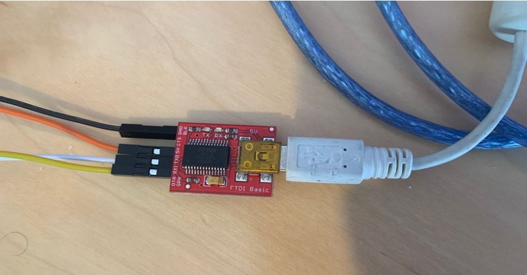

# WavTrigger Configuration

The first thing to take care of is updating the firmware on the WavTrigger boards. Sometimes they ship with firmware version 1.28 and 1.34 is required for one feature used during music playback. It is possible to use the WavTriggers without updating the firmware, the only issue you will have is during music playback: when a track ends, the next track will not automatically load and play itself.

The WavTrigger firmware and software updater and instructions can be found on the Robertsonics website. [https://www.robertsonics.com/wav-trigger](https://www.robertsonics.com/wav-trigger) To update the firmware, an [FTDI Basic (5V)](https://www.sparkfun.com/products/9716) version from Sparkfun can be used.

**Summary Steps:**

1. There is a small switch near the power connect (barrel) to on the WavTrigger, set it to the “load” position
1. Connect the RX on the FTDI basic to the TX of the WavTrigger, and TX from the FTDI basic to the RX of the Wav Trigger board.
1. Connect the 5V and GND from both together.
1. Plug in USB cable from computer to the FTDI basic.

**IMPORTANT: You will need to solder the 5V pad on the Wav Trigger to enable 5V power from the device. When you do this, NEVER USE the BARREL CONNECTOR for power. We will be using 5V to power the Wav Triggers for both in the Pack and the Wand.**

NOTE: See photos below for more information. I also wired some connectors to the TX/RX and PWR/GND on the WavTrigger, this will be a good time to do the same to enable easier connections for in the pack and wand. I used standard breadboard friendly header jumper cables to make the connections from the FTDI basic to the connectors I added to the WavTrigger. Also note that the WavTriggers have both a AUX output and/or 2 pins for audio output. You can use either or to connect to your speakers or amps.

**IMPORTANT: Make sure after flashing the firmware to set the small switch on the Wav Trigger back to the RUN position.**

