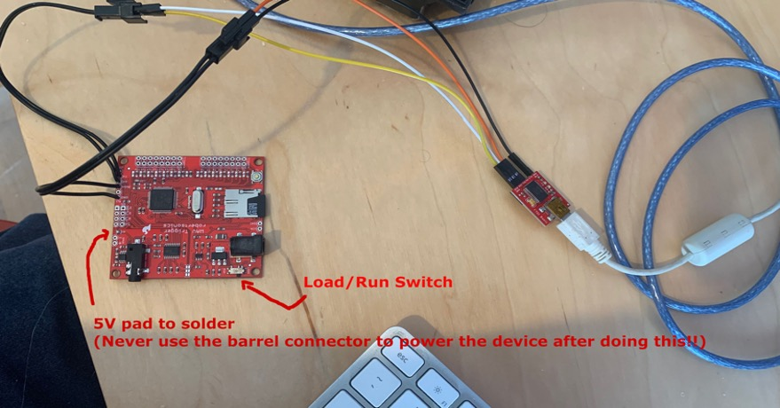

# WavTrigger Configuration

The first thing to take care of is updating the firmware on the WavTrigger boards. Sometimes they ship with firmware version 1.28 and 1.34 is required for one feature used during music playback. It is possible to use the WavTriggers without updating the firmware, the only issue you will have is during music playback: when a track ends, the next track will not automatically load and play itself.

The WavTrigger firmware and software updater and instructions [can be found on the Robertsonics website](https://www.robertsonics.com/wav-trigger). To update the firmware, an [FTDI Basic (5V version)](https://www.sparkfun.com/products/9716) from Sparkfun can be used.

**Firmware Summary Steps**

1. There is a small switch near the power connect (barrel) to on the WavTrigger, set it to the “load” position
1. Use dupont connectors to connect the following wires from the FTDI to WavTrigger:
	- RX on the FTDI basic to the TX of the WavTrigger.
	- TX from the FTDI basic to the RX of the WavTrigger.
	- 5V and GND from each side to the other, respectively.
1. Plug in USB cable from computer to the FTDI basic.

**IMPORTANT: Make sure after flashing the firmware to set the small switch on the Wav Trigger back to the RUN position.**

## Arduino Connections

Once the firmware is updated to 1.34 and you have confirmed this, there will be connections made to the respective Arduino boards. Similar to the previous step the RX and TX will go to the respective TX and RX ports on the Arduino boards. See the setup instructions for the Pack and Wand as necessary. The 5Vin and GND will be connected to the power to each of the pack and wand, respectively.

NOTE: See below for more information. I used standard breadboard friendly header jumper cables to make the connections from the FTDI basic to the connectors I added to the WavTrigger. Also note that the WavTriggers have both a AUX output and/or 2 pins for audio output. You can use either or to connect to your speakers or amps.

**IMPORTANT: You will need to solder the 5Vpad on the Wav Trigger to enable 5V power from the device. When you do this, NEVER USE the BARREL CONNECTOR for power. We will be using 5V to power the Wav Triggers for both in the Pack and the Wand.**

Note the "5V" pad just below the SPKR connection holes.

## Loading Files to the SD Cards

Your SD cards **must** be formatted as FAT32 using 32KB block size per the WavTrigger manual. Use a full formatting option for the SD cards not a quick formatting for best results.

Load [all sound effects files from the "sounds" folder](sounds) (and music, optionally) onto both SD cards. The file names must be identical and match between the SD cards so that any synchronized effects are both played by both WavTrigger devices at the same time. Although only some of the same tracks are played on the wand and pack while firing, some tracks play the same like the firing tail end, video game firing sounds, etc. For the proton stream, the wand plays a different sound vs the pack, so they overlap and mix in person for a nice effect.

Sound effects are prefixed with numbers 001-099 while music files will be prefixed as 100 and above. **DO NOT LEAVE GAPS IN PREFIXES WHEN NUMBERING FILES!** The only exception is between the last sound effect and first music track; when the pack and wand boot up, they ask the WavTrigger to count all the sound files on the SD cards, then I do some simple math by subtracting a known number of sound effects from the total number of loaded sound files, then it knows how many music tracks have been added and plays them accordingly.

To add more music, copy stereo wav tracks (44khz stereo wav files) onto the SD card of the pack and wand. File naming of the music tracks start at 100. So for example, `100_somesong.wav`, `101_somesong.wav`, `102_somesong.wav`, etc. **Do not leave any gaps in the number sequencing!** (For example of what NOT to do, `100_somesong.wav` followed by `102_somesong.wav` leaving off `101_somesong.wav` on the SD card.) The most and only important part in the naming is the XXX_ prefix for all tracks.

## Troubleshooting

From the Robertsonics [manual for the WavTrigger](https://static1.squarespace.com/static/62ab6e0d1f3ea036834d4a0b/t/63c331cab98b7f0d1d5fe04b/1673736656985/WT_UserGuide_20230114.pdf):

If you have problems, here are a few things to check:

1. Make sure your WAV files are named properly and are located in the root directory of the microSD card. When you first power on the WAV Trigger, it will locate and index the files and then blink 3 times to indicate that it found at least one WAV file. One long blink means that it either couldn’t read the card or it didn’t find any WAV files.

1. If there’s no activity on the status LED whatsoever when you power up the WAV Trigger, check the “Load/Run” switch next to the power connector and make sure it’s in the “Run” position.

1. Once you get the 3 blinks, pressing the on-board button will play the lowest numbered track on the microSD card. Confirm this by observing the status LED turning on to indicate a track is playing. You should hear the track through the stereo jack. If you’re using the on-board audio amp and speaker connection, you won’t hear anything unless you have enabled the amp using the init file.

1. If you’ve gotten this far and tracks won’t play, then it’s most likely that your WAV files are not the correct format. The WAV Trigger will only play WAV files formatted as 16-bit, stereo, 44.1kHz, and there can be no meta-data (non-audio data) in the file before the audio data. It seems that many Mac audio applications insert a meta-data chunk prior to the audio, and this will prevent the track from playing. In such cases, simply importing the file and re-exporting with Audacity will likely fix the problem.

1. Please consider using a supply voltage of no more than 9V, preferably less. Playing loud audio with the on-board amp for extended periods can draw a lot of current and the lower the input voltage, the less warm the 5V regulator will get. This is especially important if you’re encasing the WAV Trigger in a small project box. I personally use 6V wall mount adaptors. Alternatively, you can power the WAV Trigger with regulated 5V (5Vin) and bypass the on-board regulator completely.