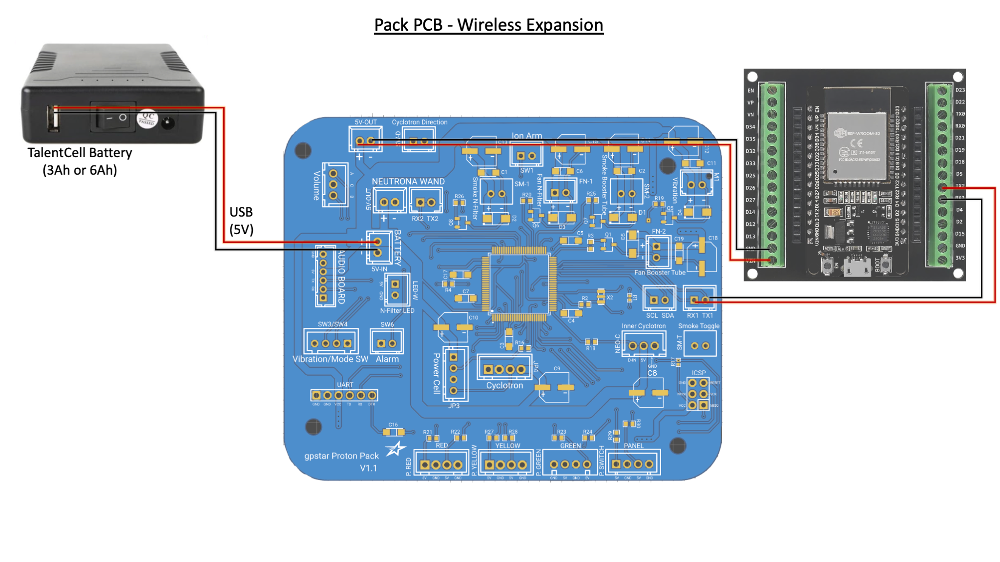

# Wireless Adapter (Optional)

Use of the serial expansion port on the gpstar Proton Pack can bring WiFi capabilities to your unlicensed nuclear reactor! This is a minimal version of the Attenuator device without input or output devices (no lights, sound, vibration, or switches) and may be installed directly into your pack alongside the gpstar Proton Pack controller.

[Video Installation Guide](https://www.youtube.com/watch?v=9r0VZKfhY5o) (YouTube, November 2023).

## Bill of Materials

The configuration for this device is extremely simple and can be implemented with NO SOLDERING using the parts below. You will need a true ESP32 (ESP-WROOM-32 not ESP8266) development board with a terminal shield and a pair of JST-XH pre-wired connectors with bare wire ends.

* [ESP-WROOM-32 Dev Board w/ Terminal Shield](https://a.co/d/hDxXluE)
* [JST-XH 2-Pin Connector and Wire Set](https://a.co/d/74ILiUB)

## ESP32 - Pin Connections

The following is a diagram of the ESP32 pins from left and right, when oriented with the USB connection facing down (south) like the pinout diagram above.

| Connection    | ESP32 (L) |     | ESP32 (R) | Connection    |
|---------------|-----------|-----|-----------|---------------|
|               | EN        |     | GPIO23    |               |
|               | GPIO36    |     | GPIO22    |               |
|               | GPIO39    |     | GPIO1     |               |
|               | GPIO34    |     | GPIO3     |               |
|               | GPIO35    |     | GPIO21    |               |
|               | GPIO32    |     | GPIO19    |               |
|               | GPIO33    |     | GPIO18    |               |
|               | GPIO25    |     | GPIO5     |               |
|               | GPIO26    |     | GPIO17    | to Pack RX1   |
|               | GPIO27    |     | GPIO16    | to Pack TX1   |
|               | GPIO14    |     | GPIO4     |               |
|               | GPIO12    |     | GPIO2     |               |
|               | GPIO13    |     | GPIO15    |               |
| to 5V-OUT -   | GND       |     | GND       |               |
| to 5V-OUT +   | VIN       |     | 3.3V      |               |
|               |         | **USB** |         |               |

As shown above you will only need 4 connections using the pair of JST-XH connectors connecting the 5V-OUT and RX1/TX1 sockets to the ESP32 device. Since the pre-wired connections may only have a red/black color pattern the diagram below has been intentionally designed with this in mind.

## Firmware Flashing

This device currently uses the exact same firmware image as the Attenuator device, so please see the [ATTENUATOR_FLASHING](ATTENUATOR_FLASHING) guide for details on compiling and/or uploading software to your wireless adapter.

## Operation

When using the ESP32 controller it is possible to connect to the device via WiFi. The SSID (Network Name) will be broadcast as **"ProtonPack_####"** where "####" is the last 4 hexadecimal values for the MAC address of the WiFi interface. This will differ for each ESP32 device, making each network unique to the attached pack. The default password is **"555-2368"** and can (and should) be changed via the web interface after successfully connecting to the network. The IP address for the device will be hardcoded as "192.168.1.2" with the web interface accessible at `http://192.168.1.2`.

For instructions on using the web interface to control your equipment, please see the [Wireless Operations](WIRELESS_OPERATION.md) guide.

**Security Notice**

Once you have successfully paired with the WiFi network for the Proton pack, you are HIGHLY encouraged to change the default password. This is accessible via a link at the bottom of the main device page as noted above. Follow the prompts to enter and confirm a new password then re-join your pack's WiFi network with the new credentials.
