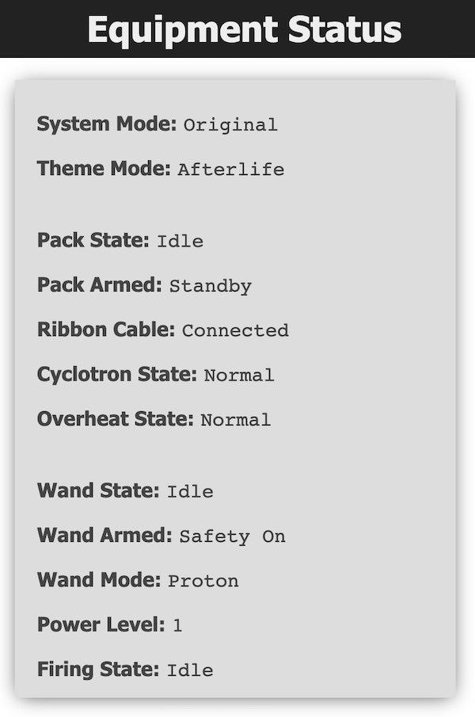
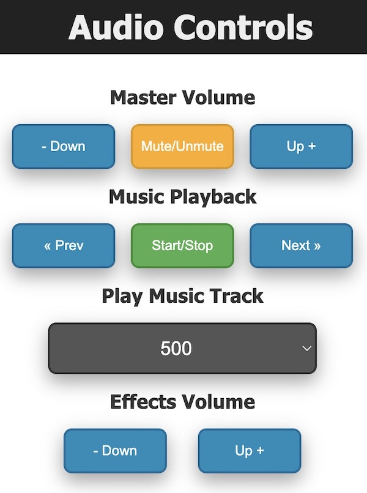
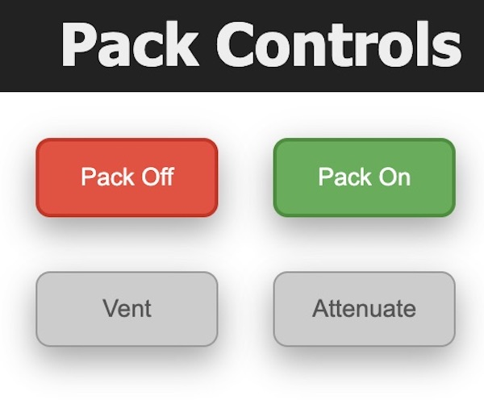
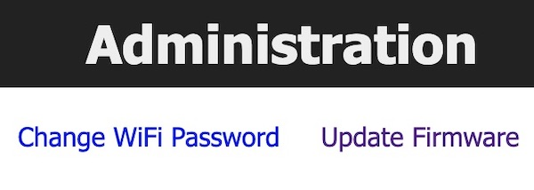

# Wireless Operation

This guide will cover the web interface available via the Attenuator or Wireless Adapter devices to control your Proton Pack and Neutrona Wand. At present the same software will be utilized for both solution.

## Firmware Flashing

Please see the [ATTENUATOR_FLASHING](ATTENUATOR_FLASHING.md) guide for details on compiling and/or uploading software to your Wireless Adapter controller.

## Web UI

When using the ESP32 controller for either the Attenuator or Wireless Adapter, a web-based user interface is available to view the state of your Proton Pack and Neutrona Wand, and to manage specific actions. The available sections are described below.

### Equipment Status

The equipment status will reflect the status of your Proton Pack and Neutrona Wand and will update in real-time as you interact with the device.

**Note:** If you see a "&mdash;" (dash) beside these values it can indicate a potential communication issue. Simply refresh the page and/or check your WiFi connection to the device.

### Audio Controls

This section allows full control of the master (overall) volume and to mute/unmute all devices. For playback of music you can advance forward or backwards in the music queue, or select a specific track for playback via the selection field (switching immediately if already playing, otherwise will be the track started via the Start/Stop button). Lastly, you can change the effects volume as needed via the dedicated buttons.

**Note:** Only the track numbers are known to the WavTrigger device, and track names are not available for display.

### Pack Controls

Controls will be made available on a per-action or per-state basis. Shown here, the pack and wand are both in an Idle state while in the "Original" mode which allows the pack to be turned on/off remotely. The options to remotely vent or to "Attenuate" are only enabled when the devices are in a specific state.

### Administration

These links allow you to update the WiFi password to one of your choice, or to update the software (respectively).

## Web API

The following URL's will serve the pages as shown above:

	GET / - Standard Index/Landing Page
	GET /password - WiFi Password Update Page
	GET /style.css - Common Stylesheet

For real-time updates, a special url exists at `/ws` to support [WebSockets](https://developer.mozilla.org/en-US/docs/Web/API/WebSockets_API). When connected, the ESP32 device will "push" any relevant information direct to clients. Note that this data may be in the form of a JSON object or a plain string, so check the contents of the data carefully before usage.

The following URL's are available for managing actions within your devices:

	GET /status - Obtain the current equipment status
	PUT /pack/on - Turn the pack on (subject to system state)
	PUT /pack/off - Turn the pack onf (subject to system state)
	PUT /pack/attenuate - Cancel pack overheat via "attenuation"
	PUT /pack/vent - Perform manual vent (subject to system state)
	PUT /volume/toggle - Toggle mute for all devices
	PUT /volume/master/up - Increase master volume
	PUT /volume/master/down - Decrease master volume
	PUT /volume/effects/up - Increase effects volume
	PUT /volume/effects/down - Decrease effects volume
	PUT /music/startstop - Toggle music playback via start/stop
	PUT /music/pauseresume - Toggle music playback via resume/pause
	PUT /music/next - Move to next track
	PUT /music/prev - Move to previous track
	PUT /music/select?track=[INTEGER] - Select a specific music track (Min Value: 500)
