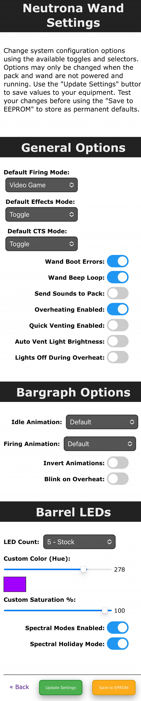

# Wireless Operation

This guide will cover the web interface available via an ESP32 chip used as either the **Attenuator** or **Wireless Adapter** devices, and is capable of controlling some operations of your Proton Pack and Neutrona Wand.

Before proceeding, it is worth noting that the ESP32 device is only capable of operating on the 2.4GHz band for WiFi communications. While it does support the 801.11b/g/n networking standards, any computer/phone/tablet which connects to this device as it's network or will be connected to by this device as a client must offer the 2.4GHz frequency. For secured networks, only the WPA2 standard is allowed.

## Firmware Flashing

Please see the [ATTENUATOR_FLASHING](ATTENUATOR_FLASHING.md) guide for details on compiling and/or uploading software to your Wireless Adapter controller.

## Hardware Synchronization

In order to view the state of the pack and control it remotely, the two devices must be physically connected and have been sychnronized via the built-in software. On the ESP32 are 2 on-board LEDs which will show the current status. A red LED indicates the device is powered and should be accessible via WiFi. A blue LED indicates the device has successfully synchronized with the Proton Pack.

## Web Interface

When using the ESP32 controller for either the Attenuator or Wireless Adapter, it will offer a private WiFi network which begins with the prefix **"ProtonPack_"** and secured with a default password of **"555-2368"**.

Once connected, you will need to configure an IP address for your computer/phone/tablet using the preferences for that device's operating system. You may pick an IP address from the range of **"10.0.0.100" through "10.0.0.200"** with a subnet of **"255.0.0.0"**. Please remember that if you intent to have multiple devices connect via this private WiFi network you will need a unique IP for each device.

**Note:** The IP range of "10.0.0.3-10.0.0.99" is reserved for potential future devices which may connect to this private WiFi network. Use of those IP's is not advised.

A web-based user interface is available at [http://10.0.0.2](http://10.0.0.2) to view the state of your Proton Pack and Neutrona Wand, and to manage specific actions. The available sections are described below.

### Equipment Status

The equipment status will reflect the status of your Proton Pack and Neutrona Wand and will update in real-time as you interact with the device.

**Note:** If you see a "&mdash;" (dash) beside these values it can indicate a potential communication issue. Simply refresh the page and/or check your WiFi connection to the device.

### Audio Controls

This section allows full control of the master (overall) volume and to mute/unmute all devices. For playback of music you can advance forward or backwards in the music queue, or select a specific track for playback via the selection field (switching immediately if already playing, otherwise will be the track started via the Start/Stop button). Lastly, you can change the effects volume as needed via the dedicated buttons. The current volume levels will be shown and updated in real-time whether adjusted via the web UI, the pack, or wand.

**Note:** Only the track numbers are known to the WavTrigger device, and track names are not available for display. Music tracks must begin at value "500" per the naming convention used by the GPStar controllers/software.

### Pack Controls

Controls will be made available on a per-action or per-state basis. Shown here, the pack and wand are both in an Idle state while in the "Super Hero" operation mode which allows the pack to be turned on/off remotely. The options to remotely vent or to "Attenuate" are only enabled when the devices are in a specific state.

**Vent:** This can only be triggered remotely when in the "Super Hero" mode and while the Pack State is "Powered".

**Attenuate:** When firing, the Cyclotron State must be either "Warning" or "Critical" to enable this button.

### Preferences

These provide a web interface for managing options which are accessed via the LED or Config EEPROM menus. The settings are divided into 3 sections: Pack, Wand, and Smoke.

### Administration

These links allow you to change or control aspects of the device.

- **Update ESP32 Firmware** - Allows you to update the ESP32 firmware using Over-the-Air updates. See the [ATTENUATOR_FLASHING](ATTENUATOR_FLASHING.md) guide for details
- **Secure Device WiFi**- Allows changing of the default password for the private WiFi network
- **Change WiFi Settings** - Provides an optional means of joining an existing WiFi network for access of your device
- **Restart/Resync** - Allows a remote restart of the software by performing a reboot of the ESP32 device

## Pack Preferences

Set options related specifically to the Proton Pack.

**Note:** The ability to update settings or save to EEPROM will be disabled so long as the pack and wand are running. Turn off all physical toggles to set these devices to an idle state before adjusting settings. Refresh the page to get the latest values for preferences.

## Wand Preferences

Set options related specifically to the Neutrona Wand.

**Note:** The ability to update settings or save to EEPROM will be disabled so long as the pack and wand are running. Turn off all physical toggles to set these devices to an idle state before adjusting settings. Refresh the page to get the latest values for preferences.

## Smoke Preferences

Adjust overall smoke effects (toggle on/off) and adjust per-level effects.

**Note:** The ability to update settings or save to EEPROM will be disabled so long as the pack and wand are running. Turn off all physical toggles to set these devices to an idle state before adjusting settings. Refresh the page to get the latest values for preferences.

## External WiFi Settings

It is possible to have your device join an existing WiFi network which may provide a more stable network connection.

1. Access the "Change WiFi Settings" page via [http://10.0.0.2/wifi](http://10.0.0.2/wifi) URL to make the necessary device modifications.
1. Enable the external WiFi options and supply the preferred WiFi network name (SSID) and WPA2 password for access.
	- Optionally, you may specify an IP address, subnet mask, and gateway IP if you wish to use static values. Otherwise, the ESP32 will obtain these values automatically from your chosen network via DHCP.
1. Save the changes, which will cause the device to reboot and attempt to connect to the network (up to 3 tries).
1. Return to the URL above to observe the IP address information. If the connection was successful, an IP address, subnet mask, and gateway IP will be shown.
1. While connected to the same WiFi network on your computer/phone/tablet, use the IP address shown to connect to your device's web interface.

Use of an unsecured WiFi network is not supported and not recommended.

## Web API

The web UI is built as a single-page application, using single HTML pages for the interface elements and performing actions using an API layer. These API endpoints are available for use if you wish to build your own interface. They pass data in JSON format though the exact structure is not described here at this time.

The following URL's will serve the informational/maintenance pages as shown previously in this guide:

	GET / - Standard Index/Landing Page
	GET /network - External WiFi Settings Page
	GET /password - WiFi Password Update Page
	GET /settings/pack - Pack Settings Page
	GET /settings/wand - Wand Settings Page
	GET /settings/smoke - Smoke Settings Page
	GET /style.css - Common Stylesheet

For real-time updates, a special url exists at `/ws` to support [WebSockets](https://developer.mozilla.org/en-US/docs/Web/API/WebSockets_API). When connected, the ESP32 device will "push" any relevant information direct to clients. Note that this data may be in the form of a JSON object or a plain string, so check the contents of the data carefully before usage.

The following URL's are available for managing actions within your devices:

	GET /status - Obtain the current equipment status
	PUT /pack/on - Turn the pack on (subject to system state)
	PUT /pack/off - Turn the pack onf (subject to system state)
	PUT /pack/attenuate - Cancel pack overheat via "attenuation"
	PUT /pack/vent - Perform manual vent (subject to system state)
	PUT /volume/toggle - Toggle mute for all devices
	PUT /volume/master/up - Increase master volume
	PUT /volume/master/down - Decrease master volume
	PUT /volume/effects/up - Increase effects volume
	PUT /volume/effects/down - Decrease effects volume
	PUT /music/startstop - Toggle music playback via start/stop
	PUT /music/pauseresume - Toggle music playback via resume/pause
	PUT /music/next - Move to next track
	PUT /music/prev - Move to previous track
	PUT /music/select?track=[INTEGER] - Select a specific music track (Min Value: 500)
	GET /config/pack - Obtain the current pack equipment settings
	PUT /config/pack/save - Sends latest pack settings for evaluation
	GET /config/wand - Obtain the current wand equipment settings
	PUT /config/wand/save - Sends latest wand settings for evaluation
	GET /config/smoke - Obtain the current pack/wand smoke settings
	PUT /config/smoke/save - Sends latest smoke settings for evaluation
	PUT /eeprom/app - Stores current smoke preferences to pack/wand EEPROMs
	PUT /eeprom/pack - Stores current pack preferences to pack EEPROM
	PUT /eeprom/wand - Stores current wand preferences to wand EEPROM
	GET /wifi/settings - Returns the current external WiFi settings
	PUT /wifi/update - Save new/modified external WiFi settings
