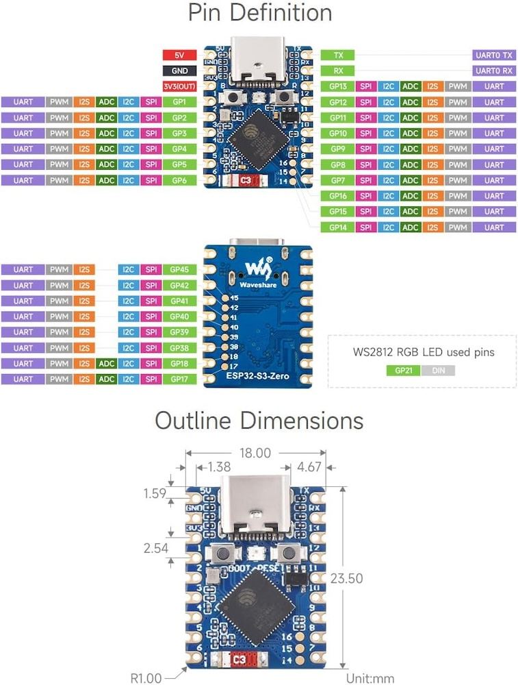
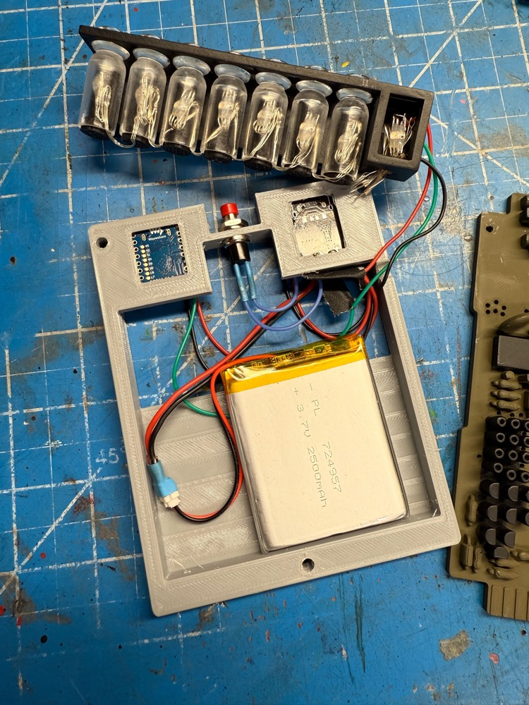
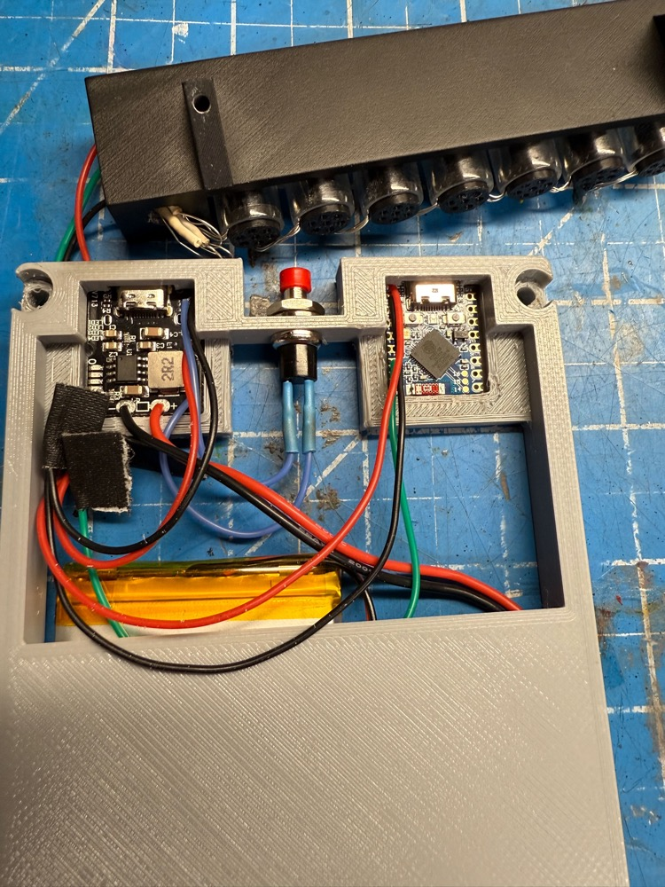
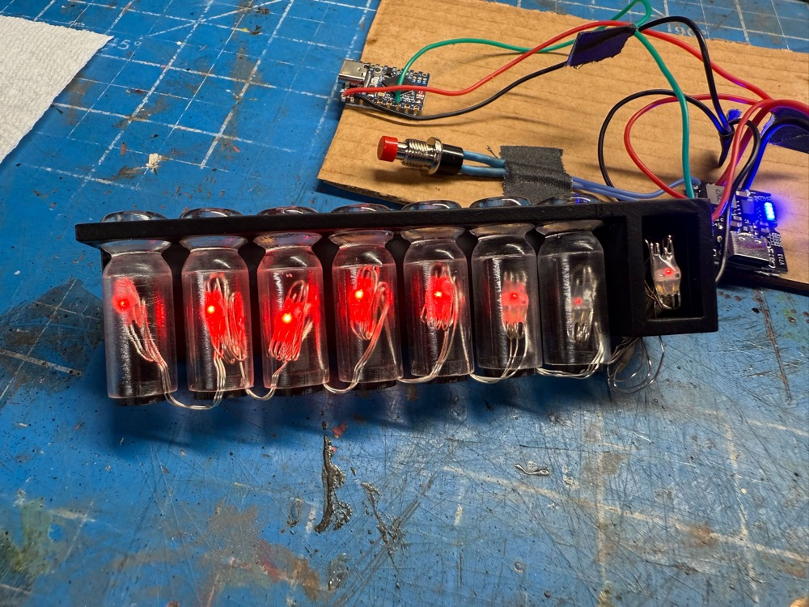
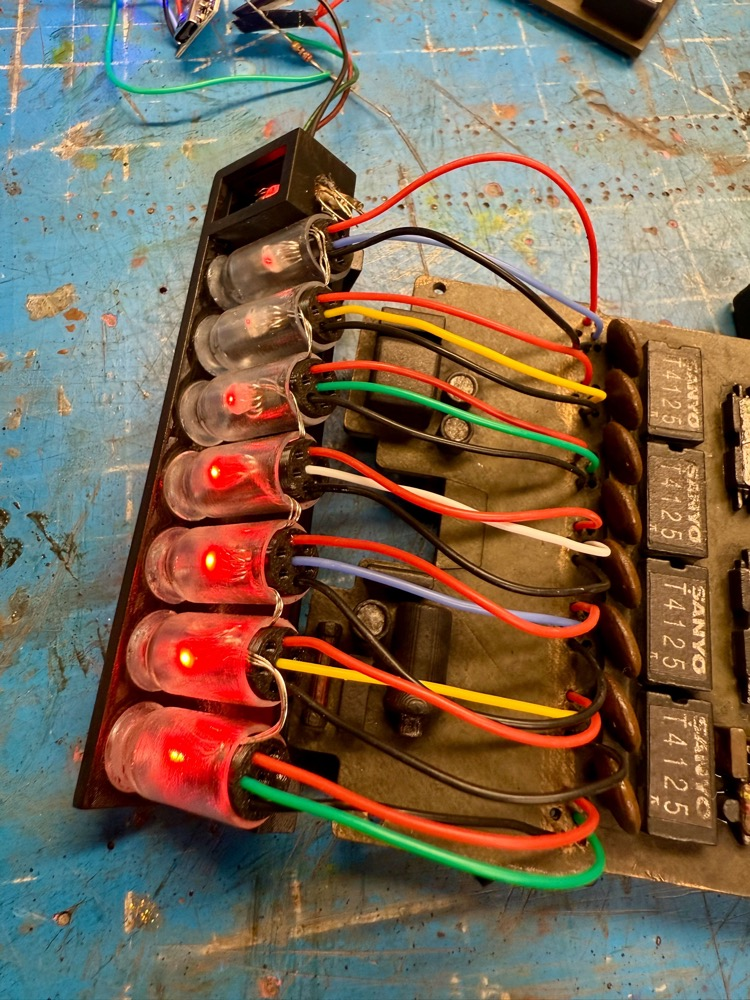

# Belt Gizmo

While the original "gizmo" was never given an on-screen purpose it has endured as a standard piece of kit for any uniform. This guide shows how to an interactive light show to any such device produced by the community, with some light modifications.

This depends on the presence of an Attenuator or WiFi Adapter in order to provide a wireless integration with your equipment.

Watch this demonstration of the Belt Gizmo and Stream Effects devices:
<video src="../videos/effects_demo.webm" controls width="480">
  Your browser does not support the video tag.
</video>

## External Shell

Many models of this device exist in the wild and you can pick any that you prefer as your base. Or if you have an existing Belt Gizmo you may be able to modify it to incorporate the new electronics.

- [Belt Gizmo by Dave W](https://makerworld.com/en/models/1481024-ghostbusters-belt-gizmo-customisable-readout#profileId-1546412)
- [Belt Gizmo by MRKIOU](https://cults3d.com/en/3d-model/gadget/ghostbusters-belt-gizmo?srsltid=AfmBOoodHZSokoh6WtUnP8dFB2FAfHBY5bJPWOEOunehdjz8OXQWtP-q)
- [Belt Gizmo Back by Dustin Grau](https://www.tinkercad.com/things/hXboxGGXGLa-belt-gizmo-back?sharecode=ha-4RQ-0age-2QNgxU-ZpJ5jofNhaNWqsaZMZCeECbs)

## Bill of Materials

Assembly of this device WILL require SOLDERING skills and is considered a DIY approach at this time. The exact list of parts below were chosen for their availability from common sources and/or available support across the Internet.

* [Addressable 5V WS2812B Fairy String Lights](https://a.co/d/ia74QSm)
* [Waveshare ESP32-S3-Zero Mini Dev Board](https://a.co/d/0TzJcFc)
* [USB-C 5V Boost Converter and Lithium Battery Charger](https://a.co/d/9K8KTmT)
* [2500mAh 3.7V Lithium Polymer Battery Pack](https://a.co/d/cKEqCLi)
* [SPDT 2-Position Micro Slide Switch](https://a.co/d/08XEYrL)
* [SPST Momentary Push Button Switch](https://a.co/d/7ySDNmg)
* [28AWG Stranded Silicone Hookup Wire](https://a.co/d/8uN87y4)
* [270 ohm Resisitor](https://a.co/d/j5Otzhq)

## ESP32 - Pin Connections

The following is a diagram of the **ESP32-S3-Zero pins** from left and right, when oriented with the USB connection facing up (north) like the pinout diagram above-top. We only need a single

| Connection    | ESP32 (L) |     | ESP32 (R) | Connection    |
|---------------|-----------|-----|-----------|---------------|
|               |         | **USB** |         |               |
| to 5V-OUT +   | 5V        |     | TX        |               |
| to 5V-OUT -   | GND       |     | RX        |               |
|               | 3V3(OUT)  |     | GP13      |               |
|               | GP1       |     | GP12      |               |
|               | GP2       |     | GP11      |               |
|               | GP2       |     | GP10      |               |
| to LEDs       | GP4       |     | GP9       |               |
|               | GP5       |     | GP8       |               |
|               | GP6       |     | GP7       |               |

## Power - Pin Connections

We need to both power the device but also allow for the battery pack to be charged without removing it from the Belt Gizmo every time. This approach uses a slide switch to cut power to the ESP32 and allows for faster charging without simultaneously draining the battery. We also make use of the Key switch to turn the power on or off. A single press will turn on the boost chip while two quick presses will turn it off.

For the battery you have 2 options: use a JST socket to connect your battery or cut off the existing plug. The latter may be quicker if you are comfortable with re-soldering a new battery in the future should the current one no longer hold a charge. Carefully cut off the plug from the LiPo battery pack, cutting each wire **1 AT TIME** to avoid a short-circuit.

You will connect battery leads to the through-hole connections opposite the battery: positive (red) to + and negative (black) to - as expected.

From the 5V through-hole ports you are best to solder a single wire to each due to the diameter of the holes. Use red for the + connection and - for negative, using 2-3" of wire for each. We will use these as a pigtail connection to connect our devices which need 5V power:

* 5V + Connects to LED positive and ESP32 5V via SPDT Slide Switch
* 5V - Connects to LED negative and ESP32 GND

The hole labelled K connects to one side of the SPST Momentary Switch, the other side to the 5V - wire used above.

Note: You will not need the USB2 connector supplied with this device.

## Assembly

The LEDs chosen for this project are the same which may be used with the Proton Pack when adding the sparking effect to your inner cyclotron cake. Essentially this used a spare segment of 8 addressable LEDs which fit within the 7 nixie tubes and the E block. Note that the 270 ohm resistor will be used on the data line which connects to pin GP4 of the ESP32.

The STL file `stl/misc/belt_gizmo_back.stl` is available in this project as a holder for the electronics and is highly recommended to keep things clean and compact. This _should_ work with most Belt Gizmo designs, though it was created specifically for the MRKIOU (Q) design linked above.

The excess wiring for each LED can be carefully folded over and secured behind each light in the nixie tubes. The sequence of lights begins with the E block and moves left from there.

Lengths of the silicone wiring can be used to provide more visual interest to the base of each nixie tube and terminate on the backside of the gizmo itself. You can see the ends of the wires secured with hot glue in the next photo.

Not shown here is the mini slide switch which severs power to the ESP32 so that the device can be charged without simultaneously discharging.

## Firmware Flashing

For the initial flashing of the firmware you can use a 3rd-party website to upload using the Web Serial protocol which is only available on the Google Chrome, Microsoft Edge, and Opera desktop web browsers. Mobile browsers are NOT supported, and you will be prompted with a message if your web browser is not valid for use.

1. Plug your device into a USB port on your computer and go to [http://espwebtool.ghostbusters.engineering](http://espwebtool.ghostbusters.engineering) (which [redirects to https://esp.huhn.me](https://esp.huhn.me)).

1. Locate the following files from the `/binaries/gizmo` directory.

	* [extras/BeltGizmo-Bootloader.bin](https://github.com/gpstar81/GPStar-proton-pack/blob/main/binaries/gizmo/extras/BeltGizmo-Bootloader.bin?raw=1) = This is the standard bootloader for the ESP32 itself.
	* [extras/BeltGizmo-Partitions.bin](https://github.com/gpstar81/GPStar-proton-pack/blob/main/binaries/gizmo/extras/BeltGizmo-Partitions.bin?raw=1) = This specifies the partition scheme for the flash memory.
	* [extras/boot_app0.bin](https://github.com/gpstar81/GPStar-proton-pack/blob/main/binaries/gizmo/extras/boot_app0.bin?raw=1) = This is the software for selecting the available/next OTA partition.
	* [BeltGizmo.bin](https://github.com/gpstar81/GPStar-proton-pack/blob/main/binaries/gizmo/BeltGizmo.bin?raw=1) = This is the custom firmware for the GPStar kit.

1. Click on the **CONNECT** button and select your USB serial device from the list of options and click on "Connect".

1. Once connected, select the files (noted above) for the following address spaces:

	* `0x0000` &rarr; [BeltGizmo-Bootloader.bin](https://github.com/gpstar81/GPStar-proton-pack/blob/main/binaries/gizmo/extras/BeltGizmo-Bootloader.bin?raw=1)
	* `0x8000` &rarr; [BeltGizmo-Partitions.bin](https://github.com/gpstar81/GPStar-proton-pack/blob/main/binaries/gizmo/extras/BeltGizmo-Partitions.bin?raw=1)
	* `0xE000` &rarr; [boot_app0.bin](https://github.com/gpstar81/GPStar-proton-pack/blob/main/binaries/gizmo/extras/boot_app0.bin?raw=1)
	* `0x10000` &rarr; [BeltGizmo.bin](https://github.com/gpstar81/GPStar-proton-pack/blob/main/binaries/gizmo/BeltGizmo.bin?raw=1)

    * **Note:** The address for the bootloader on ESP32-S3 chips is `0x0000` [as per this documentation](https://docs.mcuboot.com/readme-espressif.html) and is called out as it may differ from other flashing instructions seen within the GPStar guides. Rest assured this value change is intentional.

1. Click on the **PROGRAM** button to begin flashing. View the "Output" window to view progress of the flashing operation.

1. Once the device has completely flashed (100%) unplug the USB cable and remove any remaining power source from the device. Restore power to reboot the device and confirm operation.

Once the device is flashed successfully via USB you can use the WiFi and web UI to perform future flashes using over-the-air (OTA) updates.

## Operation

Look for a WiFi network of "BeltGizmo_0000" or similar and connect using the password `555-2368`. Open a web browser to the same name as the network name, for instance `http://beltgizmo_0000.local`.

**Security Notice**

This device uses a default password of `555-2368` and should be changed immediately. You also have the option of changing the SSID broadcast if desired.
