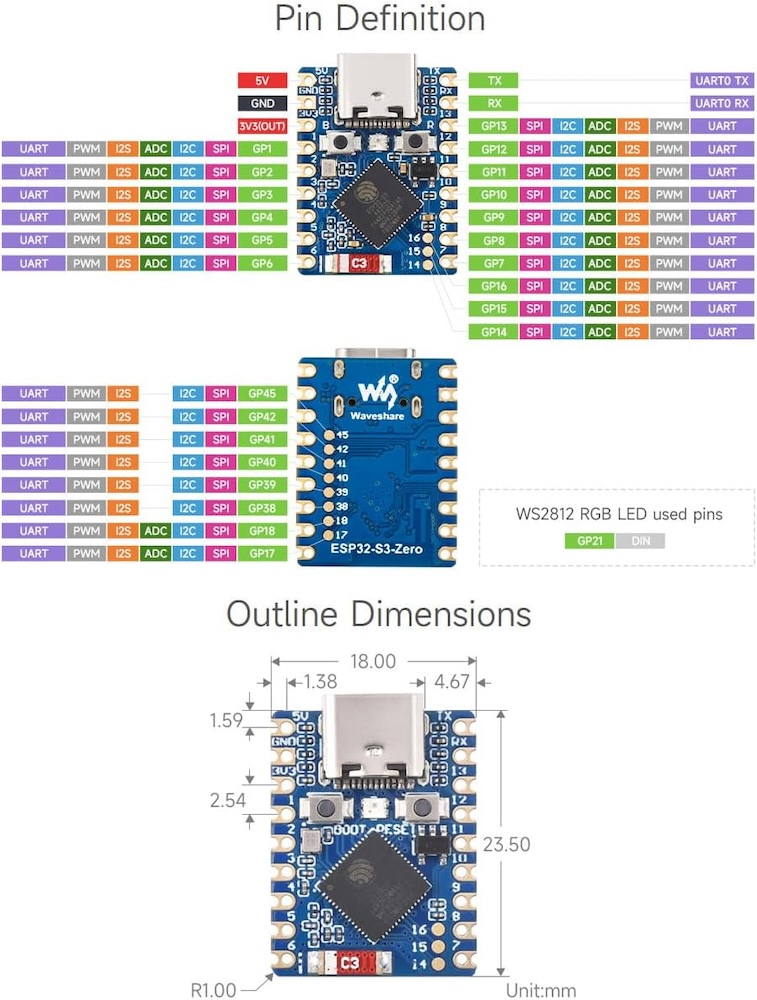
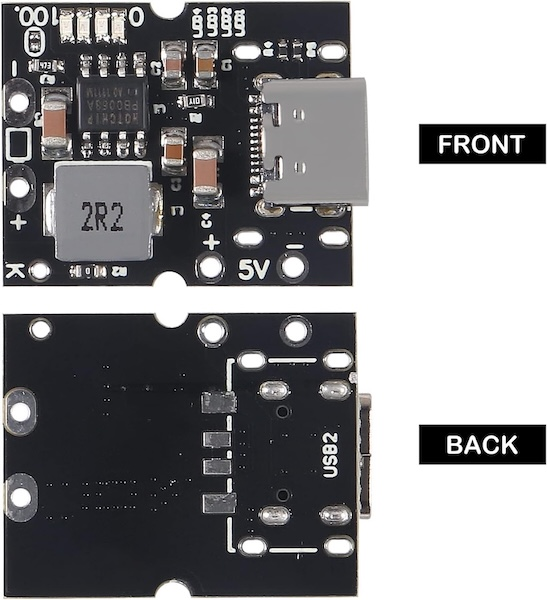
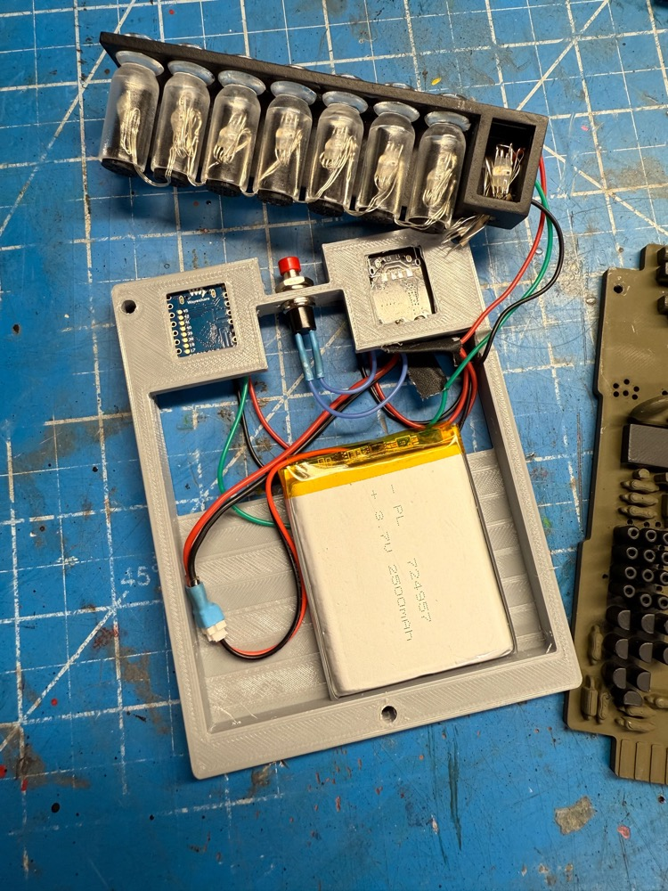
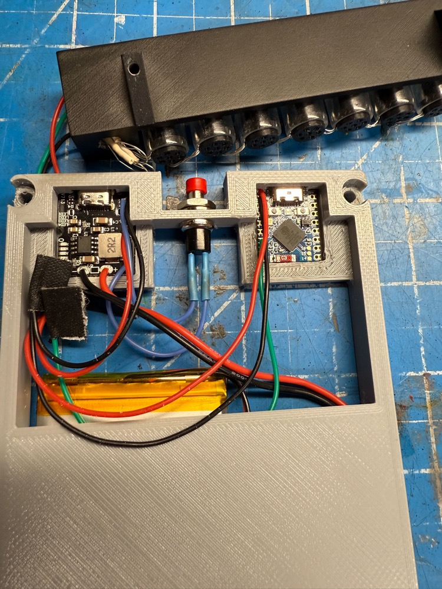
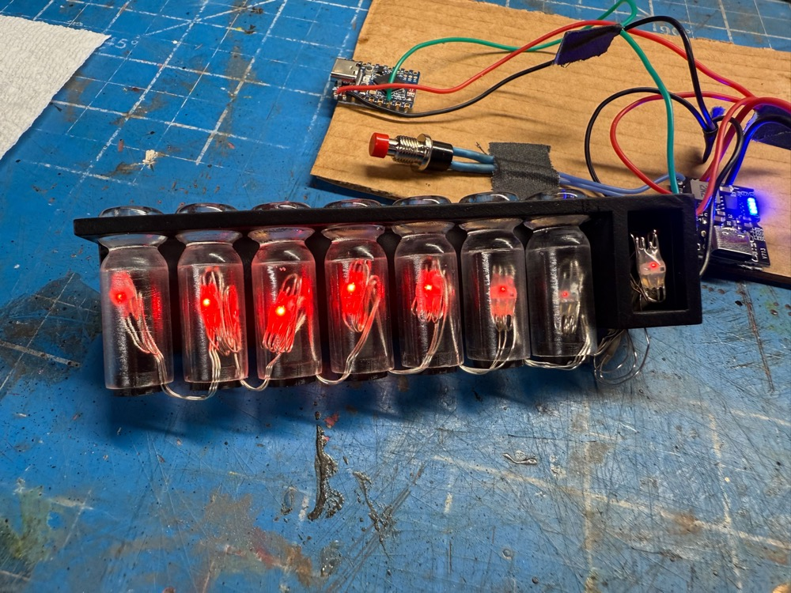
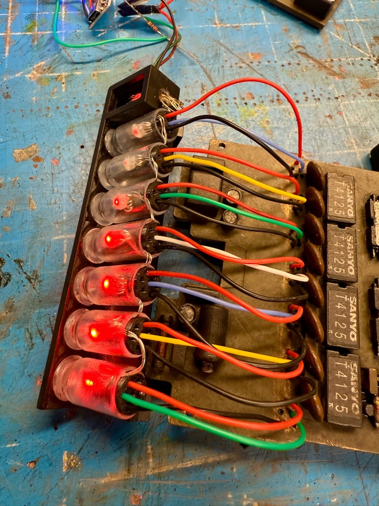
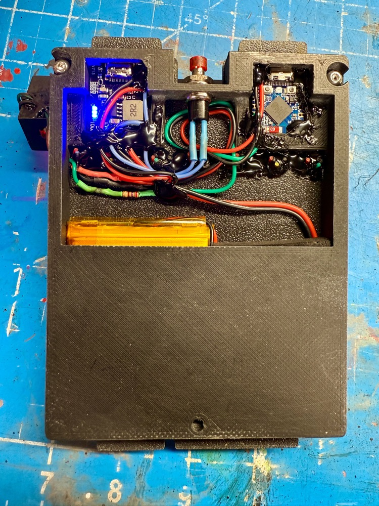
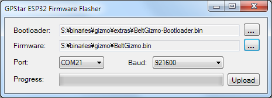

# Belt Gizmo

While the original "gizmo" was never given an on-screen purpose it has endured as a standard piece of kit for any uniform. This guide shows how to an interactive light show to any such device produced by the community, with some light modifications.

This depends on the presence of an Attenuator or WiFi Adapter in order to provide a wireless integration with your equipment.

Watch this demonstration of the Belt Gizmo and Stream Effects devices:
<video src="../videos/effects_demo.webm" controls width="480">
  Your browser does not support the video tag.
</video>

## External Shell

Many models of this device exist in the wild and you can pick any that you prefer as your base. Or if you have an existing Belt Gizmo you may be able to modify it to incorporate the new electronics.

- [Belt Gizmo by Dave W](https://makerworld.com/en/models/1481024-ghostbusters-belt-gizmo-customisable-readout#profileId-1546412)
- [Belt Gizmo by MRKIOU](https://cults3d.com/en/3d-model/gadget/ghostbusters-belt-gizmo?srsltid=AfmBOoodHZSokoh6WtUnP8dFB2FAfHBY5bJPWOEOunehdjz8OXQWtP-q)
- [Belt Gizmo Back by Dustin Grau](https://www.tinkercad.com/things/hXboxGGXGLa-belt-gizmo-back?sharecode=ha-4RQ-0age-2QNgxU-ZpJ5jofNhaNWqsaZMZCeECbs)

## Bill of Materials

Assembly of this device WILL require SOLDERING skills and is considered a DIY approach at this time. The exact list of parts below were chosen for their availability from common sources and/or available support across the Internet.

* [Addressable 5V WS2812B Fairy String Lights](https://a.co/d/ia74QSm)
* [Waveshare ESP32-S3-Zero Mini Dev Board](https://a.co/d/0TzJcFc)
* [USB-C 5V Boost Converter and Lithium Battery Charger](https://a.co/d/9K8KTmT)
* [2500mAh 3.7V Lithium Polymer Battery Pack](https://a.co/d/cKEqCLi)
* [SPDT 2-Position Micro Slide Switch](https://a.co/d/08XEYrL)
* [SPST Momentary Push Button Switch](https://a.co/d/7ySDNmg)
* [28AWG Stranded Silicone Hookup Wire](https://a.co/d/8uN87y4)
* [270 ohm Resisitor](https://a.co/d/j5Otzhq)

## ESP32 - Pin Connections



The following is a diagram of the **ESP32-S3-Zero pins** from left and right, when oriented with the USB connection facing up (north) like the pinout diagram above-top. We only need a single

	!! IMPORTANT !!
	This diagram is based on the dev module recommended in the links above.
	If your device differs there will likely be position or label changes.

| Connection    | ESP32 (L) |     | ESP32 (R) | Connection    |
|---------------|-----------|-----|-----------|---------------|
|               |         | **USB** |         |               |
| to 5V-OUT +   | 5V        |     | TX        |               |
| to 5V-OUT -   | GND       |     | RX        |               |
|               | 3V3(OUT)  |     | GP13      |               |
|               | GP1       |     | GP12      |               |
|               | GP2       |     | GP11      |               |
|               | GP2       |     | GP10      |               |
| to LEDs       | GP4       |     | GP9       |               |
|               | GP5       |     | GP8       |               |
|               | GP6       |     | GP7       |               |

## Power - Pin Connections

We need to both power the device but also allow for the battery pack to be charged without removing it from the Belt Gizmo every time. This approach uses a slide switch to cut power to the ESP32 and allows for faster charging without simultaneously draining the battery. We also make use of the Key switch to turn the power on or off. A single press will turn on the boost chip while two quick presses will turn it off.

For the battery you have 2 options: use a JST socket to connect your battery or cut off the existing plug. The latter may be quicker if you are comfortable with re-soldering a new battery in the future should the current one no longer hold a charge. Carefully cut off the plug from the LiPo battery pack, cutting each wire **1 AT TIME** to avoid a short-circuit.

You will connect battery leads to the through-hole connections opposite the battery: positive (red) to + and negative (black) to - as expected.

From the 5V through-hole ports you are best to solder a single wire to each due to the diameter of the holes. Use red for the + connection and - for negative, using 2-3" of wire for each. We will use these as a pigtail connection to connect our devices which need 5V power:

* 5V + Connects to LED positive and ESP32 5V via SPDT Slide Switch
* 5V - Connects to LED negative and ESP32 GND

The hole labelled K connects to one side of the SPST Momentary Switch, the other side to the 5V - wire used above.

Note: You will not need the USB2 connector supplied with this device.



## Assembly



The LEDs chosen for this project are the same which may be used with the Proton Pack when adding the sparking effect to your inner cyclotron cake. Essentially this used a spare segment of 8 addressable LEDs which fit within the 7 nixie tubes and the E block. Note that the 270 ohm resistor will be used on the data line which connects to pin GP4 of the ESP32.



The STL file `stl/misc/belt_gizmo_back.stl` is available in this project as a holder for the electronics and is highly recommended to keep things clean and compact. This _should_ work with most Belt Gizmo designs, though it was created specifically for the MRKIOU (Q) design linked above.



The excess wiring for each LED can be carefully folded over and secured behind each light in the nixie tubes. The sequence of lights begins with the E block and moves left from there.



Lengths of the silicone wiring can be used to provide more visual interest to the base of each nixie tube and terminate on the backside of the gizmo itself. You can see the ends of the wires secured with hot glue in the next photo.



Not shown here is the mini slide switch which severs power to the ESP32 so that the device can be charged without simultaneously discharging.

## Firmware Flashing

**Option 1: Using GPStar ESP32 Firmware Uploader**

This uses a purpose-built flash tool just like the tools for the Proton Pack, Neutrona Wand, Single-Shot Blaster and GPStar Audio. Thanks to its ease of use, this is our recommended method for performing the first-time USB upload process. First, download either the Windows or Mac OSX flash tool from the [extras](https://github.com/gpstar81/GPStar-proton-pack/blob/main/extras/) folder. If you are on Linux, try Option 2 below instead.

**Windows:** [GPStar ESP32 Firmware Flasher](https://github.com/gpstar81/GPStar-proton-pack/blob/main/extras/gpstarESP32FirmwareFlasher.exe?raw=1)

**MacOS Intel/M1:** [GPStar ESP32 Firmware Flasher (Mac OSX)](https://github.com/gpstar81/GPStar-proton-pack/blob/main/extras/GPStar-ESP32-Flasher.dmg?raw=1)

1. Plug your device into a USB port on your computer.
2. Locate the following files from the `/binaries/gizmo` directory.

	* [extras/BeltGizmo-Bootloader.bin](https://github.com/gpstar81/GPStar-proton-pack/blob/main/binaries/gizmo/extras/BeltGizmo-Bootloader.bin?raw=1) = This is the standard bootloader for the ESP32 itself.
	* [extras/BeltGizmo-Partitions.bin](https://github.com/gpstar81/GPStar-proton-pack/blob/main/binaries/gizmo/extras/BeltGizmo-Partitions.bin?raw=1) = This specifies the partition scheme for the flash memory.
	* [extras/boot_app0.bin](https://github.com/gpstar81/GPStar-proton-pack/blob/main/binaries/gizmo/extras/boot_app0.bin?raw=1) = This is the software for selecting the available/next OTA partition.
	* [BeltGizmo.bin](https://github.com/gpstar81/GPStar-proton-pack/blob/main/binaries/gizmo/BeltGizmo.bin?raw=1) = This is the custom firmware for the GPStar kit.

3. Open the GPStar ESP32 Firmware Flasher and browse to the files specified in step 2 above for each of the four requested file locations (see below screenshot).



4. The program should automatically detect the correct COM port and baud rate (see above screenshot). If it did not, use the drop-down menus to select the correct one for your PC.

5. Click the Upload button to flash the new firmware to your ESP32. Be patient, this process can take between 15 seconds and several minutes depending on the selected baud rate.

6. Once the flash has completed successfully, your ESP32 should now be broadcasting a WiFi network. If the flash failed, please see Solution 2 in the **"[USB Troubleshooting](#usb-troubleshooting)"** section at the bottom of this guide to manually switch the ESP32 into bootloader mode. You may also try lowering the baud rate to 115200 (if available), though note this will increase the time it takes to flash the firmware.

**Option 2: Via Web Uploader**

This uses a 3rd-party website to upload using the Web Serial protocol which is only available on the Google Chrome, Microsoft Edge, and Opera desktop web browsers. Mobile browsers are NOT supported, and you will be prompted with a message if your web browser is not valid for use.

1. Plug your device into a USB port on your computer and go to [http://espwebtool.ghostbusters.engineering](http://espwebtool.ghostbusters.engineering) (which [redirects to https://esp.huhn.me](https://esp.huhn.me)).

1. Locate the following files from the `/binaries/gizmo` directory.

	* [extras/BeltGizmo-Bootloader.bin](https://github.com/gpstar81/GPStar-proton-pack/blob/main/binaries/gizmo/extras/BeltGizmo-Bootloader.bin?raw=1) = This is the standard bootloader for the ESP32 itself.
	* [extras/BeltGizmo-Partitions.bin](https://github.com/gpstar81/GPStar-proton-pack/blob/main/binaries/gizmo/extras/BeltGizmo-Partitions.bin?raw=1) = This specifies the partition scheme for the flash memory.
	* [extras/boot_app0.bin](https://github.com/gpstar81/GPStar-proton-pack/blob/main/binaries/gizmo/extras/boot_app0.bin?raw=1) = This is the software for selecting the available/next OTA partition.
	* [BeltGizmo.bin](https://github.com/gpstar81/GPStar-proton-pack/blob/main/binaries/gizmo/BeltGizmo.bin?raw=1) = This is the custom firmware for the GPStar kit.

1. Click on the **CONNECT** button and select your USB serial device from the list of options and click on "Connect".

1. Once connected, select the files (noted above) for the following address spaces:

	* `0x0000` &rarr; [BeltGizmo-Bootloader.bin](https://github.com/gpstar81/GPStar-proton-pack/blob/main/binaries/gizmo/extras/BeltGizmo-Bootloader.bin?raw=1)
	* `0x8000` &rarr; [BeltGizmo-Partitions.bin](https://github.com/gpstar81/GPStar-proton-pack/blob/main/binaries/gizmo/extras/BeltGizmo-Partitions.bin?raw=1)
	* `0xE000` &rarr; [boot_app0.bin](https://github.com/gpstar81/GPStar-proton-pack/blob/main/binaries/gizmo/extras/boot_app0.bin?raw=1)
	* `0x10000` &rarr; [BeltGizmo.bin](https://github.com/gpstar81/GPStar-proton-pack/blob/main/binaries/gizmo/BeltGizmo.bin?raw=1)

1. Click on the **PROGRAM** button to begin flashing. View the "Output" window to view progress of the flashing operation.

1. Once the device has completely flashed (100%) unplug the USB cable and remove any remaining power source from the device. Restore power to reboot the device and confirm operation.

View [a quick video](images/ESP_Firmware_Update.mp4) of what this process should look like. Your list of USB devices may differ, and it may require selecting a different device if you cannot immediately determine which connected device is your ESP32.

**Option 3: Via Command-Line**

You will need to utilize a command-line tool to upload the firmware to your device from your local computer. Note this is *not recommended* unless you are using a platform other than Windows or Mac OSX, such as Linux.

1. Install the latest Python 3.x utility based on your operating system:

	- Windows: Download the installer from [Python](https://www.python.org/downloads/windows/). When installing you may be prompted to "Add Python to PATH", and it is recommended to accept that option.
	- Linux: Execute `sudo apt update && sudo apt install -y python3 python3-pip`
	- MacOS: Execute `brew install python` using Homebrew ([instructions here](https://brew.sh/))

1. From a terminal (command line) prompt run the following which will install the `pip` tool along with the `esptool` utility:

	```
	python3 -m ensurepip
	python3 -m pip install --upgrade pip setuptools esptool
	```

1. Confirm that python was installed successfully by running the commands `python --version` and `python3 --version`. Use the command that reports a 3.x version (`python` or `python3`) for all following steps. We will assume `python3` is available.

1. Navigate to the `binaries/gizmo` directory within the extracted GPStar-proton-pack software release:

	`cd <extracted_location>/binaries/gizmo`

1. Run the following command to flash the bootloader and firmware:

	```
	python3 -m esptool --port-filter vid=0x303A --chip esp32s3 --baud 921600 write-flash --flash-mode dio --flash-size detect --flash-freq 80m 0x0 extras/BeltGizmo-Bootloader.bin 0x8000 extras/BeltGizmo-Partitions.bin 0xe000 extras/boot_app0.bin 0x10000 BeltGizmo.bin
	```

📝 **NOTE:** If your device still cannot be found automatically you may need to view the **"[USB Troubleshooting](#usb-troubleshooting)"** section at the bottom of this guide.

### ESP32: Standard Updates (via WiFi)

This applies to all updates you will perform AFTER the first-time upload of the firmware for the device, when the private WiFi network for the Proton Pack is available via the custom firmware.

1. Power on the Belt Gizmo.
1. Open the WiFi preferences on your computer/device and look for the SSID which matches **"GPStar_BeltGizmo"** or begins **"ProtonPack_"**.
	* If this is your first connection to this access point, use the default password **"555-2368"**.
1. Navigate directly to the URL: [http://192.168.1.2/update](http://192.168.1.2/update)
1. Use the "Select File" button and select the [BeltGizmo.bin](https://github.com/gpstar81/GPStar-proton-pack/blob/main/binaries/gizmo/BeltGizmo.bin?raw=1) file from the `/binaries/gizmo` directory.
1. The upload will begin immediately. Once at 100% the device will reboot.
1. Navigate to [http://192.168.1.2](http://192.168.1.2) or `http://BeltGizmo_####.local` to confirm that the device is able to communicate with the Proton Pack PCB.


**Note:** If the upload fails, this is not uncommon. Simply attempt the upload again using the OTA updater.

## Operation

Look for a WiFi network of "BeltGizmo_0000" or similar and connect using the password `555-2368`. Open a web browser to the same name as the network name, for instance `http://BeltGizmo_0000.local`.

**Security Notice**

This device uses a default password of `555-2368` and should be changed immediately. You also have the option of changing the SSID broadcast if desired.

## USB Troubleshooting

Before beginning any actions when using a USB cable, be sure to use a high-quality USB cable which supports data transfer. Some cheap cables may only support charging (not data), or not fully support the power requirements of the device.

**Problem 1:** Your ESP32 controller does not appear as a serial device in your operating system (COM# for Windows, /dev/cu.usb* for macOS/Linux).

**Solution 1:** It may be necessary to install a driver for the **"ESP32-S3 USB-CDC JTAG Interface"** onto your computer. A driver for Windows is available [via GitHub](https://github.com/espressif/esp-win-usb-drivers/releases/tag/ESP-PROG_v1.0.0.0).

**Problem 2:** The ESP32 device can be detected when using the [ESPWebTool website](https://esp.huhn.me/) but can't connect. Alternatively, you get a notice that the device must be reset.

**Solution 2:** You must put the device into bootloader mode. To help with this, use the [SerialTerminal website](https://serial.huhn.me/) to connect to your device first:

2. Hold down BOOT button and EN button.
2. Plug ESP32 into computer
3. While holding EN, release the BOOT button.
4. Once you hear the connection sound from your computer, release the BOOT button.

You should see a message similar to the following which indicates the device is ready to flash:

```
rst:0x1 (POWERON_RESET),boot:0x3 (DOWNLOAD_BOOT(UART0/UART1/SDIO_REI_REO_V2))
waiting for download
```

Without disconnecting the device from your computer, and using the **same** browser tab, return to the ESPWebTool website](https://esp.huhn.me/) and complete the flashing process as described earlier in this guide as "Option 2".

**Note:** If you get garbage on the screen when using the serial terminal, use the gear icon at the top right to make sure the baud rate is set to 115200.

**Problem 3:** The process described in Solution 2 did not work, help!

**Solution 3:** Try using Option 1 instead. For users not on Windows or Mac OSX, use Option 3 to run `esptool` manually.

**Problem 4:** For Linux users, if you get a "Permission denied" error when running `esptool` you may need to add your user to the dialout group.

**Solution 4:** Run this command, then log out and back in for the changes to take effect:

	`sudo usermod -aG dialout $USER`

📝 **Tip:** If you have successfully flashed your ESP32 device and do not see the available WiFi access point, try plugging your USB cable directly into the Talentcell battery or try another USB port on your computer. In rare cases the USB port and/or cable cannot supply enough voltage to run the ESP32's WiFi radio.

📝 **Tip:** To identify the USB device requires different methods based on the operating system used:

- For **Linux** use the `lsusb` utility (or `lsusb -v`) to list attached USB devices.
- For **MacOS** run `ls /dev/{tty,cu}.*` to list available USB devices.
- For **Windows**, use the "Device Manager" and look at the **"Ports (COM & LPT)"** section.

These guides from Espressif may be of some help as a reference:

* [Espressif - esptool Installation](https://docs.espressif.com/projects/esptool/en/latest/esp32s3/installation.html)
* [Espressif - Flashing Firmware](https://docs.espressif.com/projects/esptool/en/latest/esp32s3/esptool/flashing-firmware.html)
* [Espressif - Boot Mode Selection](https://docs.espressif.com/projects/esptool/en/latest/esp32s3/advanced-topics/boot-mode-selection.html)

---

## Software Development Requirements

As of the v6.0.0 release the development platform of choice for this device has been migrated from Arduino IDE to the [VSCode with PlatformIO](VSCODE.md). Please follow the linked guide for installing the core software and plugins required.