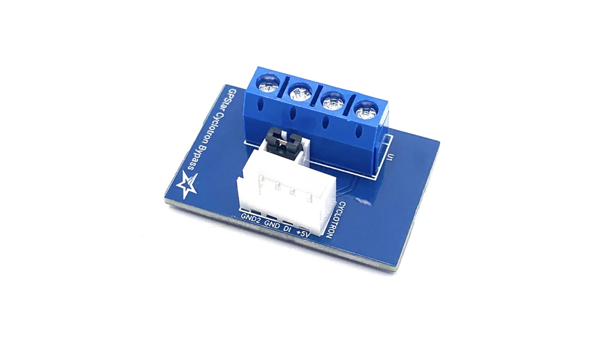
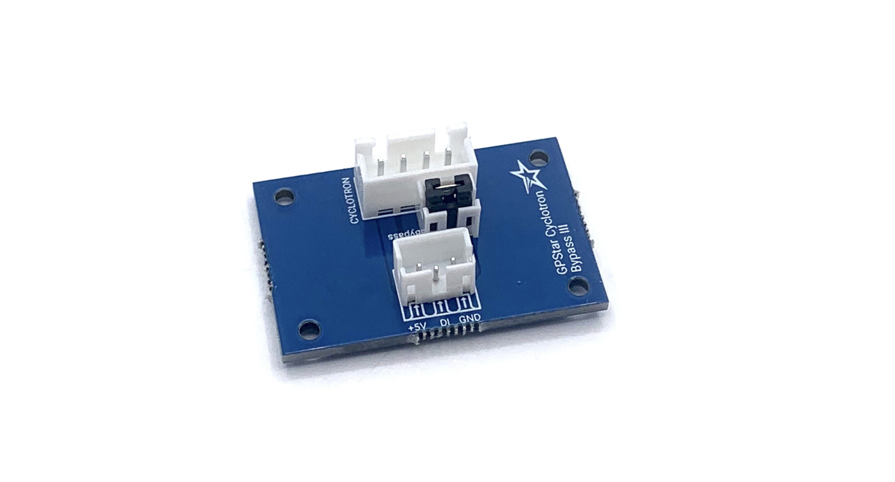

# GPStar Cyclotron Bypass (DIY Packs)

This device is only necessary for a DIY (non-Haslab) Proton Pack which does not have a removable cyclotron lid.

The GPStar Cyclotron Bypass is used to connect your GPStar Cyclotron Lid LEDs (or any addressable LED ring or lights) to the GPStar Proton Pack electronics. As the kit was designed to work with the removable lid features on the Hasbro packs, we need a way to make the system think a lid is always attached which is what this bypass board can do.

With the removal of the bypass shunt (included with the connectors variant), you can even make use of Proton Pack shells with removable cyclotron lids by breaking the ground connection loop with a simple switch system connected to the included JST-XH connector.

## GPStar Cyclotron Bypass
Uses terminal blocks on the Cyclotron side for connecting to the GPStar Cyclotron LEDs.

## GPStar Cyclotron Bypass III
Uses JST-PH 3 pin connector on the cyclotron side for connecting to the GPStar Cyclotron LEDs.

## Installation

Refer to the connection diagrams photo below:

GPStar Cyclotron Bypass Connection:

GPStar Cyclotron Bypass III Connections:

