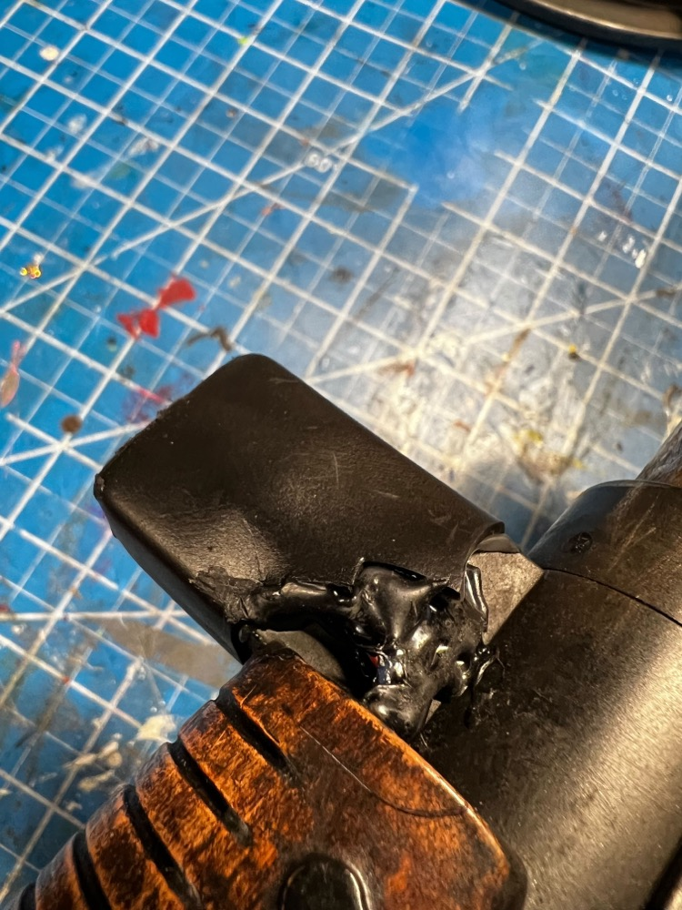

# Hat Lights (Optional)

The hat lights are a special add-on which replace the solid orange plastic dome on the top of the wand gun box and the orange selector switch at the end of the wand barrel. Support for both lights exists as part of the Wand PCB kit.

## Hatlight Kit Installation Video ##

[Hatlight Kit Installation Video](https://www.youtube.com/watch?v=G1TXLc8lEsk) (YouTube)

## Gun Box Hat

This is the easiest of the 2 modifications to make. The orange dome (fake light) can be sanded down with a dremel, then drilled out to accommodate an orange lens. This will drill through the black plastic exterior and a portion of the clear plastic which is part of the vent light and bargraph assembly. Secure the lens using any supplied washer/nut combination.

An LED can be hot-glued into the lens socket and attached to the HAT2 socket (JST-PH) on the Wand PCB. Use of a red LED with 2VDC forward voltage and 20mA current is expected.

## Barrel Wing Hat (+Selector Button)

This is the more complex assembly **as it requires replacing the stock selection switch with a new momentary pushbutton type**, along with drilling out a significant portion of the barrel wing. This solution is suggested to be undertaken if also considering adding the wand-tip strobe LED as the barrel must be significantly disassembled. Removal of the inner barrel with the LEDs for the wand is crucial, as well as a black plastic sleeve which protects the wiring from the button at the end. **Remove the tape from the white wires inside the barrel before beginning this work as you'll need to remove that later!**

Preparation begins with cutting off the top of the fake pushbutton, and removing the barrel wing screws. We won't be able to completely separate it, but we can split it apart just enough to pull out the old circuit board for the selector switch. Both of these spots can be drilled out using no more than a 1/4" (6mm) bit. Just drill through both sides, and it's expected to drill right through the old orange button. You may have to hold the button still with some pliers while you drill.

Once the holes are drilled, you can widen the holes on the underside to fit the nuts for your orange lens and new momentery pushbutton. This will also allow more access to remove debris from inside the barrel and pull the thin white wires.

Insert your orange lens and pushbutton from the top, and secure using their respective washer/nut combo as needed from below. **It is necessary to solder on the wires for the pushbutton before installation!**

A drop of CA glue can help hold items in place while you add the securing nut.

Once installed, it is suggested to test that you have continuity from the pushbutton wires when the button is depressed, and connect your LED and check that it both fits and illuminates from the wand PCB.

Fill the orange lens with hot glue and press the LED into the socket to hold it. This will be permanent once the glue hardens, so adjustment is key! Back-fill with hot glue to keep wiring in place and secured to the back of the barrel wing. You will need to drill a small hole for the wires to enter the gun barrel just where the grip meets the wand end.

To run the wires back to the gun box you can use the internal space under the existing grip, inside the barrel which will be protected by the inner sleeve. Removing the fake rubber wires will give you a location for the wires to exit the grip and re-enter the gun box.

To match the original Afterlife aesthetic, wrapping in black electrical tape will complete the look and keep the wiring protected.

The wiring in the gun box will need to cross from one side to the other. Making a small notch in the plastic in what would be above the barrel, the wiring can be run in that space to reach the PCB. Connect to the HAT1 and SW6 sockets using JST-PH connectors.

To finish off the barrel wing look and hide the wiring, use of 1.5" marine-grade heatshrink tubing can be used to cover the entire plastic assembly. This is similar in appearance to the Afterlife wand serving both aesthetic and functional uses.

