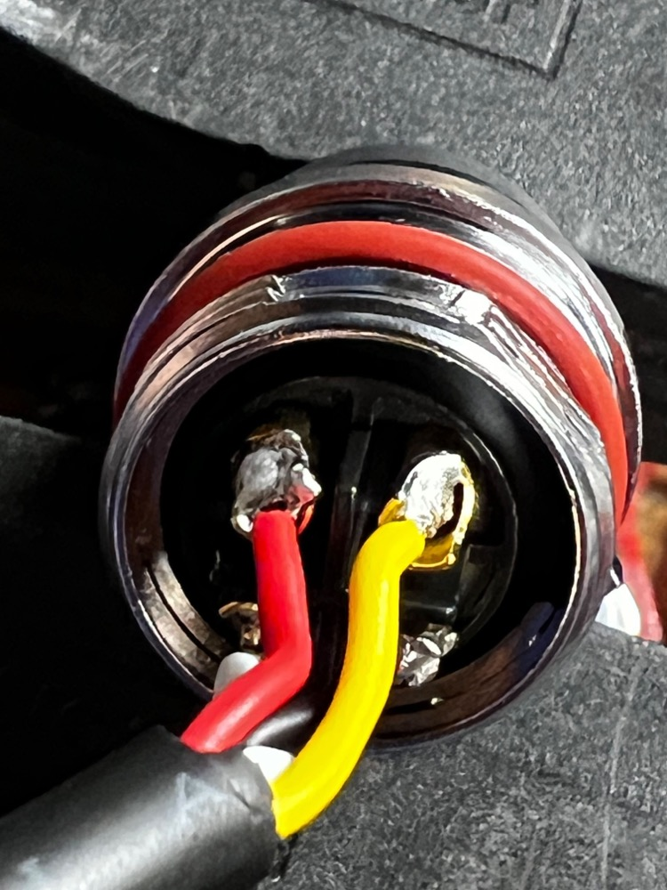
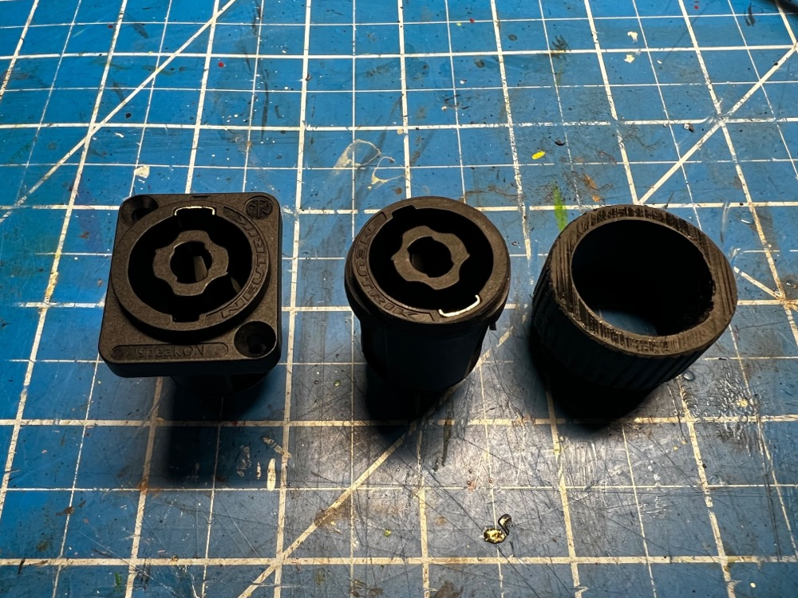
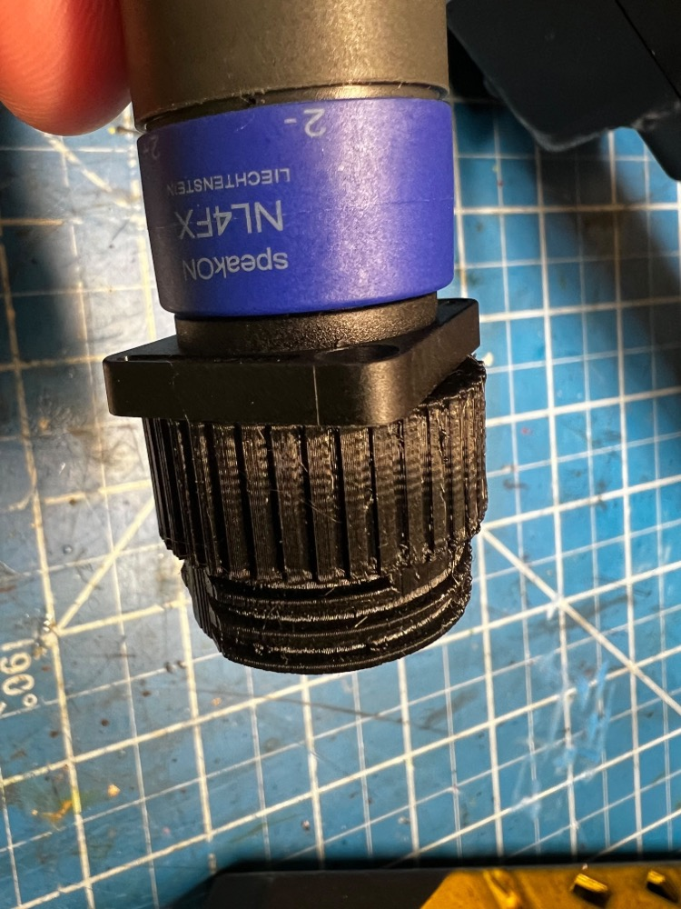
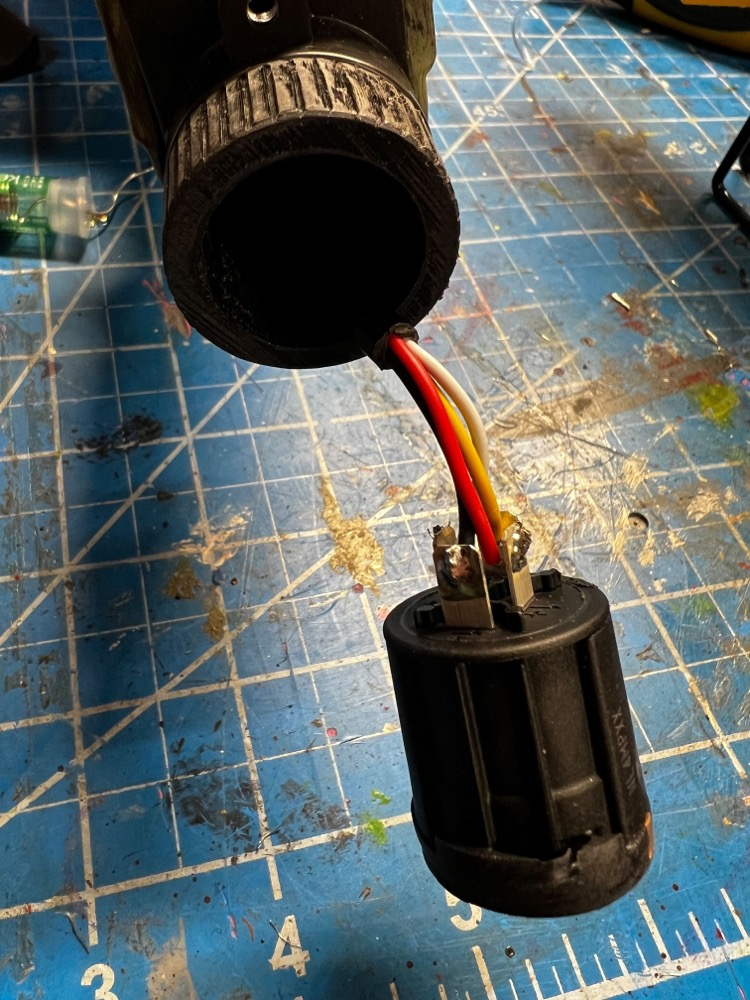
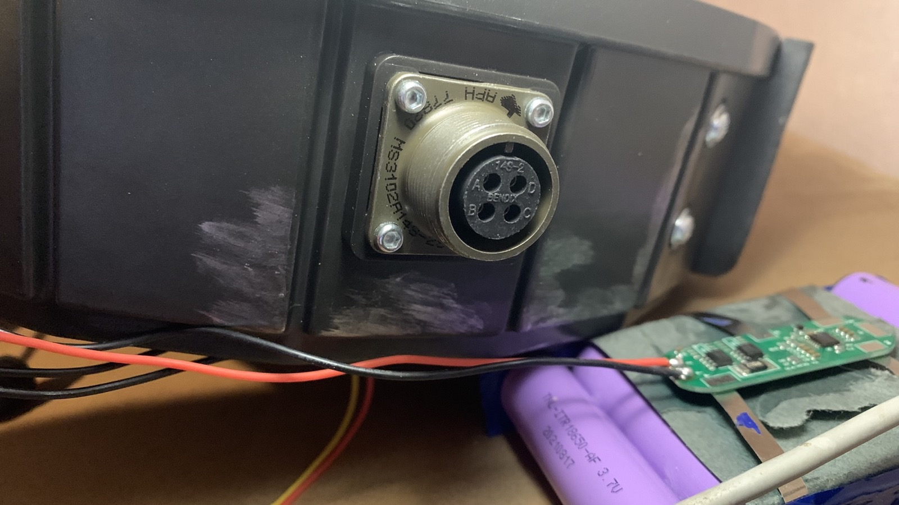
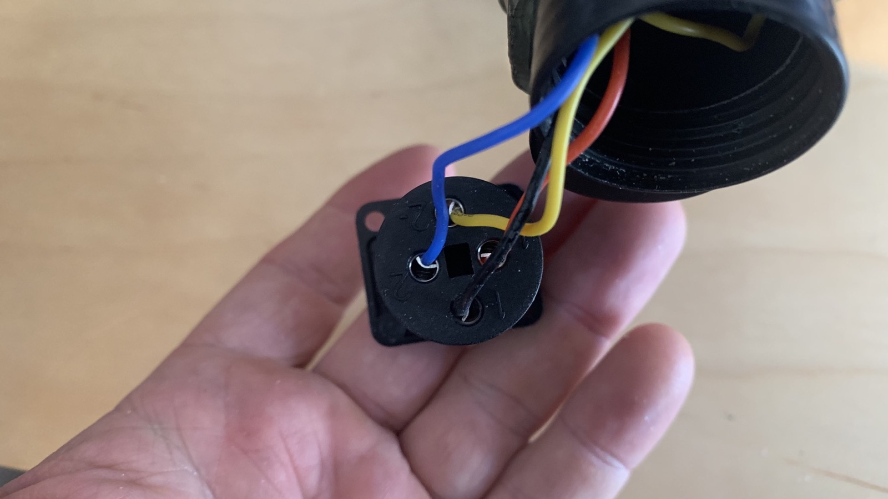
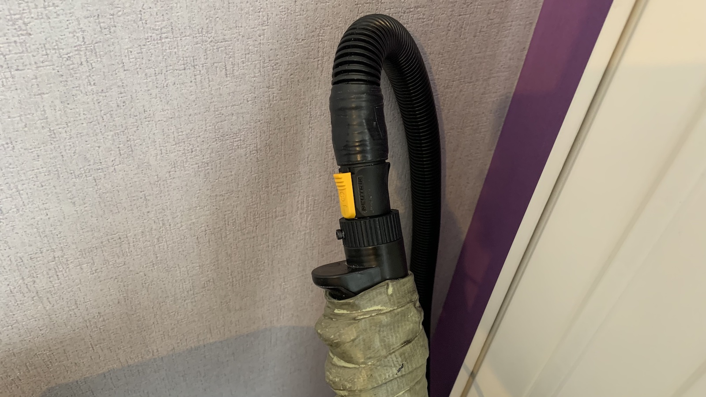
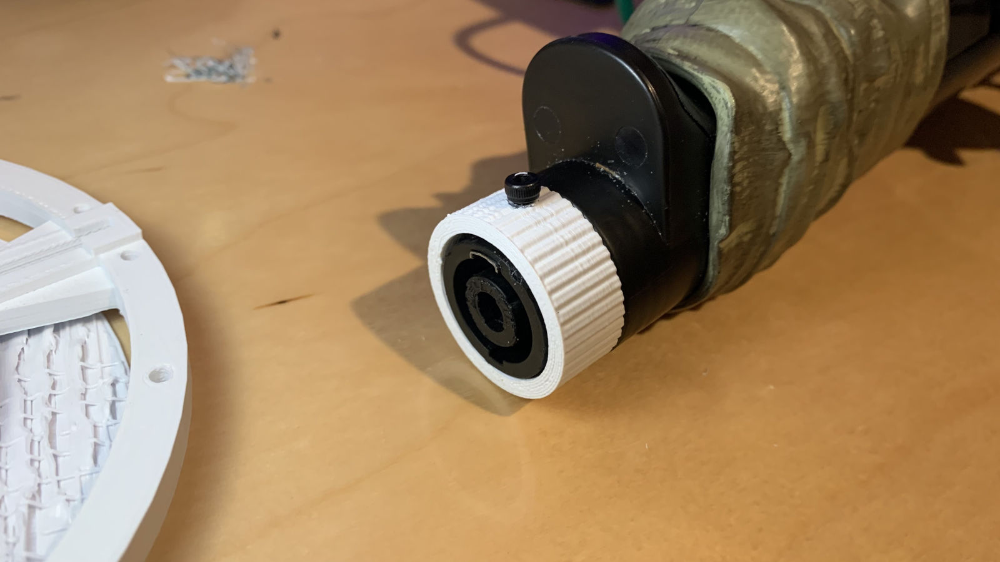
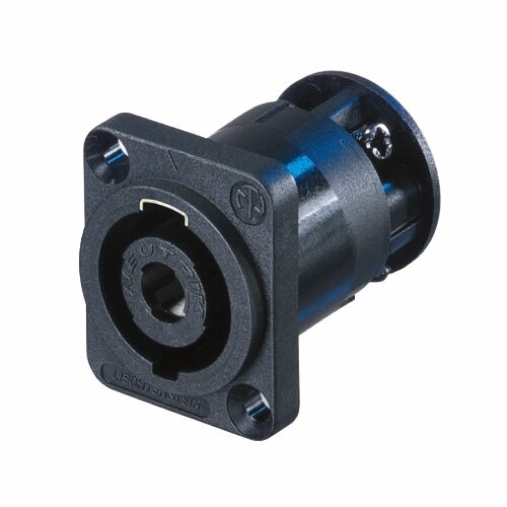
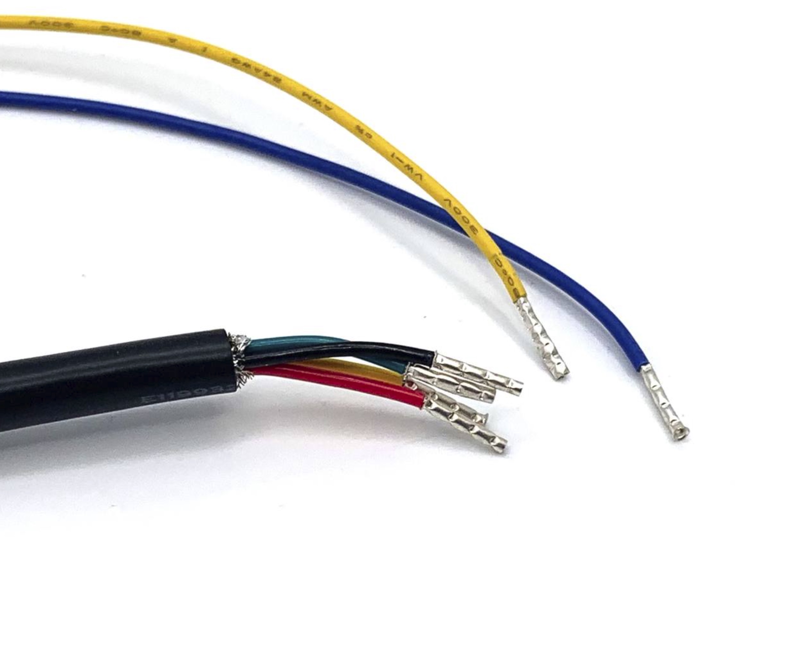

# Pack-Wand Hose Replacement

In order to deliver both power and data signals to the wand, a new set of cabling is required. As wiring is typically desired to remain internal to the hose the following approaches have been used to replace the stock 2-wire (power-only) hose with a new 4-wire solution. The existing wire loom (black hose) can be reused if desired, or replaced with a more flexible brand.

## DIY Hose Example #1

The following parts are utilized:

* 1 - [CNLINKO 4-Pin Connector](https://a.co/d/8ALa9Gq) - Connector for the pack which uses a square connector roughly the size of the stock connection
* 1 - [Neutrik NL4FX 4-Pole Locking speakON Cable Connector](https://a.co/d/9c7djjo) - This is the connector at the wand end of the hose
* 1 - [Neutrik NL4MP 4-Pole speakON Panel Mount](https://a.co/d/atMuNfz) - This is the socket for the wand itself

### Installation

For the CNLINKO, the receptacle on the pack uses soldered ports for a secure connection. To attach the panel connector to the pack you may need to start with the screws fully inserted into the socket holes along the outside and angled into the existing pack holes. Begin tightening in increments around the connector and it will be held fast to the pack.

These connectors have numbered sockets which must follow a certain pattern. The exact color used here doesn't matter so much as the order on each side, and where those pins connect internally:

* 1 -> 5V Positive
* 2 -> Connects to Pack RX
* 3 -> Connects to Pack TX
* 4 -> Ground

The Neutrik connectors have # markings on them and must be matched on each side. Whatever color is used for the corresponding connection to the CNLINKO should be carried forward to the speakON cable connector.

* +1 -> 5V Positive
* -1 -> Ground
* +2 -> Wand RX (from Pack TX)
* -2 -> Wand TX (from Pack RX)

The socket for the wand is a panel connector which has 4 screw holes which must be sanded off. This can be done with a belt sander or hand sander. A 3D printed adapter is furnished with kits to allow the socket to be secured using the existing screw base for the original battery pack.

The speakON connector uses a twist-lock mechanism for a secure fit to the panel socket and 3D printed adapter. This can be painted a color of your choice (eg. silver) prior to installation.

The speakON panel connector, like the pack connection, uses a soldered connection to secure the wires. Both connections at each end of the wand will use screw terminals to attach the wiring.

## DIY Hose Example #2

This approach uses parts which are slightly more accurate to the movie pack, though they may be more difficult to obtain. More work is needed to convert these to HasLab use.

* 1 - [Amphenol MS3106A14S-2P (4 pin)](https://www.mouser.com/ProductDetail/654-MS3106A14S-2P)
* 1 - [Amphenol MS3102A14S-2S (4 pin)](https://www.mouser.com/ProductDetail/654-MS3102A14S-2S)
* [3/4 inch splitless loom (you can find this at almost any hardware store)](https://www.gbfans.com/shop/pack-parts/34-splitless-wire-loom/)
* Black electrical tape
* 1 - [Neutrik NAC3FX-W](https://www.neutrik.com/en/product/nac3fx-w) (discontinued, see below)
* 1 - [Neutrik NL4FC](https://www.neutrik.com/en/product/nl4fc)
* 1 - [Neutrik NL4MP-ST](https://www.neutrik.com/en/product/nl4mp-st)

In this example, I use 4 pin Amphenol connectors. The 4 pin version is slightly smaller than the 16s versions, however it does still work. You will need to enlarge the holes on the pack side Amphenol connector. I used the reamer on a swiss knife and slowly enlarged it until all 4 screws can bolt onto the pack. Take your time and go slow. You also need to remove some plastic in the center of the pack hole for the connector to slide on. After feeding the 4 wires running from the wand to the pack connector through both ends of the 3/4 inch splitless loom, solder the wires onto the appropriate ends on the connector.

On the wand side, this uses a modified Neutrik NAC3FX-W connector. This is a 3 pin connector, but you can take it apart and use the 4 pin internals of the NL4FC which is a 4 pin connector. The NAC3FX-W is discontinued, so if you cannot find one, you can just use the NL4FC instead and not have to modify anything.

I use black electrical tape to secure the 3/4 splitless wire loom to the Neutrik connector on the Neutrona Wand side and the Amphenol connector on the Proton Pack side.

Provided in the wand STL folder is a printable connector which threads into the handle of the Hasbro Neutrona Wand. With this connector, you can shave down the square corners of the 4 pin Neutrik NL4MP-ST connector so it is round, and it can slide into the 3D printable connector. I then screw the 3D printable connector into the wand handle and make a mark on the bottom side of it. I remove the connector and make a hole in it. I then use a M3x5 hex socket screw (or which ever set screw you want to use) to secure the Neutrik NL4MP-ST connector into the Neutrona Wand handle.

**READ BELOW IF USING A MODIFIED NAC3FX-W with a NL4FC.**

If you are using the NAC3FX-W with the NL4FC internals, you will need to slightly modify it. In the photo below, the 3-pin NAC3FX-W internal piece is on the left. On the right is the NL4FC 4-pin internal piece that needs to be modified to work correctly inside the NAC3FX-W shell. You have to grind off some of the indicated plastic on the NL4FC internal piece on the right. Compared to the NAC3FX-W on the left, the tab sits too high, which blocks it from going all the way into the NAC3FX-W shell. A small plastic tab needs to be removed. If you are using the NL4FC shell and not the NAC3FX-W, then you can ignore this.

## Quick Tip

For any case where the bare wires cannot be clamped down into the screw terminals tightly, it will be necessary to use [Wire Ferrules](https://www.youtube.com/watch?v=cqyYBua4pX4) on the ends of the wires to increase the surface area to clamp. Many users of the GPStar kits have reported improved success in keeping their electrical connections stable once they crimped on ferrules to their power and serial data wires. Crimping kits can be found on Amazon for $25-40, though as an alternative you can fold over the wire and apply solder to help bulk up the connection.

As of May 2024 all kits will come pre-crimped for the hose connections.

