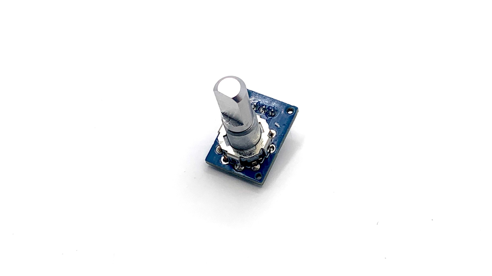

# GPStar Neutrona Encoder

This is an ultra compact and slim encoder for Neutrona Wand's to connect the top dial of the Neutrona Wand so you can adjust the power levels and various settings of your GPStar Neutrona Wand. Meant for Mack's Factory, custom and DIY builds, this should fit all Neutrona Wand shells.

## Installation

Mount the board and wire the connections as indicated in the photo below. Note that the GND wire for the vent light board shares the same connection in the terminal blocks as the top dial ROT- terminal.

| Neutrona Encoder | Neutrona Wand |
|------------|---------------|
| A | D7 |
| B | ROT- |
| C | D6 |

### GPStar Neutrona Wand II

### GPStar Neutrona Wand

